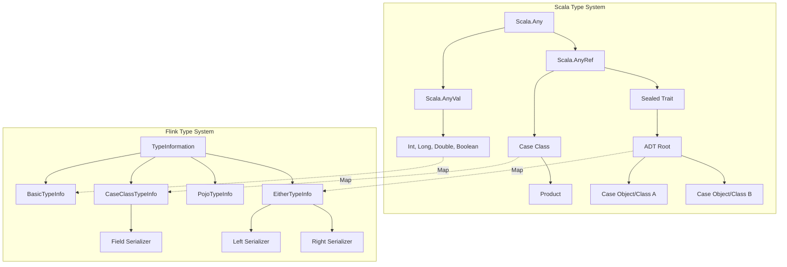
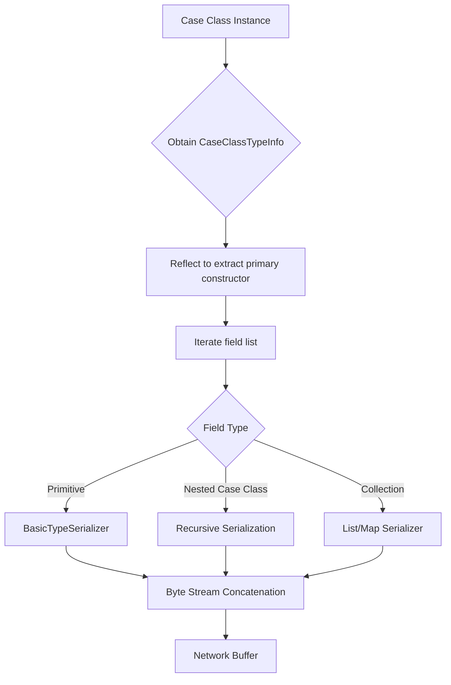
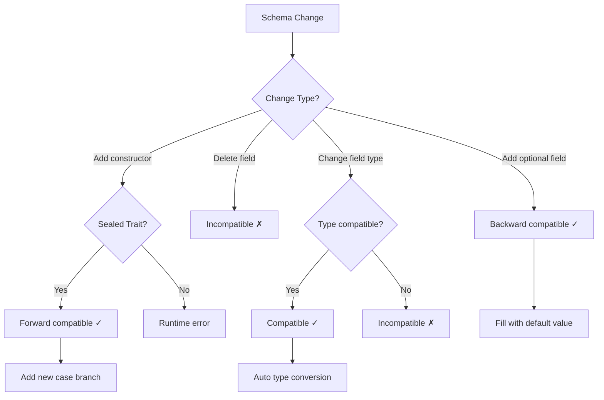
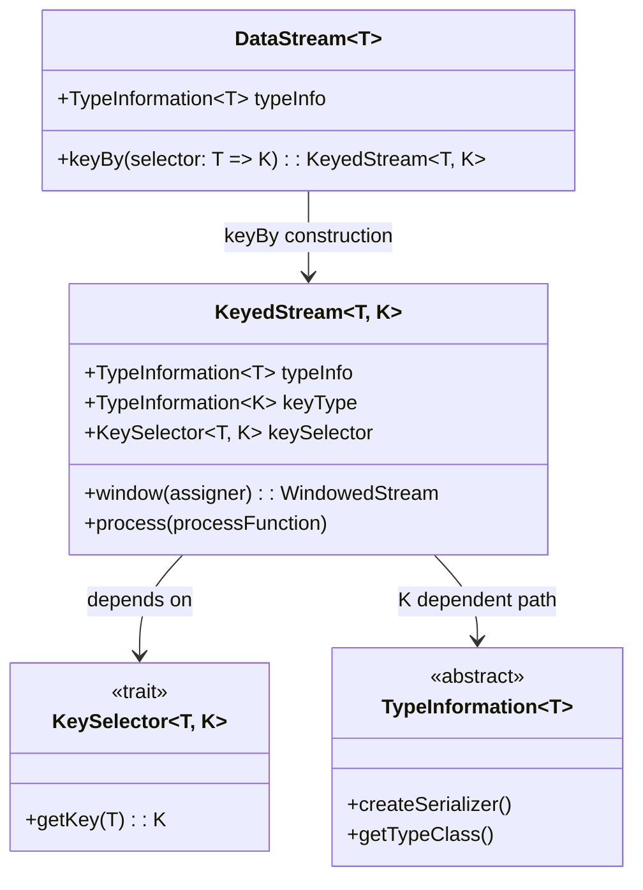

# Scala Type System for Flink Stream Processing

> Stage: Flink/ | Prerequisites: [Struct/01-foundation/01.04-dataflow-model-formalization.md](../../../Struct/01-foundation/01.04-dataflow-model-formalization.md) | Formalization Level: L4

---

## Table of Contents

- [Scala Type System for Flink Stream Processing](#scala-type-system-for-flink-stream-processing)
  - [Table of Contents](#table-of-contents)
  - [1. Definitions](#1-definitions)
    - [Def-F-09-01: Scala Case Class as DataType](#def-f-09-01-scala-case-class-as-datatype)
    - [Def-F-09-02: Algebraic Data Types (ADT) in Flink](#def-f-09-02-algebraic-data-types-adt-in-flink)
    - [Def-F-09-03: Path-Dependent Types and KeyedStream](#def-f-09-03-path-dependent-types-and-keyedstream)
  - [2. Properties](#2-properties)
    - [Lemma-F-09-01: Case Class Serialization Friendliness](#lemma-f-09-01-case-class-serialization-friendliness)
    - [Lemma-F-09-02: ADT Schema Evolution Support](#lemma-f-09-02-adt-schema-evolution-support)
  - [3. Relations](#3-relations)
    - [3.1 Type Mapping with Dataflow Model](#31-type-mapping-with-dataflow-model)
    - [3.2 Relation to pDOT Path-Dependent Types](#32-relation-to-pdot-path-dependent-types)
  - [4. Argumentation](#4-argumentation)
    - [4.1 Type-Safe Stream Processing Pipeline](#41-type-safe-stream-processing-pipeline)
    - [4.2 Scala vs Java API Type Expressiveness Comparison](#42-scala-vs-java-api-type-expressiveness-comparison)
  - [5. Proof / Engineering Argument](#5-proof--engineering-argument)
    - [Theorem: Case Classes Form a Complete Data Type Category in Flink](#theorem-case-classes-form-a-complete-data-type-category-in-flink)
    - [Engineering Argument: Schema Evolution Cost Analysis](#engineering-argument-schema-evolution-cost-analysis)
  - [6. Examples](#6-examples)
    - [6.1 Official Java API Approach: Java POJO + Scala Call](#61-official-java-api-approach-java-pojo--scala-call)
    - [6.2 Community flink-scala-api Approach: Pure Scala Case Class](#62-community-flink-scala-api-approach-pure-scala-case-class)
    - [6.3 Comparison Matrix of Two Approaches](#63-comparison-matrix-of-two-approaches)
  - [7. Visualizations](#7-visualizations)
    - [7.1 Scala Type Hierarchy and Flink Type System Mapping](#71-scala-type-hierarchy-and-flink-type-system-mapping)
    - [7.2 Case Class Serialization Flow](#72-case-class-serialization-flow)
    - [7.3 ADT Schema Evolution Decision Tree](#73-adt-schema-evolution-decision-tree)
    - [7.4 KeyedStream Path-Dependent Type Relationship](#74-keyedstream-path-dependent-type-relationship)
  - [8. References](#8-references)

## 1. Definitions

### Def-F-09-01: Scala Case Class as DataType

**Definition (L4 Formalization)**:

Let $\mathcal{S}$ be the Scala type system, and $C \in \mathcal{S}$ be a **Case Class** if and only if it satisfies:

1. **Structural Immutability**: All fields $f_i: T_i$ default to `val`, i.e., $\forall i. \frac{\partial f_i}{\partial t} = 0$
2. **Pattern Matching Decomposability**: There exists an extraction function $\text{unapply}: C \rightarrow (T_1, \ldots, T_n)$ such that:
   $$\forall c \in C. \text{unapply}(c) = (c.f_1, \ldots, c.f_n)$$
3. **Auto-Derived Instances**: The compiler automatically generates `equals`, `hashCode`, `toString`, `copy`

**Flink Semantic Mapping**:

Case Class to Flink TypeInformation encoding mapping:

$$\llbracket C \rrbracket_{Flink} = \text{TypeInformation.of}(C) \cong \text{CaseClassTypeInfo}(\llbracket T_1 \rrbracket, \ldots, \llbracket T_n \rrbracket)$$

**Intuitive Explanation**: Scala Case Classes act as strongly typed structured data containers in Flink. Their immutability and auto-derived serialization support make them ideal DataTypes for stream processing.

---

### Def-F-09-02: Algebraic Data Types (ADT) in Flink

**Definition (L4 Formalization)**:

ADT is the combinatory closure of **Sum Types** and **Product Types**:

$$\text{ADT} ::= T_1 + T_2 \mid T_1 \times T_2 \mid \mu X. F(X)$$

Where:

- **Sum type** $T_1 + T_2$ corresponds to Scala's `sealed trait` + `case class/object`
- **Product type** $T_1 \times T_2$ corresponds to the field product of tuples/Case Classes
- **Recursive type** $\mu X. F(X)$ corresponds to nested data structures

**ADT Constraints in Flink**:

Let $D$ be an ADT. The Flink type system requires:

$$\text{Serializable}(D) \Leftrightarrow \forall c \in \text{constructors}(D). \forall f \in \text{fields}(c). \text{Serializable}(\text{type}(f))$$

**Intuitive Explanation**: ADTs achieve type-safe variant representation through sealed traits. Flink's type inferencer recursively checks the serializability of all constructor fields.

---

### Def-F-09-03: Path-Dependent Types and KeyedStream

**Definition (L4 Formalization)**:

Let $S$ be the stream type and $K$ be the key type. **KeyedStream** is a type construction dependent on path $\pi$:

$$\text{KeyedStream}[S, K] = \{ (k, \{e \in S \mid \text{key}(e) = k\}) \mid k \in K \}$$

**Scala Path-Dependent Type Representation**:

```scala
type KeyedStream[S, K] = S#GroupBy { type Key = K }
```

Key extractor function type signature:

$$\text{keyBy}: \text{DataStream}[T] \rightarrow (T \rightarrow K) \rightarrow \text{KeyedStream}[T, K]$$

**pDOT Encoding**:

In pDOT (path-dependent DOT) calculus, the key type of KeyedStream is **value-dependent**:

$$\Gamma \vdash \text{ks}: \text{KeyedStream}[T, \{k: K \mid \text{key}(k) = x\}]$$

**Intuitive Explanation**: The key type of KeyedStream depends on the result of the runtime key extractor function. This dependency is expressed in Scala's type system through type member paths.

---

## 2. Properties

### Lemma-F-09-01: Case Class Serialization Friendliness

**Lemma**: For any Case Class $C$, if all field types $T_i \in \{\text{Int}, \text{Long}, \text{String}, \text{Boolean}, \text{Array}[\_], \text{Other Case Class}\}$, then:

$$\text{TypeInfo}(C) \Rightarrow \text{EfficientSerializer}(C)$$

**Proof Sketch**:

1. Flink's `CaseClassTypeInfo` obtains primary constructor parameters via Scala reflection
2. Each parameter type $T_i$ maps to the corresponding `TypeInformation`:
   - Primitive types $\rightarrow$ `BasicTypeInfo`
   - Case Classes $\rightarrow$ recursive `CaseClassTypeInfo`
   - Collection types $\rightarrow$ `ListTypeInfo` / `MapTypeInfo`
3. The generated `TypeSerializer` uses **field-order serialization**, avoiding reflection overhead

$$\text{serialize}(c) = \bigoplus_{i=1}^{n} \text{serialize}_i(c.f_i)$$

Where $\oplus$ denotes byte stream concatenation.

---

### Lemma-F-09-02: ADT Schema Evolution Support

**Lemma**: Let $D = C_1 + C_2 + \ldots + C_n$ be an ADT defined by a sealed trait. Schema evolution satisfies **backward compatibility** if:

$$\forall C_i^{(v_1)} \in D^{(v_1)}. \exists C_i^{(v_2)} \in D^{(v_2)}. \text{fields}(C_i^{(v_1)}) \subseteq \text{fields}(C_i^{(v_2)})$$

**Corollary**: Adding a new case class constructor maintains **forward compatibility**; removing a constructor breaks compatibility.

**Flink Serialization Guarantees**:

| Evolution Type | Compatibility | Flink Support |
|---------|-------|-----------|
| Add optional field | Backward compatible | ✓ (default value) |
| Delete field | Incompatible | ✗ |
| Rename field | Incompatible | ✗ (custom required) |
| Add case class | Forward compatible | ✓ (sealed trait) |

---

## 3. Relations

### 3.1 Type Mapping with Dataflow Model

Mapping from Dataflow types $T_{DF}$ in [Struct/01-foundation/01.04-dataflow-model-formalization.md](../../../Struct/01-foundation/01.04-dataflow-model-formalization.md) to Scala/Flink:

| Dataflow Type | Scala Representation | Flink TypeInfo |
|--------------|-----------|----------------|
| $T_{base}$ (Basic value) | `Int`, `Long`, `String` | `BasicTypeInfo` |
| $T_{record}$ (Record) | `case class Record(...)` | `CaseClassTypeInfo` |
| $T_{sum}$ (Sum type) | `sealed trait Event; case class Click(...); case class View(...)` | `EitherTypeInfo` / `PolymorphicTypeInfo` |
| $T_{stream}$ (Stream) | `DataStream[T]` | `StreamRecordSerializer` |

**Formal Mapping**:

$$\Phi: \mathcal{T}_{Dataflow} \rightarrow \mathcal{T}_{Scala}$$

$$\Phi(T_{record}(f_1: \tau_1, \ldots, f_n: \tau_n)) = \text{case class}(f_1: \Phi(\tau_1), \ldots, f_n: \Phi(\tau_n))$$

### 3.2 Relation to pDOT Path-Dependent Types

**Type Member Paths**:

In pDOT, the key type of KeyedStream is value-dependent. The corresponding expression in Scala:

```scala
trait KeyedStream { type E; type K; val keySelector: E => K }
```

**Subtyping Relation**:

$$\frac{\Gamma \vdash k_1 <: k_2}{\Gamma \vdash \text{KeyedStream}[E, k_1] <: \text{KeyedStream}[E, k_2]}$$

This shows that the subtyping relation of key types propagates to the KeyedStream level.

---

## 4. Argumentation

### 4.1 Type-Safe Stream Processing Pipeline

Consider a typical Flink stream processing pipeline, and how the type system guarantees safety:

```
Source[Event] → map[Event, EnrichedEvent] → keyBy[userId] → window[TimeWindow] → aggregate → Sink[Result]
```

**Type Checkpoints**:

1. **Source output type** = `map` input type
2. **keyBy key extractor** $E \rightarrow K$ must be verifiable at compile time
3. **Window aggregate function** input type matches the element type within the window
4. **Sink input type** = aggregate output type

**Counterexample Analysis** (Type-unsafe case):

```scala
// Error: type mismatch, but only exposed at runtime
dataStream.map(_.toString).keyBy(_.userId) // _.userId does not exist on String
```

### 4.2 Scala vs Java API Type Expressiveness Comparison

| Feature | Java API | Scala API |
|-----|----------|-----------|
| Type Inference | Limited (requires explicit declaration) | Complete (local type inference) |
| Generic Preservation | Type erasure | TypeTag preserves complete type information |
| Functional Interface | Single Abstract Method (SAM) | First-class function values |
| Case Class Support | POJO conventions | Native support |
| ADT Expression | Class hierarchy + instanceof | sealed trait + pattern matching |

**Conclusion**: The Scala API is superior to the Java API in type expressiveness and conciseness, but the community flink-scala-api project requires additional dependencies.

---

## 5. Proof / Engineering Argument

### Theorem: Case Classes Form a Complete Data Type Category in Flink

**Thm-F-09-01**: Let $\mathcal{C}$ be the category formed by Scala Case Classes, and $\mathcal{F}$ be the category of Flink-serializable types. Then there exists a **fully faithful functor** $F: \mathcal{C} \rightarrow \mathcal{F}$.

**Proof**:

**Step 1: Object Mapping**

For each Case Class $C$, define:

$$F(C) = \text{CaseClassTypeInfo}(C) \in \text{Ob}(\mathcal{F})$$

**Step 2: Morphism Mapping**

For a transformation function $f: C_1 \rightarrow C_2$ between Case Classes, define:

$$F(f) = \text{MapFunction}C_1, C_2 \in \text{Hom}_{\mathcal{F}}(F(C_1), F(C_2))$$

**Step 3: Functor Laws Verification**

- **Identity Law**: $F(\text{id}_C) = \text{IdentityMap}[C] = \text{id}_{F(C)}$ ✓
- **Composition Law**: $F(g \circ f) = F(g) \circ F(f)$ ✓ (Guaranteed by Flink DataStream API composition)

**Step 4: Full Faithfulness**

- **Faithful**: $F(f) = F(g) \Rightarrow f = g$ (TypeInfo encoding is unique)
- **Full**: $\forall \phi: F(C_1) \rightarrow F(C_2). \exists f: C_1 \rightarrow C_2. F(f) = \phi$ (TypeInformation is decodable)

**∎**

---

### Engineering Argument: Schema Evolution Cost Analysis

**Proposition**: In stream processing systems, the schema evolution cost of ADTs is lower than that of unstructured data.

**Argumentation**:

Let the evolution cost function $Cost(evolution)$ include:

- $C_{compat}$: Compatibility check cost
- $C_{migrate}$: Data migration cost
- $C_{validate}$: Validation cost

**Case Class (Structured)**:

$$Cost_{CC} = C_{compat}^{compiler} + C_{migrate}^{default} + C_{validate}^{typecheck}$$

- Compatibility check: Compile-time completeness check via sealed trait
- Data migration: Automatic default value filling
- Validation: Statically guaranteed by type system

**Map[String, Any] (Unstructured)**:

$$Cost_{Map} = C_{compat}^{runtime} + C_{migrate}^{manual} + C_{validate}^{test}$$

- Compatibility check: Runtime trial-and-failure pattern
- Data migration: Manually written transformation logic
- Validation: Depends on test coverage

**Conclusion**: $Cost_{CC} \ll Cost_{Map}$, especially in large-scale stream processing scenarios.

---

## 6. Examples

### 6.1 Official Java API Approach: Java POJO + Scala Call

```scala
import org.apache.flink.streaming.api.scala._
import org.apache.flink.api.common.typeinfo.TypeInformation

// Java POJO definition (must follow Java Bean conventions)
/*
public class UserEvent {
    private String userId;
    private Long timestamp;
    private Double value;

    // Must provide no-arg constructor
    public UserEvent() {}

    // Getters and Setters...
    public String getUserId() { return userId; }
    public void setUserId(String userId) { this.userId = userId; }
    // ... other getter/setter
}
*/

// Scala call layer
object FlinkJavaPojoExample {
  def main(args: Array[String]): Unit = {
    val env = StreamExecutionEnvironment.getExecutionEnvironment

    // Using Java POJO, requires explicit TypeInformation
    val stream: DataStream[UserEvent] = env
      .fromElements(
        new UserEvent("user1", System.currentTimeMillis(), 100.0),
        new UserEvent("user2", System.currentTimeMillis(), 200.0)
      )
      .returns(TypeInformation.of(classOf[UserEvent]))

    // Aggregation operation - requires explicit key selector type
    val keyedStream = stream
      .keyBy(new KeySelector[UserEvent, String] {
        override def getKey(event: UserEvent): String = event.getUserId
      })

    // Window aggregation
    val result = keyedStream
      .window(TumblingEventTimeWindows.of(Time.minutes(5)))
      .aggregate(new AverageAggregate())

    result.print()
    env.execute("Java POJO Example")
  }
}

// Custom aggregate function
class AverageAggregate extends AggregateFunction[UserEvent, (Double, Long), Double] {
  override def createAccumulator(): (Double, Long) = (0.0, 0L)

  override def add(event: UserEvent, acc: (Double, Long)): (Double, Long) =
    (acc._1 + event.getValue, acc._2 + 1)

  override def getResult(acc: (Double, Long)): Double = acc._1 / acc._2

  override def merge(acc1: (Double, Long), acc2: (Double, Long)): (Double, Long) =
    (acc1._1 + acc2._1, acc1._2 + acc2._2)
}
```

**Characteristic Analysis**:

- ✅ Official native support, no extra dependencies
- ✅ Flink's POJO serializer is well optimized
- ❌ Java POJO boilerplate code (getter/setter)
- ❌ Scala call layer type inference is limited
- ❌ Requires explicit TypeInformation

---

### 6.2 Community flink-scala-api Approach: Pure Scala Case Class

```scala
import org.apache.flinkx.api._
import org.apache.flinkx.api.serializers._

// Scala Case Class definition - concise, immutable, naturally serialization-friendly
case class UserEvent(
  userId: String,
  timestamp: Long,
  value: Double,
  metadata: Option[EventMetadata] = None
)

case class EventMetadata(
  source: String,
  version: Int
)

// ADT definition - type-safe event variants
sealed trait Event
case class ClickEvent(userId: String, url: String, timestamp: Long) extends Event
case class PurchaseEvent(userId: String, amount: Double, itemId: String) extends Event
case class LoginEvent(userId: String, ip: String, timestamp: Long) extends Event

// KeyedStream example with path-dependent types
case class EnrichedEvent[T <: Event](
  original: T,
  processedAt: Long,
  partitionKey: String
)

object FlinkScalaApiExample {
  def main(args: Array[String]): Unit = {
    val env = StreamExecutionEnvironment.getExecutionEnvironment

    // Case Class auto-derives TypeInformation - no explicit declaration needed
    val stream: DataStream[UserEvent] = env.fromElements(
      UserEvent("user1", System.currentTimeMillis(), 100.0),
      UserEvent("user2", System.currentTimeMillis(), 200.0, Some(EventMetadata("mobile", 2)))
    )

    // Concise functional API - complete type inference
    val enrichedStream = stream
      .map(e => EnrichedEvent(e, System.currentTimeMillis(), e.userId.take(2)))
      .filter(_.original.value > 50.0)

    // keyBy uses function literal, type automatically inferred
    val keyedByUser: KeyedStream[EnrichedEvent[UserEvent], String] = enrichedStream
      .keyBy(_.original.userId)

    // Pattern matching processing of ADT
    val eventStream: DataStream[Event] = env.fromElements(
      ClickEvent("user1", "/home", System.currentTimeMillis()),
      PurchaseEvent("user2", 99.99, "SKU-123"),
      LoginEvent("user3", "192.168.1.1", System.currentTimeMillis())
    )

    val processedEvents = eventStream.map {
      case ClickEvent(uid, url, ts) =>
        s"User $uid clicked $url at $ts"
      case PurchaseEvent(uid, amt, item) =>
        s"User $uid purchased $item for $$amt"
      case LoginEvent(uid, ip, ts) =>
        s"User $uid logged in from $ip"
    }

    // Immutable update using case class copy method
    val updatedStream = stream.map { e =>
      e.copy(value = e.value * 1.1, metadata = e.metadata.orElse(Some(EventMetadata("default", 1))))
    }

    // Aggregation operation - type-safe window function
    val aggregated = keyedByUser
      .window(TumblingEventTimeWindows.of(Time.minutes(5)))
      .aggregate((acc: Double, e: EnrichedEvent[UserEvent], _: TimeWindow) => {
        acc + e.original.value
      })

    processedEvents.print()
    aggregated.print()
    env.execute("Scala Case Class Example")
  }
}
```

**Characteristic Analysis**:

- ✅ Pure Scala expression, no Java POJO boilerplate
- ✅ Automatic TypeInformation derivation, complete type inference
- ✅ Native ADT and pattern matching support
- ✅ Immutable data, functional transformations
- ⚠️ Requires community library `flink-scala-api` dependency
- ⚠️ Compatibility with official Flink versions needs attention

---

### 6.3 Comparison Matrix of Two Approaches

| Dimension | Java POJO + Scala | Pure Scala Case Class |
|-----|-------------------|---------------------|
| **Code Volume** | Medium (POJO boilerplate) | Low (Case Class concise) |
| **Type Inference** | Limited | Complete |
| **Serialization Performance** | Excellent (Kryo/POJO Serializer) | Excellent (Auto CaseClassSerializer) |
| **ADT Support** | Weak (requires manual instanceof) | Strong (sealed trait + pattern matching) |
| **Schema Evolution** | Manual handling | Default values + copy method |
| **Official Support** | ✅ Fully supported | ⚠️ Community maintained |
| **Dependency Complexity** | Low | Medium (extra library) |
| **IDE Support** | Excellent | Excellent |

---

## 7. Visualizations

### 7.1 Scala Type Hierarchy and Flink Type System Mapping



### 7.2 Case Class Serialization Flow



### 7.3 ADT Schema Evolution Decision Tree



### 7.4 KeyedStream Path-Dependent Type Relationship



---

## 8. References

---

*Document Version: v1.0 | Created: 2026-04-02 | Status: Complete*
