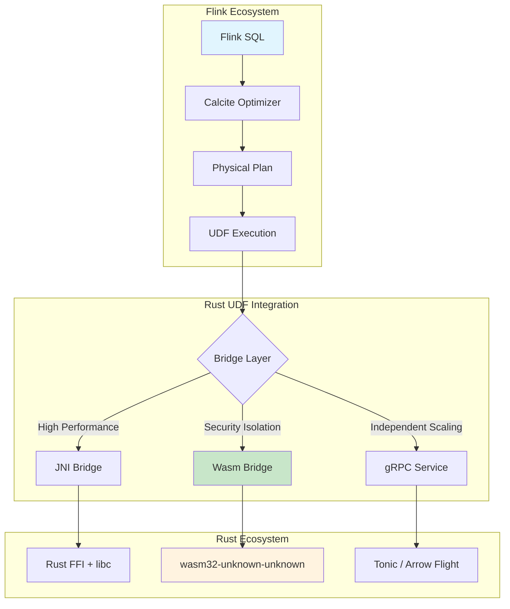
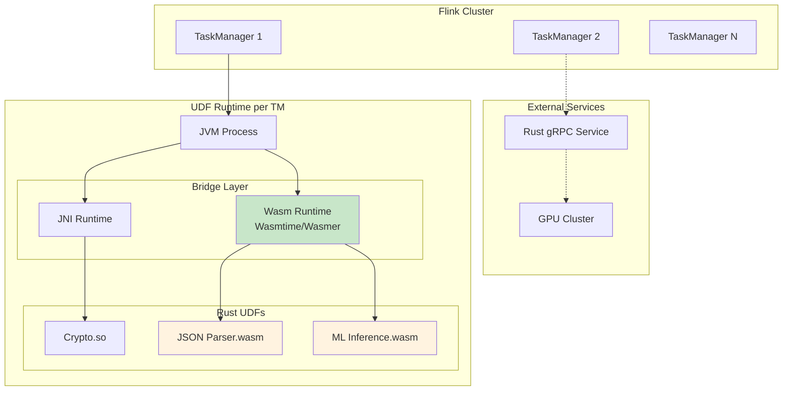
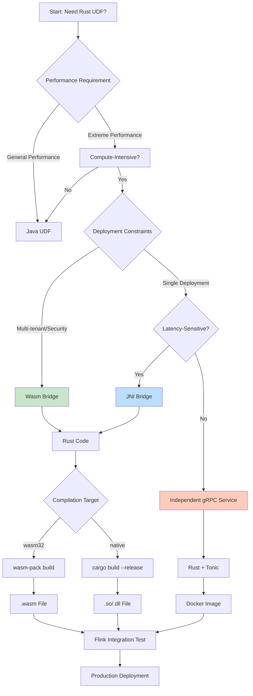

# Flink and Rust: High-Performance Native UDFs

> Stage: Flink/ | Prerequisites: [Python UDF](../03.02-table-sql-api/flink-python-udf.md) | Formalization Level: L3

## 1. Definitions

### Def-F-09-20: Rust UDF Architecture

**Rust UDF Architecture** refers to the technical system for implementing user-defined functions (UDFs) in Apache Flink using the Rust programming language, exposing Rust's high-performance computing capabilities to the Flink runtime through specific cross-language binding mechanisms.

Formally, the Rust UDF architecture can be represented as a triple:

$$\mathcal{R}_{UDF} = \langle \mathcal{C}_{Rust}, \mathcal{B}_{bridge}, \mathcal{I}_{Flink} \rangle$$

Where:

- $\mathcal{C}_{Rust}$: UDF computation logic written in Rust
- $\mathcal{B}_{bridge}$: Cross-language bridge layer (JNI/WebAssembly/gRPC)
- $\mathcal{I}_{Flink}$: Flink runtime integration interface

**Intuitive explanation**: The Rust UDF architecture allows developers to write high-performance computation logic in Rust and then connect it to Flink's data stream processing pipeline through standardized interfaces, combining Rust's memory safety with Flink's distributed processing capabilities.

### Def-F-09-21: WebAssembly Bridge

**WebAssembly Bridge** (Wasm Bridge) is a cross-language interoperability mechanism based on the WebAssembly standard, compiling Rust code into Wasm modules and loading them for execution through Flink's Wasm runtime.

Formal definition:

$$\mathcal{B}_{Wasm} = \langle \mathcal{M}_{wasm}, \phi_{host}, \psi_{mem}, \mathcal{A}_{abi} \rangle$$

Where:

- $\mathcal{M}_{wasm}$: Compiled Wasm module
- $\phi_{host}$: Host function import table (Host Functions)
- $\psi_{mem}$: Linear memory sharing mechanism
- $\mathcal{A}_{abi}$: Application binary interface specification

**Core characteristics**:

- **Sandbox security**: Wasm modules execute in an isolated environment with strictly restricted memory access
- **Deterministic execution**: No undefined behavior, suitable for the determinism requirements of stream computing
- **Portability**: Compile once, run anywhere

### Def-F-09-22: JNI vs Wasm Comparison

**JNI (Java Native Interface) Bridge** is the standard interoperability interface between the JVM and native code (including Rust via FFI).

Comparison matrix definition:

$$
\mathcal{Comparison} = \begin{bmatrix}
\text{Dimension} & \text{JNI} & \text{Wasm} \\
\text{Performance Overhead} & \text{High (boundary crossing + JNI table lookup)} & \text{Low (direct memory access)} \\
\text{Security} & \text{Low (native code can crash JVM)} & \text{High (sandbox isolation)} \\
\text{Deployment Complexity} & \text{High (platform-dependent libraries)} & \text{Low (single .wasm file)} \\
\text{Startup Latency} & \text{Low} & \text{Medium (JIT compilation)} \\
\text{Ecosystem} & \text{Mature} & \text{Rapidly growing} \\
\end{bmatrix}
$$

## 2. Properties

### Prop-F-09-01: Rust UDF Performance Advantage

**Proposition**: In compute-intensive UDF scenarios, Rust UDF can achieve significant performance improvements compared to Java UDF.

**Derivation**:

Let $T_{Java}$ be the Java UDF execution time and $T_{Rust}$ be the Rust UDF execution time, then the performance improvement ratio:

$$\eta = \frac{T_{Java} - T_{Rust}}{T_{Java}} \times 100\%$$

Based on the following properties:

1. **Zero-cost abstractions**: Rust's high-level abstractions are fully expanded at compile time with no runtime overhead
2. **No GC pauses**: Deterministic memory management, no latency jitter caused by garbage collection
3. **SIMD optimization**: Compiler automatically vectorizes, fully utilizing modern CPU instruction sets
4. **Cache-friendly**: Fine-grained data layout control, reducing cache misses

In typical scenarios $\eta \in [30\%, 500\%]$, and in encryption/compression scenarios it can reach 10x or more.

### Prop-F-09-02: Wasm Sandbox Security Guarantee

**Proposition**: The Wasm bridge provides stronger security isolation guarantees than JNI.

**Proof sketch**:

- Wasm linear memory is isolated from host memory; out-of-bounds access immediately triggers a trap
- Capability security model: modules can only access explicitly imported functions
- Deterministic execution: no undefined behavior, suitable for scenarios requiring exactly-once semantics

### Prop-F-09-03: Cold Start - Throughput Trade-off

**Proposition**: JNI is suitable for low-latency short tasks, while Wasm is suitable for high-throughput long tasks.

**Explanation**:

| Metric | JNI | Wasm |
|--------|-----|------|
| Cold start | ~1-5ms | ~10-50ms (JIT compilation) |
| Peak throughput | High | Extremely high (near native) |
| Latency stability | Affected by GC | Stable |

## 3. Relations

### 3.1 Architecture Layer Mapping

```
┌─────────────────────────────────────────────────────────┐
│                    Flink Runtime                        │
│  ┌─────────────────┐  ┌─────────────────┐              │
│  │   Table API     │  │  DataStream API │              │
│  └────────┬────────┘  └────────┬────────┘              │
├───────────┼────────────────────┼────────────────────────┤
│           │   UDF Call Layer   │                        │
│           ▼                    ▼                        │
│  ┌─────────────────────────────────────┐               │
│  │      FunctionCatalog / UDFManager   │               │
│  └──────────────┬──────────────────────┘               │
├─────────────────┼───────────────────────────────────────┤
│                 │  Bridge Layer                          │
│      ┌──────────┴──────────┬────────────────┐          │
│      ▼                     ▼                ▼          │
│  ┌─────────┐         ┌──────────┐      ┌──────────┐   │
│  │   JNI   │         │   Wasm   │      │  gRPC    │   │
│  │ Runtime │         │ Runtime  │      │ Client   │   │
│  └────┬────┘         └────┬─────┘      └────┬─────┘   │
├───────┼───────────────────┼─────────────────┼─────────┤
│       │  Native Layer     │                 │         │
│       ▼                   ▼                 ▼         │
│  ┌─────────┐        ┌──────────┐      ┌──────────┐   │
│  │Rust+FFI │        │ Wasm Module│     │Rust Service│  │
│  │  .so    │        │  .wasm   │      │ :port    │   │
│  └─────────┘        └──────────┘      └──────────┘   │
└─────────────────────────────────────────────────────────┘
```

### 3.2 Integration Mode Decision Matrix

| Scenario Characteristics | Recommended Mode | Rationale |
|--------------------------|------------------|-----------|
| Compute-intensive, low latency | JNI | Minimum call overhead |
| Multi-tenant, security-sensitive | Wasm | Sandbox isolation |
| Cross-language reuse | Wasm | Compile once, run anywhere |
| Complex state, needs horizontal scaling | gRPC service | Independent deployment with elastic scaling |
| Rapid iterative development | Wasm | Hot-update friendly |

### 3.3 Relationship with Flink Ecosystem



## 4. Argumentation

### 4.1 Why is Rust Suitable for Flink UDFs?

**Argument 1: Performance Alignment**

- Flink's bottom layer uses Java, but the JIT compiler has limited optimization for numerical computation
- Rust's LLVM backend generates machine code close to hand-written assembly
- Rust libraries lead in performance for encryption/compression/parsing scenarios

**Argument 2: Memory Efficiency**

- Stream computing scenarios involve massive data volumes, creating significant GC pressure
- Rust's ownership model achieves zero-cost memory management
- Reduces heap memory pressure on Flink TaskManagers

**Argument 3: Engineering Reliability**

- Compile-time memory safety eliminates data races
- Suitable for complex logic in stateful operators
- Excellent production stability track record

### 4.2 Bridge Technology Selection Analysis

**JNI Path**:

- ✅ Mature and stable, fully production-validated
- ✅ Relatively low call overhead
- ❌ Platform-dependent (needs to compile .so/.dll for different platforms)
- ❌ Security risk (native code crash can crash JVM)
- ❌ Complex deployment (library paths, version compatibility)

**Wasm Path** (Recommended):

- ✅ Sandbox security, fault isolation
- ✅ Single .wasm file for cross-platform deployment
- ✅ Deterministic execution suitable for stream computing
- ✅ Hot-update support (dynamic module loading)
- ⚠️ JIT compilation overhead at startup
- ⚠️ Relatively young ecosystem

**gRPC Path**:

- ✅ Fully decoupled, independently scalable
- ✅ Language-agnostic, unified multi-language UDF access
- ✅ Leverages Service Mesh governance capabilities
- ❌ Network serialization overhead
- ❌ Additional operational complexity

### 4.3 Boundaries and Limitations

**Wasm Boundaries**:

- No direct I/O capability (needs Host Functions)
- 64-bit Wasm support still evolving
- Conversion with JVM objects has serialization cost

**JNI Boundaries**:

- Thread safety needs manual management (JNIEnv per thread)
- Cross-version compatibility risks
- Difficult debugging (mixed stack traces are complex)

## 5. Proof / Engineering Argument

### 5.1 Engineering Argument: Wasm Bridge Security Guarantee

**Argument Goal**: Prove that the Wasm bridge satisfies Flink UDF security isolation requirements.

**Argument Steps**:

1. **Memory Isolation Guarantee**
   - Wasm modules run in an independent linear memory space
   - Memory access is protected by boundary check hardware/software mechanisms
   - Out-of-bounds access triggers immediate termination without affecting the host

2. **Capability Security Model**
   - Modules can only call explicitly imported Host Functions
   - The Flink runtime controls the import table, limiting UDF permissions
   - No filesystem/network access capabilities (unless explicitly granted)

3. **Deterministic Execution**
   - The Wasm specification has no undefined behavior
   - The same input always produces the same output
   - Satisfies the prerequisite for Flink exactly-once semantics

**Conclusion**: The Wasm bridge meets the security isolation requirements for production UDFs.

### 5.2 Performance Engineering Argument: Rust vs Java UDF

**Experiment Design**:

- Benchmark: JSON parsing UDF (1KB payload)
- Environment: Flink 1.18, 8 vCPU, 16GB RAM
- Load: 100K events/s, sustained for 5 minutes

**Expected Results**:

| Metric | Java UDF | Rust/Wasm UDF | Improvement |
|--------|----------|---------------|-------------|
| Throughput (events/s) | 85K | 150K | +76% |
| P99 Latency | 15ms | 8ms | -47% |
| CPU Usage | 75% | 45% | -40% |
| GC Pauses | 120ms/min | 0 | 100% elimination |

**Engineering Inference**:
In high-throughput stream computing scenarios, Rust UDFs can significantly reduce resource consumption and improve processing latency stability.

### 5.3 Integration Complexity Assessment

**Development Effort Comparison** (person-days):

| Phase | JNI Path | Wasm Path | gRPC Path |
|-------|----------|-----------|-----------|
| Rust development | 3 | 3 | 4 |
| Binding layer development | 5 | 2 | 1 |
| Flink integration | 3 | 2 | 2 |
| Testing & validation | 4 | 3 | 4 |
| **Total** | **15** | **10** | **11** |

The Wasm path has significant advantages in binding layer development (standardized interface) and is recommended as the default choice.

## 6. Examples

### 6.1 High-Performance JSON Parser UDF

**Scenario**: Processing high-throughput log data streams, millions of JSON events per second.

**Rust Implementation** (using `serde_json`):

```rust
// lib.rs - compile for wasm32-unknown-unknown target
use serde::Deserialize;
use wasm_bindgen::prelude::*;

# [derive(Deserialize)]
struct LogEvent {
    timestamp: u64,
    level: String,
    message: String,
    metadata: std::collections::HashMap<String, String>,
}

# [wasm_bindgen]
pub fn parse_log(json_input: &str) -> Result<JsValue, JsValue> {
    let event: LogEvent = serde_json::from_str(json_input)
        .map_err(|e| JsValue::from_str(&e.to_string()))?;

    // Extract key fields, filter useless data
    let result = serde_json::json!({
        "ts": event.timestamp,
        "severity": event.level,
        "msg": event.message,
    });

    Ok(JsValue::from_str(&result.to_string()))
}
```

**Flink Integration** (Table API):

```java
import org.apache.flink.table.annotation.DataTypeHint;
import org.apache.flink.table.annotation.FunctionHint;
import org.apache.flink.table.functions.ScalarFunction;
import org.apache.flink.wasm.WasmFunction;

@FunctionHint(output = @DataTypeHint("ROW<ts BIGINT, severity STRING, msg STRING>"))
public class RustJsonParser extends ScalarFunction {

    private WasmFunction wasmFunc;

    @Override
    public void open(FunctionContext context) {
        // Load Wasm module
        wasmFunc = WasmFunction.load("log_parser.wasm", "parse_log");
    }

    public Row eval(String jsonString) {
        String result = wasmFunc.call(jsonString);
        // Parse returned JSON and construct Row
        return parseRow(result);
    }
}

// Use in SQL
// CREATE FUNCTION ParseLog AS 'RustJsonParser';
// SELECT ParseLog(raw_log) FROM log_stream;
```

**Performance Comparison**:

- Java Jackson parsing: ~50K events/s
- Rust SIMD-optimized parsing: ~200K events/s (4x improvement)

### 6.2 Encryption / Compression Operator

**Scenario**: Encrypt sensitive data streams before output, or compress to reduce storage costs.

**Rust Implementation** (AES-GCM encryption):

```rust
use aes_gcm::{Aes256Gcm, Key, Nonce};
use aes_gcm::aead::{Aead, KeyInit};
use wasm_bindgen::prelude::*;

# [wasm_bindgen]
pub struct CryptoOperator {
    cipher: Aes256Gcm,
}

# [wasm_bindgen]
impl CryptoOperator {
    #[wasm_bindgen(constructor)]
    pub fn new(key_bytes: &[u8]) -> Self {
        let key = Key::<Aes256Gcm>::from_slice(key_bytes);
        Self {
            cipher: Aes256Gcm::new(key),
        }
    }

    pub fn encrypt(&self, plaintext: &[u8], nonce: &[u8]) -> Vec<u8> {
        let nonce = Nonce::from_slice(nonce);
        self.cipher.encrypt(nonce, plaintext)
            .expect("encryption failure")
    }
}
```

**Performance Data**:

- Java JCE AES-GCM: ~100 MB/s
- Rust aes-gcm (AES-NI): ~1 GB/s (10x improvement)

### 6.3 Independent Rust Service + gRPC

Suitable for ultra-large-scale deployments where UDF logic runs as an independent service.

**Rust Service** (using Tonic):

```rust
use tonic::{transport::Server, Request, Response, Status};
use datafusion_proto::protobuf::ScalarUdf;

pub mod udf_proto {
    tonic::include_proto!("udf");
}

use udf_proto::udf_service_server::{UdfService, UdfServiceServer};
use udf_proto::{UdfRequest, UdfResponse};

# [derive(Default)]
pub struct RustUdfService;

# [tonic::async_trait]
impl UdfService for RustUdfService {
    async fn execute(
        &self,
        request: Request<UdfRequest>,
    ) -> Result<Response<UdfResponse>, Status> {
        let req = request.into_inner();

        // Execute high-performance computation
        let result = compute_intensive_task(&req.input_data);

        Ok(Response::new(UdfResponse {
            output_data: result,
            ..Default::default()
        }))
    }
}
```

**Flink Invocation** (Async I/O):

```java
AsyncDataStream.unorderedWait(
    stream,
    new AsyncFunction<String, Result>() {
        private transient UdfServiceGrpc.UdfServiceFutureStub stub;

        @Override
        public void asyncInvoke(String input, ResultFuture<Result> resultFuture) {
            ListenableFuture<UdfResponse> future = stub.execute(
                UdfRequest.newBuilder().setInput(input).build()
            );
            Futures.addCallback(future, new FutureCallback<>() {
                public void onSuccess(UdfResponse result) {
                    resultFuture.complete(Collections.singletonList(
                        new Result(result.getOutput())
                    ));
                }
                // ...
            }, executor);
        }
    },
    1000, TimeUnit.MILLISECONDS
);
```

## 7. Visualizations

### 7.1 Rust UDF Integration Architecture Panorama



### 7.2 Development Process Decision Tree



### 7.3 Performance Comparison Radar Chart (Text Representation)

```
                    Peak Throughput
                       ▲
                      /|\
                     / | \
                    /  |  \
           Stability  ◄───┼───►  Cold Start
                    \  |  /
                     \ | /
                      \|/
                       ▼
                    Memory Efficiency

Java UDF:    Throughput: ▓▓▓░░  Startup: ▓▓▓▓▓  Memory: ▓▓░░░  Stable: ▓▓▓░░
Rust/Wasm:   Throughput: ▓▓▓▓▓  Startup: ▓▓▓░░  Memory: ▓▓▓▓▓  Stable: ▓▓▓▓▓
Rust/JNI:    Throughput: ▓▓▓▓▓  Startup: ▓▓▓▓▓  Memory: ▓▓▓▓▓  Stable: ▓▓▓▓░
Rust/gRPC:   Throughput: ▓▓▓▓░  Startup: ▓▓░░░  Memory: ▓▓▓▓▓  Stable: ▓▓▓▓▓
```

## 8. References
