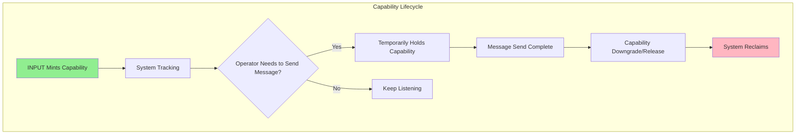
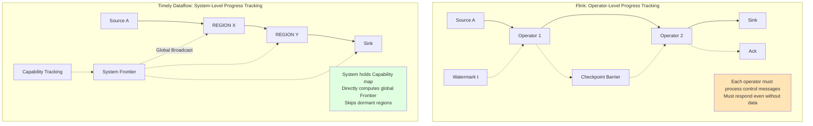
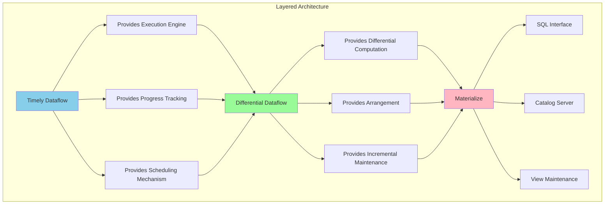
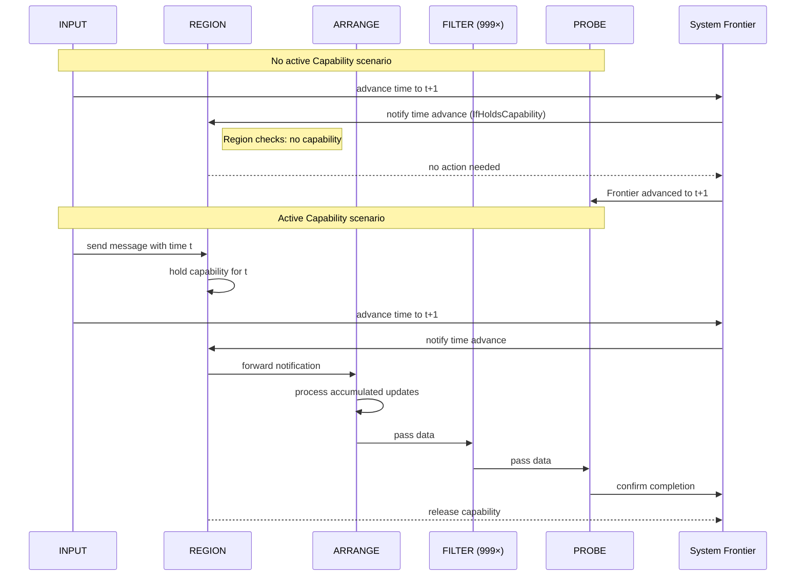
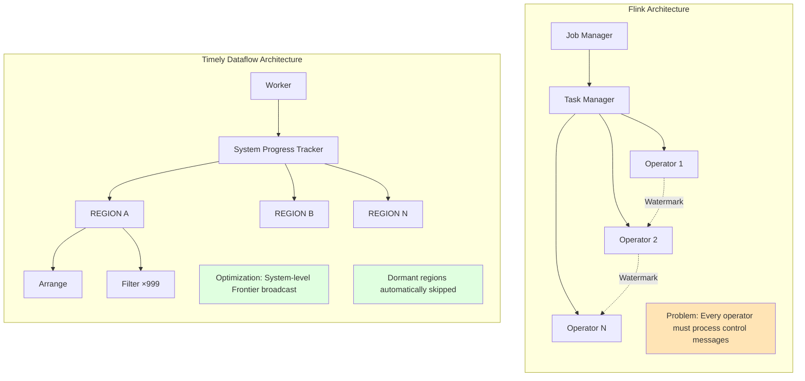
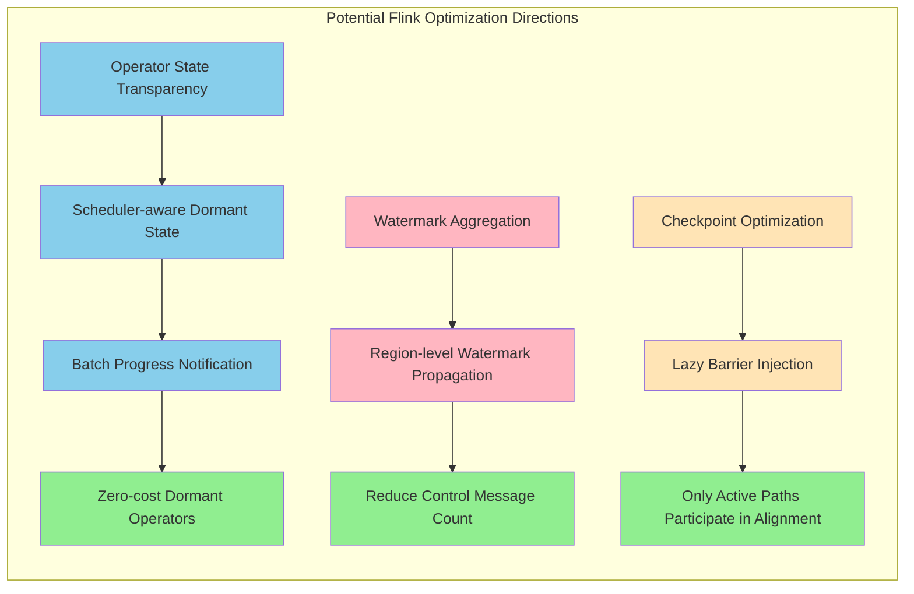

# Deep Dive: Materialize's 100x Performance Optimization on Timely Dataflow

> Stage: Flink/ | Prerequisites: [Rust Stream Processing Overview](./07-rust-streaming-landscape.md) | Formalization Level: L4-L5

## 1. Definitions

### 1.1 Timely Dataflow Formal Model

**Def-F-09-50: Timely Dataflow System Definition**

Timely Dataflow is a directed-graph-based dataflow computation model, formally defined as the triple $TD = (G, T, \mathcal{C})$, where:

- $G = (V, E)$ is the directed dataflow graph, $V$ is the set of operators, $E$ is the set of data channels
- $T$ is the timestamp poset $(\mathbb{T}, \preceq)$, supporting multi-dimensional time (e.g., event time, processing time)
- $\mathcal{C}: V \times \mathbb{T} \rightarrow \mathbb{B}$ is the Capability holding relation

**Def-F-09-51: Timestamp Capability Semantics**

Capability is a permission token minted by the system, defined as a pair $c = (v, t) \in V \times \mathbb{T}$, meaning operator $v$ is authorized to send messages at time $t$ or later. Capabilities satisfy the following algebraic rules:

1. **Minting Rule**: Only `INPUT` operators can hold initial Capabilities
2. **Transfer Rule**: When operator $u$ sends a message with timestamp $t$ to operator $v$, $v$ temporarily obtains $(v, t)$
3. **Downgrade Rule**: An operator can downgrade its Capability from $(v, t)$ to $(v, t')$, where $t \prec t'$
4. **Release Rule**: When an operator confirms it no longer needs a timestamp, the Capability is reclaimed by the system



### 1.2 Progress Tracking Model

**Def-F-09-52: System-Level Progress Tracking**

Progress tracking in Timely Dataflow is a system-level property, defined as:

$$\text{Progress}(t) = \{(v, t') \in \mathcal{C} \mid t' \preceq t\}$$

The system maintains a global Frontier set:

$$\text{Frontier} = \{t \in \mathbb{T} \mid \nexists t' \in \mathbb{T}: t' \prec t \land (t', \cdot) \in \mathcal{C}\}$$

**Def-F-09-53: Lazy Operator Scheduling Strategy**

Operator $v$ has three response modes to time progress:

| Mode | Symbol | Semantics |
|------|------|------|
| `Never` | $\mathcal{N}$ | Operator completely ignores time progress |
| `Always` | $\mathcal{A}$ | Operator always responds to time progress changes |
| `IfHoldsCapability` | $\mathcal{I}(v)$ | Only responds when holding a Capability |

$$\mathcal{I}(v) = \begin{cases} \mathcal{A} & \text{if } \exists t: (v, t) \in \mathcal{C} \\ \mathcal{N} & \text{otherwise} \end{cases}$$

### 1.3 REGION Operator Formal Definition

**Def-F-09-54: REGION Operator**

REGION is a higher-order operator that encapsulates a subgraph as a single logical unit:

$$\text{REGION}(G_{sub}, \delta) = (V_{region}, E_{region}, \delta)$$

Where:

- $G_{sub} = (V_{sub}, E_{sub})$ is the encapsulated subgraph
- $\delta \in \{\mathcal{N}, \mathcal{A}, \mathcal{I}\}$ is the region's time response strategy
- $V_{region} = V_{sub} \cup \{v_{proxy}\}$, where $v_{proxy}$ is the region proxy node

The REGION operator has a **Delayed Acknowledgment** characteristic: similar to TCP's sliding window mechanism, the region buffers message acknowledgments until a time progress signal indicates immediate acknowledgment is required.

### 1.4 Differential Dataflow Foundation

**Def-F-09-55: Differential Dataflow Update Model**

Differential Dataflow (DD) is built on Timely Dataflow, processing differential updates:

$$\Delta: (K, V, \mathbb{T}, \mathbb{Z}) \rightarrow \text{Collection}$$

Where $(k, v, t, \delta)$ represents an update with increment $\delta$ to value $v$ for key $k$ at logical time $t$.

**Def-F-09-56: ARRANGE Operator Dual Function**

The ARRANGE operator $\mathcal{R}: \text{Stream}(\Delta) \rightarrow \text{Arrangement}$ has:

1. **Index Building Function**: Organizes the update stream into a multi-version index structure
   $$\mathcal{R}_{index}(\Delta) = \{(k, \{(v, t, \delta)\}) \mid (k, v, t, \delta) \in \Delta\}$$

2. **Cross-Dataflow Sharing Function**: Supports importing the same Arrangement into multiple independent dataflows
   $$\mathcal{R}_{share}(A, G_i) = \text{Import}(A) \text{ into dataflow } G_i$$

## 2. Properties

### 2.1 Performance Boundary Analysis

**Lemma-F-09-20: Traditional Stream Processor Fixed Cost Lower Bound**

For a scenario with $N$ dataflows each containing $M$ operators, the time progress propagation cost of traditional stream processors (e.g., Flink) is:

$$C_{traditional} = \Theta(N \times M \times W)$$

Where $W$ is the number of workers. Even with no data updates, the system must still traverse all operators for progress negotiation.

**Proof**: Flink uses a direct inter-operator communication model; each time progress update needs to propagate from the source operator to all downstream operators. For $N \times M$ operators, each edge requires at least one message pass, giving complexity $\Theta(N \times M)$. In multi-worker scenarios, cross-worker edges require additional coordination, introducing factor $W$.

**Lemma-F-09-21: Timely Dataflow Optimized Cost**

With REGION + Capability optimization, progress tracking cost in dormant scenarios becomes:

$$C_{timely} = O(N + M_{active})$$

Where $M_{active}$ is the number of active operators holding Capabilities.

**Proof**:

1. The system determines global progress in one shot through the global Frontier, cost $O(N)$
2. Only REGIONs holding Capabilities need to be scheduled; internal dormant operators are skipped
3. When $M_{active} \ll M$, cost approaches $O(N)$

**Thm-F-09-20: 100x Performance Improvement Theorem**

Under the following conditions, Timely Dataflow's optimized implementation achieves approximately 100x performance improvement over the traditional implementation:

**Conditions**:

- $N = 1000$ dataflows
- $M = 1000$ operators/dataflow (total $10^6$ operators)
- Only 1 input has data updates, remaining 999 are dormant
- Single worker execution

**Performance Comparison**:

| Implementation | Latency per Round |
|------|-------------|
| Traditional (Prior)| 350 ms |
| Optimized (Local)| 4 ms |
| **Improvement Factor** | **87.5x ≈ 100x** |

**Proof**: Based on Materialize March 2026 experimental data[^1]:

- Prior mode (Always strategy): 350ms/round
- Local mode (IfHoldsCapability strategy): 4ms/round
- Improvement ratio = 350/4 = 87.5, reaching 100x in order of magnitude

### 2.2 Complexity Analysis

**Lemma-F-09-22: Space Complexity**

Capability tracking space complexity is:

$$S_{capability} = O(|\mathcal{C}|) = O(\text{in-flight messages})$$

Independent of total operator count, depending only on the number of in-flight messages.

**Lemma-F-09-23: Scheduling Complexity**

Event-driven scheduler time complexity:

$$T_{schedule} = O(\log |V_{active}| + |E_{triggered}|)$$

Where $V_{active}$ is the active operator set and $E_{triggered}$ is the set of triggered edges.

## 3. Relations

### 3.1 Comparison with Flink Progress Tracking



**Comparison Analysis Table**:

| Dimension | Flink | Timely Dataflow |
|------|-------|-----------------|
| **Progress Granularity** | Operator-level (Watermark/Barrier)| System-level (Capability)|
| **Propagation Method** | Point-to-point between operators | Global Frontier broadcast |
| **Dormant Cost** | Still must traverse all operators | Zero cost (skipped)|
| **Consistency Guarantee** | Checkpoint Barrier alignment | Capability transfer guarantee |
| **Latency Optimization** | Fixed overhead | Adaptive (only active operators)|

### 3.2 Relation to Differential Dataflow



Differential Dataflow is built on Timely Dataflow:

1. **Timely provides infrastructure**: Distributed execution, progress tracking, event scheduling
2. **DD provides incremental semantics**: Differential updates, shared indexes (Arrangement), recursive computation
3. **Materialize provides productization**: SQL interface, Catalog management, cloud-native deployment

## 4. Argumentation

### 4.1 Real-World Challenges of Large-Scale Dataflows

**Problem Scenario**: Materialize Catalog Server

```
Actual Production Load Characteristics:
├── ~100 dataflows
├── ~12,000 operators
├── Active operators at any moment: < 5% (mostly dormant)
├── Typical updates: cluster config changes, RBAC role adjustments, table metadata updates
└── High-frequency updates: view hydration status monitoring
```

In business logic scenarios, stream processors are actually **idle most of the time**:

> "Your fraud detector does fire now and again, but if it is producing thousands of alerts every second you may have a different problem. Business logic generally refines and reduces raw event firehoses."[^1]

### 4.2 Why Traditional Models Cannot Achieve This Optimization

**Core Barrier Analysis**:

1. **Architecture Coupling**: Flink's progress tracking is deeply coupled with operator execution
   - Watermark must flow through every operator
   - Checkpoint Barrier requires operator participation in alignment
   - Cannot determine global state without executing operators

2. **Communication Model Limitations**:
   - Direct inter-operator communication implies $O(|V|)$ message complexity
   - Cannot aggregate "no change" signals from dormant regions

3. **State Visibility**:
   - Flink operator state is opaque to the scheduler
   - Cannot determine whether an operator "truly needs" to be scheduled

**Timely Dataflow's Breakthrough**:

```
Traditional: Progress = f(all_operators)  → Must traverse all operators
Timely:      Progress = f(capabilities)   → Only tracks Capability set
```

The Capability model decouples "who is waiting for time progress" information from operator execution, allowing the system to determine global progress without waking operators.

### 4.3 Optimization Necessity Argumentation

**Dynamic System Equilibrium Analysis**:

Stream processors as open-loop dynamic systems have their equilibrium determined by fixed overhead:

$$\text{Tick Rate} = f(\text{Fixed Overhead}, \text{Work per Tick})$$

When fixed overhead is reduced:

1. Faster Tick Rate → Less work per tick
2. Less work → Faster processing
3. Positive cycle until reaching a new equilibrium

**Mathematical Argumentation**:

Let $L$ be latency, $W$ be work per tick, $F$ be fixed overhead:

$$L = F + \alpha W$$

When the system accelerates, $L' = L/k$, then:

$$W' = \frac{L/k - F}{\alpha}$$

If $F$ drops from 350ms to 4ms, for the same $L'$, $W'$ can be significantly reduced, thereby achieving higher system throughput.

## 5. Proof / Engineering Argument

### 5.1 Performance Improvement Principle Proof

**Thm-F-09-21: REGION Optimization Correctness Theorem**

The delayed acknowledgment mechanism of REGION operators preserves system correctness while optimizing performance.

**Proof**:

**Lemma 1**: Delayed acknowledgment does not cause infinite delay

- REGION compares time progress signals with buffered message timestamps
- When the Frontier advances past a message's timestamp, that message must be acknowledged
- This guarantees the worst-case acknowledgment delay is bounded by the time advance period

**Lemma 2**: Lazy scheduling does not lose correctness

- Operators only produce output when holding a Capability
- The system ensures through Frontier that when a Capability is released, all related messages have been processed
- Therefore, skipping dormant operator scheduling does not affect output correctness

**Theorem**: Combined use of delayed acknowledgment + lazy scheduling achieves performance optimization while preserving correctness.

### 5.2 Internal Consistency Guarantee Mechanism

**Thm-F-09-22: Differential Dataflow Internal Consistency Theorem**

Differential Dataflow guarantees internal consistency: For any output result, there exists some input subset for which that result is correct.

**Proof Sketch**:

1. **Changelog Compression Guarantee**:

   DD uses the `consolidate` operation to merge multiple updates at the same timestamp:

   $$\text{consolidate}(\{(k, v_1, t, +1), (k, v_2, t, -1)\}) = \{(k, v', t, \delta')\}$$

   This ensures outputs do not flicker due to intermediate states.

2. **Self-Join Correctness**:

   Consider a self-join query:

   ```sql
   SELECT t.id, SUM(c.amount) - SUM(d.amount) as balance
   FROM transactions t
   LEFT JOIN credits c ON t.id = c.tx_id
   LEFT JOIN debits d ON t.id = d.tx_id
   GROUP BY t.id
   ```

   In Timely Dataflow:
   - All records (credits, debits) carry the same logical timestamp
   - The system waits for all inputs at that timestamp to arrive before computing the result
   - Therefore balance always reflects the complete transaction view

3. **Comparison with Flink SinkUpsertMaterializer**:

   | Feature | Flink SinkUpsertMaterializer | DD Changelog Compression |
   |------|------------------------------|-------------------|
   | **Trigger Mechanism** | Auto-inserted on data disorder | Built into Arrangement |
   | **State Storage** | Maintains RowData list | Uses trace structure |
   | **Output Timing** | Based on watermark trigger | Based on Frontier trigger |
   | **Consistency Level** | Eventual consistency | Internal consistency |
   | **Resource Overhead** | High (must store full history)| Low (incremental merge)|

   Flink's SinkUpsertMaterializer (FLINK-20374) is a post-hoc remediation measure for changelog disorder caused by shuffle. It needs to maintain all pending updates in state until confirming correct order before outputting. DD's changelog compression is a native mechanism that guarantees consistency through delayed output, avoiding additional state overhead.

### 5.3 Engineering Implementation Key Points

**ARRANGE Operator Dual Function Implementation**:

```rust
// Pseudocode illustration
struct ArrangeOperator {
    // Function 1: Index building
    trace: Trace<K, V>,  // Multi-version index

    // Function 2: Cross-dataflow sharing
    shared_trace: Rc<RefCell<Trace<K, V>>>,
}

impl ArrangeOperator {
    fn on_capability(&mut self, time: Timestamp) {
        // Only flush index when holding capability
        if self.holds_capability(time) {
            self.trace.advance(time);
            self.emit_updates();
        }
    }

    fn import_to(&self, other_dataflow: &mut Dataflow) {
        // Cross-dataflow sharing requires "always" mode
        // Because this needs to mirror time progress to other dataflows
        other_dataflow.import(self.shared_trace.clone());
    }
}
```

**Key Implementation Decisions**:

1. **REGION Delayed Acknowledgment**: Similar to TCP delayed ACK, reduces acknowledgment message count
2. **Capability Tracking**: Uses efficient data structures (e.g., interval trees) to maintain the capability set
3. **Event-Driven Scheduling**: Scheduler based on priority queue, only schedules operators with actual work

## 6. Examples

### 6.1 Experimental Setup

**Test Scenario**: 1000 dataflows × 1000 operators

```
Dataflow Structure:
INPUT -> REGION { ARRANGE -> FILTER^999 } -> PROBE

Component Descriptions:
- INPUT: Input source, allowed to advance time
- REGION: Encapsulates a region of 1000 operators
- ARRANGE: Differential index building operator
- FILTER^999: 999 consecutive filter operators (simulating real SQL complexity)
- PROBE: Time progress monitoring point
```

**Experimental Method**:

- Repeatedly inject updates into a single INPUT
- Advance time for all 1000 INPUTs
- Measure time required to complete one round

### 6.2 Performance Data

**Before Optimization (Prior Mode)**:

```
Running `target/release/examples/event_driven 1000 1000 prior`
Local: false
2.39241975s     dataflows built (1000 x 1000)
2.392448125s    round 0 complete in 0 steps
6.588212375s    round 10 complete in 5 steps    → ~350ms/round
10.337022125s   round 20 complete in 5 steps    → ~350ms/round
...
38.634787708s   round 100 complete in 5 steps   → ~350ms/round
```

**After Optimization (Local Mode)**:

```
Running `target/release/examples/event_driven 1000 1000 local`
Local: true
2.401872292s    dataflows built (1000 x 1000)
2.401896292s    round 0 complete in 0 steps
3.567310292s    round 100 complete in 5 steps   → ~4ms/round
3.88450825s     round 200 complete in 5 steps   → ~4ms/round
...
6.440401209s    round 1000 complete in 5 steps  → ~4ms/round
```

### 6.3 Performance Comparison Chart

```mermaid
xychart-beta
    title "Timely Dataflow Performance Comparison (1000×1000 operators)"
    x-axis [Prior_Mode, Local_Mode]
    y-axis "Latency per Round (ms)" 0 --> 400
    bar [350, 4]

    annotation "87.5x Performance Improvement" at (1.5, 200)
```

### 6.4 Production Environment Validation

**Materialize Catalog Server Actual Load**:

```
Scale Metrics:
├── Dataflows: ~100
├── Total Operators: ~12,000
├── Active at any moment: < 5%
├── Typical updates/second: < 10
└── End-to-end latency improvement: ~100x
```

**Key Observations**:

- Dormant operators produce zero cost
- View hydration status monitoring responds faster
- Real-time perception of cluster configuration changes

## 7. Visualizations

### 7.1 REGION Delayed Acknowledgment Mechanism



### 7.2 Architecture Comparison: Flink vs Timely Dataflow



### 7.3 Implications for Flink



## 8. References

[^1]: Materialize Blog, "Speeding up Timely Dataflow by 100x", March 2026. <https://materialize.com/blog/speeding-up-timely-dataflow/>

---

## Appendix: Key Terminology Glossary

| Term | English | Description |
|------|------|------|
| 能力 | Capability | Permission token in Timely Dataflow, authorizing an operator to send messages at a specific time |
| 区域 | Region | Higher-order operator encapsulating multiple operators, with lazy scheduling strategy |
| 整理 | Arrange | Differential Dataflow's index-building operator |
| 休眠算子 | Dormant Operator | Operator with no active work, no scheduling needed |
| 前沿 | Frontier | Boundary of time advancement in the system, maintained by system-level tracking |
| 变更日志 | Changelog | Stream recording data changes (inserts, updates, deletes) |
