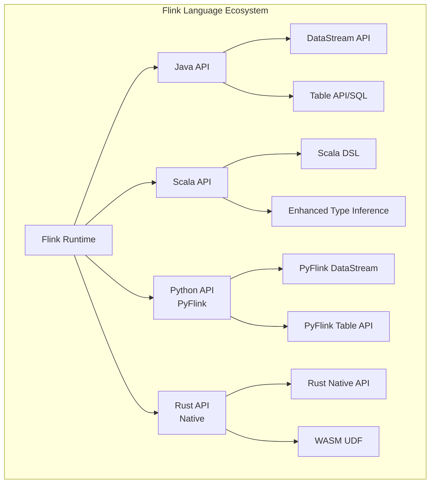
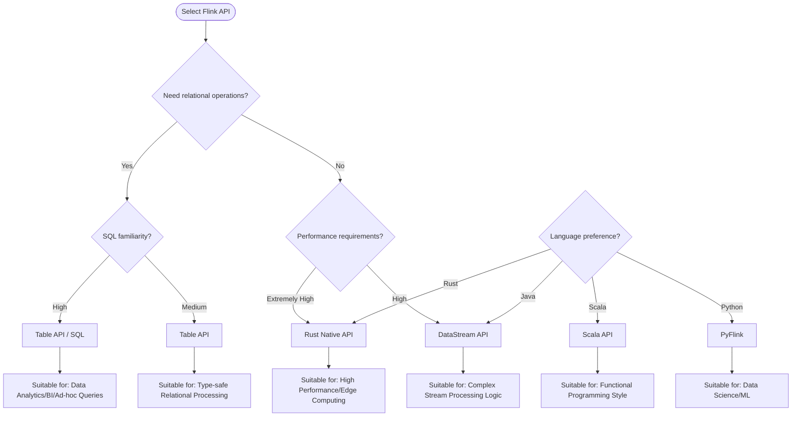
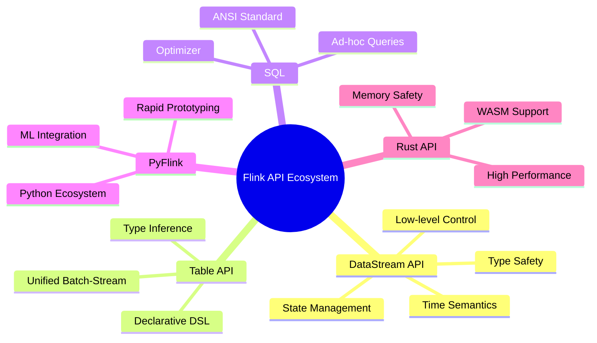

# Flink API Ecosystem Overview

> **Status**: Forward-looking | **Expected Release**: From 2026-Q3 | **Last Updated**: 2026-04-12
>
> ⚠️ Features described in this document are in early discussion stage and not yet officially released. Implementation details may change.

> **Stage**: Flink | **Prerequisites**: [Flink/01-concepts/](../01-concepts/) | **Formalization Level**: L3

This document is the authoritative navigation center for the Flink API layer, systematically organizing all programming interfaces and query languages provided by Flink. From the low-level DataStream API to the declarative Table API & SQL, to the multi-language support system (Java, Scala, Python, Rust), this directory provides complete technical selection and implementation references for stream processing developers.

---

## Directory Structure Navigation

```
03-api/
├── README.md                          # This file - API Ecosystem Overview
├── 03.02-table-sql-api/               # Table API & SQL Complete Guide
│   ├── flink-table-sql-complete-guide.md
│   ├── flink-sql-window-functions-deep-dive.md
│   ├── flink-sql-calcite-optimizer-deep-dive.md
│   ├── flink-cep-complete-guide.md
│   └── ...
└── 09-language-foundations/             # Language Foundations & Multi-language Support
    ├── flink-datastream-api-complete-guide.md
    ├── flink-language-support-complete-guide.md
    ├── pyflink-complete-guide.md
    ├── flink-rust-native-api-guide.md
    └── ...
```

---

## 1. Definitions

### Def-F-03-01: Flink API Layered Architecture

Flink's API design follows the **layered abstraction principle**, from low-level to high-level:

| Level | API Type | Abstraction | Applicable Scenario |
|-------|----------|-------------|---------------------|
| L1 | ProcessFunction | Lowest | Fine-grained state control, complex event processing |
| L2 | DataStream API | Low | Stream processing logic programming, precise control |
| L3 | Table API | Medium | Relational data processing, type safety |
| L4 | SQL | Highest | Declarative queries, rapid analytics |

**Core Feature**: APIs at all levels can be **seamlessly mixed** (e.g., SQL results converted to DataStream), forming a unified programming experience.

---

## 2. DataStream API Deep Dive

### 2.1 Architecture Positioning

DataStream API is Flink's **core programming interface**, providing a type-safe programming model for both unbounded and bounded data streams.

**Core Abstractions**:

- **DataStream<T>**: Immutable data stream supporting transformation operations
- **KeyedStream<K, T>**: Key-partitioned stream supporting stateful operations
- **WindowedStream<T, K, W>**: Windowed stream supporting time-window computations
- **ConnectedStreams<T1, T2>**: Connected stream supporting multi-stream joins

### 2.2 Key Features

| Feature | Description | Document Link |
|---------|-------------|---------------|
| Type System | Strong typing based on TypeInformation | [Type Derivation Mechanism](./09-language-foundations/01.02-typeinformation-derivation.md) |
| Time Semantics | Event Time / Processing Time / Ingestion Time | [Flink/01-concepts/](../01-concepts/) |
| State Management | Full support for Keyed State and Operator State | [Flink/02-core/](../02-core/) |
| Fault Tolerance | Exactly-Once semantics based on Checkpoint | [Flink/01-concepts/](../01-concepts/) |

### 2.3 Quick Start Documents

- 📘 [DataStream API Complete Guide](./09-language-foundations/flink-datastream-api-complete-guide.md) - Complete tutorial from basics to advanced
- 📋 [DataStream API Cheat Sheet](./09-language-foundations/datastream-api-cheatsheet.md) - Quick reference for common operations
- 🆕 [DataStream V2 API](./09-language-foundations/05-datastream-v2-api.md) - Preview of Flink 2.x next-generation API

---

## 3. Table API & SQL Deep Dive

### 3.1 Architecture Positioning

Table API and SQL are Flink's **unified relational APIs**, based on the Apache Calcite optimizer, supporting batch-stream unified queries.

**Core Components**:

```
┌─────────────────────────────────────────┐
│           SQL / Table API               │
├─────────────────────────────────────────┤
│         Apache Calcite Optimizer        │
├─────────────────────────────────────────┤
│      Table API Core (Declarative DSL)   │
├─────────────────────────────────────────┤
│        Table & SQL Runtime              │
├─────────────────────────────────────────┤
│    DataStream API / Batch API (Low-level)│
└─────────────────────────────────────────┘
```

### 3.2 SQL Capability Matrix

| Feature Category | Support Status | Key Document |
|------------------|----------------|--------------|
| ANSI SQL 2023 | Partially implemented | [ANSI SQL 2023 Compliance Guide](./03.02-table-sql-api/ansi-sql-2023-compliance-guide.md) |
| Window Functions | ✅ Complete | [SQL Window Functions Deep Dive](./03.02-table-sql-api/flink-sql-window-functions-deep-dive.md) |
| Complex Event Processing (CEP) | ✅ Complete | [Flink CEP Complete Guide](./03.02-table-sql-api/flink-cep-complete-guide.md) |
| Vector Search | ✅ Experimental | [Vector Search and RAG](./03.02-table-sql-api/flink-vector-search-rag.md) |
| Materialized Tables | ✅ 2.0+ | [Materialized Tables Deep Dive](./03.02-table-sql-api/flink-materialized-table-deep-dive.md) |
| UDF/UDTF/UDAF | ✅ Complete | [Python UDF Development](./03.02-table-sql-api/flink-python-udf.md) |

### 3.3 Table API Core Documents

- 📘 [Table API & SQL Complete Guide](./03.02-table-sql-api/flink-table-sql-complete-guide.md) - Complete tutorial from beginner to expert
- 📊 [Data Types Complete Reference](./03.02-table-sql-api/data-types-complete-reference.md) - Type system deep dive
- 🔧 [Built-in Functions Complete List](./03.02-table-sql-api/built-in-functions-complete-list.md) - 200+ function reference
- ⚡ [SQL Optimization and Hint Guide](./03.02-table-sql-api/flink-sql-hints-optimization.md) - Query performance tuning
- 🔄 [SQL vs DataStream Comparison](./03.02-table-sql-api/sql-vs-datastream-comparison.md) - Selection reference

---

## 4. Language Support System

### 4.1 Language Support Overview

Flink provides **official multi-language support**, meeting the needs of different technology stack teams:



### 4.2 Java API

**Positioning**: Flink's native language, most complete features, optimal performance.

**Core Documents**:

- [Java API from a Scala Perspective](./09-language-foundations/02.01-java-api-from-scala.md)
- [Java API Type System](./09-language-foundations/01.02-typeinformation-derivation.md)

**Applicable Scenarios**: Production environment first choice, enterprise-level application development.

### 4.3 Scala API

**Positioning**: Functional programming-friendly stream processing interface.

**Core Features**:

- Implicit type inference, reducing boilerplate code
- Pattern matching support, elegantly handling complex events
- Case Class automatic serialization

**Core Documents**:

- [Scala Stream Processing Type System](./09-language-foundations/01.01-scala-types-for-streaming.md)
- [Scala 3 Type System Formalization](./09-language-foundations/01.03-scala3-type-system-formalization.md)
- [Flink Scala API Community Guide](./09-language-foundations/02.02-flink-scala-api-community.md)

**Version Status**: Community-maintained after Flink 1.18+, continuous support in 2.x.

### 4.4 Python API (PyFlink)

**Positioning**: Preferred interface for data science and machine learning scenarios.

**Core Features**:

- Seamless integration with Pandas and NumPy ecosystems
- Supports Python UDF and UDTF
- Async I/O support for external service calls

**Core Documents**:

- 📘 [PyFlink Complete Guide](./09-language-foundations/pyflink-complete-guide.md)
- ⚡ [Python Async API](./09-language-foundations/02.03-python-async-api.md)
- 🔧 [Python UDF Development Practice](./03.02-table-sql-api/flink-python-udf.md)

**Applicable Scenarios**: Data science, ML feature engineering, rapid prototyping.

### 4.5 Rust API (Native)

**Positioning**: High-performance, memory-safe new stream processing interface.

**Core Features**:

- Zero-cost abstraction, performance close to C++
- Compile-time memory safety guarantees
- WASM compilation target support

**Core Documents**:

- 📘 [Rust Native API Guide](./09-language-foundations/flink-rust-native-api-guide.md)
- 🦀 [Rust Stream Processing Ecosystem Analysis](./09-language-foundations/07-rust-streaming-landscape.md)
- 🔌 [Rust Connector Development](./09-language-foundations/08-flink-rust-connector-dev.md)
- 📦 [Migration Guide](./09-language-foundations/03.01-migration-guide.md)

**Status**: Experimental support in Flink 2.5+, targeting future high-performance scenarios.

---

## 5. API Selection Decision Guide

### 5.1 Decision Tree



### 5.2 Scenario Comparison Table

| Application Scenario | Recommended API | Rationale |
|----------------------|-----------------|-----------|
| Real-time ETL Pipeline | DataStream API | Precise control over transformation logic |
| Real-time Data Warehouse Queries | SQL / Table API | Declarative, optimizer auto-optimization |
| Complex Event Processing (CEP) | SQL CEP / DataStream CEP | Pattern matching semantic support |
| ML Feature Engineering | PyFlink | Python ecosystem integration |
| High-frequency Trading/Risk Control | Rust API | Extreme latency requirements |
| Unified Batch-Stream Jobs | Table API | Unified batch-stream semantics |
| Rapid Prototype Validation | SQL | Low barrier, rapid iteration |

---

## 6. Subdirectory Navigation

### 6.1 03.02-table-sql-api/ - Table API & SQL Advanced Topics

This directory contains advanced features and deep dives for Table API and SQL:

| Document | Content Summary | Difficulty |
|----------|-----------------|------------|
| [Table API & SQL Complete Guide](./03.02-table-sql-api/flink-table-sql-complete-guide.md) | Comprehensive tutorial covering basics to advanced | ⭐⭐⭐ |
| [SQL Window Functions Deep Dive](./03.02-table-sql-api/flink-sql-window-functions-deep-dive.md) | TUMBLE/SESSION/HOP/CUMULATE | ⭐⭐⭐⭐ |
| [Flink CEP Complete Guide](./03.02-table-sql-api/flink-cep-complete-guide.md) | Complex event processing pattern definitions | ⭐⭐⭐⭐ |
| [Calcite Optimizer Deep Dive](./03.02-table-sql-api/flink-sql-calcite-optimizer-deep-dive.md) | Query plan generation and optimization | ⭐⭐⭐⭐⭐ |
| [Materialized Tables Deep Dive](./03.02-table-sql-api/flink-materialized-table-deep-dive.md) | Incremental computation and materialized views | ⭐⭐⭐⭐ |
| [Vector Search and RAG](./03.02-table-sql-api/flink-vector-search-rag.md) | Streaming vector retrieval in the AI era | ⭐⭐⭐⭐ |
| [Built-in Functions Complete List](./03.02-table-sql-api/built-in-functions-complete-list.md) | 200+ function reference manual | ⭐⭐ |

### 6.2 09-language-foundations/ - Language Foundations and Frontier Exploration

This directory covers multi-language support and future technology exploration:

| Category | Key Document | Value |
|----------|--------------|-------|
| **Language Support Overview** | [Flink Language Support Complete Guide](./09-language-foundations/flink-language-support-complete-guide.md) | Authoritative multi-language selection reference |
| **Java/Scala** | [DataStream API Complete Guide](./09-language-foundations/flink-datastream-api-complete-guide.md) | Core API complete tutorial |
| **Python** | [PyFlink Complete Guide](./09-language-foundations/pyflink-complete-guide.md) | First choice for data science scenarios |
| **Rust** | [Rust Native API Guide](./09-language-foundations/flink-rust-native-api-guide.md) | High-performance scenario exploration |
| **Frontier Exploration** | [Timely Dataflow Optimization](./09-language-foundations/07.01-timely-dataflow-optimization.md) | Differentiated stream computing research |
| **WASM Integration** | [WASM UDF Frameworks](./09-language-foundations/09-wasm-udf-frameworks.md) | Unified multi-language UDF solution |

---

## 7. Quick Start Paths

### 7.1 Beginner Learning Path

```
Week 1: Fundamentals
├── Read: Flink Core Concepts (../01-core-concepts/)
└── Practice: Official WordCount Example

Week 2: DataStream API
├── Read: [DataStream API Complete Guide](./09-language-foundations/flink-datastream-api-complete-guide.md)
└── Practice: Implement a real-time ETL job

Week 3: Table API & SQL
├── Read: [Table API & SQL Complete Guide](./03.02-table-sql-api/flink-table-sql-complete-guide.md)
└── Practice: Build a real-time data warehouse query

Week 4: Advanced Topics
├── Choose: CEP / Window Functions / State Management
└── Practice: Complete a production-grade project
```

### 7.2 Learning Path by Role

| Role | Recommended Path | Expected Time |
|------|------------------|---------------|
| **Data Engineer** | DataStream API → SQL → Connectors | 4-6 weeks |
| **Data Analyst** | SQL → Table API → Window Functions | 2-3 weeks |
| **Data Scientist** | PyFlink → ML Integration → Feature Engineering | 3-4 weeks |
| **Platform Engineer** | Runtime → Deployment → Observability | 4-6 weeks |
| **Researcher** | Theoretical Foundations → Rust API → Formal Verification | 6-8 weeks |

---

## 8. Best Practices and Resources

### 8.1 API Usage Guidelines

1. **Start from high-level**: Prioritize trying SQL/Table API, only下沉 to DataStream when necessary
2. **Type safety**: Always use generic types, avoid RawType
3. **State explicitness**: Explicitly define state TTL to prevent unbounded growth
4. **Test-driven**: Leverage Flink's testing tools for unit and integration testing

### 8.2 Related Resources

- 🔗 [Flink Official Documentation](https://nightlies.apache.org/flink/flink-docs-stable/)
- 🔗 [Flink Forward Conference Videos](https://www.youtube.com/@FlinkForward)
- 🔗 [Stack Overflow - Flink Tag](https://stackoverflow.com/questions/tagged/apache-flink)
- 🔗 [Flink User Mailing List](https://flink.apache.org/community.html#mailing-lists)

---

## 9. Version Compatibility Notes

| API | Flink 1.18 | Flink 1.19 | Flink 2.0 | Flink 2.1+ |
|-----|------------|------------|-----------|------------|
| DataStream API | ✅ | ✅ | ✅ | ✅ |
| Table API/SQL | ✅ | ✅ | ✅ | ✅ |
| PyFlink | ✅ | ✅ | ✅ | ✅ |
| Scala API | ⚠️ Community-maintained | ⚠️ Community-maintained | ⚠️ Community-maintained | ⚠️ Community-maintained |
| Rust API | ❌ | ❌ | ⚠️ Experimental | ✅ |

> **Note**: ⚠️ indicates community-maintained, ❌ indicates not supported, ✅ indicates official full support

---

## 10. Visualization Summary



---

## References
