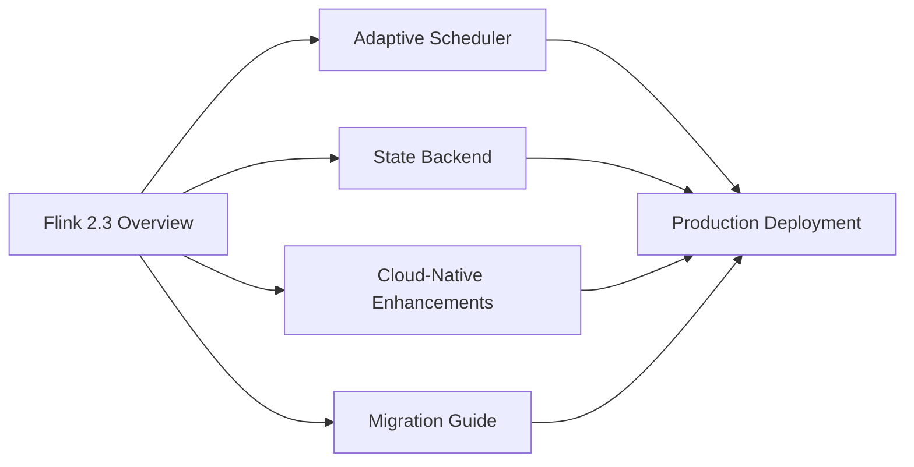

# Flink 2.3 Feature Deep Dive — Index

> **Status**: 🔮 Forward-looking | **Risk Level**: High | **Last Updated**: 2026-04
>
> The content described in this directory is in early planning stages and may differ from the final implementation. Please refer to official Apache Flink releases for authoritative information.

---

## Document List

| ID | Document | Description | Status |
|------|------|------|------|
| 03.01 | [Flink 2.3 New Features Overview](./flink-23-overview.md) | Version positioning, core enhancements, migration strategy overview | ✅ Complete |
| 03.02 | [Adaptive Scheduler 2.0](./flink-23-adaptive-scheduler.md) | Dynamic parallelism adjustment, elastic scaling, scheduling correctness | ✅ Complete |
| 03.03 | [New State Backend Analysis](./flink-23-state-backend.md) | ForStStateBackend, RocksDB comparison, migration path | ✅ Complete |
| 03.04 | [Cloud-Native Enhancements in Practice](./flink-23-cloud-native.md) | K8s Operator collaboration, Sidecar, Pod template injection | 📝 Pending |
| 03.05 | [2.2→2.3 Migration Guide](./flink-22-to-23-migration.md) | Compatibility matrix, configuration changes, rollback plan | 📝 Pending |

---

## Quick Navigation

---

*Flink 2.3 Feature Deep Dive Index*
