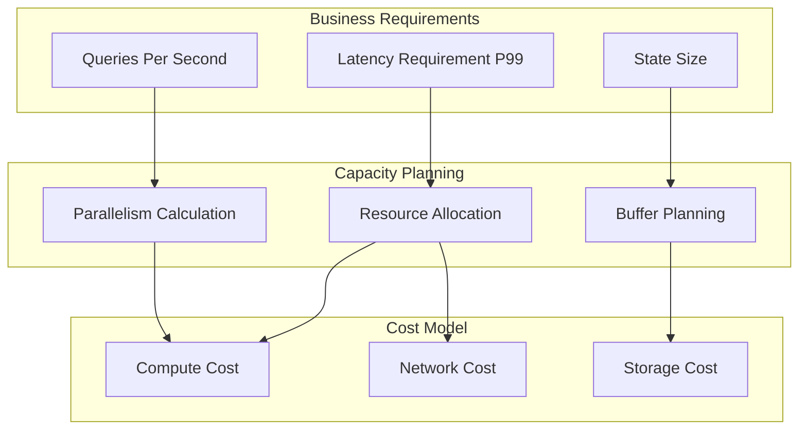
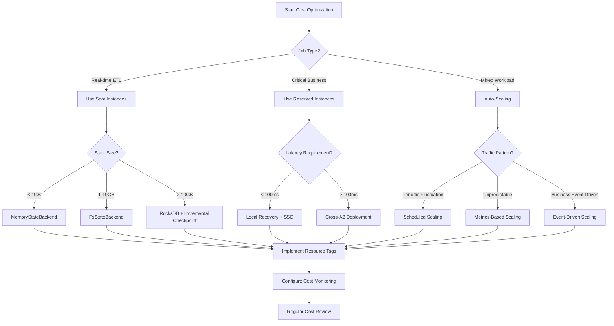
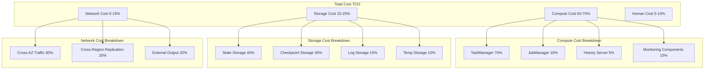
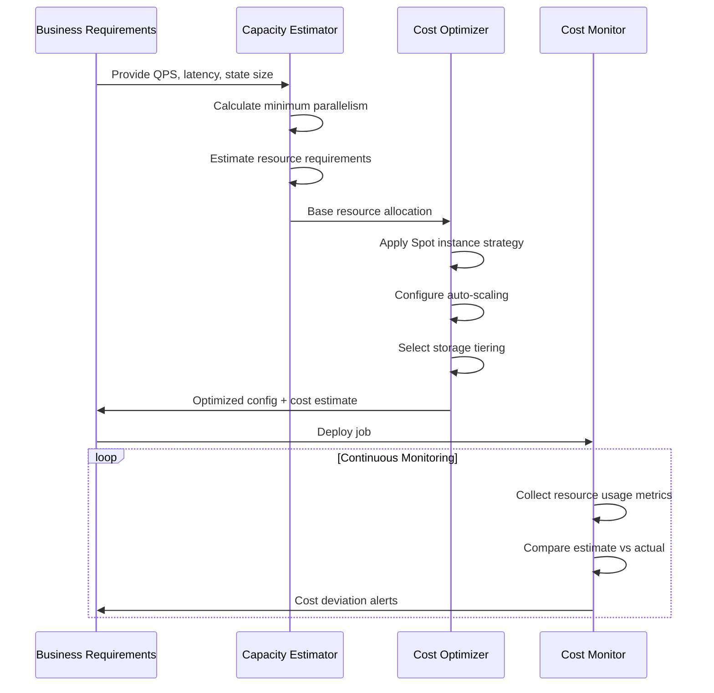
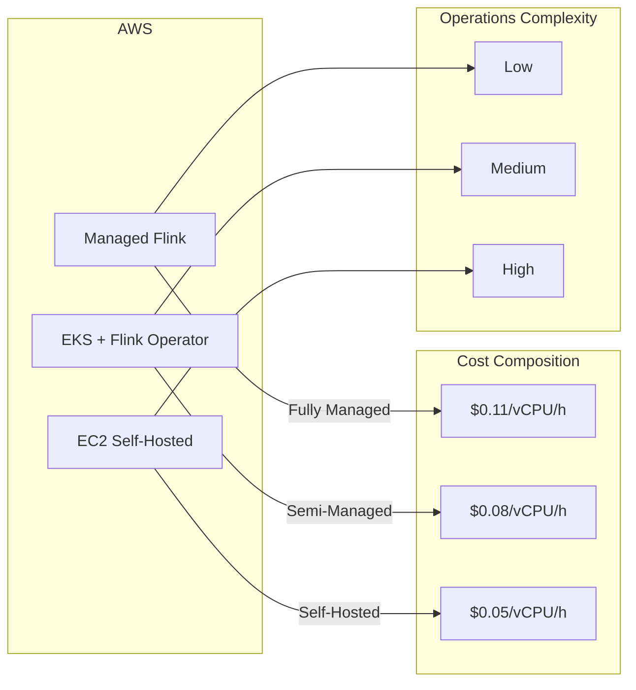

# Flink Cost Optimization Calculator Guide

> Stage: Flink/10-deployment | Prerequisites: [Flink Deployment Operations Complete Guide](./flink-deployment-ops-complete-guide.md), [Performance Tuning Guide](../../09-practices/09.03-performance-tuning/performance-tuning-guide.md) | Formalization Level: L3

---

## 1. Definitions

### Def-F-10-01: Stream Computing Total Cost of Ownership (TCO)

The total cost of ownership $\text{TCO}$ of a stream computing job is defined as the sum of costs across four dimensions:

$$
\text{TCO} = C_{\text{compute}} + C_{\text{storage}} + C_{\text{network}} + C_{\text{human}}
$$

Where:

- $C_{\text{compute}}$: Compute resource cost (vCPU, memory)
- $C_{\text{storage}}$: Storage resource cost (state backend, checkpoints)
- $C_{\text{network}}$: Network transfer cost (cross-AZ, cross-region)
- $C_{\text{human}}$: Human operations cost

### Def-F-10-02: Compute Resource Unit Cost

Define the unit hourly cost function for compute resources:

$$
\text{UnitCost}_{\text{compute}}(r) = p_{\text{vCPU}} \cdot r_{\text{vCPU}} + p_{\text{mem}} \cdot r_{\text{mem}} + p_{\text{gpu}} \cdot r_{\text{gpu}}
$$

Where:

- $p_{\text{vCPU}}$: Per-vCPU per-hour unit price (USD)
- $p_{\text{mem}}$: Per-GB memory per-hour unit price (USD)
- $p_{\text{gpu}}$: Per-GPU per-hour unit price (USD)
- $r$: Resource configuration vector

### Def-F-10-03: State Storage Cost Model

State storage cost consists of active state and checkpoint components:

$$
C_{\text{storage}} = c_{\text{active}} \cdot S_{\text{active}} + c_{\text{checkpoint}} \cdot S_{\text{checkpoint}} \cdot N_{\text{retain}}
$$

Where:

- $S_{\text{active}}$: Active state size (GB)
- $S_{\text{checkpoint}}$: Single checkpoint size (GB)
- $N_{\text{retain}}$: Number of retained checkpoints
- $c_{\text{active}}, c_{\text{checkpoint}}$: Corresponding storage unit prices (USD/GB/month)

### Def-F-10-04: Cost Efficiency Metric

Define the cost efficiency metric for stream processing jobs:

$$
\eta_{\text{cost}} = \frac{T_{\text{throughput}}}{C_{\text{hourly}}} = \frac{\text{events/second}}{\text{USD/hour}}
$$

Where $T_{\text{throughput}}$ is the peak throughput processed by the job.

### Def-F-10-05: Capacity Planning Baseline

The capacity planning baseline defines the minimum resource configuration required to ensure job SLA compliance:

$$
R_{\text{baseline}} = \{(r_{\text{vCPU}}, r_{\text{mem}}, r_{\text{disk}}) \mid \forall t: \text{Latency}(t) \leq \text{SLA}_{\text{latency}} \land \text{Availability}(t) \geq \text{SLA}_{\text{availability}}\}
$$

---

## 2. Properties

### Prop-F-10-01: Sublinear Cost-Throughput Relationship

Under resource constraint conditions, the compute cost of a Flink job exhibits a sublinear relationship with throughput:

$$
C_{\text{compute}}(\lambda) = O(\lambda^{\alpha}), \quad \alpha \in [0.7, 0.9]
$$

Where $\lambda$ is the event arrival rate. This is due to the diminishing returns effect of parallelism scaling.

**Proof Sketch**: As parallelism increases, coordination overhead between tasks (network transfer, checkpoint coordination) grows superlinearly, causing the marginal cost per unit throughput to increase.

### Prop-F-10-02: Checkpoint Frequency Cost Inflection Point

There exists an optimal checkpoint frequency $f^{*}$ that minimizes total storage cost:

$$
f^{*} = \arg\min_{f} \left[ \frac{c_{\text{compute}} \cdot T_{\text{checkpoint}}(f)}{3600} + c_{\text{storage}} \cdot S_{\text{checkpoint}}(f) \cdot f \cdot T_{\text{retention}} \right]
$$

Where:

- $T_{\text{checkpoint}}(f)$: Single checkpoint time (positively correlated with $f$)
- $S_{\text{checkpoint}}(f)$: Checkpoint size (negatively correlated with $f$ under incremental checkpoints)

### Prop-F-10-03: Spot Instance Cost Savings Upper Bound

The maximum cost savings rate using Spot/Preemptible instances is limited by the interruption probability:

$$
\text{Savings}_{\text{max}} = 1 - \frac{1}{1 + \frac{p_{\text{interrupt}}}{1 - p_{\text{interrupt}}} \cdot \frac{C_{\text{restart}}}{C_{\text{ondemand}}}}
$$

Where:

- $p_{\text{interrupt}}$: Spot instance interruption probability
- $C_{\text{restart}}$: Job restart cost (state recovery, data replay)

### Lemma-F-10-01: Positive Correlation Between State Size and Compute Cost

For jobs using the RocksDB state backend, compute cost has a positive correlation with state size:

$$
\frac{\partial C_{\text{compute}}}{\partial S_{\text{state}}} > 0
$$

This is because larger states cause higher serialization/deserialization overhead and greater checkpoint overhead.

---

## 3. Relations

### 3.1 Cost Dimension Correlation Matrix

| Optimization Strategy | Compute Cost | Storage Cost | Network Cost | Human Cost | Applicable Scenario |
|----------------------|-------------|-------------|-------------|-----------|---------------------|
| Spot instances | Down arrow x3 | Right arrow | Right arrow | Up arrow | Fault-tolerant batch processing |
| Auto-scaling | Down arrow x2 | Right arrow | Down arrow | Down arrow | High traffic fluctuation |
| Storage tiering | Right arrow | Down arrow x3 | Up arrow | Right arrow | Hot/cold data separation |
| Incremental checkpoint | Up arrow | Down arrow x2 | Down arrow | Right arrow | Large-state jobs |
| Local recovery | Down arrow | Right arrow | Down arrow x2 | Right arrow | AZ failure tolerance |
| Resource Right-sizing | Down arrow x2 | Right arrow | Right arrow | Down arrow | Stable workload scenarios |

### 3.2 Capacity Planning and Cost Relationship



### 3.3 Cloud Provider Pricing Model Mapping

| Cloud Provider | Compute Pricing Model | Storage Pricing Model | Network Pricing Model | Specialty Services |
|---------------|----------------------|----------------------|----------------------|-------------------|
| AWS | On-Demand / Spot / Savings Plans | S3 Tiering / EBS gp3 | Cross-AZ free / Cross-Region charged | Managed Flink |
| Azure | Pay-as-you-go / Spot / Reserved | Blob Tiering / Managed Disk | VNet peering / Egress traffic | HDInsight on AKS |
| GCP | On-Demand / Spot / Committed Use | Cloud Storage tiers / PD | Internal traffic free / Egress charged | Dataproc Serverless |
| Alibaba Cloud | Pay-as-you-go / Spot / Subscription | OSS Standard/IA/Archive / ESSD | Internal network free / Public network charged | Real-time Compute Flink |

---

## 4. Argumentation

### 4.1 Cost Model Construction Methodology

Building a Flink job cost model requires the following steps:

1. **Baseline Measurement**: Run the job under standard load and collect resource usage metrics
2. **Cost Decomposition**: Attribute total cost to each dimension (compute, storage, network)
3. **Sensitivity Analysis**: Analyze the impact of parameter changes on cost
4. **Model Validation**: Calibrate model parameters through actual billing data

### 4.2 Key Decision Points in Capacity Planning

**Decision Point 1: Parallelism Determination**

Parallelism $P$ selection needs to balance throughput and cost:

$$
P = \max\left(P_{\min}, \min\left(P_{\max}, \left\lceil\frac{\lambda}{\mu_{\text{task}}}\right\rceil\right)\right)
$$

Where $\mu_{\text{task}}$ is the single-task processing capacity.

**Decision Point 2: State Backend Selection**

| State Backend | Applicable State Size | Cost Characteristics | Recovery Time |
|--------------|----------------------|---------------------|---------------|
| MemoryStateBackend | < 100MB | Low compute cost, high risk | Fast |
| FsStateBackend | 100MB - 1GB | Balanced | Medium |
| RocksDBStateBackend | > 1GB | Low storage cost, high compute overhead | Slower |
| Incremental RocksDB | > 10GB | Storage optimized, low network cost | Medium |

**Decision Point 3: Checkpoint Configuration**

Checkpoint configuration requires trade-offs between fault recovery time and storage cost:

```
Checkpoint interval down arrow -> Fault recovery time down arrow -> Storage cost up arrow -> Compute overhead up arrow
```

### 4.3 Cost Optimization Boundary Conditions

Cost optimization strategies have the following boundary constraints:

1. **Latency constraint**: $\text{Latency} \leq \text{SLA}_{\text{latency}}$
2. **Availability constraint**: $\text{Availability} \geq \text{SLA}_{\text{availability}}$
3. **Data integrity constraint**: $\text{DataLoss} = 0$ (Exactly-Once semantics)
4. **Compliance constraint**: Data residency, encryption requirements

---

## 5. Proof / Engineering Argument

### Thm-F-10-01: Optimal Resource Allocation Theorem

**Theorem**: Under given throughput $\lambda$ and latency constraint $L_{\max}$ conditions, there exists a unique optimal resource allocation $R^{*}$ that minimizes cost.

**Proof**:

Define the optimization problem:

$$
\begin{aligned}
\min_{R} \quad & C(R) = c_{\text{vCPU}} \cdot R_{\text{vCPU}} + c_{\text{mem}} \cdot R_{\text{mem}} \\
\text{s.t.} \quad & T(R, \lambda) \leq L_{\max} \\
& R_{\text{vCPU}} \geq R_{\min} \\
& R_{\text{mem}} \geq S_{\text{state}} \cdot \beta
\end{aligned}
$$

Where $T(R, \lambda)$ is the processing latency function.

1. **Feasibility**: When $R \to \infty$, $T(R, \lambda) \to T_{\min}$, constraints are satisfiable
2. **Convexity**: $C(R)$ is a linear function (convex), $T(R, \lambda)$ is decreasing with respect to $R$ (anti-convex constraint)
3. **Optimality**: Optimal solution lies on the constraint boundary $T(R, \lambda) = L_{\max}$

By convex optimization theory, there exists a unique optimal solution. QED

### Thm-F-10-02: Spot Instance Cost-Effectiveness Condition

**Theorem**: Using Spot instances is cost-effective if and only if:

$$
p_{\text{spot}} < p_{\text{ondemand}} \cdot \left(1 - \frac{p_{\text{interrupt}} \cdot t_{\text{recovery}}}{t_{\text{checkpoint}} + t_{\text{recovery}}}\right)
$$

Where:

- $p_{\text{spot}}$: Spot instance unit price
- $p_{\text{ondemand}}$: On-Demand instance unit price
- $t_{\text{recovery}}$: Average recovery time from interruption
- $t_{\text{checkpoint}}$: Checkpoint interval

**Engineering Argument**:

1. **Effective utilization rate**: Spot instance effective utilization rate is $1 - p_{\text{interrupt}}$
2. **Recovery cost**: Each interruption requires paying recovery cost $C_{\text{recovery}}$
3. **Break-even**: When cumulative savings exceed recovery costs, Spot instances have cost advantage

### Thm-F-10-03: Auto-Scaling Cost Savings Upper Bound

**Theorem**: The maximum cost savings rate of auto-scaling is determined by the load coefficient of variation:

$$
\text{Savings}_{\text{autoscaling}} \leq 1 - \frac{\mathbb{E}[\lambda]}{\lambda_{\max}} = 1 - \frac{1}{1 + CV_{\lambda}}
$$

Where $CV_{\lambda} = \frac{\sigma_{\lambda}}{\mathbb{E}[\lambda]}$ is the load coefficient of variation.

**Engineering Argument**:

1. Fixed resource allocation needs to be configured for peak load: $R_{\text{fixed}} = R(\lambda_{\max})$
2. Auto-scaling allocates based on actual load: $R_{\text{autoscaling}} = R(\lambda(t))$
3. Average savings rate depends on the concentration degree of load distribution

---

## 6. Examples

### 6.1 Cost Calculator Input Parameters

```yaml
# cost-calculator-input.yaml
workload:
  qps_peak: 100000           # Peak QPS
  qps_average: 50000         # Average QPS
  event_size_bytes: 1024     # Average event size
  state_size_gb: 500         # State size
  state_growth_rate: 0.1     # Daily growth rate
  latency_sla_ms: 200        # P99 latency requirement
  availability_sla: 0.999    # Availability requirement

infrastructure:
  cloud_provider: aws        # aws | azure | gcp | aliyun
  deployment_mode: managed   # managed | self-hosted | kubernetes
  region: us-east-1
  zones: 3                   # Number of availability zones

optimization:
  use_spot_instances: true
  spot_ratio: 0.5            # Spot instance proportion
  autoscaling_enabled: true
  storage_tiering: true
  checkpoint_interval_sec: 300
  checkpoint_retention_count: 10

cost_factors:
  vcpu_hourly_usd: 0.05
  memory_gb_hourly_usd: 0.006
  storage_ssd_gb_monthly_usd: 0.10
  storage_s3_gb_monthly_usd: 0.023
  network_gb_usd: 0.02
```

### 6.2 Cost Calculation Formula Implementation

```python
# flink_cost_calculator.py
from dataclasses import dataclass
from typing import Optional

@dataclass
class FlinkCostEstimator:
    """Flink Cost Estimator"""

    # Input parameters
    qps_peak: int                    # Peak QPS
    qps_avg: int                     # Average QPS
    event_size_bytes: int            # Event size
    state_size_gb: float             # State size
    latency_sla_ms: float            # Latency requirement

    # Cloud provider pricing (AWS example)
    vcpu_hourly: float = 0.05
    memory_gb_hourly: float = 0.006
    ebs_gp3_gb_monthly: float = 0.08
    s3_standard_gb_monthly: float = 0.023
    cross_az_gb_cost: float = 0.01

    # Flink configuration parameters
    checkpoint_interval_sec: int = 300
    checkpoint_retention: int = 10
    parallelism_per_vcpu: int = 2

    def estimate_compute_cost(self) -> dict:
        """Estimate compute cost"""
        # Calculate required parallelism based on QPS
        events_per_sec_per_task = 5000  # Assume single-task processing capacity
        required_parallelism = max(4,
            int(self.qps_peak / events_per_sec_per_task) + 1)

        # Calculate resource requirements
        vcpus = required_parallelism * 2  # 2 vCPU per parallelism
        memory_gb = required_parallelism * 4  # 4GB per parallelism

        # Calculate monthly cost
        hours_per_month = 730

        # On-Demand cost
        ondemand_cost = (vcpus * self.vcpu_hourly +
                        memory_gb * self.memory_gb_hourly) * hours_per_month

        # Spot instance cost (assume 60% discount)
        spot_vcpu_hourly = self.vcpu_hourly * 0.4
        spot_memory_hourly = self.memory_gb_hourly * 0.4
        spot_cost = (vcpus * spot_vcpu_hourly +
                    memory_gb * spot_memory_hourly) * hours_per_month

        return {
            "parallelism": required_parallelism,
            "vcpus": vcpus,
            "memory_gb": memory_gb,
            "ondemand_monthly": round(ondemand_cost, 2),
            "spot_monthly": round(spot_cost, 2),
            "spot_savings_pct": round((1 - spot_cost/ondemand_cost) * 100, 1)
        }

    def estimate_storage_cost(self) -> dict:
        """Estimate storage cost"""
        # Active state storage (RocksDB on EBS)
        active_state_cost = self.state_size_gb * self.ebs_gp3_gb_monthly

        # Checkpoint storage (S3)
        # Assume incremental checkpoint, average daily change 10%
        daily_change_gb = self.state_size_gb * 0.1
        checkpoint_size_gb = self.state_size_gb + daily_change_gb * 30
        checkpoint_storage_cost = (checkpoint_size_gb *
                                   self.s3_standard_gb_monthly *
                                   self.checkpoint_retention)

        # Log storage
        log_gb_per_month = self.qps_avg * self.event_size_bytes * 86400 * 30 / 1e9
        log_retention_days = 7
        log_storage_cost = log_gb_per_month * log_retention_days / 30 * self.s3_standard_gb_monthly

        total_monthly = active_state_cost + checkpoint_storage_cost + log_storage_cost

        return {
            "active_state_gb": round(self.state_size_gb, 2),
            "active_state_cost": round(active_state_cost, 2),
            "checkpoint_storage_gb": round(checkpoint_size_gb * self.checkpoint_retention, 2),
            "checkpoint_storage_cost": round(checkpoint_storage_cost, 2),
            "log_storage_gb": round(log_gb_per_month * log_retention_days / 30, 2),
            "log_storage_cost": round(log_storage_cost, 2),
            "total_monthly": round(total_monthly, 2)
        }

    def estimate_network_cost(self) -> dict:
        """Estimate network cost"""
        # Cross-AZ traffic
        # Assume 50% of shuffle traffic crosses AZ
        shuffle_bytes_per_sec = (self.qps_avg * self.event_size_bytes * 2)  # Input + output
        cross_az_bytes_per_month = shuffle_bytes_per_sec * 0.5 * 86400 * 30
        cross_az_cost = cross_az_bytes_per_month / 1e9 * self.cross_az_gb_cost

        return {
            "cross_az_gb_monthly": round(cross_az_bytes_per_month / 1e9, 2),
            "cross_az_cost": round(cross_az_cost, 2),
            "total_monthly": round(cross_az_cost, 2)
        }

    def generate_report(self) -> dict:
        """Generate complete cost report"""
        compute = self.estimate_compute_cost()
        storage = self.estimate_storage_cost()
        network = self.estimate_network_cost()

        total_ondemand = compute["ondemand_monthly"] + storage["total_monthly"] + network["total_monthly"]
        total_spot = compute["spot_monthly"] + storage["total_monthly"] + network["total_monthly"]

        return {
            "summary": {
                "ondemand_monthly_usd": round(total_ondemand, 2),
                "spot_monthly_usd": round(total_spot, 2),
                "annual_ondemand_usd": round(total_ondemand * 12, 2),
                "annual_spot_usd": round(total_spot * 12, 2),
                "spot_savings_annual_usd": round((total_ondemand - total_spot) * 12, 2)
            },
            "compute": compute,
            "storage": storage,
            "network": network
        }

# Usage example
if __name__ == "__main__":
    estimator = FlinkCostEstimator(
        qps_peak=100000,
        qps_avg=50000,
        event_size_bytes=1024,
        state_size_gb=500,
        latency_sla_ms=200
    )

    report = estimator.generate_report()
    print(f"Monthly On-Demand Cost: ${report['summary']['ondemand_monthly_usd']}")
    print(f"Monthly Spot Cost: ${report['summary']['spot_monthly_usd']}")
    print(f"Annual Savings: ${report['summary']['spot_savings_annual_usd']}")
```

### 6.3 E-commerce Scenario Cost Analysis

**Scenario**: Real-time order processing system

| Metric | Value |
|--------|-------|
| Peak QPS | 50,000 |
| Average QPS | 15,000 |
| Event size | 2KB (order event) |
| State size | 200GB (user shopping cart, inventory) |
| Latency requirement | P99 < 100ms |
| Availability requirement | 99.99% |

**Cost Calculation**:

```
Compute Resource Allocation:
- Parallelism: 16 (based on 50k/3k single-task processing capacity)
- vCPU: 32
- Memory: 128GB
- Compute monthly cost (On-Demand): $1,168
- Compute monthly cost (50% Spot): $818

Storage Cost:
- Active state (EBS gp3): 200GB x $0.08 = $16/month
- Checkpoints (S3): 50GB x $0.023 x 10 = $11.5/month
- Log storage: $5/month
- Total storage cost: $32.5/month

Network Cost:
- Cross-AZ traffic: ~2TB/month x $0.01 = $20/month

Total Cost:
- On-Demand: $1,220/month
- Optimized (50% Spot): $870/month
- Annual savings: $4,200
```

### 6.4 Financial Scenario Cost Analysis

**Scenario**: Real-time risk control system

| Metric | Value |
|--------|-------|
| Peak QPS | 10,000 |
| Average QPS | 5,000 |
| Event size | 5KB (transaction event) |
| State size | 1TB (user profile, rule library) |
| Latency requirement | P99 < 50ms |
| Availability requirement | 99.999% |
| Compliance requirement | Data encryption, audit logs |

**Special Considerations**:

- Cannot use Spot instances (high availability requirement)
- Need reserved instances or Savings Plans
- Multi-AZ deployment increases network cost
- Compliance increases storage cost (audit logs retained 7 years)

**Cost Calculation**:

```
Compute Resource Allocation:
- Parallelism: 8
- vCPU: 24 (reserved instances, 40% discount)
- Memory: 96GB
- Compute monthly cost (Savings Plan): $630

Storage Cost:
- Active state (encrypted EBS): 1TB x $0.10 = $100/month
- Checkpoints (encrypted S3): 200GB x $0.023 x 20 = $92/month
- Audit logs (Glacier): 10TB x $0.004 = $40/month
- Total storage cost: $232/month

Network Cost:
- Cross-AZ traffic: ~5TB/month x $0.01 = $50/month
- Dedicated line (compliance): $300/month
- Total network cost: $350/month

Compliance Cost:
- KMS encryption: $50/month
- CloudTrail: $30/month

Total Cost: $1,292/month ($15,504/year)
```

### 6.5 IoT Scenario Cost Analysis

**Scenario**: Large-scale IoT data processing

| Metric | Value |
|--------|-------|
| Peak QPS | 1,000,000 (device reporting) |
| Average QPS | 300,000 |
| Event size | 200B (sensor data) |
| State size | 50GB (device status, aggregation windows) |
| Latency requirement | P99 < 500ms |
| Data retention | Hot data 7 days, cold data 1 year |

**Optimization Strategies**:

- Use Spot instances for non-critical data cleansing
- Hot data stored on SSD, cold data auto-migrated to S3
- Utilize cross-AZ network free policies
- Partition by device ID to reduce shuffle

**Cost Calculation**:

```
Compute Resource Allocation:
- Parallelism: 128
- vCPU: 256
- Memory: 512GB
- On-Demand compute monthly: $9,344
- Optimized (70% Spot): $5,138

Storage Cost:
- Hot data (EBS): 50GB x $0.08 = $4/month
- Cold data (S3 Standard-IA): 500GB x $0.0125 = $6.25/month
- Archive data (Glacier): 3TB x $0.004 = $12/month
- Checkpoints: 10GB x $0.023 x 5 = $1.15/month
- Total storage cost: $23.4/month

Network Cost:
- Inbound traffic free
- Internal shuffle: Minimized through partitioning optimization
- Output to data lake: ~1TB/month x $0.09 = $90/month
- Total network cost: $90/month

Total Cost:
- On-Demand: $9,457/month
- Optimized: $5,251/month
- Annual savings: $50,472
```

---

## 7. Visualizations

### 7.1 Cost Optimization Decision Tree



### 7.2 Cost Structure Hierarchy Diagram



### 7.3 Capacity Planning Sequence Diagram



### 7.4 Cost Comparison Matrix



---

## 8. Cost Monitoring and Governance

### 8.1 Resource Tagging Strategy

```yaml
# Mandatory tagging specification
tags:
  # Business dimension
  BusinessUnit: "E-commerce Division"
  Project: "Real-time Recommendation System"
  Environment: "production"

  # Technical dimension
  Component: "flink-job"
  FlinkVersion: "1.18"
  StateBackend: "rocksdb"

  # Cost dimension
  CostCenter: "CC-12345"
  Owner: "data-platform-team"
  AutoShutdown: "false"

  # Optimization dimension
  SpotEnabled: "true"
  AutoscalingEnabled: "true"
```

### 8.2 Cost Allocation Model

| Allocation Dimension | Method | Applicable Scenario |
|---------------------|--------|---------------------|
| By business line | Tag association | Multi-business shared cluster |
| By job | Job ID tracking | Granular cost attribution |
| By resource type | Categorized summary | Capacity planning decisions |
| By environment | Environment tags | Dev/Prod cost separation |

### 8.3 Anomaly Detection Rules

```yaml
# cost-anomaly-detection.yaml
rules:
  - name: Daily cost spike
    condition: daily_cost > avg(daily_cost, 7d) * 1.5
    severity: warning
    action: notify

  - name: Compute cost ratio anomaly
    condition: compute_cost_ratio > 0.8
    severity: info
    action: suggest_optimization

  - name: Storage cost growth
    condition: storage_cost_growth_rate > 0.2
    severity: warning
    action: review_retention_policy

  - name: Network cost anomaly
    condition: network_cost > $500/day
    severity: critical
    action: investigate_traffic_pattern
```

---

## 9. Cloud Provider Pricing Comparison

### 9.1 AWS Pricing Reference (us-east-1, 2025)

| Resource Type | On-Demand | Spot | Reserved Instance (1-year) |
|--------------|-----------|------|---------------------------|
| m6i.xlarge (4 vCPU, 16GB) | $0.192/hour | $0.076/hour | $0.120/hour |
| EBS gp3 (GB/month) | $0.08 | - | - |
| S3 Standard (GB/month) | $0.023 | - | - |
| Cross-AZ Data Transfer | $0.01/GB | - | - |
| Managed Flink (KPU/hour) | $0.11 | - | - |

### 9.2 Azure Pricing Reference (East US, 2025)

| Resource Type | Pay-as-you-go | Spot | Reserved (1-year) |
|--------------|--------------|------|------------------|
| D4s_v5 (4 vCPU, 16GB) | $0.192/hour | $0.057/hour | $0.115/hour |
| Managed Disk P10 (GB/month) | $0.132 | - | - |
| Blob Hot Tier (GB/month) | $0.0184 | - | - |
| VNet Peering | $0.01/GB | - | - |
| HDInsight Flink | Contact for pricing | - | - |

### 9.3 GCP Pricing Reference (us-central1, 2025)

| Resource Type | On-Demand | Spot | Committed Use (1-year) |
|--------------|-----------|------|----------------------|
| n2-standard-4 (4 vCPU, 16GB) | $0.194/hour | $0.058/hour | $0.136/hour |
| Persistent Disk (GB/month) | $0.04 | - | - |
| Cloud Storage Standard (GB/month) | $0.020 | - | - |
| Internal Egress Traffic | Free | - | - |
| Dataproc Serverless | Billed by processing units | - | - |

### 9.4 Alibaba Cloud Pricing Reference (China East 1, 2025)

| Resource Type | Pay-as-you-go | Spot | Subscription |
|--------------|--------------|------|-------------|
| ecs.g7.xlarge (4 vCPU, 16GB) | CNY 1.08/hour | CNY 0.32/hour | CNY 520/month |
| ESSD PL1 (GB/month) | CNY 0.5 | - | - |
| OSS Standard (GB/month) | CNY 0.12 | - | - |
| Internal Network Traffic | Free | - | - |
| Real-time Compute Flink | Billed by CU | - | - |

---

## 10. Best Practices Summary

### 10.1 Cost Optimization Checklist

- [ ] Evaluated feasibility of using Spot/Preemptible instances
- [ ] Configured auto-scaling strategy
- [ ] Implemented storage tiering (hot/warm/cold)
- [ ] Optimized checkpoint frequency and retention policy
- [ ] Configured resource tags for cost allocation
- [ ] Set up cost anomaly alerts
- [ ] Regularly reviewing resource utilization
- [ ] Evaluated applicability of reserved instances/subscription

### 10.2 Common Cost Pitfalls

| Pitfall | Manifestation | Solution |
|---------|--------------|----------|
| Over-provisioning | Resource utilization < 30% | Use auto-scaling |
| Excessive checkpoints | Storage cost surge | Enable incremental checkpoints |
| Uncontrolled cross-AZ traffic | Abnormal network cost | Optimize partition strategy |
| Excessive log retention | Continuous storage growth | Configure auto-cleanup policy |
| Frequent Spot interruptions | Recovery costs offset savings | Adjust interruption tolerance |

### 10.3 Cost Optimization Roadmap

```
Phase 1 (1-2 weeks): Baseline establishment
├── Enable resource tags
├── Configure cost monitoring
└── Establish cost reports

Phase 2 (2-4 weeks): Quick wins
├── Implement Spot instances (for non-critical jobs)
├── Optimize checkpoint configuration
└── Clean up unused resources

Phase 3 (1-3 months): Deep optimization
├── Deploy auto-scaling
├── Implement storage tiering
└── Purchase reserved instances

Phase 4 (Ongoing): Cost governance
├── Regular cost review meetings
├── Cost optimization training
└── Automated cost optimization strategies
```

---

## 11. References


---

*Document Version: v1.0 | Last Updated: 2026-04-04 | Maintainer: AnalysisDataFlow Project*

---

*Document Version: v1.0 | Created: 2026-04-20*
