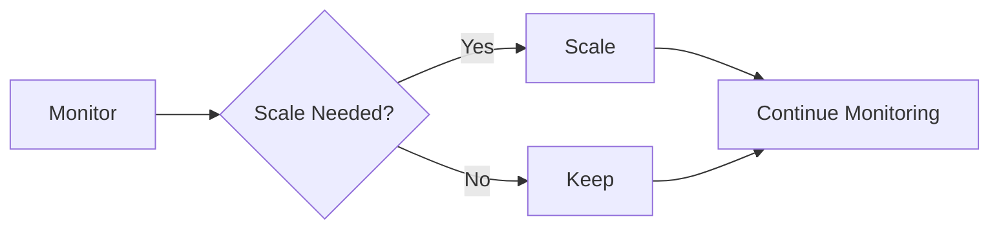

# Auto Scaling Evolution Tracking

> Stage: Flink/deployment/evolution | Prerequisites: [Auto Scaling][^1] | Formalization Level: L3

## 1. Definitions

### Def-F-Autoscale-01: Auto Scaling

Auto scaling:
$$
\text{Scale} = f(\text{Load}, \text{Latency}, \text{Cost})
$$

## 2. Properties

### Prop-F-Autoscale-01: Scaling Speed

Scaling speed:
$$
T_{\text{scale}} < 60s
$$

## 3. Relations

### Auto Scaling Evolution

| Version | Feature | Status |
|---------|---------|--------|
| 2.4 | Backpressure-Based | GA |
| 2.5 | Predictive Scaling | GA |
| 3.0 | Intelligent Scaling | In Design |

## 4. Argumentation

### 4.1 Trigger Conditions

| Metric | Threshold |
|--------|-----------|
| CPU | >80% |
| Backpressure | >5s |
| Latency | >SLA |

## 5. Proof / Engineering Argument

### 5.1 Scaling Algorithm

```java
public class AdaptiveScaler {
    public int calculateTargetParallelism(Metrics metrics) {
        double load = metrics.getLoad();
        return (int) Math.ceil(currentParallelism * load / targetUtilization);
    }
}
```

## 6. Examples

### 6.1 Configuration

```yaml
autoscaling.enabled: true
autoscaling.min-parallelism: 2
autoscaling.max-parallelism: 100
```

## 7. Visualizations



## 8. References

[^1]: Flink Auto Scaling Documentation

---

## Tracking Information

| Property | Value |
|----------|-------|
| Version | 2.4-3.0 |
| Current Status | Evolving |
