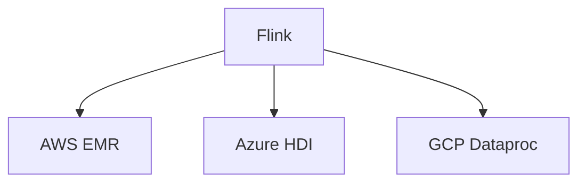

# Cloud Deployment Evolution Feature Tracking

> Stage: Flink/deployment/evolution | Prerequisites: [Cloud Deployment][^1] | Formalization Level: L3

## 1. Definitions

### Def-F-Deploy-Cloud-01: Managed Service

Managed service:
$$
\text{Managed} = \text{Provisioning} + \text{Maintenance} + \text{Monitoring}
$$

## 2. Properties

### Prop-F-Deploy-Cloud-01: Auto Provisioning

Auto provisioning:
$$
\text{Resources} \to \text{AutoProvision}
$$

## 3. Relations

### Cloud Deployment Evolution

| Version | Feature | Status |
|---------|---------|--------|
| 2.4 | EMR Integration | GA |
| 2.5 | Ververica | GA |
| 3.0 | Multi-Cloud Native | In Design |

## 4. Argumentation

### 4.1 Cloud Services

| Vendor | Service |
|--------|---------|
| AWS | EMR, KDA |
| Azure | HDInsight |
| GCP | Dataproc |
| Alibaba Cloud | Ververica |

## 5. Proof / Engineering Argument

### 5.1 Terraform Deployment

```hcl
resource "aws_kinesisanalyticsv2_application" "flink" {
  name = "flink-app"
  runtime_environment = "FLINK-1_18"
}
```

## 6. Examples

### 6.1 AWS EMR

```bash
aws emr create-cluster \
  --name "Flink Cluster" \
  --release-label emr-6.15.0 \
  --applications Name=Flink
```

## 7. Visualizations



## 8. References

[^1]: Cloud Deployment Documentation

---

## Tracking Information

| Property | Value |
|----------|-------|
| Version | 2.4-3.0 |
| Current Status | Evolving |
