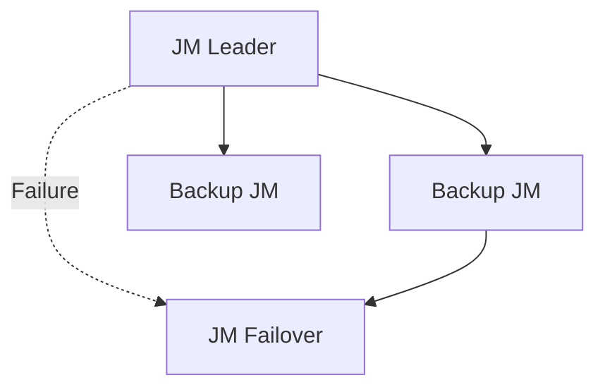

# High Availability Evolution Feature Tracking

> **Stage**: Flink/deployment/evolution | **Prerequisites**: [HA][^1] | **Formalization Level**: L3

## 1. Definitions

### Def-F-Deploy-HA-01: High Availability

High availability:
$$
\text{HA} = \text{FaultTolerance} + \text{AutoRecovery}
$$

## 2. Properties

### Prop-F-Deploy-HA-01: Recovery Time

Recovery time:
$$
T_{\text{recovery}} < 3min
$$

## 3. Relations

### HA Evolution

| Version | Feature | Status |
|------|------|------|
| 2.4 | ZK HA | GA |
| 2.5 | K8s Native HA | GA |
| 3.0 | ZK-less HA | In Design |

## 4. Argumentation

### 4.1 HA Modes

| Mode | Metadata Storage |
|------|------------|
| ZooKeeper | ZK ensemble |
| Kubernetes | K8s ConfigMap |
| Embedded | Embedded Raft |

## 5. Formal Proof / Engineering Argument

### 5.1 HA Configuration

```yaml
high-availability: zookeeper
high-availability.zookeeper.quorum: zk1:2181,zk2:2181
```

## 6. Examples

### 6.1 K8s HA

```yaml
spec:
  jobManager:
    replicas: 3
  flinkConfiguration:
    high-availability: kubernetes
```

## 7. Visualizations



## 8. References

[^1]: Flink HA Documentation

---

## Tracking Information

| Attribute | Value |
|------|-----|
| Version | 2.4-3.0 |
| Current Status | Evolving |
