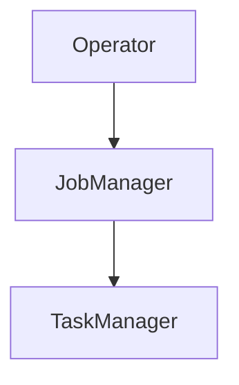

# Kubernetes Deployment Evolution Tracking

> Stage: Flink/deployment/evolution | Prerequisites: [K8s Deployment][^1] | Formalization Level: L3

## 1. Definitions

### Def-F-Deploy-K8s-01: K8s Native

K8s native deployment:
$$
\text{K8sNative} = \text{CRD} + \text{Operator} + \text{NativeAPI}
$$

## 2. Properties

### Prop-F-Deploy-K8s-01: Self-Healing

Self-healing capability:
$$
\text{Failure} \to \text{AutoRestart}
$$

## 3. Relations

### K8s Evolution

| Version | Feature | Status |
|---------|---------|--------|
| 2.4 | Operator Enhancement | GA |
| 2.5 | GitOps Support | GA |
| 3.0 | Cloud Native Native | In Design |

## 4. Argumentation

### 4.1 Deployment Modes

| Mode | Description |
|------|-------------|
| Application | Application Mode |
| Session | Session Mode |
| Job | Per-Job Mode |

## 5. Proof / Engineering Argument

### 5.1 FlinkDeployment CR

```yaml
apiVersion: flink.apache.org/v1beta1
kind: FlinkDeployment
metadata:
  name: example
spec:
  image: flink:2.4
  jobManager:
    resource:
      memory: 2048m
  taskManager:
    resource:
      memory: 4096m
```

## 6. Examples

### 6.1 Helm Deployment

```bash
helm install flink-kubernetes-operator \
  https://github.com/apache/flink-kubernetes-operator/releases/download/v1.7.0/flink-kubernetes-operator-1.7.0.tgz
```

## 7. Visualizations



## 8. References

[^1]: Flink K8s Operator Documentation

---

## Tracking Information

| Property | Value |
|----------|-------|
| Version | 2.4-3.0 |
| Current Status | Evolving |
