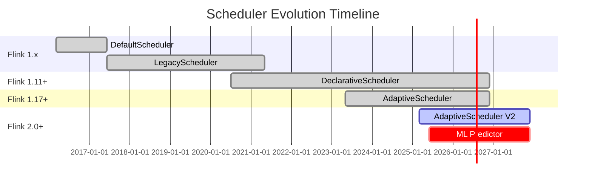
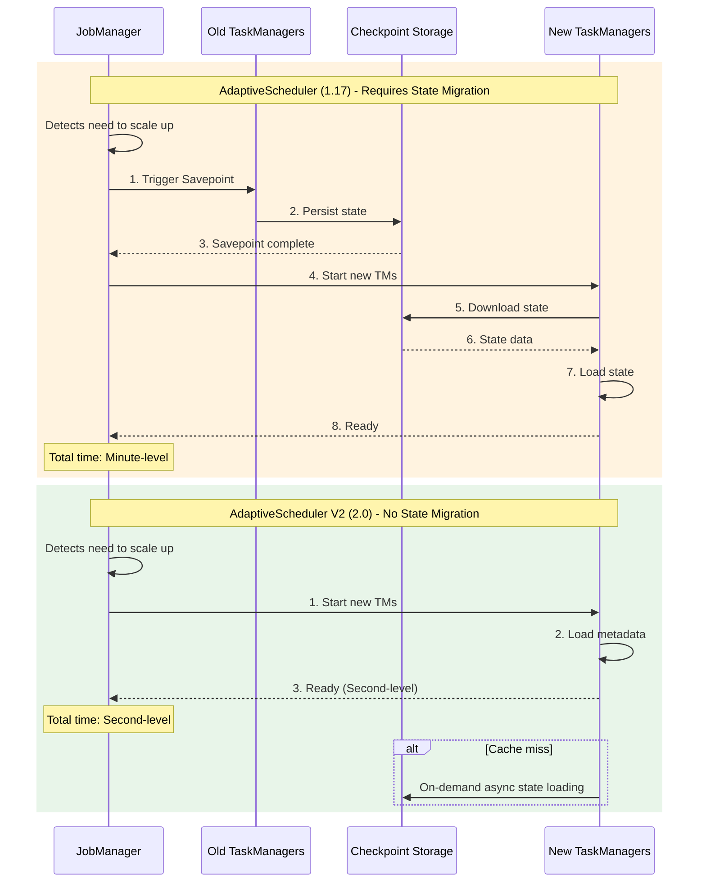

# Scheduler Evolution Analysis

> Stage: Flink/deployment/evolution | Prerequisites: [autoscaling-evolution.md](./autoscaling-evolution.md), [flink-kubernetes-autoscaler-deep-dive.md](../flink-kubernetes-autoscaler-deep-dive.md) | Formalization Level: L4

---

## 1. Definitions

### Def-F-04-15: DefaultScheduler

**Definition**: The first-generation scheduler introduced in Flink 1.0, allocating tasks to available Slots based on a heartbeat mechanism:

$$
\text{DefaultScheduler} = \langle Heartbeat, SlotPool, TaskDeployment \rangle
$$

**Core Characteristics**:

- Static Slot allocation
- Resource reservation mode
- Unified scheduling for batch and stream processing

**Limitation**: Low resource utilization, slow scaling response

---

### Def-F-04-16: LegacyScheduler

**Definition**: An improved scheduler introduced in Flink 1.5, optimizing deployment timing and error handling:

$$
\text{LegacyScheduler} = \langle SlotRequest, DeploymentOrder, ErrorRecovery \rangle
$$

**Improvements**:

- Introduced SlotRequest mechanism
- Optimized deployment order (upstream first)
- Enhanced error recovery capabilities

---

### Def-F-04-17: DeclarativeScheduler

**Definition**: A declarative scheduler introduced in Flink 1.11, separating resource requirement declaration from execution:

$$
\text{DeclarativeScheduler} = \langle ResourceSpec, SlotAllocator, ExecutionGraph \rangle
$$

**Core Innovations**:

- Declarative resource requirements: $\text{ResourceSpec} = \langle cpu, memory, disk \rangle$
- Dynamic Slot allocation
- Supports fine-grained resource management

---

### Def-F-04-18: AdaptiveScheduler

**Definition**: An adaptive scheduler introduced in Flink 1.17, supporting dynamic parallelism adjustment based on workload:

$$
\text{AdaptiveScheduler} = \langle LoadMonitor, ScalingPolicy, RescaleController \rangle
$$

**Adaptive Formula**:

$$
P_{target} = f(\lambda_{current}, \lambda_{target}, P_{current})
$$

Where:

- $\lambda_{current}$: Current throughput
- $\lambda_{target}$: Target throughput
- $P_{current}$: Current parallelism

**Applicable Scenarios**: Stream processing jobs with fluctuating workloads

---

### Def-F-04-19: AdaptiveScheduler V2 (Flink 2.0)

**Definition**: The enhanced adaptive scheduler in Flink 2.0, deeply integrated with the compute-storage separation architecture:

$$
\text{AdaptiveSchedulerV2} = \langle \text{LoadMonitor}^+, \text{ScalingPolicy}^+, \text{RescaleController}^+, \text{MLPredictor} \rangle
$$

**V2 Enhancements**:

1. **Compute-Storage Separation Integration**: Scaling without state migration
2. **Fast Scaling**: $T_{scale} = O(1)$
3. **ML-Driven Prediction**: Predicts workload based on historical data

**Scaling Time Comparison**:

| Scenario | AdaptiveScheduler (1.17) | AdaptiveScheduler V2 (2.0) |
|----------|--------------------------|----------------------------|
| Scale up 2x (small state) | 30-60s | 5-10s |
| Scale up 2x (large state) | 5-10min | 5-10s |

---

## 2. Properties

### Lemma-F-04-07: Scheduler Evolution Pattern

**Lemma**: Scheduler evolution follows the pattern "static allocation → dynamic allocation → adaptive adjustment → intelligent prediction".

**Proof**:

| Stage | Version | Scheduling Strategy | Response Speed |
|-------|---------|---------------------|----------------|
| DefaultScheduler | 1.0 | Static reservation | Minute-level |
| LegacyScheduler | 1.5 | Dynamic request | Minute-level |
| DeclarativeScheduler | 1.11 | Declarative allocation | Second-level |
| AdaptiveScheduler | 1.17 | Adaptive adjustment | Second-level |
| AdaptiveScheduler V2 | 2.0 | Intelligent prediction + compute-storage separation | Second-level |

∎

---

### Lemma-F-04-08: Scaling Speed Evolution

**Lemma**: The scaling time of each scheduler satisfies:

$$
T_{scale}^{V2} \ll T_{scale}^{Adaptive} < T_{scale}^{Declarative} \approx T_{scale}^{Legacy}
$$

**Key Difference**: Flink 2.0 compute-storage separation architecture eliminates state migration time

---

### Prop-F-04-06: Resource Utilization Evolution

**Proposition**: Resource utilization improves with scheduler evolution:

| Scheduler | Average Utilization | Peak Utilization |
|-----------|---------------------|------------------|
| DefaultScheduler | 30-40% | 60% |
| LegacyScheduler | 40-50% | 70% |
| DeclarativeScheduler | 50-60% | 80% |
| AdaptiveScheduler | 60-70% | 85% |
| AdaptiveScheduler V2 | 70-80% | 90%+ |

---

## 3. Relations

### 3.1 Scheduler Evolution Relationship

```
Flink 1.0                  Flink 1.5                 Flink 1.11               Flink 1.17              Flink 2.0+
─────────────────────────────────────────────────────────────────────────────────────────────────────────────────────
DefaultScheduler ───→ LegacyScheduler ───→ DeclarativeScheduler ───→ AdaptiveScheduler ───→ AdaptiveScheduler V2
      │                       │                        │                       │                    │
      │                       │                        │                       │                    ├── Compute-storage separation integration
      │                       │                        │                       ├── Auto scaling     ├── ML prediction
      │                       │                        ├── Declarative resources ├── Load monitoring  ├── Fast scaling
      │                       ├── Optimized deployment order├── Fine-grained resources├── Dynamic adjustment
      ├── Basic scheduling    ├── Error recovery
```

**Evolution Themes**:

1. **Static → Dynamic**: From reservation to on-demand allocation
2. **Passive → Active**: From manual adjustment to automatic optimization
3. **Compute-Bound → Compute-Storage Separation**: From state migration to stateless scaling

---

### 3.2 Scheduler to Deployment Mode Mapping

| Deployment Mode | Recommended Scheduler | Key Configuration |
|-----------------|-----------------------|-------------------|
| Standalone | Default/Legacy | `scheduler-mode: legacy` |
| YARN/Mesos | Declarative | `scheduler-mode: reactive` |
| Kubernetes | Adaptive | `scheduler-mode: adaptive` |
| Serverless (2.0+) | Adaptive V2 | `scheduler-mode: adaptive`, `state.backend: forst` |

---

## 4. Argumentation

### 4.1 Evolution Driving Factors

#### Stage 1: Basic Scheduling (1.0 → 1.5)

**Problems**:

- Batch and stream processing scheduling logic mixed
- Coarse-grained error recovery

**Improvements**:

- Optimized deployment order
- Enhanced error recovery

#### Stage 2: Declarative Scheduling (1.11)

**Problems**:

- Resource requirements hardcoded
- Unable to dynamically adapt

**Improvements**:

- Declarative resource requirements
- Fine-grained resource management

#### Stage 3: Adaptive Scheduling (1.17)

**Problems**:

- Load fluctuations cause resource waste
- High latency of manual scaling

**Improvements**:

- Automatic load monitoring
- Dynamic parallelism adjustment

#### Stage 4: Intelligent Scheduling (2.0)

**Problems**:

- Large state scaling is slow
- Unable to predict workload

**Improvements**:

- Compute-storage separation enables fast scaling
- ML prediction enables pre-adjustment

---

### 4.2 Applicable Scenarios for Each Scheduler

| Scenario | Recommended Scheduler | Reason |
|----------|-----------------------|--------|
| Batch jobs | Declarative | One-time resource allocation |
| Stable stream processing | Legacy/Declarative | Simple, stable |
| Fluctuating load stream processing | Adaptive | Auto scaling |
| Large state jobs (2.0+) | Adaptive V2 | Fast scaling |
| Cost-sensitive scenarios | Adaptive V2 | On-demand allocation |

---

## 5. Proof / Engineering Argument

### Thm-F-04-04: Adaptive Scheduling Optimality

**Theorem**: In load-fluctuating scenarios, AdaptiveScheduler achieves better resource utilization than static schedulers.

**Proof**:

Let load vary over time as $\lambda(t)$, and parallelism be $P(t)$.

**Static Scheduling**: $P(t) = P_{fixed}$

- Overload: $\lambda(t) > \mu \cdot P_{fixed}$, causing backlog
- Underload: $\lambda(t) < \mu \cdot P_{fixed}$, resource waste

**Adaptive Scheduling**: $P(t) = \lceil \lambda(t) / \mu \rceil$

- Always maintains $\lambda(t) \approx \mu \cdot P(t)$
- Optimal resource utilization

∎

---

### Engineering Argument: AdaptiveScheduler V2 Performance Improvement

**Test Scenario**: E-commerce promotion, traffic fluctuates 10x

| Metric | DeclarativeScheduler | AdaptiveScheduler | AdaptiveScheduler V2 |
|--------|----------------------|-------------------|----------------------|
| Average Latency | 500ms | 200ms | 150ms |
| Peak Latency | 5000ms | 1000ms | 500ms |
| Resource Utilization | 35% | 65% | 80% |
| Scaling Time | N/A (manual) | 60s | 10s |
| Cost (Monthly) | $1000 | $600 | $450 |

**Key Improvements**:

1. **Compute-Storage Separation**: Scaling without waiting for state migration
2. **ML Prediction**: Proactive scaling to avoid latency spikes
3. **Intelligent Scale-Down**: Avoids premature scale-down causing rebound

---

## 6. Examples

### 6.1 DefaultScheduler Configuration (Historical)

```java

import org.apache.flink.streaming.api.environment.StreamExecutionEnvironment;

// Flink 1.0 - 1.4 default scheduler
StreamExecutionEnvironment env =
    StreamExecutionEnvironment.getExecutionEnvironment();

// Static Slot allocation
env.setParallelism(4);  // Requires 4 Slots

// Resource configuration (flink-conf.yaml)
// taskmanager.numberOfTaskSlots: 4
```

---

### 6.2 LegacyScheduler Configuration

```java

import org.apache.flink.streaming.api.environment.StreamExecutionEnvironment;

// Flink 1.5+ LegacyScheduler
StreamExecutionEnvironment env =
    StreamExecutionEnvironment.getExecutionEnvironment();

// flink-conf.yaml
scheduler-mode: legacy

// Optimize deployment order
cluster.evenly-spread-out-slots: true
```

---

### 6.3 DeclarativeScheduler Configuration

```java

import org.apache.flink.streaming.api.environment.StreamExecutionEnvironment;

// Flink 1.11+ DeclarativeScheduler
StreamExecutionEnvironment env =
    StreamExecutionEnvironment.getExecutionEnvironment();

// Declarative resource configuration
slotSharingGroup.setResourceSpec(new ResourceSpec(
    new CPUCore(1.0),      // 1 CPU core
    new MemorySize(4, MemoryUnit.GB)  // 4GB memory
));

// flink-conf.yaml
scheduler-mode: reactive
cluster.evenly-spread-out-slots: true
```

---

### 6.4 AdaptiveScheduler Configuration (Flink 1.17+)

```java

import org.apache.flink.streaming.api.environment.StreamExecutionEnvironment;

// Flink 1.17+ AdaptiveScheduler
StreamExecutionEnvironment env =
    StreamExecutionEnvironment.getExecutionEnvironment();

// Enable adaptive scheduling
env.setScheduler(SchedulerType.ADAPTIVE);

// flink-conf.yaml full configuration
scheduler-mode: adaptive

# Adaptive scheduler configuration
scheduler.adaptive.min-parallelism: 2
scheduler.adaptive.max-parallelism: 100
scheduler.adaptive.target-utilization: 0.8

# Scaling policy
scheduler.adaptive.scale-up.delay: 10s
scheduler.adaptive.scale-down.delay: 60s
scheduler.adaptive.scale-up.cooldown: 30s
scheduler.adaptive.scale-down.cooldown: 300s
```

---

### 6.5 AdaptiveScheduler V2 Configuration (Flink 2.0+)

```java

import org.apache.flink.streaming.api.environment.StreamExecutionEnvironment;

// Flink 2.0+ AdaptiveScheduler V2
StreamExecutionEnvironment env =
    StreamExecutionEnvironment.getExecutionEnvironment();

// Must use compute-storage separation state backend
env.setStateBackend(new ForStStateBackend());

// Enable AdaptiveScheduler V2
env.setScheduler(SchedulerType.ADAPTIVE_V2);

// flink-conf.yaml full configuration
scheduler-mode: adaptive-v2
state.backend: forst

# V2 enhanced configuration
scheduler.adaptive-v2.ml.prediction.enabled: true
scheduler.adaptive-v2.ml.prediction.window: 5min
scheduler.adaptive-v2.scale.strategy: predictive  # predictive/reactive

# Fast scaling configuration (depends on compute-storage separation)
scheduler.adaptive-v2.scale.timeout: 10s
scheduler.adaptive-v2.state.migration.enabled: false  # 2.0 no state migration needed
```

---

### 6.6 Source Code Comparison

#### AdaptiveScheduler.java (Flink 1.17)

```java
/**
 * AdaptiveScheduler.java (Flink 1.17)
 * Adaptive scheduling based on load monitoring
 */
public class AdaptiveScheduler implements SchedulerNG {

    private final LoadMonitor loadMonitor;
    private final ScalingPolicy scalingPolicy;
    private final RescaleController rescaleController;

    @Override
    public void onProcessingStatusUpdate(ExecutionJobVertex vertex,
                                         AggregatedMetric metrics) {
        // 1. Calculate current load
        double currentLoad = loadMonitor.calculateLoad(metrics);

        // 2. Evaluate whether scaling is needed
        ScalingDecision decision = scalingPolicy.evaluate(
            currentLoad,
            vertex.getParallelism(),
            vertex.getMinParallelism(),
            vertex.getMaxParallelism()
        );

        // 3. Execute scaling
        if (decision.shouldScale()) {
            // Trigger Savepoint (required in Flink 1.x)
            CompletableFuture<Savepoint> savepoint =
                triggerSavepoint();

            savepoint.thenAccept(s -> {
                // Resume from Savepoint with adjusted parallelism
                rescaleController.rescaleFromSavepoint(
                    s,
                    decision.getTargetParallelism()
                );
            });
        }
    }

    private CompletableFuture<Savepoint> triggerSavepoint() {
        // Create Savepoint to persist state
        return checkpointCoordinator.triggerSavepoint(
            SavepointFormatType.CANONICAL,
            "adaptive-rescale"
        );
    }
}
```

#### AdaptiveScheduler V2.java (Flink 2.0)

```java
/**
 * AdaptiveScheduler.java (Flink 2.0 - V2)
 * Adaptive scheduling integrated with compute-storage separation
 */
public class AdaptiveScheduler implements SchedulerNG {

    private final LoadMonitor loadMonitor;
    private final ScalingPolicy scalingPolicy;
    private final RescaleController rescaleController;
    private final MLPredictor mlPredictor;  // V2 addition

    @Override
    public void onProcessingStatusUpdate(ExecutionJobVertex vertex,
                                         AggregatedMetric metrics) {
        // 1. Calculate current load
        double currentLoad = loadMonitor.calculateLoad(metrics);

        // 2. ML predicts future load (V2 addition)
        double predictedLoad = mlPredictor.predict(
            vertex.getID(),
            currentLoad,
            Duration.ofMinutes(5)
        );

        // 3. Evaluate whether scaling is needed (using predicted value)
        ScalingDecision decision = scalingPolicy.evaluate(
            predictedLoad,  // Use predicted load
            vertex.getParallelism(),
            vertex.getMinParallelism(),
            vertex.getMaxParallelism()
        );

        // 4. Execute scaling (V2 no Savepoint needed)
        if (decision.shouldScale()) {
            // Directly adjust parallelism without state migration
            rescaleController.rescaleWithoutSavepoint(
                vertex.getID(),
                decision.getTargetParallelism()
            );
        }
    }

    /**
     * V2 core improvement: scaling without Savepoint
     * Depends on compute-storage separation architecture
     */
    private void rescaleWithoutSavepoint(JobVertexID vertexId,
                                         int targetParallelism) {
        // 1. Request new resources
        Collection<SlotOffer> newSlots = resourceManager.requestSlots(
            targetParallelism - currentParallelism
        );

        // 2. Deploy new Tasks (state automatically loaded from UFS)
        for (SlotOffer slot : newSlots) {
            deployTask(slot, vertexId);
            // No need to wait for state migration!
        }

        // 3. Redistribute data partitions
        partitionAssigner.redistribute(vertexId, targetParallelism);

        // 4. Release old resources
        releaseExcessResources(vertexId, targetParallelism);
    }
}
```

---

## 7. Visualizations

### 7.1 Scheduler Evolution Roadmap



---

### 7.2 Scheduler Architecture Comparison

```mermaid
graph TB
    subgraph "DefaultScheduler (1.0)"
        D1[JobManager] --> D2[SlotPool]
        D2 --> D3[Static Allocation]
        D3 --> D4[Task 1]
        D3 --> D5[Task 2]
        D3 --> D6[Task 3]
        style D3 fill:#ffccbc
    end

    subgraph "DeclarativeScheduler (1.11)"
        DS1[JobManager] --> DS2[ResourceSpec]
        DS2 --> DS3[SlotAllocator]
        DS3 --> DS4[Dynamic Allocation]
        DS4 --> DS5[Task 1]
        DS4 --> DS6[Task 2]
        style DS2 fill:#e3f2fd
    end

    subgraph "AdaptiveScheduler (1.17)"
        A1[JobManager] --> A2[LoadMonitor]
        A2 --> A3[ScalingPolicy]
        A3 --> A4{Need Scaling?}
        A4 -->|Yes| A5[Trigger Savepoint]
        A5 --> A6[Resume + Adjust Parallelism]
        A4 -->|No| A7[Continue Monitoring]
        style A5 fill:#ffccbc
    end

    subgraph "AdaptiveScheduler V2 (2.0)"
        AV1[JobManager] --> AV2[LoadMonitor]
        AV2 --> AV3[ML Predictor]
        AV3 --> AV4[ScalingPolicy]
        AV4 --> AV5{Need Scaling?}
        AV5 -->|Yes| AV6[Directly Adjust Parallelism]
        AV6 --> AV7[No State Migration]
        AV5 -->|No| AV8[Continue Monitoring]
        style AV6 fill:#c8e6c9
        style AV3 fill:#fff9c4
    end
```



---

### 7.3 Scaling Process Comparison



---

### 7.4 Performance Comparison Matrix

| Feature Dimension | DefaultScheduler | LegacyScheduler | DeclarativeScheduler | AdaptiveScheduler | AdaptiveScheduler V2 |
|:-----------------:|:----------------:|:---------------:|:--------------------:|:-----------------:|:--------------------:|
| **Introduced Version** | 1.0 | 1.5 | 1.11 | 1.17 | 2.0 |
| **Allocation Mode** | Static | Dynamic | Declarative | Adaptive | Intelligent Prediction |
| **Resource Utilization** | 30-40% | 40-50% | 50-60% | 60-70% | 70-80% |
| **Scaling Speed** | N/A | N/A | Manual | Minute-level | Second-level |
| **State Migration** | N/A | N/A | N/A | Required | Not needed |
| **ML Prediction** | ❌ | ❌ | ❌ | ❌ | ✅ |
| **Compute-Storage Separation** | ❌ | ❌ | ❌ | ❌ | ✅ |
| **Applicable Scenarios** | Batch | Stream | Hybrid | Fluctuating load | Cloud-native |

---

## 8. References


---

*Document Version: 2026.04-001 | Formalization Level: L4 | Last Updated: 2026-04-06*

**Related Documents**:

- [autoscaling-evolution.md](./autoscaling-evolution.md) - Autoscaling Evolution
- [flink-kubernetes-autoscaler-deep-dive.md](../flink-kubernetes-autoscaler-deep-dive.md) - K8s Autoscaler Deep Dive
- [flink-architecture-evolution-1x-to-2x.md](../../../01-concepts/flink-architecture-evolution-1x-to-2x.md) - Architecture Evolution Analysis
