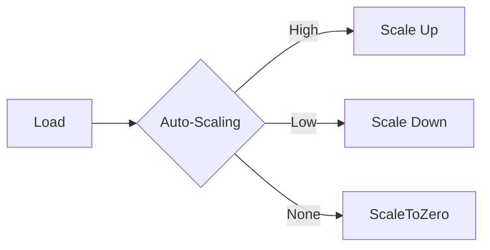

> **Status**: 🔮 Forward-looking | **Risk Level**: High | **Last Updated**: 2026-04
>
> The content described in this document is in early planning stages and may differ from the final implementation. Please refer to official Apache Flink releases.

# Serverless Deployment Evolution Feature Tracking

> **Stage**: Flink/deployment/evolution | **Prerequisites**: [Serverless][^1] | **Formalization Level**: L3

## 1. Definitions

### Def-F-Deploy-Serverless-01: Serverless Mode

Serverless mode:
$$
\text{Serverless} = \text{ScaleToZero} + \text{PayPerUse} + \text{AutoManage}
$$

## 2. Properties

### Prop-F-Deploy-Serverless-01: Cold Start

Cold start:
$$
T_{\text{cold}} < 60s
$$

## 3. Relations

### Serverless Evolution

| Version | Feature | Status |
|---------|---------|--------|
| 2.4 | Preview | GA |
| 2.5 | V2 Optimization | GA |
| 3.0 | Native Serverless | In Design |

## 4. Argumentation

### 4.1 Configuration

```yaml
execution.mode: serverless
serverless.autoscaling.enabled: true
serverless.scale-to-zero: true
```

## 5. Proof / Engineering Argument

### 5.1 Auto-Scaling

```java
public class ServerlessAutoscaler {
    public void scaleOnDemand(LoadMetrics metrics) {
        if (metrics.getUtilization() > 0.8) {
            scaleUp();
        } else if (metrics.getUtilization() < 0.2) {
            scaleDown();
        }
    }
}
```

## 6. Examples

### 6.1 Serverless Submission

```bash
flink run-application \
  --target kubernetes-application \
  --kubernetes-cluster-id my-job \
  ./my-job.jar
```

## 7. Visualizations



## 8. References

[^1]: Flink Serverless Documentation

---

## Tracking Information

| Attribute | Value |
|-----------|-------|
| Version | 2.4-3.0 |
| Current Status | Evolving |
