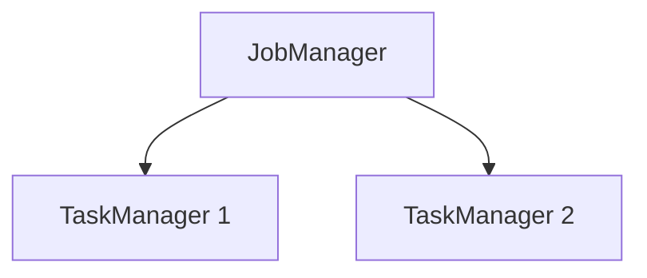

# Standalone Deployment Evolution Feature Tracking

> Stage: Flink/deployment/evolution | Prerequisites: [Standalone Deployment][^1] | Formalization Level: L3

## 1. Definitions

### Def-F-Deploy-Standalone-01: Standalone Cluster

Standalone cluster:
$$
\text{Standalone} = \text{FixedResources} + \text{ManualManagement}
$$

## 2. Properties

### Prop-F-Deploy-Standalone-01: Startup Speed

Startup speed:
$$
T_{\text{startup}} < 30s
$$

## 3. Relations

### Standalone Evolution

| Version | Feature | Status |
|---------|---------|--------|
| 2.4 | Docker Support | GA |
| 2.5 | Docker Compose | GA |
| 3.0 | Lightweight Mode | In Design |

## 4. Argumentation

### 4.1 Deployment Modes

| Scenario | Recommendation |
|----------|----------------|
| Development | Standalone |
| Testing | Docker |
| Small Production | HA Standalone |

## 5. Proof / Engineering Argument

### 5.1 Startup Scripts

```bash
# Start cluster
./bin/start-cluster.sh

# Submit job
./bin/flink run ./examples/streaming/WordCount.jar
```

## 6. Examples

### 6.1 Docker Deployment

```yaml
version: "3"
services:
  jobmanager:
    image: flink:2.4
    command: jobmanager
  taskmanager:
    image: flink:2.4
    command: taskmanager
```

## 7. Visualizations



## 8. References

[^1]: Flink Standalone Documentation

---

## Tracking Information

| Property | Value |
|----------|-------|
| Version | 2.4-3.0 |
| Current Status | Evolving |
