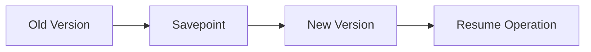

# Upgrade Strategy Evolution Feature Tracking

> Stage: Flink/deployment/evolution | Prerequisites: [Upgrade][^1] | Formalization Level: L3

## 1. Definitions

### Def-F-Upgrade-01: State Migration

State migration:
$$
\text{State}_{v1} \xrightarrow{\text{transform}} \text{State}_{v2}
$$

## 2. Properties

### Prop-F-Upgrade-01: Zero Downtime

Zero downtime:
$$
T_{\text{unavailable}} = 0
$$

## 3. Relations

### Upgrade Evolution

| Version | Feature | Status |
|---------|---------|--------|
| 2.4 | Savepoint Recovery | GA |
| 2.5 | Rolling Upgrade | GA |
| 3.0 | Seamless Upgrade | In Design |

## 4. Argumentation

### 4.1 Upgrade Strategies

| Strategy | Description |
|----------|-------------|
| Stop-Start | Simple but has downtime |
| Blue-Green | Zero downtime requires double resources |
| Rolling | Gradual replacement |
| Canary | Validate first then full rollout |

## 5. Proof / Engineering Argument

### 5.1 Rolling Upgrade

```bash
# Create savepoint
flink savepoint $JOB_ID

# Stop job
flink cancel -s $JOB_ID

# Start new version
flink run -s $SAVEPOINT_PATH new-job.jar
```

## 6. Examples

### 6.1 K8s Rolling Upgrade

```yaml
spec:
  job:
    upgradeMode: savepoint
    state: running
```

## 7. Visualizations



## 8. References

[^1]: Flink Upgrade Documentation

---

## Tracking Information

| Property | Value |
|----------|-------|
| Version | 2.4-3.0 |
| Current Status | Evolving |
