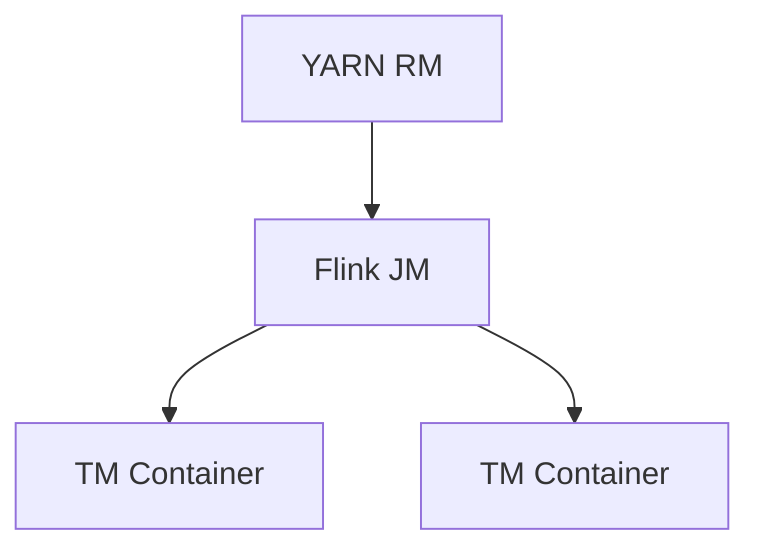

# YARN Deployment Evolution Feature Tracking

> Stage: Flink/deployment/evolution | Prerequisites: [YARN Deployment][^1] | Formalization Level: L3

## 1. Concept Definitions (Definitions)

### Def-F-Deploy-YARN-01: YARN Session

YARN session:
$$
\text{YARNSession} = \text{SharedCluster} + \text{DynamicResource}
$$

## 2. Property Derivation (Properties)

### Prop-F-Deploy-YARN-01: Resource Elasticity

Resource elasticity:
$$
\text{Resources} = f(\text{Load})
$$

## 3. Relation Establishment (Relations)

### YARN Evolution

| Version | Feature | Status |
|------|------|------|
| 2.4 | Dynamic Allocation | GA |
| 2.5 | GPU Resources | GA |
| 3.0 | YARN Native Optimization | In Design |

## 4. Argumentation (Argumentation)

### 4.1 Deployment Commands

```bash
# Start YARN session
./bin/yarn-session.sh -nm flink-session -q

# Submit job
./bin/flink run -t yarn-per-job ./examples/streaming/WordCount.jar
```

## 5. Formal Proof / Engineering Argument

### 5.1 Resource Configuration

```yaml
yarn.application-attempts: 10
yarn.application-attempt-failures-validity-interval: 3600000
```

## 6. Examples (Examples)

### 6.1 Dynamic Resources

```java
// [伪代码片段 - 不可直接运行] 仅展示核心逻辑
env.getConfig().setAutoWatermarkInterval(200);
```

## 7. Visualizations (Visualizations)



## 8. References (References)

[^1]: Flink YARN Documentation

---

## Tracking Information

| Property | Value |
|------|-----|
| Version | 2.4-3.0 |
| Current Status | Evolving |
