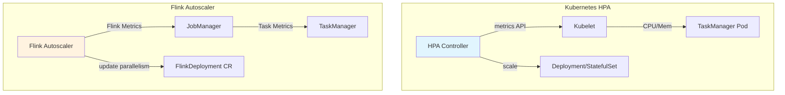
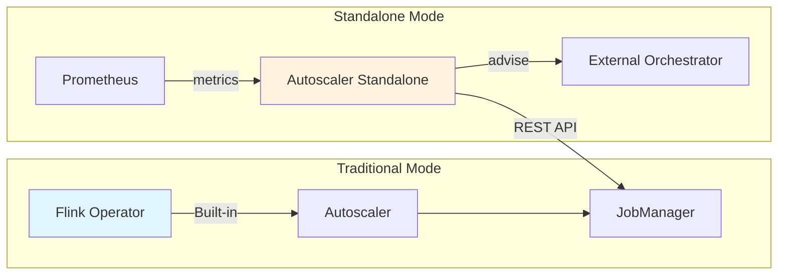
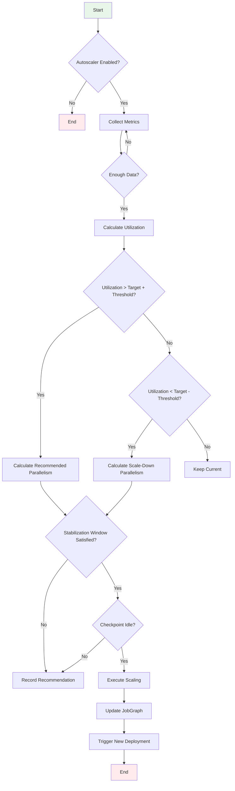
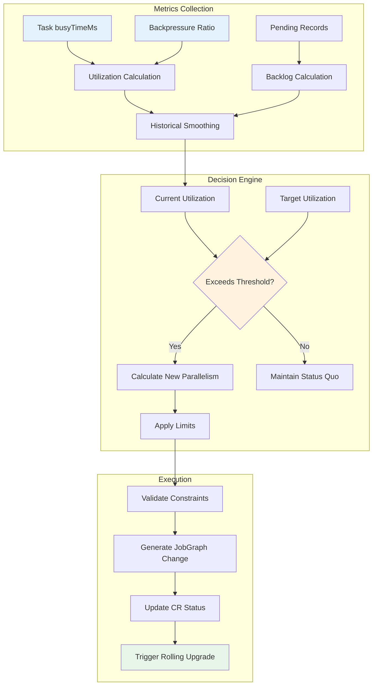
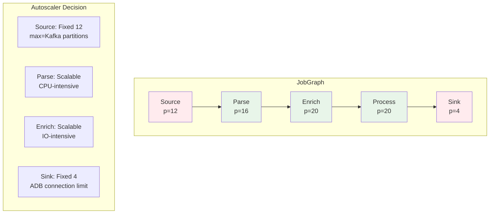
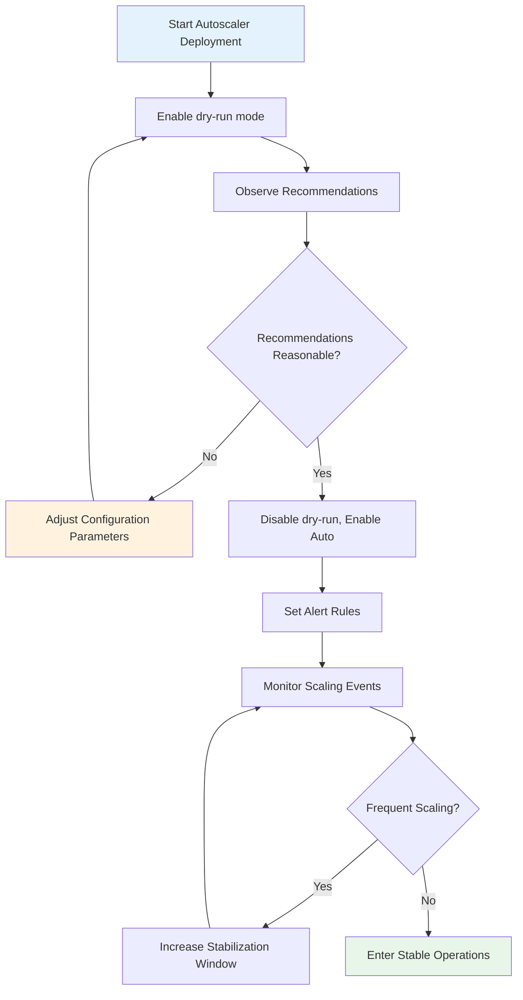

# Flink Kubernetes Operator Autoscaling Deep Dive

> Stage: Flink | Prerequisites: [Flink Kubernetes Operator Deep Dive](./flink-kubernetes-operator-deep-dive.md) | Formalization Level: L4

---

## 1. Definitions

### Def-F-10-30: Autoscaler Architecture Definition

Flink Kubernetes Operator Autoscaler is a **declarative automatic scaling system**, formally defined as:

```
Autoscaler = ⟨Controller, Evaluator, Executor, MetricsBackend⟩

Where:
- Controller: Watches FlinkDeployment CRD changes, coordinates scaling decisions
- Evaluator: Computes target parallelism based on historical metrics
- Executor: Executes scaling operations, updates JobGraph
- MetricsBackend: Stores time-series metrics (default uses JobManager in-memory storage)
```

Autoscaler integration points at the Kubernetes level:

```
┌─────────────────────────────────────────────────────────────┐
│                    Kubernetes Cluster                       │
│  ┌─────────────────┐         ┌──────────────────────────┐   │
│  │  Flink Operator │◄────────│ FlinkDeployment CRD      │   │
│  │  - Controller   │  watch  │ - spec.autoscaler.enabled│   │
│  │  - Evaluator    │         │ - status.recommendedPar  │   │
│  └────────┬────────┘         └──────────────────────────┘   │
│           │                                                 │
│           ▼                                                 │
│  ┌─────────────────┐         ┌──────────────────────────┐   │
│  │  Flink Job      │◄────────│  JobManager REST API     │   │
│  │  - TaskManagers │  metrics│  - /jobs/:id/metrics     │   │
│  │  - JobGraph     │         │  - /taskmanagers/metrics │   │
│  └─────────────────┘         └──────────────────────────┘   │
└─────────────────────────────────────────────────────────────┘
```

### Def-F-10-31: Backpressure Formal Definition

**Def-F-10-31**: Backpressure is a **flow-control feedback mechanism** that occurs when data producer rate exceeds consumer processing capacity, formally defined as:

```
Given operator chain C = {op₁, op₂, ..., opₙ}, backpressure state BP(opᵢ) ∈ {NONE, LOW, HIGH}

Backpressure propagation condition:
BP(opᵢ) = HIGH  ⇒  ∀j < i, BP(opⱼ) ∈ {LOW, HIGH}

Backpressure ratio calculation:
BackpressureRatio = (blockedTime / totalTime) × 100%

Where blockedTime is the cumulative time the thread was blocked waiting for network buffers
```

Backpressure detection levels:

| Level | Detection Mechanism | Granularity | Latency |
|------|----------|------|------|
| Thread-level | Thread.getState() sampling | Single thread | ~1s |
| Task-level | Task backPressureRatio metric | Task instance | ~10s |
| Operator-level | Web UI Backpressure Tab | Operator | ~5s |

### Def-F-10-32: Target Utilization Definition

**Def-F-10-32**: Target utilization is the **optimal resource usage ratio** pursued by the Autoscaler, defined as:

```
TargetUtilization = (Actual Processing Time / Available Time) × 100%

Ideal state:
TargetUtilization ≈ 80%  // Reserve 20% buffer for burst traffic

Actual utilization calculation:
Utilization = busyTimeMsPerSecond / 1000ms

Where busyTimeMsPerSecond is derived from Task idleTimeMsPerSecond:
busyTimeMsPerSecond = 1000 - idleTimeMsPerSecond
```

### Def-F-10-33: Vertex-Level Scaling Definition

**Def-F-10-33**: Vertex-level scaling allows **independently adjusting the parallelism of each vertex in the JobGraph**, formalized as:

```
JobGraph J = (V, E)  // V: vertex set, E: edge set

ScalingPolicy: V → ℕ⁺  // Each vertex maps to target parallelism

Constraints:
∀v ∈ V: parallelism(v) ≤ maxParallelism(v)
∀(u,v) ∈ E: Data partition strategy compatible (FORWARD, HASH, REBALANCE)
```

Vertex classification and scaling strategies:

| Vertex Type | Scaling Characteristics | Constraints |
|----------|------------|----------|
| Source | Limited by partition count | parallelism ≤ sourcePartitions |
| Sink | Typically fixed or limited | Constrained by external system throughput |
| Processing | Fully scalable | Affected by state size and recovery time |

### Def-F-10-34: Catch-up Capacity Definition

**Def-F-10-34**: Catch-up capacity is the additional resource quota required by the system to process **backlogged data**, defined as:

```
Given:
- Current backlog: B (records)
- Target processing latency: T (seconds)
- Single-parallelism throughput: R (records/s)

Required parallelism:
P_required = B / (T × R) + P_base

Where P_base is the base parallelism for handling real-time traffic
```

### Def-F-10-35: Stabilization Window Definition

**Def-F-10-35**: Stabilization window is a time-buffering mechanism to prevent **jitter scaling**:

```
StabilizationWindow = [t₀, t₀ + Δt]

Constraints:
- Only records recommended parallelism during the window, does not execute changes
- New parallelism P_new must be maintained for Δt time before triggering execution
- Within the window, takes P_recommended = max(P₁, P₂, ..., Pₙ)  // Conservative strategy

Default parameters:
Δt_scaleUp = 5 minutes
Δt_scaleDown = 15 minutes  // More conservative for scale-down
```

---

## 2. Properties

### Prop-F-10-15: Monotonic Relationship Between Backpressure and Parallelism

**Prop-F-10-15**: Given sufficient resources, increasing the bottleneck operator's parallelism **monotonically decreases** the backpressure ratio.

**Proof Sketch**:

```
Let operator op have current parallelism p, input rate λ, and single-parallelism processing capacity μ

When λ > p × μ, backpressure occurs

Increase parallelism to p' = p + Δp:
- New processing capacity: p' × μ > p × μ
- If p' × μ ≥ λ, backpressure is eliminated
- If p' × μ < λ, backpressure is reduced

Therefore: ∂(BackpressureRatio)/∂p < 0
```

### Prop-F-10-16: Target Utilization Optimality

**Prop-F-10-16**: In scenarios with traffic fluctuations, TargetUtilization = 80% is the **Pareto optimal cost-latency trade-off**.

**Argumentation**:

| Utilization | Latency Characteristics | Cost Efficiency | Applicable Scenario |
|--------|----------|----------|----------|
| 60% | Low latency, high redundancy | Poor | Critical path with strict SLA |
| 80% | Balanced | Excellent | General production environment |
| 95% | High latency risk | Optimal but dangerous | Batch processing, offline |

```
Let traffic fluctuation be N(μ, σ²), and utilization U collapse probability:

P(overload) = P(arrivalRate > U × capacity)
             = 1 - Φ((U × capacity - μ) / σ)

When U = 0.8, typically tolerates 1.25× burst traffic (2σ)
```

### Prop-F-10-17: Vertex Independent Scaling Compatibility

**Prop-F-10-17**: For edges using the `FORWARD` partition strategy, upstream and downstream vertex parallelisms must be **equal**; for `HASH` or `REBALANCE` strategies, this restriction does not apply.

**Constraint Matrix**:

| Partition Strategy | Parallelism Constraint | Requires Repartitioning |
|----------|------------|----------------|
| FORWARD | p_src == p_dst | No |
| HASH | None | Yes (HashCode recomputed) |
| REBALANCE | None | Yes (Round-robin assignment) |
| RESCALE | p_src % p_dst == 0 | Possibly |

---

## 3. Relations

### Flink Autoscaler vs Kubernetes HPA



| Dimension | Flink Autoscaler | Kubernetes HPA |
|------|------------------|----------------|
| Metrics | Task-level backlog, busyness | Pod-level CPU/Memory |
| Decision Granularity | Vertex (operator) level | Pod (container) level |
| Scaling Target | JobGraph parallelism | TaskManager replica count |
| State Awareness | Yes, considers checkpoint state | No |
| Data Locality | Preserved, through MaxParallelism | May be broken |
| Applicable Scenario | Stream processing jobs | Stateless services |

### Autoscaler and Checkpoint Mechanism Relationship

```
Coordination between scaling trigger timing and Checkpoint:

1. Scaling is prohibited during active Checkpoint execution
   - Avoids state inconsistency
   - Config: kubernetes.operator.job.autoscaler.scale-up.cooldown = 5min

2. Checkpoint size affects scaling decisions
   - Large-state jobs require more conservative scaling strategies
   - Consider state.backend.incremental configuration

3. Savepoint is automatically triggered after scaling
   - Saves new job topology state
   - Used for failure recovery
```

### Autoscaler Standalone Architecture Relationship



---

## 4. Argumentation

### 4.1 Why Vertex-Level Scaling Is Needed

**Heterogeneous Pipeline Scenario Analysis**:

```
Typical ETL Pipeline:
Source(Kafka) → Parse(JSON) → Enrich(Join) → Sink(ADB)
     │              │              │            │
   High throughput CPU-intensive  IO-intensive External limit
   12 partitions  Scalable        Scalable     Fixed 4 concurrency

Global scaling problems:
- Source can only go to 12 (limited by partitions)
- Sink fixed at 4 (external system limit)
- Middle operators may need 20+

Vertex-level solution:
Source:12 → Parse:16 → Enrich:20 → Sink:4
```

### 4.2 Backpressure Detection Accuracy Boundary

**Detection Error Sources**:

| Source | Error Range | Mitigation |
|------|----------|----------|
| Sampling frequency | ±10% (1s sampling) | Increase sampling window to 10s |
| GC pause | Transient false positive | Exclude GC time, use wall-clock |
| Network jitter | Occasional false positive | Multiple sample confirmations |

### 4.3 Scale-Down Risks and Conservative Strategy

**Scale-Down Risk Analysis**:

```
Risk 1: State migration cost
- Scale-down triggers KeyGroup reassignment
- Requires recomputing Hash routing
- May cause brief processing delays

Risk 2: Hotspot skew
- After scale-down, certain KeyGroups may have excessive load
- Need to observe KeyGroup distribution uniformity

Risk 3: Traffic burst
- Reduced buffer after scale-down
- Decreased ability to handle bursts

Conservative strategy:
- scaleDown.cooldown > scaleUp.cooldown
- scaleDown.utilizationThreshold < scaleUp.utilizationThreshold
```

---

## 5. Proof / Engineering Argument

### Thm-F-10-30: Autoscaling Stability Theorem

**Thm-F-10-30**: Under stable traffic and reasonable configuration, Flink Autoscaler guarantees the system will eventually converge to a **stable state** where parallelism no longer changes frequently.

**Proof**:

```
Definitions:
- λ(t): Input traffic at time t
- P(t): Parallelism at time t
- U_target: Target utilization
- ε: Stability tolerance threshold

Stability condition:
| Utilization(P(t), λ(t)) - U_target | < ε

Convergence proof:

1. Monotonicity:
   If Utilization < U_target - ε, Autoscaler increases P
   If Utilization > U_target + ε, Autoscaler decreases P

2. Boundedness:
   P_min ≤ P(t) ≤ P_max (constrained by maxParallelism)

3. Stabilization Window:
   Ensures each P value is maintained for at least Δt

4. By the monotone convergence theorem, P(t) necessarily converges

Q.E.D.
```

### Thm-F-10-31: Vertex-Level Optimality Theorem

**Thm-F-10-31**: For heterogeneous pipelines, vertex-level scaling resource efficiency is **not lower than** global scaling.

**Proof**:

```
Let the pipeline have n vertices V = {v₁, v₂, ..., vₙ}
Each vertex vᵢ has load Lᵢ and processing capacity Cᵢ

Global scaling solution:
- All vertices use the same parallelism P_global
- Must satisfy: P_global × Cᵢ ≥ Lᵢ for all i
- Therefore P_global ≥ maxᵢ(Lᵢ / Cᵢ)
- Total resources: R_global = P_global × Σᵢ(Cᵢ)

Vertex-level scaling solution:
- Each vertex independently selects Pᵢ ≥ Lᵢ / Cᵢ
- Total resources: R_vertex = Σᵢ(Pᵢ × Cᵢ) = Σᵢ(Lᵢ)

Comparison:
R_global = maxᵢ(Lᵢ/Cᵢ) × Σᵢ(Cᵢ)
         ≥ Σᵢ(Lᵢ/Cᵢ × Cᵢ)  // Because max ≥ each element
         = Σᵢ(Lᵢ) = R_vertex

Therefore R_global ≥ R_vertex, vertex-level solution is better or equal.
Q.E.D.
```

### Thm-F-10-32: Catch-up Capacity Calculation Completeness

**Thm-F-10-32**: The catch-up capacity formula ensures backlog data is processed within target time T.

**Proof**:

```
Given:
- Backlog B
- Target time T
- Single-parallelism throughput R
- Base parallelism P_base

Catch-up period total processing capacity:
Capacity = P_required × R × T

Need to satisfy:
Capacity ≥ B + (real-time arrivals during T)

Assuming real-time arrival rate is λ, then:
P_required × R × T ≥ B + λ × T

Since P_base is the minimum parallelism for real-time traffic:
P_base × R ≥ λ

Therefore:
P_required ≥ B/(R×T) + λ/R
          ≥ B/(R×T) + P_base

The formula gives P_required = B/(T×R) + P_base, satisfying the above condition.
Q.E.D.
```

---

## 6. Examples

### 6.1 Basic Configuration Example

```yaml
apiVersion: flink.apache.org/v1beta1
kind: FlinkDeployment
metadata:
  name: autoscaler-demo
spec:
  image: flink:1.18
  jobManager:
    resource:
      memory: "2Gi"
      cpu: 1
  taskManager:
    resource:
      memory: "4Gi"
      cpu: 2
  job:
    jarURI: local:///opt/flink/examples/streaming/StateMachineExample.jar
    parallelism: 4
    upgradeMode: stateful
    state: running
  # Autoscaler core configuration
  flinkConfiguration:
    # Enable Autoscaler
    kubernetes.operator.job.autoscaler.enabled: "true"

    # Target utilization 80%
    kubernetes.operator.job.autoscaler.target.utilization: "0.8"

    # Scale-up threshold (trigger when current utilization exceeds target by 10%)
    kubernetes.operator.job.autoscaler.scale-up.grace-period: "5m"
    kubernetes.operator.job.autoscaler.scale-up.cooldown: "5m"

    # Scale-down threshold (more conservative)
    kubernetes.operator.job.autoscaler.scale-down.grace-period: "15m"
    kubernetes.operator.job.autoscaler.scale-down.cooldown: "15m"

    # Parallelism limits
    kubernetes.operator.job.autoscaler.limits.min-parallelism: "2"
    kubernetes.operator.job.autoscaler.limits.max-parallelism: "32"
```

### 6.2 Vertex-Level Configuration Example

```yaml
apiVersion: flink.apache.org/v1beta1
kind: FlinkDeployment
metadata:
  name: vertex-level-autoscaler
spec:
  flinkConfiguration:
    # Enable vertex-level scaling (Flink 1.18+)
    kubernetes.operator.job.autoscaler.vertex-parallelism.enabled: "true"

    # Set independent maxParallelism for specific vertices
    # Format: kubernetes.operator.job.autoscaler.vertex.<vertex-id>.max-parallelism
    kubernetes.operator.job.autoscaler.vertex."Source: Kafka".max-parallelism: "12"
    kubernetes.operator.job.autoscaler.vertex."Sink: ADB".max-parallelism: "4"

    # Vertex-level target utilization override
    kubernetes.operator.job.autoscaler.vertex."Enrich".target.utilization: "0.7"
```

### 6.3 Advanced Tuning Configuration

```yaml
flinkConfiguration:
  # Historical metrics window (affects decision smoothness)
  kubernetes.operator.job.autoscaler.metrics.window: "10m"

  # Stabilization window (prevents jitter)
  kubernetes.operator.job.autoscaler.stabilization.window: "5m"

  # Minimum data collection time (wait before first scaling)
  kubernetes.operator.job.autoscaler.metrics.collection.interval: "1m"
  kubernetes.operator.job.autoscaler.metrics.collection.min-data-points: "5"

  # Backpressure detection threshold
  kubernetes.operator.job.autoscaler.back-pressure.threshold: "0.2"

  # Catch-up capacity configuration
  kubernetes.operator.job.autoscaler.catch-up.duration: "10m"
  kubernetes.operator.job.autoscaler.catch-up.utilization: "0.5"
```

### 6.4 Monitoring Metrics Example

```yaml
# Prometheus ServiceMonitor configuration
apiVersion: monitoring.coreos.com/v1
kind: ServiceMonitor
metadata:
  name: flink-autoscaler-metrics
spec:
  selector:
    matchLabels:
      app.kubernetes.io/name: flink-kubernetes-operator
  endpoints:
    - port: metrics
      path: /metrics
      interval: 30s

  # Key Autoscaler metrics
  # - flink_autoscaler_recommended_parallelism
  # - flink_autoscaler_current_utilization
  # - flink_autoscaler_back_pressure_ratio
  # - flink_autoscaler_scaling_events_total
```

---

## 7. Visualizations

### Autoscaler Decision Flow



### Core Algorithm Flow



### Vertex-Level Scaling Architecture



### Production Deployment Decision Tree



---

## 8. References

---

## Appendix: Complete Configuration Parameter Table

### Core Parameters

| Parameter Name | Default Value | Description |
|--------|--------|------|
| `kubernetes.operator.job.autoscaler.enabled` | `false` | Whether to enable Autoscaler |
| `kubernetes.operator.job.autoscaler.target.utilization` | `0.8` | Target utilization |

### Time Window Parameters

| Parameter Name | Default Value | Description |
|--------|--------|------|
| `kubernetes.operator.job.autoscaler.stabilization.window` | `5m` | Stabilization window |
| `kubernetes.operator.job.autoscaler.metrics.window` | `10m` | Metrics window |
| `kubernetes.operator.job.autoscaler.scale-up.grace-period` | `5m` | Scale-up grace period |
| `kubernetes.operator.job.autoscaler.scale-down.grace-period` | `15m` | Scale-down grace period |

### Limit Parameters

| Parameter Name | Default Value | Description |
|--------|--------|------|
| `kubernetes.operator.job.autoscaler.limits.min-parallelism` | `1` | Minimum parallelism |
| `kubernetes.operator.job.autoscaler.limits.max-parallelism` | `128` | Maximum parallelism |
| `kubernetes.operator.job.autoscaler.limits.scaling.effectiveness.threshold` | `0.1` | Minimum effective change |

### Advanced Parameters

| Parameter Name | Default Value | Description |
|--------|--------|------|
| `kubernetes.operator.job.autoscaler.vertex-parallelism.enabled` | `false` | Vertex-level scaling |
| `kubernetes.operator.job.autoscaler.back-pressure.threshold` | `0.2` | Backpressure threshold |
| `kubernetes.operator.job.autoscaler.catch-up.duration` | `10m` | Catch-up time target |
