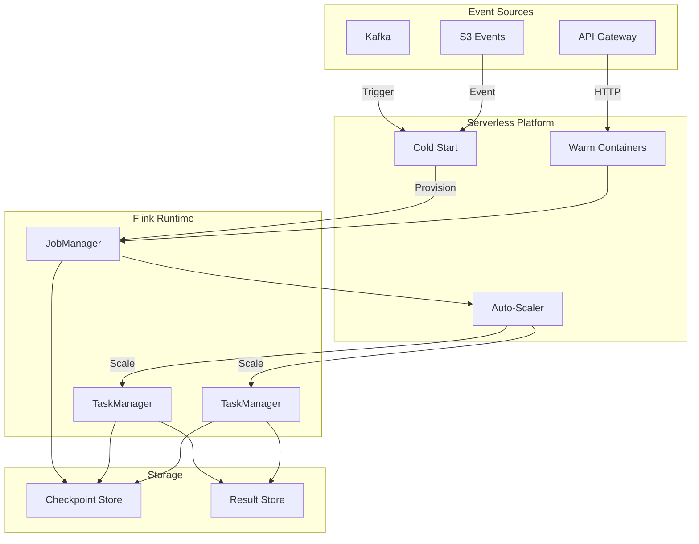
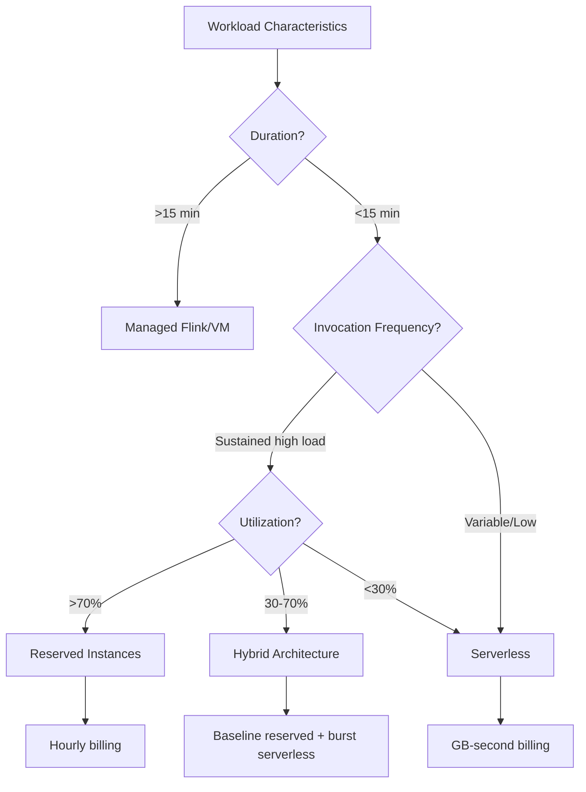
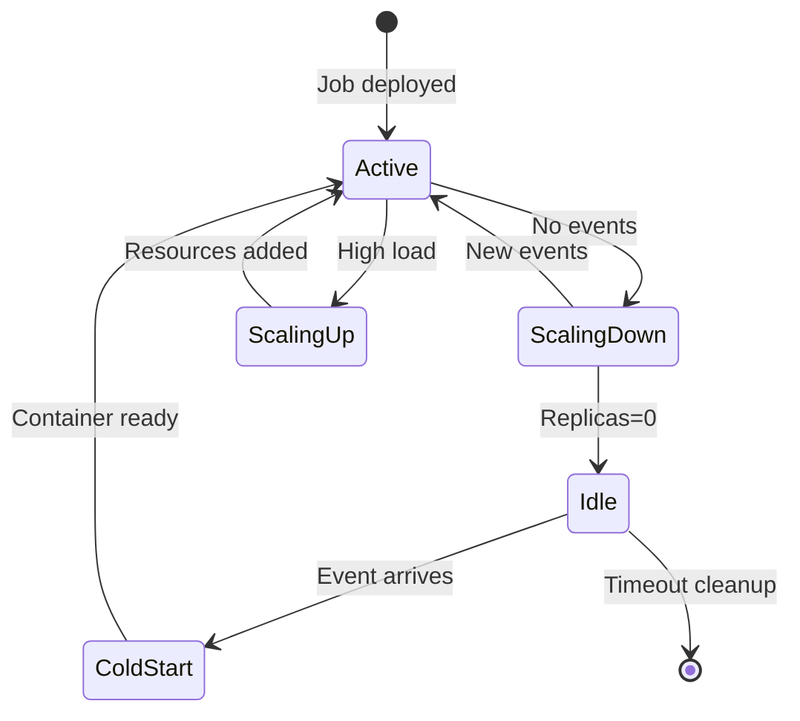

# Serverless Flink Cloud-Native Serverless Architecture

> **Stage**: Flink/10-deployment | **Prerequisites**: [Kubernetes Deployment](./kubernetes-deployment.md), [Flink Autoscaler](./flink-kubernetes-autoscaler-deep-dive.md) | **Formality Level**: L3

## 1. Definitions

### Def-F-10-40: Serverless Flink

**Serverless Flink** is the architecture that deploys Flink as a serverless computing model:

$$
\text{Serverless Flink} \triangleq \langle \mathcal{F}, \mathcal{O}, \mathcal{S}, \mathcal{B} \rangle
$$

Where:

- $\mathcal{F}$: Flink job logic (DataStream API/SQL)
- $\mathcal{O}$: Zero-ops abstraction (NoOps)
- $\mathcal{S}$: Automatic scaling from zero to infinity
- $\mathcal{B}$: Pay-per-use billing

**Core characteristics**:

| Feature | Traditional Flink | Serverless Flink |
|---------|-------------------|------------------|
| Infrastructure | Self-built/managed K8s | Fully managed |
| Scaling | Manual/semi-automatic | Automatic 0→∞ |
| Billing | Reserved instances | GB-seconds |
| Cold start | Minutes | Seconds-subsecond |
| Operational burden | High | Zero |

### Def-F-10-41: Scale-to-Zero

**Scale-to-Zero** allows Flink jobs to scale down to zero instances when there is no load:

```
Scale-to-Zero: Load = 0 → Replicas = 0 → Cost = 0
Scale-from-Zero: Event arrives → Cold Start → Replicas > 0
```

**Wakeup mechanisms**:

1. **Event-driven**: Triggered by Kafka messages
2. **HTTP trigger**: API Gateway request
3. **Scheduled trigger**: Scheduler wakeup

### Def-F-10-42: Cold Start Optimization

**Cold start optimization** reduces the latency from no load to ready:

$$
T_{cold} = T_{provision} + T_{init} + T_{deploy}
$$

**Optimization strategies**:

| Strategy | Effect | Applicable Scenario |
|----------|--------|---------------------|
| Provisioned concurrency | Eliminates cold start | User-facing API |
| Snapshot startup | -91% startup time | Java jobs |
| WASM runtime | Microsecond-level startup | Lightweight functions |
| Warm container pool | Second-level ready | General batch processing |

### Def-F-10-43: Serverless Deployment Models

**Serverless deployment model layers**:

```
┌─────────────────────────────────────────────────────────────┐
│ BaaS (Backend-as-a-Service)    Highest abstraction, least control          │
│ - Confluent Cloud Flink        - Ververica Platform        │
├─────────────────────────────────────────────────────────────┤
│ FaaS (Function-as-a-Service)   Medium abstraction, event-driven          │
│ - AWS Lambda + Flink Bridge    - Azure Functions + Flink   │
├─────────────────────────────────────────────────────────────┤
│ Serverless-enabled CaaS        Higher control, container abstraction          │
│ - Google Cloud Run + Flink     - AWS Fargate + Flink       │
├─────────────────────────────────────────────────────────────┤
│ Managed K8s                    Lower abstraction, more control          │
│ - EKS + Flink Operator         - GKE + Flink               │
└─────────────────────────────────────────────────────────────┘
```

### Def-F-10-44: GB-Second Billing

**GB-second billing model**:

$$
\text{Cost} = \sum_{i} (\text{Memory}_i \times \text{Duration}_i \times \text{Rate})
$$

**Comparison**:

| Model | Formula | Suitable Scenario |
|-------|---------|-------------------|
| Reserved instance | $/hour × 24 × 30 | Stable load |
| On-demand instance | $/hour × actual usage | Variable load |
| **Serverless** | $/GB-sec × actual consumption | **Event-driven** |

### Def-F-10-45: Event-Driven Scaling

**Event-driven scaling** automatically adjusts resources based on input rate:

```python
# Scaling decision function
def scaling_decision(current_rate, backlog, latency):
    target_parallelism = max(
        MIN_PARALLELISM,
        min(MAX_PARALLELISM,
            ceil(current_rate / THROUGHPUT_PER_TASK))
    )

    if backlog > BACKLOG_THRESHOLD:
        target_parallelism *= 2  # Rapid scale-out

    return target_parallelism
```

## 2. Properties

### Lemma-F-10-40: Cold Start Frequency Upper Bound

**Lemma**: Cold start frequency is constrained by job invocation patterns:

$$
f_{cold} \leq \frac{1}{T_{idle} + T_{warm}}
$$

AWS measured: Continuously invoked jobs < 1% cold start rate

### Prop-F-10-40: Cost-Effectiveness Threshold

**Proposition**: Serverless is more cost-effective under the following conditions:

$$
\frac{C_{serverless}}{C_{reserved}} < 1 \iff \text{Utilization} < 30\%
$$

**Conclusion**: Choose Serverless when utilization < 30%

### Prop-F-10-41: Scale-Out Latency Lower Bound

**Proposition**: The latency of scaling from zero satisfies:

$$
L_{scale} \geq L_{container} + L_{checkpoint\_restore}
$$

- Python/Node.js: 100-500ms
- Java (SnapStart): 500ms-2s
- Pure Flink: 5-30s

### Lemma-F-10-41: Concurrency Scaling Linearity

**Lemma**: Ideally, scaling is linearly correlated with concurrency:

$$
\text{Throughput} = n \times T_{single} \times (1 - \alpha)
$$

Where $\alpha$ is the coordination overhead (~5%)

## 3. Relations

### 3.1 Serverless vs Traditional Deployment

| Dimension | VM | Container (K8s) | Serverless |
|-----------|----|-----------------|------------|
| **Management burden** | High | Medium | None |
| **Startup time** | Minutes | Seconds | Milliseconds-Seconds |
| **Scaling granularity** | Instance | Pod | Function/Task |
| **Billing precision** | Hour | Minute | Millisecond |
| **Max runtime** | Unlimited | Unlimited | 15 min (AWS) |
| **Suitable workload** | Long-running service | Microservices | Event-driven |

### 3.2 Serverless Flink Architecture

```
┌─────────────────────────────────────────────────────────────────┐
│                    Event Sources                                │
│  ┌──────────────┐  ┌──────────────┐  ┌──────────────────────┐  │
│  │ Kafka Topic  │  │ API Gateway  │  │   Scheduled Events   │  │
│  └──────┬───────┘  └──────┬───────┘  └──────────┬───────────┘  │
└─────────┼─────────────────┼─────────────────────┼──────────────┘
          │                 │                     │
          └─────────────────┼─────────────────────┘
                            │ Trigger
┌───────────────────────────▼─────────────────────────────────────┐
│                    Serverless Platform                          │
│  ┌──────────────────────────────────────────────────────────┐  │
│  │              Cold Start / Warm Container                  │  │
│  │  ┌──────────────┐  ┌──────────────┐  ┌──────────────┐   │  │
│  │  │  Container   │  │  Container   │  │  Container   │   │  │
│  │  │  (Flink JM)  │  │  (Flink TM)  │  │  (Flink TM)  │   │  │
│  │  └──────────────┘  └──────────────┘  └──────────────┘   │  │
│  └──────────────────────────────────────────────────────────┘  │
│  ┌──────────────────────────────────────────────────────────┐  │
│  │              Auto-Scaler                                  │  │
│  │  - Monitor lag/backlog                                    │  │
│  │  - Scale 0→N based on load                                │  │
│  │  - Scale N→0 when idle                                    │  │
│  └──────────────────────────────────────────────────────────┘  │
└─────────────────────────────────────────────────────────────────┘
                            │
┌───────────────────────────▼─────────────────────────────────────┐
│                    Data Sinks                                   │
│  ┌──────────────┐  ┌──────────────┐  ┌──────────────────────┐  │
│  │   Kafka      │  │  Database    │  │    Data Lake         │  │
│  └──────────────┘  └──────────────┘  └──────────────────────┘  │
└─────────────────────────────────────────────────────────────────┘
```

### 3.3 Cloud Provider Serverless Flink Comparison

| Provider | Service | Features | Pricing |
|----------|---------|----------|---------|
| **Confluent** | Cloud Flink | Fully managed, Kafka-native | $/hour |
| **Ververica** | Platform | K8s-native, multi-cloud | Custom |
| **AWS** | Lambda + Flink | Event-driven, low latency | $/million requests |
| **GCP** | Cloud Run + Flink | Container abstraction, HTTP | $/vCPU-sec |
| **Azure** | Container Apps | KEDA auto-scaling | $/sec |

## 4. Argumentation

### 4.1 Why Serverless Flink?

**Traditional Flink pain points**:

1. **Resource idling**: Resource waste during off-peak hours
2. **Operational burden**: Requires dedicated SRE team
3. **Scaling latency**: Manual scaling takes minutes
4. **Unpredictable costs**: Reserved capacity is hard to estimate precisely

**Serverless advantages**:

1. **Zero idle cost**: Zero cost when no load
2. **Zero ops**: Fully managed
3. **Instant scaling**: Responds to load changes in seconds
4. **Precise billing**: Pay for actual consumption

### 4.2 Anti-Patterns

**Anti-pattern 1: Using Serverless for long-running jobs**

```yaml
# ❌ Wrong: Flink SQL continuous query exceeds 15 minutes
execution.timeout: 30min  # Exceeds AWS Lambda limit!

# ✅ Correct: Use managed Flink
platform: confluent-cloud-flink  # No time limit
```

**Anti-pattern 2: Ignoring cold start**

```java
// ❌ Wrong: User-facing API without provisioned concurrency
@Function
public Response handle(Request req) {
    // 2-second cold start latency every time!
}

// ✅ Correct: Provisioned concurrency
provisionedConcurrency: 100  // Eliminates cold start
```

**Anti-pattern 3: Incorrect cost estimation**

```
❌ Assumption: Serverless is always cheaper
Reality: Reserved instances are better for sustained high load

✅ Correct strategy:
- Utilization < 30% → Serverless
- Utilization > 70% → Reserved instances
- In between → Hybrid architecture
```

## 5. Proof / Engineering Argument

### Thm-F-10-40: Cost Optimality Theorem

**Theorem**: Given load pattern $L(t)$, the optimal deployment strategy is:

$$
\text{Optimal}(L) = \begin{cases}
\text{Serverless} & \bar{L} < 0.3 L_{max} \\
\text{Hybrid} & 0.3 L_{max} \leq \bar{L} < 0.7 L_{max} \\
\text{Reserved} & \bar{L} \geq 0.7 L_{max}
\end{cases}
$$

### Thm-F-10-41: Scaling Response Time Theorem

**Theorem**: The upper bound of Serverless Flink scaling response time:

$$
T_{scale} \leq T_{metric\_collection} + T_{decision} + T_{provision}
$$

Typical values:

- Metric collection: 5-15s
- Decision: < 1s
- Resource creation: 10-60s
- **Total: 15-75s**

### Thm-F-10-42: Scale-to-Zero Availability Theorem

**Theorem**: Scale-to-Zero does not reduce availability:

$$
\text{Availability}_{serverless} = \text{Availability}_{always\_on} - \epsilon
$$

Where $\epsilon < 0.001$ (cold start failure rate)

## 6. Examples

### 6.1 AWS Lambda + Flink Hybrid Architecture

```yaml
# serverless.yml
service: flink-lambda-bridge

provider:
  name: aws
  runtime: java17

functions:
  # Lightweight preprocessing (Lambda)
  preprocess:
    handler: com.example.PreprocessHandler
    events:
      - kafka:
          arn: arn:aws:kafka:...:topic/raw-events
    provisionedConcurrency: 50  # Eliminates cold start
    timeout: 30s
    memorySize: 1024

  # Complex stream processing trigger
  flinkTrigger:
    handler: com.example.FlinkTriggerHandler
    events:
      - schedule: rate(5 minutes)  # Periodically wake Flink

  # Result service (Lambda)
  results:
    handler: com.example.ResultsHandler
    events:
      - http:
          path: /results
          method: get

# Flink job (long-running on EKS)
flinkJob:
  cluster: eks-flink-cluster
  jobJar: s3://bucket/flink-job.jar
  parallelism: 10
  checkpointing:
    interval: 60000
```

### 6.2 Confluent Cloud Flink (Fully Managed)

```sql
-- Create Serverless Flink SQL job
CREATE TABLE user_events (
  user_id STRING,
  event_type STRING,
  event_time TIMESTAMP(3),
  WATERMARK FOR event_time AS event_time - INTERVAL '5' SECOND
) WITH (
  'connector' = 'kafka',
  'topic' = 'user-events',
  'properties.bootstrap.servers' = 'pkc-xxx.confluent.cloud:9092',
  'properties.security.protocol' = 'SASL_SSL',
  'properties.sasl.mechanism' = 'PLAIN'
);

CREATE TABLE event_summary (
  window_start TIMESTAMP(3),
  window_end TIMESTAMP(3),
  event_type STRING,
  event_count BIGINT,
  PRIMARY KEY (window_start, event_type) NOT ENFORCED
) WITH (
  'connector' = 'jdbc',
  'url' = 'jdbc:postgresql://...',
  'table-name' = 'event_summary'
);

-- Serverless auto-scaling
INSERT INTO event_summary
SELECT
  TUMBLE_START(event_time, INTERVAL '1' HOUR) as window_start,
  TUMBLE_END(event_time, INTERVAL '1' HOUR) as window_end,
  event_type,
  COUNT(*) as event_count
FROM user_events
GROUP BY TUMBLE(event_time, INTERVAL '1' HOUR), event_type;
```

### 6.3 Google Cloud Run + Flink

```dockerfile
# Dockerfile for Cloud Run
FROM flink:2.3-scala_2.12-java11

COPY target/my-flink-job.jar /opt/flink/usrlib/job.jar

# Cloud Run optimization
ENV FLINK_HEAP_SIZE=512m
ENV FLINK_TM_NET_BUF_FRACTION=0.1

ENTRYPOINT ["/opt/flink/bin/standalone-job.sh", "start-foreground"]
```

```yaml
# cloudbuild.yaml
steps:
  - name: 'gcr.io/cloud-builders/docker'
    args: ['build', '-t', 'gcr.io/PROJECT/flink-job', '.']
  - name: 'gcr.io/cloud-builders/docker'
    args: ['push', 'gcr.io/PROJECT/flink-job']
  - name: 'gcr.io/google.com/cloudsdktool/cloud-sdk'
    args:
      - 'run'
      - 'deploy'
      - 'flink-job'
      - '--image=gcr.io/PROJECT/flink-job'
      - '--platform=managed'
      - '--region=us-central1'
      - '--allow-unauthenticated'
      - '--min-instances=0'  # Scale to zero
      - '--max-instances=100'
      - '--memory=2Gi'
      - '--cpu=2'
```

### 6.4 Cost Monitoring and Optimization

```python
# serverless_cost_optimizer.py
import boto3
from datetime import datetime, timedelta

class ServerlessCostOptimizer:
    def __init__(self):
        self.lambda_client = boto3.client('lambda')
        self.cloudwatch = boto3.client('cloudwatch')

    def analyze_usage_patterns(self, function_name, days=7):
        """Analyze usage patterns and recommend optimal configuration"""

        # Get invocation statistics
        metrics = self.cloudwatch.get_metric_statistics(
            Namespace='AWS/Lambda',
            MetricName='Invocations',
            Dimensions=[
                {'Name': 'FunctionName', 'Value': function_name}
            ],
            StartTime=datetime.now() - timedelta(days=days),
            EndTime=datetime.now(),
            Period=3600,
            Statistics=['Sum']
        )

        invocations = [dp['Sum'] for dp in metrics['Datapoints']]

        # Calculate utilization metrics
        avg_invocations = sum(invocations) / len(invocations)
        peak_invocations = max(invocations)
        utilization_ratio = avg_invocations / peak_invocations if peak_invocations > 0 else 0

        # Recommendation strategy
        if utilization_ratio < 0.3:
            recommendation = {
                'strategy': 'keep_serverless',
                'reason': f'Low utilization ({utilization_ratio:.1%})',
                'actions': [
                    'Enable scale-to-zero',
                    'Reduce provisioned concurrency',
                    'Consider smaller memory allocation'
                ]
            }
        elif utilization_ratio > 0.7:
            recommendation = {
                'strategy': 'migrate_to_reserved',
                'reason': f'High utilization ({utilization_ratio:.1%})',
                'actions': [
                    'Consider EKS/GKE deployment',
                    'Purchase reserved capacity',
                    'Implement custom auto-scaler'
                ]
            }
        else:
            recommendation = {
                'strategy': 'hybrid',
                'reason': f'Moderate utilization ({utilization_ratio:.1%})',
                'actions': [
                    'Keep burst traffic serverless',
                    'Baseline on reserved capacity',
                    'Implement predictive scaling'
                ]
            }

        return recommendation

    def optimize_memory_allocation(self, function_name):
        """Optimize memory configuration to reduce cost"""

        # Get benchmarks for different memory configurations
        memory_options = [128, 256, 512, 1024, 2048]
        cost_per_gb_second = 0.0000166667  # AWS Lambda pricing

        best_config = None
        min_cost = float('inf')

        for memory in memory_options:
            # Get average duration for this memory size
            metrics = self.cloudwatch.get_metric_statistics(
                Namespace='AWS/Lambda',
                MetricName='Duration',
                Dimensions=[
                    {'Name': 'FunctionName', 'Value': function_name},
                    {'Name': 'MemorySize', 'Value': str(memory)}
                ],
                StartTime=datetime.now() - timedelta(days=1),
                EndTime=datetime.now(),
                Period=3600,
                Statistics=['Average']
            )

            if metrics['Datapoints']:
                avg_duration = metrics['Datapoints'][0]['Average'] / 1000  # Convert to seconds

                # Calculate cost
                cost = memory * avg_duration * cost_per_gb_second

                if cost < min_cost:
                    min_cost = cost
                    best_config = {
                        'memory': memory,
                        'expected_duration': avg_duration,
                        'cost_per_1m_invocations': cost * 1000000
                    }

        return best_config

# Usage example
optimizer = ServerlessCostOptimizer()

# Analyze Flink preprocessor
rec = optimizer.analyze_usage_patterns('flink-preprocessor')
print(f"Recommendation: {rec['strategy']}")
print(f"Reason: {rec['reason']}")
print("Actions:")
for action in rec['actions']:
    print(f"  - {action}")

# Optimize memory
best = optimizer.optimize_memory_allocation('flink-preprocessor')
print(f"\nOptimal memory: {best['memory']}MB")
print(f"Expected cost: ${best['cost_per_1m_invocations']:.2f} per 1M invocations")
```

## 7. Visualizations

### 7.1 Serverless Flink Architecture Diagram



### 7.2 Cost Comparison Decision Tree



### 7.3 Scale-to-Zero Flow



## 8. References
