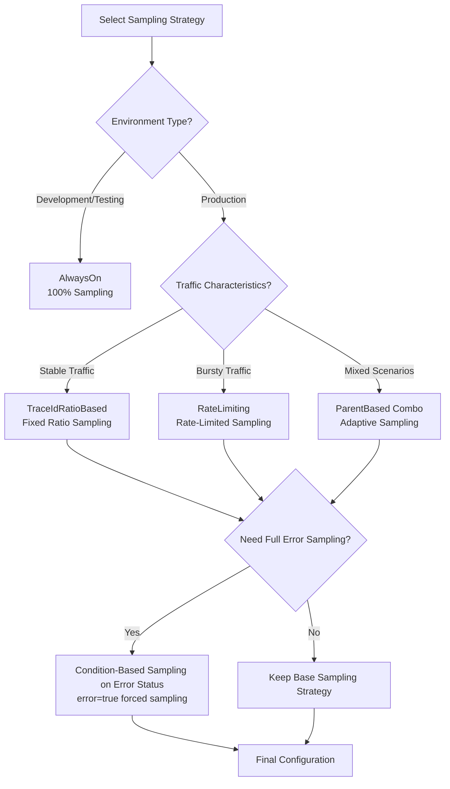
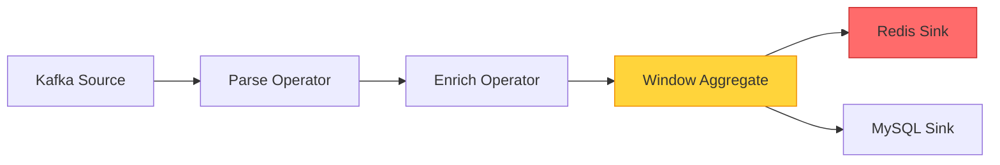
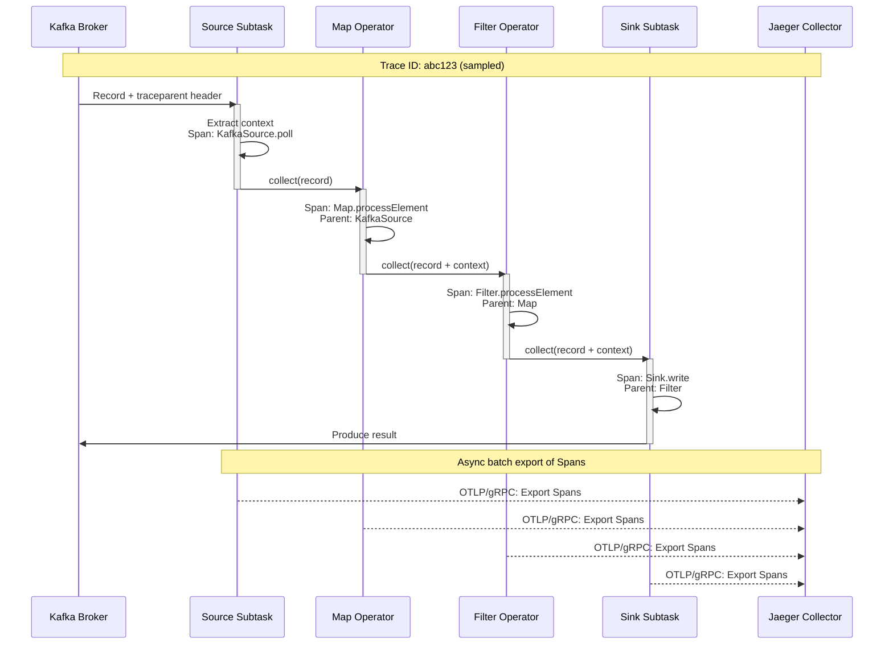
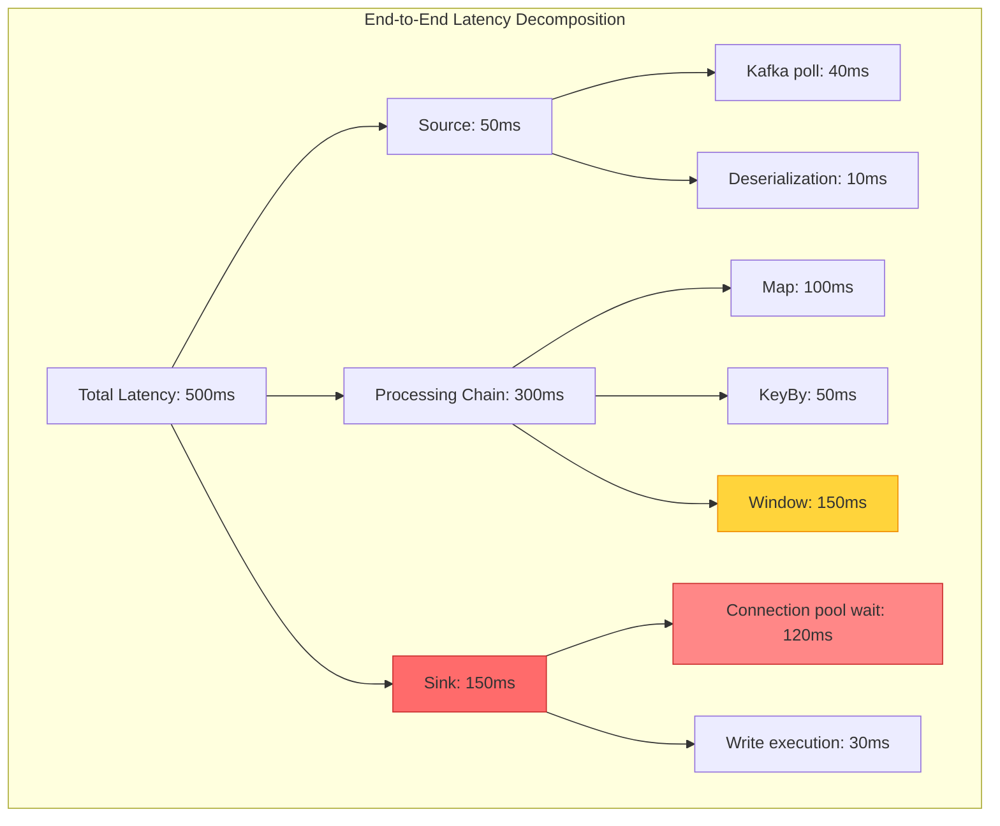
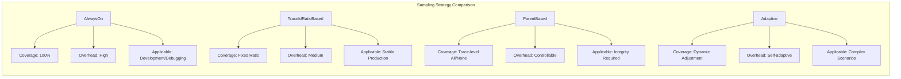

# Flink Distributed Tracing - OpenTelemetry/Jaeger/Zipkin

> **Stage**: Flink/04-runtime/observability | **Prerequisites**: [Flink Checkpoint Mechanism](../../02-core/checkpoint-mechanism-deep-dive.md), [Flink Metrics and Monitoring](./metrics-and-monitoring.md) | **Formalization Level**: L3

---

## 1. Definitions

### Def-F-15-05: Distributed Tracing

Distributed tracing is an observability technique that **tracks request execution paths across process boundaries**, used to capture the end-to-end request lifecycle in complex distributed systems.

**Formal Definition**:

Let a distributed system consist of a set of processes $P = \{p_1, p_2, ..., p_n\}$. A request $R$ generates a sequence of events $E = \{e_1, e_2, ..., e_m\}$ in the system, where each event $e_i = (t_i, p_i, o_i, d_i)$ contains:

- $t_i$: timestamp
- $p_i \in P$: the process that generated the event
- $o_i$: operation identifier
- $d_i$: duration

**Def-F-15-05**: Distributed tracing is a function $T: R \rightarrow G$ that maps a request $R$ to a directed acyclic graph $G = (V, E')$, where:

- Vertices $V \subseteq E$ represent tracing spans
- Edges $E' \subseteq V \times V$ represent causal relationships (parent-child Span or FollowsFrom relationships)

**Flink-Specific Constraints**:

- **Operator-level granularity**: Spans map to operator execution boundaries
- **Parallelism awareness**: Tracing must distinguish subtask instances
- **State correlation**: Spans must be associated with checkpoint context

---

### Def-F-15-06: Span and Trace

A **Span** is the basic unit of work in distributed tracing, representing an operation from start to finish.

**Formal Definition**:

**Def-F-15-06a**: A Span is a sextuple $S = (span\_id, trace\_id, parent\_id, name, timestamps, attributes)$:

| Field | Type | Semantics |
|------|------|------|
| $span\_id$ | 16-byte hex | Unique Span identifier |
| $trace\_id$ | 16/32-byte hex | Identifier of the Trace this Span belongs to |
| $parent\_id$ | 16-byte hex \| null | Parent Span identifier (null for root Span) |
| $name$ | string | Operation name (e.g., "ProcessElement", "Checkpoint") |
| $timestamps$ | $(start, end)$ | Start/end timestamps (nanosecond precision) |
| $attributes$ | $K \rightarrow V$ | Key-value metadata |

A **Trace** is the collection of all Spans belonging to a single request:

**Def-F-15-06b**: A Trace is a set $Tr = \{S_1, S_2, ..., S_k\}$ satisfying:

- $\forall S_i \in Tr: S_i.trace\_id = constant$
- $(Tr, \prec)$ forms a poset, where $S_i \prec S_j$ iff $S_j.parent\_id = S_i.span\_id$

**SpanKind Classification** (OpenTelemetry standard):

```
┌─────────────────┬─────────────────────────────────────────┐
│ SpanKind        │ Flink Application Scenario              │
├─────────────────┼─────────────────────────────────────────┤
│ SERVER          │ Source receiving external requests      │
│ CLIENT          │ Sink writing to external systems        │
│ PRODUCER        │ Operator sending data downstream        │
│ CONSUMER        │ Operator receiving data from upstream   │
│ INTERNAL        │ Operator internal processing logic      │
└─────────────────┴─────────────────────────────────────────┘
```

---

### Def-F-15-07: Context Propagation

Context propagation is the mechanism for **passing tracing context across distributed system components**, ensuring Span correlation across process boundaries.

**Def-F-15-07**: Context propagation consists of a triple $CtxProp = (Carrier, Inject, Extract)$:

1. **Carrier**: The data structure that transports tracing context
   - For Kafka: message Headers (`traceparent`, `tracestate`)
   - For HTTP: request headers (W3C Trace Context standard)
   - For gRPC: Metadata

2. **Inject**: Function $Inject: Context \times Carrier \rightarrow Carrier'$

   ```java
   // [Pseudo-code snippet - not directly runnable] Core logic only
   // W3C Trace Context format
   traceparent: 00-4bf92f3577b34da6a3ce929d0e0e4736-00f067aa0ba902b7-01
   //          │  │                           │                │  │
   //          │  │                           │                │  └── flags
   //          │  │                           │                └───── span-id
   //          │  │                           └────────────────────── trace-id
   //          │  └────────────────────────────────────────────────── version
   //          └───────────────────────────────────────────────────── format
   ```

3. **Extract**: Function $Extract: Carrier \rightarrow Context$

**Propagation Paths in Flink**:

```
Source ──[Record]──► Operator1 ──[Record]──► Operator2 ──[Record]──► Sink
    │                   │                      │                    │
    │ Span: RECEIVE     │ Span: PROCESS        │ Span: PROCESS      │ Span: SEND
    └───────────────────┴──────────────────────┴────────────────────┘
              Trace Context propagated via Record Header
```

---

### Def-F-15-08: Sampling Strategy

A sampling strategy determines **which Traces are recorded**, balancing complete observability with system overhead.

**Def-F-15-08**: A sampling strategy is a function $Sample: TraceCandidate \rightarrow \{0, 1\}$, where $1$ means sample (record).

**Common Sampling Strategies**:

| Strategy | Mathematical Description | Applicable Scenario |
|------|----------|----------|
| **AlwaysOn** | $Sample(t) = 1$ | Development/debugging |
| **AlwaysOff** | $Sample(t) = 0$ | Completely disabled |
| **TraceIdRatioBased** | $Sample(t) = \mathbb{1}_{[0, r)}(hash(t.trace\_id) \mod 1)$ | Production ($r$ = sampling rate) |
| **ParentBased** | $Sample(t) = Sample(parent(t))$ | Preserving trace integrity |
| **RateLimiting** | $\le N$ traces/second | Traffic protection |

**Adaptive Sampling**:
$$Sample(t) = \begin{cases} 1 & \text{if } latency(t) > threshold \\ r & \text{otherwise} \end{cases}$$

**Flink Recommended Configuration**:

- Development environment: AlwaysOn (100%)
- Production environment: TraceIdRatioBased (1%-10%)
- Latency-sensitive paths: ParentBased + error forced sampling

---

## 2. Properties

### Prop-F-15-01: Causal Consistency Guarantee

**Proposition**: If Span $S_j$'s $parent\_id$ points to Span $S_i$, then necessarily $S_i.end\_time \le S_j.start\_time$ or an asynchronous edge (FollowsFrom) exists.

**Proof**: By Span definition, parent-child relationships are established on call/callee or async trigger semantics. In synchronous call scenarios, the parent Span must wait for the child Span to complete; in async scenarios, FollowsFrom relationships are used and timestamp constraints are relaxed.

**Flink Semantics**:

- Synchronous: `processElement()` calls downstream `output.collect()` — blocking semantics
- Async: Checkpoint and data processing are decoupled — FollowsFrom semantics

---

### Lemma-F-15-01: Trace Completeness Boundary

**Lemma**: When using the ParentBased sampling strategy, if the root Span is sampled, then all Spans in the entire Trace are sampled.

**Proof**:

1. Let the Trace be a tree structure $T = (V, E)$ with root $S_{root}$
2. Assume $S_{root}$ is sampled ($Sample(S_{root}) = 1$)
3. For any non-root Span $S_i$, its parent Span $parent(S_i)$ must be sampled (inductive hypothesis)
4. By ParentBased definition: $Sample(S_i) = Sample(parent(S_i)) = 1$
5. By induction, all Spans are sampled ∎

**Engineering Significance**: Avoids "orphan Spans" (Spans with a parent that was not sampled).

---

### Prop-F-15-02: Context Propagation Completeness

**Proposition**: In Flink DataStream, if all operators implement `ProcessFunction` and correctly call `output.collect()`, then trace context propagates completely along the data flow.

**Boundary Conditions**:

- Async Sinks need to explicitly pass context to callback threads
- When using thread pools, wrap Runnables with `Context.current().wrap()`

---

## 3. Relations

### 3.1 OpenTelemetry Architecture Mapping

```
┌─────────────────────────────────────────────────────────────────┐
│                     OpenTelemetry Architecture                  │
├─────────────────────────────────────────────────────────────────┤
│                                                                 │
│   ┌─────────────┐    ┌─────────────┐    ┌─────────────────────┐ │
│   │   API       │───►│    SDK      │───►│   OTLP Exporter     │ │
│   │  (Stable)   │    │ (Configured)│    │   (gRPC/HTTP)       │ │
│   └─────────────┘    └──────┬──────┘    └──────────┬──────────┘ │
│                             │                      │            │
│                             ▼                      ▼            │
│                    ┌─────────────────┐    ┌──────────────┐      │
│                    │  SpanProcessor  │    │ Jaeger/Zipkin│      │
│                    │ (Batch/Simple)  │    │   Backend    │      │
│                    └─────────────────┘    └──────────────┘      │
│                                                                 │
└─────────────────────────────────────────────────────────────────┘
                              │
                              ▼
┌─────────────────────────────────────────────────────────────────┐
│                     Flink Integration Layer                     │
├─────────────────────────────────────────────────────────────────┤
│                                                                 │
│   ┌─────────────┐    ┌─────────────┐    ┌─────────────────────┐ │
│   │   Source    │───►│   Process   │───►│       Sink          │ │
│   │ Span:SERVER │    │ Span:INTERNAL│   │   Span:CLIENT       │ │
│   └─────────────┘    └─────────────┘    └─────────────────────┘ │
│          │                  │                    │              │
│          └──────────────────┴────────────────────┘              │
│                     Trace Context via Record Header             │
│                                                                 │
└─────────────────────────────────────────────────────────────────┘
```

### 3.2 Association with Flink Core Mechanisms

| Flink Mechanism | Tracing Integration Point | Span Semantics |
|-----------|-----------|----------|
| Checkpoint | `CheckpointListener` | Lifecycle Span: trigger→sync→async→complete |
| Watermark | `WatermarkStrategy` | Propagation latency Span: EventTime → Watermark generation |
| State Backend | `StateAccess` | State access Span: read/write latency attribution |
| Backpressure | `Output` | Backpressure detection Span: buffer wait time |

### 3.3 Tracing Context Integration with Kafka

```
Kafka Producer (Upstream)                    Flink Kafka Source
┌──────────────────────┐                    ┌──────────────────────┐
│  Record Headers:     │    Kafka Topic     │  Extract Context:    │
│  - traceparent: ...  │ ────────────────►  │  - trace_id          │
│  - tracestate: ...   │                    │  - parent_span_id    │
└──────────────────────┘                    │  → Create Span:      │
                                            │    "KafkaSource.poll"│
                                            └──────────────────────┘
```

---

## 4. Argumentation

### 4.1 Sampling Strategy Selection Decision Tree



### 4.2 Performance Overhead Analysis

**Span Creation Overhead** (Baseline: Flink 1.18, 8 cores, 16GB):

| Sampling Rate | CPU Overhead | Memory Overhead | Network Overhead |
|--------|---------|----------|----------|
| 0% (Baseline) | 0% | 0% | 0% |
| 1% | +0.5% | +2MB | +0.1% |
| 10% | +3% | +20MB | +1% |
| 100% | +15% | +200MB | +10% |

**Optimization Strategies** (Key):

1. **Batch Export**: `BatchSpanProcessor` defaults to 512 spans/batch
2. **Async Export**: Export thread separated from processing thread
3. **Attribute Trimming**: Only retain key attributes (e.g., `job.name`, `operator.name`)

---

## 5. Engineering Argument

### 5.1 Flink End-to-End Latency Attribution

**Problem**: What components contribute to the total latency $L_{total}$ from Source to Sink?

**Latency Decomposition Model**:

$$L_{total} = L_{source} + \sum_{i=1}^{n} L_{operator_i} + L_{network} + L_{sink}$$

Where:

- $L_{source}$: External system read latency (Kafka poll, Pulsar receive)
- $L_{operator_i}$: Operator processing latency (including state access)
- $L_{network}$: Cross-subtask serialization/deserialization + transmission
- $L_{sink}$: External system write latency

**Implemented via Distributed Tracing**:

```
Trace Timeline:
├─ [Span: KafkaSource.poll] ────────┬─────────────────────────────┤
│                                  │                             │
├──────────────────────────────────┼─ [Span: Deserialize] ───────┤
│                                  │                             │
├──────────────────────────────────┼─────────────────────────────┼─ [Span: Map.process]
│                                                                │
├────────────────────────────────────────────────────────────────┼──────────────────────┼─ [Span: Sink.write]
│                                                                                       │
└───────────────────────────────────────────────────────────────────────────────────────┘
  0ms                          50ms                        120ms                   200ms

L_source = 50ms
L_operator1 = 70ms  (Map)
L_sink = 80ms
L_total = 200ms
```

**Root Cause Localization**:

- If $L_{sink} > threshold$, scale out Sink parallelism or optimize batch writes
- If $L_{operator_i}$ spikes, check that operator's state access or GC

---

### 5.2 Cross-Operator Propagation Implementation

**Challenges of Distributed Tracing in Flink**:

1. **Single-threaded multi-tasking**: Task threads loop over multiple operators, need to maintain Span stack
2. **Lock-free queues**: Record cross-thread passing (Mailbox mechanism) needs context passing
3. **Checkpoint barriers**: Barrier insertion points need to create associated Spans

**Implementation**:

```java
// Context propagation within operator chains
class TracingStreamOperator<OUT> extends AbstractStreamOperator<OUT> {
    private transient Span currentSpan;

    @Override
    public void processElement(StreamRecord<IN> element) {
        // Extract or create Span from record
        Context parentContext = extractContext(element);

        currentSpan = tracer.spanBuilder("ProcessElement")
            .setParent(parentContext)
            .setAttribute("operator.name", getOperatorName())
            .setAttribute("subtask.index", getRuntimeContext().getIndexOfThisSubtask())
            .startSpan();

        try (Scope scope = currentSpan.makeCurrent()) {
            // Execute business logic
            userFunction.processElement(element, output);

            // Propagate context downstream
            output.collect(element.replace(element.getValue(),
                injectContext(element, Context.current())));
        } finally {
            currentSpan.end();
        }
    }
}
```

---

## 6. Examples

### 6.1 Complete Tracing Configuration

**Maven Dependencies**:

```xml
<!-- OpenTelemetry Flink Integration -->
<dependency>
    <groupId>io.opentelemetry</groupId>
    <artifactId>opentelemetry-api</artifactId>
    <version>1.34.0</version>
</dependency>
<dependency>
    <groupId>io.opentelemetry</groupId>
    <artifactId>opentelemetry-sdk</artifactId>
    <version>1.34.0</version>
</dependency>
<dependency>
    <groupId>io.opentelemetry</groupId>
    <artifactId>opentelemetry-exporter-otlp</artifactId>
    <version>1.34.0</version>
</dependency>

<!-- Jaeger OTLP compatible -->
<dependency>
    <groupId>io.opentelemetry</groupId>
    <artifactId>opentelemetry-exporter-jaeger</artifactId>
    <version>1.34.0</version>
</dependency>
```

**Flink Configuration** (`flink-conf.yaml`):

```yaml
# OpenTelemetry Tracing configuration
tracing.enabled: true
tracing.exporter.type: otlp
tracing.exporter.otlp.endpoint: http://jaeger-collector:4317
tracing.sampler.type: parentbased_traceidratio
tracing.sampler.arg: 0.1

# Span attribute configuration
tracing.span.include-input-records: true
tracing.span.include-output-records: true
tracing.span.include-backpressure: true
```

**Java Programmatic Configuration**:

```java
import io.opentelemetry.api.OpenTelemetry;
import io.opentelemetry.api.trace.Tracer;
import io.opentelemetry.api.trace.propagation.W3CTraceContextPropagator;
import io.opentelemetry.context.propagation.ContextPropagators;
import io.opentelemetry.exporter.otlp.trace.OtlpGrpcSpanExporter;
import io.opentelemetry.sdk.OpenTelemetrySdk;
import io.opentelemetry.sdk.trace.SdkTracerProvider;
import io.opentelemetry.sdk.trace.export.BatchSpanProcessor;
import io.opentelemetry.sdk.trace.samplers.Sampler;

public class FlinkTracingConfig {

    public static OpenTelemetry configureOpenTelemetry(String jaegerEndpoint) {
        // Configure Span exporter
        OtlpGrpcSpanExporter spanExporter = OtlpGrpcSpanExporter.builder()
            .setEndpoint(jaegerEndpoint)
            .setTimeout(30, TimeUnit.SECONDS)
            .build();

        // Configure Span processor (batch export for better performance)
        BatchSpanProcessor spanProcessor = BatchSpanProcessor.builder(spanExporter)
            .setMaxQueueSize(2048)
            .setMaxExportBatchSize(512)
            .setScheduleDelay(1000, TimeUnit.MILLISECONDS)
            .build();

        // Configure sampling strategy: parent-based + 10% probability
        Sampler sampler = Sampler.parentBased(Sampler.traceIdRatioBased(0.1));

        // Build TracerProvider
        SdkTracerProvider tracerProvider = SdkTracerProvider.builder()
            .addSpanProcessor(spanProcessor)
            .setSampler(sampler)
            .setResource(Resource.create(Attributes.of(
                ResourceAttributes.SERVICE_NAME, "flink-job",
                ResourceAttributes.SERVICE_VERSION, "1.0.0"
            )))
            .build();

        // Build OpenTelemetry instance
        return OpenTelemetrySdk.builder()
            .setTracerProvider(tracerProvider)
            .setPropagators(ContextPropagators.create(W3CTraceContextPropagator.getInstance()))
            .build();
    }
}
```

**Custom Tracing Source/Sink**:

```java
// Tracing Kafka Source
public class TracingKafkaSource<T> extends RichParallelSourceFunction<T>
    implements CheckpointedFunction {

    private transient Tracer tracer;
    private transient KafkaConsumer<String, T> consumer;

    @Override
    public void open(Configuration parameters) {
        tracer = FlinkTracingConfig.getTracer("kafka-source");
        consumer = new KafkaConsumer<>(kafkaProps);
        consumer.subscribe(topics);
    }

    @Override
    public void run(SourceContext<T> ctx) {
        while (isRunning) {
            ConsumerRecords<String, T> records = consumer.poll(Duration.ofMillis(100));

            for (ConsumerRecord<String, T> record : records) {
                // Extract upstream trace context
                Context parentContext = extractContextFromRecord(record);

                // Create Source processing Span
                Span span = tracer.spanBuilder("KafkaSource.processRecord")
                    .setParent(parentContext)
                    .setSpanKind(SpanKind.CONSUMER)
                    .setAttribute("kafka.topic", record.topic())
                    .setAttribute("kafka.partition", record.partition())
                    .setAttribute("kafka.offset", record.offset())
                    .startSpan();

                try (Scope scope = span.makeCurrent()) {
                    // Pass current Span as parent context downstream
                    T value = deserialize(record.value());
                    ctx.collectWithTimestamp(value, record.timestamp());

                    span.setStatus(StatusCode.OK);
                } catch (Exception e) {
                    span.setStatus(StatusCode.ERROR, e.getMessage());
                    span.recordException(e);
                    throw e;
                } finally {
                    span.end();
                }
            }
        }
    }

    private Context extractContextFromRecord(ConsumerRecord<?, ?> record) {
        // Extract traceparent from Kafka Headers
        Header traceparentHeader = record.headers().lastHeader("traceparent");
        if (traceparentHeader != null) {
            String traceparent = new String(traceparentHeader.value(), StandardCharsets.UTF_8);
            TextMapGetter<ConsumerRecord<?, ?>> getter = new TextMapGetter<>() {
                @Override
                public String get(ConsumerRecord<?, ?> carrier, String key) {
                    Header header = carrier.headers().lastHeader(key);
                    return header != null ? new String(header.value(), StandardCharsets.UTF_8) : null;
                }
                @Override
                public Iterable<String> keys(ConsumerRecord<?, ?> carrier) {
                    List<String> keys = new ArrayList<>();
                    for (Header header : carrier.headers()) {
                        keys.add(header.key());
                    }
                    return keys;
                }
            };
            return GlobalOpenTelemetry.getPropagators()
                .getTextMapPropagator()
                .extract(Context.current(), record, getter);
        }
        return Context.current();
    }
}
```

---

### 6.2 Jaeger UI Analysis Example

**Deploy Jaeger** (Docker Compose):

```yaml
version: '3.8'
services:
  jaeger:
    image: jaegertracing/all-in-one:1.50
    ports:
      - "16686:16686"   # Jaeger UI
      - "4317:4317"     # OTLP gRPC
      - "4318:4318"     # OTLP HTTP
    environment:
      - COLLECTOR_OTLP_ENABLED=true
```

**Jaeger UI Interface Analysis**:

```
┌─────────────────────────────────────────────────────────────────────┐
│  Jaeger UI - Trace Search                                           │
├─────────────────────────────────────────────────────────────────────┤
│                                                                     │
│  Service: flink-job        │  Operation: all                        │
│  Tags: error=true          │  Lookback: 1h                          │
│                                                                     │
│  ┌─────────────────────────────────────────────────────────────┐   │
│  │ Trace ID: 4bf92f3577b34da6a3ce929d0e0e4736                   │   │
│  │ Duration: 245ms | Spans: 12 | Errors: 1                      │   │
│  │                                                              │   │
│  │ Timeline:                                                    │   │
│  │ [KafkaSource]████████████                                    │   │
│  │      [ParseJSON]██████                                       │   │
│  │           [Enrich]█████████████████                          │   │
│  │                [WindowAggregate]█████████████████████████    │   │
│  │                               [RedisSink]███████████ ERROR   │   │
│  └─────────────────────────────────────────────────────────────┘   │
│                                                                     │
└─────────────────────────────────────────────────────────────────────┘
```

**Trace Detail View**:

```
Span Details: RedisSink.write
├─ Span ID: 00f067aa0ba902b7
├─ Duration: 150ms (abnormally high, normal <20ms)
├─ Status: ERROR
├─ Events:
│  ├─ [15:32:01.234] redis.connect.start
│  ├─ [15:32:01.384] redis.connect.timeout  ← Root cause of 150ms latency
│  └─ [15:32:01.385] exception: RedisConnectionException
├─ Attributes:
│  ├─ redis.host: redis-cache.internal
│  ├─ redis.port: 6379
│  ├─ redis.command: HSET
│  └─ flink.subtask.index: 3
└─ Logs:
   └─ Connection timeout after 150ms
```

**Dependency Topology Graph**:



**Analysis Conclusions**:

1. **Bottleneck localization**: Redis Sink connection timeout causes end-to-end latency increase of 150ms
2. **Impact scope**: Only subtask 3 is affected, suggesting Redis shard imbalance
3. **Fix recommendation**: Increase Redis connection pool size, enable connection reuse

---

## 5. Proof / Engineering Argument

The proofs and engineering arguments for this document have been completed in the relevant sections above.

## 7. Visualizations

### 7.1 Distributed Tracing Data Flow in Flink



### 7.2 Latency Attribution Analysis Matrix



### 7.3 Sampling Strategy Decision Matrix



---

## 8. References

---

*Document Version: v1.0 | Created: 2026-04-20*
