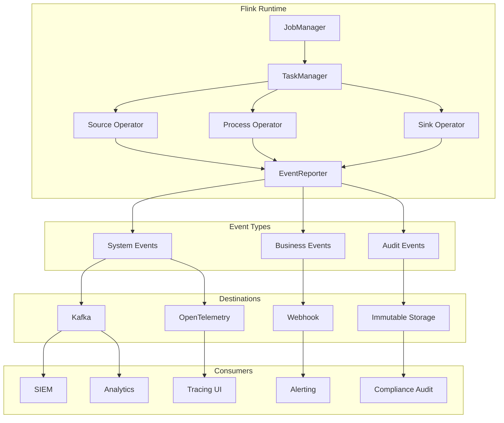
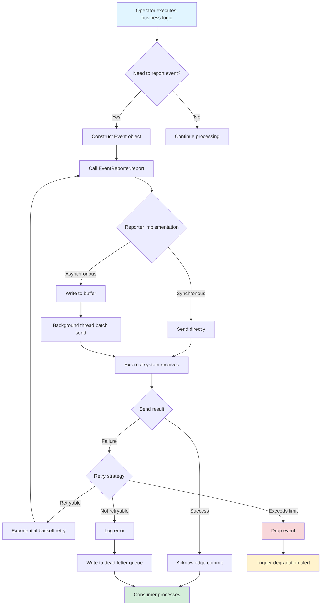
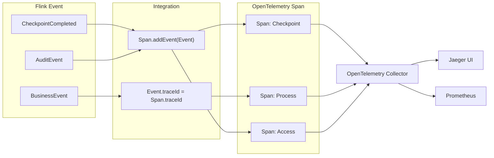
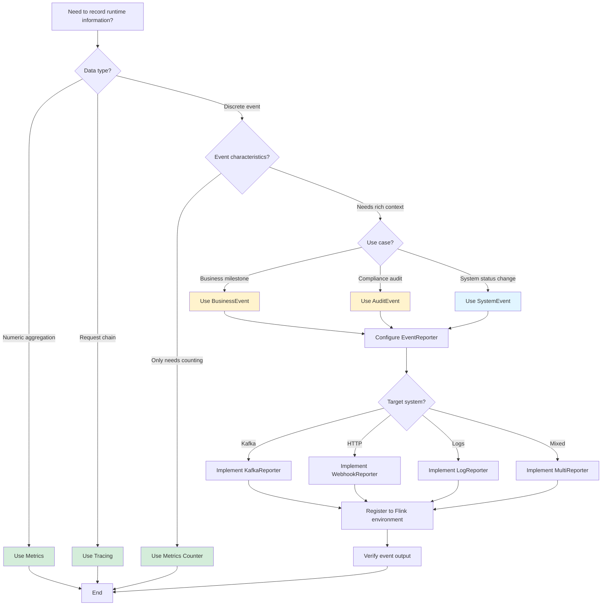

# Flink 2.2 Event Reporting - Custom Event Reporting

> **Stage**: Flink/ | **Prerequisites**: [15-observability/metrics-and-monitoring.md](./metrics-and-monitoring.md), [15-observability/distributed-tracing.md](./distributed-tracing.md) | **Formality Level**: L3

---

## 1. Definitions

### Def-F-15-12: EventReporter Interface

**EventReporter** is an extension point interface introduced in Flink 2.1+, used to report structured events to external systems.

```java
public interface EventReporter {
    /** Report a single event */
    void report(Event event);

    /** Batch report events (optional optimization) */
    default void report(List<Event> events) {
        for (Event event : events) {
            report(event);
        }
    }

    /** Close the Reporter and release resources */
    void close();
}
```

**Event Structure Definition**:

```java
public interface Event {
    /** Event type identifier */
    String getType();

    /** Event timestamp (milliseconds) */
    long getTimestamp();

    /** Event attribute map */
    Map<String, Object> getAttributes();

    /** Event severity level */
    Severity getSeverity();
}
```

**Intuitive Explanation**: EventReporter is similar to an application-level "event bus," allowing jobs to send structured events with clear semantics to external systems (such as Kafka, Webhook, logging systems) at runtime, distinguishing it from low-level Metrics and Tracing.

---

### Def-F-15-13: Built-in System Events

**Def-F-15-13-01: CheckpointCompletedEvent**

Event triggered when a Checkpoint completes successfully.

| Attribute | Type | Description |
|-----------|------|-------------|
| `checkpointId` | Long | Checkpoint unique identifier |
| `duration` | Long | Checkpoint duration (milliseconds) |
| `stateSize` | Long | State data size (bytes) |
| `numSubtasks` | Integer | Number of subtasks participating in Checkpoint |

**Def-F-15-13-02: JobStatusChangedEvent**

Event triggered when job status changes.

| Attribute | Type | Description |
|-----------|------|-------------|
| `jobId` | String | Job identifier |
| `previousStatus` | JobStatus | Status before change |
| `currentStatus` | JobStatus | Status after change |
| `timestamp` | Long | Status change timestamp |

**Def-F-15-13-03: TaskFailureEvent**

Event triggered when task execution fails.

| Attribute | Type | Description |
|-----------|------|-------------|
| `taskId` | String | Failed task identifier |
| `attemptNumber` | Integer | Retry count |
| `exceptionClass` | String | Exception type |
| `exceptionMessage` | String | Exception message summary |

---

### Def-F-15-14: Custom Event Types

**Def-F-15-14-01: BusinessEvent**

Custom event defined at the business logic layer, used to track key business milestones.

```java
public class BusinessEvent implements Event {
    private final String type;           // Business event type, e.g., "order.completed"
    private final long timestamp;
    private final Map<String, Object> attributes;
    private final Severity severity;
    private final String businessDomain; // Business domain identifier
    private final String correlationId;  // Correlation ID for trace linkage
}
```

**Def-F-15-14-02: AuditEvent**

Audit-specific event type, satisfying compliance requirements.

```java
public class AuditEvent implements Event {
    private final String action;         // Operation type (CREATE/UPDATE/DELETE)
    private final String resourceType;   // Resource type
    private final String resourceId;     // Resource identifier
    private final String userId;         // Operating user
    private final String clientIp;       // Client IP
    private final Map<String, Object> beforeState;  // State before change
    private final Map<String, Object> afterState;   // State after change
}
```

---

## 2. Properties

### Prop-F-15-01: Difference Between EventReporter and Metrics

| Dimension | EventReporter | Metrics |
|-----------|---------------|---------|
| **Data Model** | Discrete events with full context | Aggregated metrics, values only |
| **Time Semantics** | Precise timestamp, single occurrence | Sampling interval, aggregatable |
| **Use Cases** | Business events, audit, milestones | Performance monitoring, capacity planning |
| **Storage Characteristics** | Immutable logs, long-term retention | Time-series data, downsampling |
| **Query Patterns** | Filter by attributes, correlation analysis | Aggregate computation, trend analysis |

**Proof Idea**: From the comparison of Def-F-15-12 and Metrics definitions, an Event is a rich-structure discrete record, while a Metric is a lightweight value sequence.

---

### Prop-F-15-02: At-Least-Once Event Delivery Semantics

**Proposition**: Flink EventReporter provides At-Least-Once event delivery guarantee by default.

**Argumentation**:

1. EventReporter is called within the operator context
2. The Checkpoint mechanism ensures operator state consistency
3. Event reporting and state updates can be bound in the same transaction
4. Failure retry mechanisms ensure events are not lost
5. But duplicate reporting may occur (requires consumers to implement idempotency)

---

### Prop-F-15-03: Mapping Between Events and Spans

**Proposition**: Each Event can be associated with zero or one OpenTelemetry Span.

```
Span (OpenTelemetry)
├── SpanContext (traceId, spanId)
├── Events[] ──────┬── Event 1: "checkpoint.start"
│                  ├── Event 2: "state.async.snapshot"
│                  └── Event 3: "checkpoint.complete"
└── Attributes
```

**Explanation**: In the distributed tracing context, a Flink Event can be attached as an internal Span Event (Span Event), achieving a unified observability view.

---

## 3. Relations

### 3.1 EventReporter and Flink Component Relationships

```
┌─────────────────────────────────────────────────────────────┐
│                     Flink Application                        │
│  ┌─────────────┐  ┌─────────────┐  ┌─────────────────────┐ │
│  │   Source    │  │  Process    │  │       Sink          │ │
│  │   Operator  │──│   Operator  │──│     Operator        │ │
│  └──────┬──────┘  └──────┬──────┘  └──────────┬──────────┘ │
│         │                │                    │            │
│         └────────────────┼────────────────────┘            │
│                          ▼                                 │
│              ┌───────────────────────┐                     │
│              │   EventReporter       │                     │
│              │   (Extension Point)   │                     │
│              └───────────┬───────────┘                     │
└──────────────────────────┼─────────────────────────────────┘
                           │
           ┌───────────────┼───────────────┐
           ▼               ▼               ▼
    ┌────────────┐  ┌────────────┐  ┌────────────┐
    │   Kafka    │  │  Webhook   │  │   Logs     │
    │   Topic    │  │  Endpoint  │  │   File     │
    └────────────┘  └────────────┘  └────────────┘
```

### 3.2 Event Type Hierarchy

```
Event (Interface)
├── SystemEvent (Built-in)
│   ├── CheckpointCompletedEvent
│   ├── JobStatusChangedEvent
│   └── TaskFailureEvent
├── BusinessEvent (Def-F-15-14-01)
│   ├── OrderCompletedEvent
│   ├── PaymentProcessedEvent
│   └── InventoryUpdatedEvent
└── AuditEvent (Def-F-15-14-02)
    ├── DataAccessEvent
    └── ConfigurationChangeEvent
```

### 3.3 Integration with the Three Pillars of Observability

| Observability Pillar | Flink Component | Event Role |
|----------------------|-----------------|------------|
| **Metrics** | MetricReporter | Event can be converted to Counter/Gauge |
| **Logging** | Log4j/Logback | Event output as structured logs |
| **Tracing** | OpenTelemetry | Event attached as Span Event |

---

## 4. Argumentation

### 4.1 Why is EventReporter Needed?

**Problem Background**: Limitations of traditional Metrics and Logging

| Solution | Limitation |
|----------|------------|
| Metrics | Cannot carry rich context, unsuitable for business events |
| Logging | Unstructured, difficult to consume programmatically |
| Tracing | Focuses on request chains, not good at business milestones |

**EventReporter Design Goals**:

1. **Structured**: Strongly typed event definitions, convenient for downstream consumption
2. **Semantically Clear**: Clear business meaning, not technical indicators
3. **Extensible**: Supports custom event types
4. **Integration-Friendly**: Easy to connect to external systems (SIEM, audit platforms)

### 4.2 Performance Considerations for Event Reporting

**Challenge**: High-frequency event reporting may affect job performance

**Mitigation Strategies**:

| Strategy | Implementation | Applicable Scenario |
|----------|----------------|---------------------|
| Batch reporting | `report(List<Event>)` | High-throughput scenarios |
| Async sending | Internal buffer + background thread | Latency-insensitive |
| Sampling reporting | Filter by ratio or condition | Diagnostic events |
| Degraded processing | Drop or write locally when buffer full | Resource-constrained |

### 4.3 Coordination with Checkpoint

**Scenario**: How to report events when Checkpoint fails?

```
Checkpoint Flow:
┌─────────┐    ┌─────────┐    ┌─────────┐    ┌─────────┐
│  START  │───▶│ TRIGGER │───▶│  SYNC   │───▶│ ASYNC   │
└─────────┘    └─────────┘    └─────────┘    └─────────┘
     │                               │             │
     ▼                               ▼             ▼
 report(CheckpointStartEvent)   report(StateSnapshotEvent)
                                               │
                                               ▼
                                    ┌─────────────────────┐
                                    │   SUCCESS/FAILED    │
                                    └─────────────────────┘
                                               │
                                               ▼
                              report(CheckpointCompletedEvent)
                              report(CheckpointFailedEvent)
```

---

## 5. Engineering Argument

### 5.1 Architecture Design Decisions

**Decision 1: Extension Point vs. Built-in Implementation**

- **Choice**: EventReporter as an extension point interface
- **Reasons**:
  1. Event consumption infrastructure differs greatly across organizations
  2. Avoid introducing too many external dependencies
  3. Consistent with existing Metrics/Tracing extension points

**Decision 2: Synchronous vs. Asynchronous API**

- **Choice**: Synchronous `report()` interface, internally can be implemented asynchronously
- **Reasons**:
  1. Simplifies caller logic
  2. Implementer controls async strategy (thread pool, buffer)
  3. Facilitates exception throwing on failure

### 5.2 Reliability Argumentation

**Scenario**: Behavior when EventReporter implementation fails

| Failure Type | Default Behavior | Configuration Option |
|--------------|------------------|----------------------|
| Network timeout | Retry 3 times then drop | `event.reporter.max-retries` |
| Buffer full | Drop new events | `event.reporter.buffer-full-policy` |
| Serialization failure | Log error | None |

---

## 6. Examples

### 6.1 Custom EventReporter Implementation

**Kafka Event Reporter**:

```java
public class KafkaEventReporter implements EventReporter {
    private final KafkaProducer<String, String> producer;
    private final String topic;
    private final ObjectMapper objectMapper;

    public KafkaEventReporter(Properties props, String topic) {
        this.producer = new KafkaProducer<>(props);
        this.topic = topic;
        this.objectMapper = new ObjectMapper()
            .registerModule(new JavaTimeModule());
    }

    @Override
    public void report(Event event) {
        try {
            String json = objectMapper.writeValueAsString(event);
            ProducerRecord<String, String> record =
                new ProducerRecord<>(topic, event.getType(), json);

            producer.send(record, (metadata, exception) -> {
                if (exception != null) {
                    LOG.error("Failed to report event to Kafka", exception);
                }
            });
        } catch (JsonProcessingException e) {
            LOG.error("Failed to serialize event", e);
        }
    }

    @Override
    public void report(List<Event> events) {
        // Batch send optimization
        List<ProducerRecord<String, String>> records = events.stream()
            .map(this::toRecord)
            .collect(Collectors.toList());

        for (ProducerRecord<String, String> record : records) {
            producer.send(record);
        }
    }

    @Override
    public void close() {
        producer.flush();
        producer.close();
    }
}
```

**Webhook Event Reporter**:

```java
public class WebhookEventReporter implements EventReporter {
    private final HttpClient httpClient;
    private final String webhookUrl;
    private final String authToken;

    public WebhookEventReporter(String webhookUrl, String authToken) {
        this.httpClient = HttpClient.newBuilder()
            .connectTimeout(Duration.ofSeconds(10))
            .build();
        this.webhookUrl = webhookUrl;
        this.authToken = authToken;
    }

    @Override
    public void report(Event event) {
        try {
            String json = toJson(event);
            HttpRequest request = HttpRequest.newBuilder()
                .uri(URI.create(webhookUrl))
                .header("Content-Type", "application/json")
                .header("Authorization", "Bearer " + authToken)
                .POST(HttpRequest.BodyPublishers.ofString(json))
                .build();

            httpClient.sendAsync(request, HttpResponse.BodyHandlers.discarding())
                .orTimeout(30, TimeUnit.SECONDS)
                .exceptionally(ex -> {
                    LOG.warn("Webhook event report failed", ex);
                    return null;
                });
        } catch (Exception e) {
            LOG.error("Failed to send webhook", e);
        }
    }

    @Override
    public void close() {
        // HttpClient does not need explicit close
    }
}
```

### 6.2 Using Custom Events in Flink Jobs

```java
import org.apache.flink.streaming.api.environment.StreamExecutionEnvironment;

import org.apache.flink.streaming.api.datastream.DataStream;


public class OrderProcessingJob {

    public static void main(String[] args) throws Exception {
        StreamExecutionEnvironment env =
            StreamExecutionEnvironment.getExecutionEnvironment();

        // Register custom EventReporter
        env.getConfig().registerEventReporter(
            new KafkaEventReporter(kafkaProps, "flink-events")
        );

        DataStream<Order> orders = env
            .addSource(new OrderSource())
            .map(new RichMapFunction<Order, Order>() {
                private transient EventReporter eventReporter;

                @Override
                public void open(Configuration parameters) {
                    eventReporter = getRuntimeContext()
                        .getEventReporter();
                }

                @Override
                public Order map(Order order) {
                    // Process order...

                    // Report business event
                    eventReporter.report(BusinessEvent.builder()
                        .type("order.validated")
                        .businessDomain("ecommerce")
                        .correlationId(order.getTraceId())
                        .attribute("orderId", order.getId())
                        .attribute("amount", order.getAmount())
                        .severity(Severity.INFO)
                        .build());

                    return order;
                }
            });

        env.execute("Order Processing with Events");
    }
}
```

### 6.3 Audit Event Implementation Example

```java
public class AuditEventReporter implements EventReporter {

    @Override
    public void report(Event event) {
        if (event instanceof AuditEvent) {
            AuditEvent auditEvent = (AuditEvent) event;

            // Ensure immutability of audit events
            validateAuditEvent(auditEvent);

            // Write to audit log (undeletable, unmodifiable)
            writeToImmutableStorage(auditEvent);

            // Send real-time notification simultaneously
            notifyComplianceTeam(auditEvent);
        }
    }

    private void validateAuditEvent(AuditEvent event) {
        Preconditions.checkNotNull(event.getAction(), "Action required");
        Preconditions.checkNotNull(event.getUserId(), "User ID required");
        Preconditions.checkNotNull(event.getTimestamp(), "Timestamp required");
    }

    private void writeToImmutableStorage(AuditEvent event) {
        // Write to WORM (Write Once Read Many) storage
        // Such as AWS Glacier, Azure Immutable Blob
    }
}
```

---

## 7. Visualizations

### 7.1 EventReporter Architecture Diagram

The following Mermaid diagram shows the position of EventReporter in the Flink observability system:



### 7.2 Event Lifecycle Flowchart

The following Mermaid diagram shows the complete lifecycle from event generation to consumption:



### 7.3 Event and Span Integration Relationship Diagram



### 7.4 Decision Tree: When to Use EventReporter



---

## 8. References


---

*Document Version: 1.0 | Last Updated: 2026-04-02 | Status: Draft Complete*
