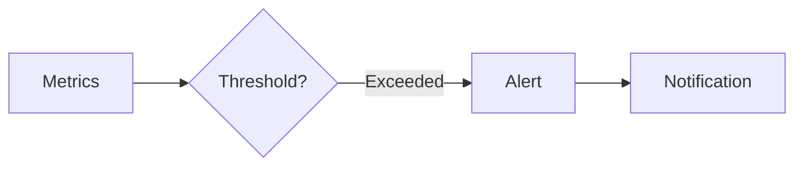

# Alerting System Evolution Feature Tracking

> Stage: Flink/observability/evolution | Prerequisites: [Alerting][^1] | Formalization Level: L3

## 1. Definitions

### Def-F-Alert-01: Alert Rule

Alert rule:
$$
\text{Rule} : \text{Condition} \to \text{Notification}
$$

### Def-F-Alert-02: Alert Severity

Alert severity:
$$
\text{Severity} \in \{\text{INFO}, \text{WARNING}, \text{CRITICAL}\}
$$

## 2. Properties

### Prop-F-Alert-01: Alert Latency

Alert latency:
$$
T_{\text{alert}} < 30s
$$

## 3. Relations

### Alerting Evolution

| Version | Feature | Status |
|---------|---------|--------|
| 2.4 | Basic Alerting | GA |
| 2.5 | AI Alerting | GA |
| 3.0 | Intelligent Alerting | In Design |

## 4. Argumentation

### 4.1 Alert Channels

| Channel | Type |
|---------|------|
| Email | Asynchronous |
| Slack | Real-time |
| PagerDuty | Urgent |

## 5. Proof / Engineering Argument

### 5.1 Alert Rules

```yaml
alerts:
  - name: high_latency
    condition: latency_p99 > 1000
    severity: warning
```

## 6. Examples

### 6.1 Custom Alert

```java
AlertManager.register(new AlertRule()
    .when(metrics -> metrics.getLatency() > 1000)
    .then(alert -> notifySlack(alert)));
```

## 7. Visualizations



## 8. References

[^1]: Flink Alerting Documentation

---

## Tracking Information

| Property | Value |
|----------|-------|
| Version | 2.4-3.0 |
| Current Status | Evolving |
