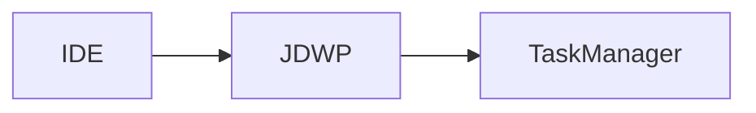

# Debugging Tools Evolution Feature Tracking

> Stage: Flink/observability/evolution | Prerequisites: [Debugging][^1] | Formalization Level: L3

## 1. Definitions

### Def-F-Debug-01: Local Debugging

Local debugging:
$$
\text{Local} : \text{IDE} \leftrightarrow \text{Flink MiniCluster}
$$

### Def-F-Debug-02: Remote Debugging

Remote debugging:
$$
\text{Remote} : \text{IDE} \leftrightarrow \text{Remote Cluster}
$$

## 2. Properties

### Prop-F-Debug-01: Debug Overhead

Debug overhead:
$$
\text{Overhead}_{\text{debug}} < 10\%
$$

## 3. Relations

### Debugging Evolution

| Version | Feature | Status |
|---------|---------|--------|
| 2.4 | Local Debugging | GA |
| 2.5 | Remote Debugging | GA |
| 3.0 | Distributed Debugging | In Design |

## 4. Argumentation

### 4.1 Debugging Tools

| Tool | Purpose |
|------|---------|
| IDE | Breakpoint debugging |
| JPDA | Remote connection |
| Flink UI | State inspection |

## 5. Proof / Engineering Argument

### 5.1 Debug Configuration

```bash
-env.java.opts.jobmanager: "-agentlib:jdwp=transport=dt_socket,server=y,suspend=n,address=5005"
```

## 6. Examples

### 6.1 IDEA Configuration

```xml
<configuration>
  <option name="HOST" value="localhost"/>
  <option name="PORT" value="5005"/>
</configuration>
```

## 7. Visualizations



## 8. References

[^1]: Flink Debugging Documentation

---

## Tracking Information

| Property | Value |
|----------|-------|
| Version | 2.4-3.0 |
| Current Status | Evolving |
