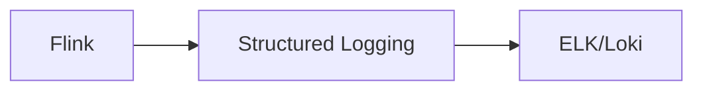

# Logging System Evolution Feature Tracking

> Stage: Flink/observability/evolution | Prerequisites: [Logging][^1] | Formalization Level: L3

## 1. Concept Definitions (Definitions)

### Def-F-Logging-01: Structured Logging

Structured logging:
$$
\text{Log} = \{ \text{timestamp}, \text{level}, \text{message}, \text{context} \}
$$

## 2. Property Derivation (Properties)

### Prop-F-Logging-01: Log Level Control

Log level control:
$$
\text{Level}_{\text{runtime}} \neq \text{Level}_{\text{startup}}
$$

## 3. Relation Establishment (Relations)

### Logging Evolution

| Version | Feature | Status |
|------|------|------|
| 2.4 | JSON Format | GA |
| 2.5 | Dynamic Level | GA |
| 3.0 | Unified Logging | In Design |

## 4. Argumentation (Argumentation)

### 4.1 Log Formats

| Format | Use Case |
|------|------|
| Text | Development |
| JSON | Production |
| Binary | High Performance |

## 5. Formal Proof / Engineering Argument

### 5.1 JSON Logging Configuration

```xml
<encoder class="net.logstash.logback.encoder.LogstashEncoder"/>
```

## 6. Examples (Examples)

### 6.1 Structured Logging

```java
LOG.info("Processing event",
    keyValue("eventId", event.getId()),
    keyValue("timestamp", event.getTime()));
```

## 7. Visualizations (Visualizations)



## 8. References (References)

[^1]: Flink Logging Documentation

---

## Tracking Information

| Property | Value |
|------|-----|
| Version | 2.4-3.0 |
| Current Status | Evolving |
