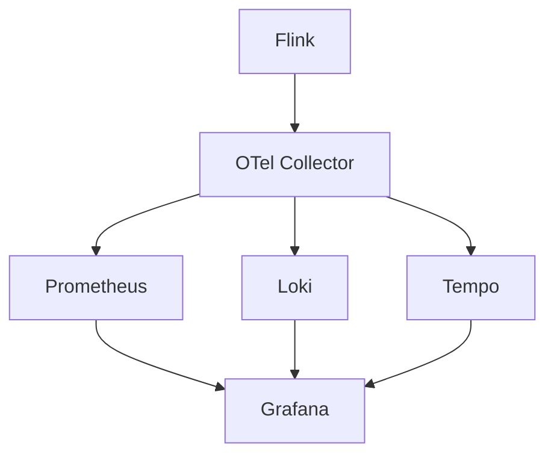

# Observability Integration Evolution Tracking

> Stage: Flink/observability/evolution | Prerequisites: [Obs Integration][^1] | Formalization Level: L3

## 1. Definitions

### Def-F-Obs-Int-01: Unified Observability

Unified observability:
$$
\text{Unified} = \text{Metrics} \times \text{Logs} \times \text{Traces}
$$

### Def-F-Obs-Int-02: Correlation

Correlation:
$$
\text{Correlation} : \text{TraceID} \to \{\text{Metrics}, \text{Logs}\}
$$

## 2. Properties

### Prop-F-Obs-Int-01: Data Completeness

Data completeness:
$$
\text{Completeness} > 0.99
$$

## 3. Relations

### Integration Evolution

| Version | Feature | Status |
|---------|---------|--------|
| 2.4 | Separate Systems | GA |
| 2.5 | Partial Correlation | GA |
| 3.0 | Fully Unified | In Design |

## 4. Argumentation

### 4.1 Integration Architecture

```
Flink → OTel Collector → Backend (Prometheus/Loki/Tempo)
```

## 5. Proof / Engineering Argument

### 5.1 OTel Collector Configuration

```yaml
receivers:
  otlp:
    protocols:
      grpc:
exporters:
  prometheus:
  loki:
```

## 6. Examples

### 6.1 Correlation Query

```sql
-- Correlate via TraceID
SELECT * FROM logs WHERE trace_id = 'xxx'
UNION
SELECT * FROM metrics WHERE trace_id = 'xxx'
```

## 7. Visualizations



## 8. References

[^1]: OpenTelemetry Documentation

---

## Tracking Information

| Property | Value |
|----------|-------|
| Version | 2.4-3.0 |
| Current Status | Evolving |
