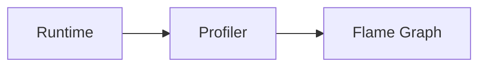

# Profiling Evolution Feature Tracking

> Stage: Flink/observability/evolution | Prerequisites: [Profiling][^1] | Formalization Level: L3

## 1. Concept Definitions (Definitions)

### Def-F-Profiling-01: CPU Profiling

CPU profiling:
$$
\text{Profile} : \text{Time} \to \text{CallStack}
$$

### Def-F-Profiling-02: Memory Profiling

Memory profiling:
$$
\text{MemoryProfile} : \text{Heap} \to \text{ObjectStats}
$$

## 2. Property Derivation (Properties)

### Prop-F-Profiling-01: Low Overhead

Low overhead:
$$
\text{Overhead} < 5\%
$$

## 3. Relation Establishment (Relations)

### Profiling Evolution

| Version | Feature | Status |
|------|------|------|
| 2.4 | JFR Support | Beta |
| 2.5 | Async Profiling | GA |
| 3.0 | Native Profiling | In Design |

## 4. Argumentation (Argumentation)

### 4.1 Profiling Types

| Type | Tool |
|------|------|
| CPU | async-profiler |
| Memory | JFR |
| Lock | JMC |

## 5. Formal Proof / Engineering Argument

### 5.1 JFR Configuration

```yaml
profiling.enabled: true
profiling.jfr.enabled: true
```

## 6. Examples (Examples)

### 6.1 Startup Profiling

```bash
-XX:+UnlockDiagnosticVMOptions
-XX:+DebugNonSafepoints
-XX:+FlightRecorder
```

## 7. Visualizations (Visualizations)



## 8. References (References)

[^1]: Java Profiling Documentation

---

## Tracking Information

| Property | Value |
|------|-----|
| Version | 2.4-3.0 |
| Current Status | Evolving |
