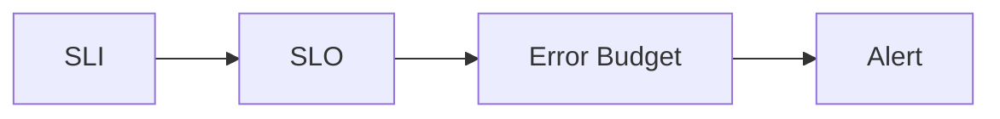

# SLO Management Evolution Feature Tracking

> Stage: Flink/observability/evolution | Prerequisites: [SLO][^1] | Formalization Level: L3

## 1. Concept Definitions (Definitions)

### Def-F-SLO-01: Service Level Objective

Service level objective:
$$
\text{SLO} = \langle \text{Metric}, \text{Target}, \text{Window} \rangle
$$

### Def-F-SLO-02: Error Budget

Error budget:
$$
\text{Budget} = 1 - \text{SLO}
$$

## 2. Property Derivation (Properties)

### Prop-F-SLO-01: Compliance

Compliance:
$$
P(\text{Metric} \leq \text{Target}) \geq \text{SLO}
$$

## 3. Relation Establishment (Relations)

### SLO Evolution

| Version | Feature | Status |
|------|------|------|
| 2.4 | Basic SLO | GA |
| 2.5 | Budget Management | GA |
| 3.0 | Auto SLO | In Design |

## 4. Argumentation (Argumentation)

### 4.1 SLO Types

| SLO | Target |
|-----|------|
| Availability | 99.9% |
| Latency | P99 < 100ms |
| Throughput | > 10K/s |

## 5. Formal Proof / Engineering Argument

### 5.1 SLO Configuration

```yaml
slos:
  - name: availability
    target: 0.999
    window: 30d
```

## 6. Examples (Examples)

### 6.1 Error Budget

```java
// [伪代码片段 - 不可直接运行] 仅展示核心逻辑
double errorBudget = 1 - slo.getTarget();
boolean burnRate = currentErrors / errorBudget;
```

## 7. Visualizations (Visualizations)



## 8. References (References)

[^1]: Google SRE Documentation

---

## Tracking Information

| Property | Value |
|------|-----|
| Version | 2.4-3.0 |
| Current Status | Evolving |
