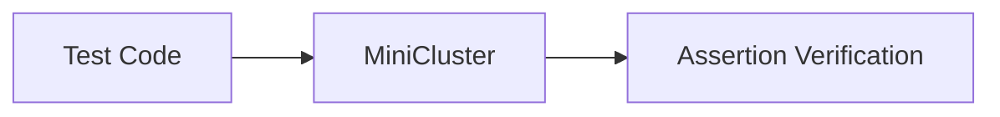

# Testing Tool Evolution Feature Tracking

> **Stage**: Flink/observability/evolution | **Prerequisites**: [Testing][^1] | **Formalization Level**: L3

## 1. Definitions

### Def-F-Test-01: Unit Testing

Unit testing:
$$
\text{UnitTest} : \text{Operator} \to \text{Assert}
$$

### Def-F-Test-02: Integration Testing

Integration testing:
$$
\text{Integration} : \text{Pipeline} \to \text{EndToEnd}
$$

## 2. Properties

### Prop-F-Test-01: Determinism

Determinism:
$$
\forall \text{run} : \text{Result}_1 = \text{Result}_2
$$

## 3. Relations

### Testing Evolution

| Version | Feature | Status |
|---------|---------|--------|
| 2.4 | Test Harness | GA |
| 2.5 | DataStream Testing | GA |
| 3.0 | Chaos Testing | In Design |

## 4. Argumentation

### 4.1 Testing Frameworks

| Framework | Purpose |
|-----------|---------|
| JUnit | Unit testing |
| Testcontainers | Integration testing |
| Flink Test | Stream testing |

## 5. Proof / Engineering Argument

### 5.1 DataStream Testing

```java

// [伪代码片段 - 不可直接运行] 仅展示核心逻辑
import org.apache.flink.streaming.api.environment.StreamExecutionEnvironment;
import org.apache.flink.streaming.api.datastream.DataStream;

@Test
public void testPipeline() throws Exception {
    StreamExecutionEnvironment env =
        StreamExecutionEnvironment.getExecutionEnvironment();
    env.setParallelism(1);

    DataStream<String> stream = env.fromElements("a", "b", "c");
    // Test logic
}
```

## 6. Examples

### 6.1 MiniCluster Testing

```java
// [伪代码片段 - 不可直接运行] 仅展示核心逻辑
MiniCluster cluster = new MiniCluster(
    new MiniClusterConfiguration.Builder()
        .setNumTaskManagers(1)
        .build());
cluster.start();
```

## 7. Visualizations



## 8. References

[^1]: Flink Testing Documentation

---

## Tracking Information

| Attribute | Value |
|-----------|-------|
| Version | 2.4-3.0 |
| Current Status | Evolving |
