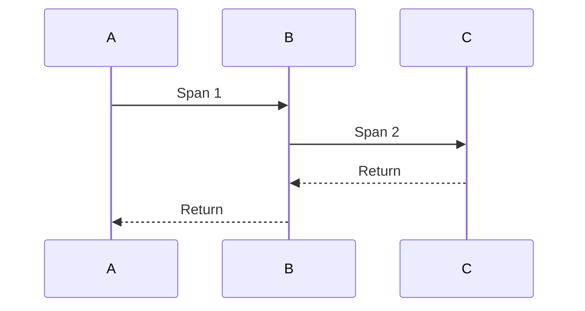

# Tracing System Evolution Tracking

> Stage: Flink/observability/evolution | Prerequisites: [Tracing][^1] | Formalization Level: L3

## 1. Definitions

### Def-F-Tracing-01: Distributed Tracing

Distributed tracing:
$$
\text{Trace} = \{ \text{Span}_1, \text{Span}_2, ... \}
$$

### Def-F-Tracing-02: OpenTelemetry

OpenTelemetry standard:
$$
\text{OTel} = \text{Trace} + \text{Metrics} + \text{Logs}
$$

## 2. Properties

### Prop-F-Tracing-01: Sampling Rate

Sampling rate:
$$
P(\text{sample}) = r
$$

## 3. Relations

### Tracing Evolution

| Version | Feature | Status |
|---------|---------|--------|
| 2.4 | OpenTracing | GA |
| 2.5 | OpenTelemetry | GA |
| 3.0 | Native Tracing | In Design |

## 4. Argumentation

### 4.1 Tracing Systems

| System | Protocol |
|--------|----------|
| Jaeger | OpenTelemetry |
| Zipkin | OpenTelemetry |
| Tempo | OpenTelemetry |

## 5. Proof / Engineering Argument

### 5.1 OTel Configuration

```yaml
tracing.exporter: otlp
tracing.otlp.endpoint: http://otel-collector:4317
```

## 6. Examples

### 6.1 Custom Span

```java
// [伪代码片段 - 不可直接运行] 仅展示核心逻辑
Span span = tracer.spanBuilder("process").startSpan();
try (Scope scope = span.makeCurrent()) {
    // Processing logic
} finally {
    span.end();
}
```

## 7. Visualizations



## 8. References

[^1]: OpenTelemetry Documentation

---

## Tracking Information

| Property | Value |
|----------|-------|
| Version | 2.4-3.0 |
| Current Status | Evolving |
