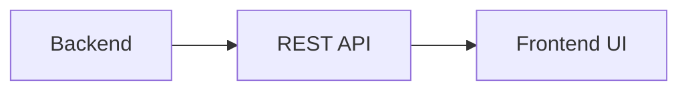

# Web UI Evolution Feature Tracking

> Stage: Flink/observability/evolution | Prerequisites: [Web UI][^1] | Formalization Level: L3

## 1. Concept Definitions (Definitions)

### Def-F-UI-01: Real-time Dashboard

Real-time dashboard:
$$
\text{Dashboard} : \text{Metrics} \xrightarrow{\text{real-time}} \text{Visualization}
$$

## 2. Property Derivation (Properties)

### Prop-F-UI-01: Refresh Rate

Refresh rate:
$$
T_{\text{refresh}} < 5s
$$

## 3. Relation Establishment (Relations)

### UI Evolution

| Version | Feature | Status |
|------|------|------|
| 2.4 | New UI Framework | GA |
| 2.5 | Real-time Streaming Graph | GA |
| 3.0 | Unified Console | In Design |

## 4. Argumentation (Argumentation)

### 4.1 UI Functions

| Function | Description |
|------|------|
| Job Overview | Overall status |
| Operator Details | Single operator |
| Checkpoint | Progress tracking |
| Backpressure Analysis | Heatmap |

## 5. Formal Proof / Engineering Argument

### 5.1 REST API

```java
// [伪代码片段 - 不可直接运行] 仅展示核心逻辑
GET /jobs/{jobid}/vertices
GET /jobs/{jobid}/metrics
```

## 6. Examples (Examples)

### 6.1 Custom View

```javascript
// Web UI extension
const customView = {
  metrics: ['latency', 'throughput'],
  refresh: 5000
};
```

## 7. Visualizations (Visualizations)



## 8. References (References)

[^1]: Flink Web UI Documentation

---

## Tracking Information

| Property | Value |
|------|-----|
| Version | 2.4-3.0 |
| Current Status | Evolving |
