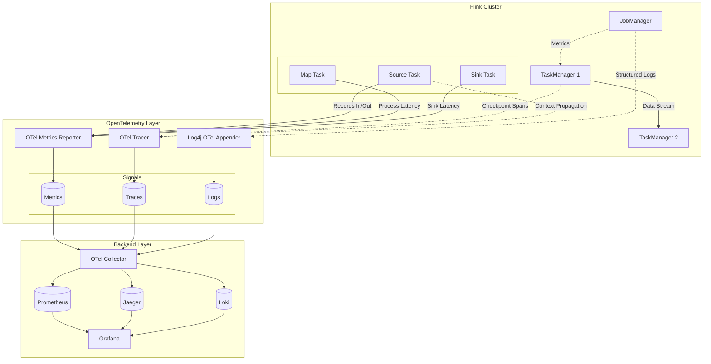
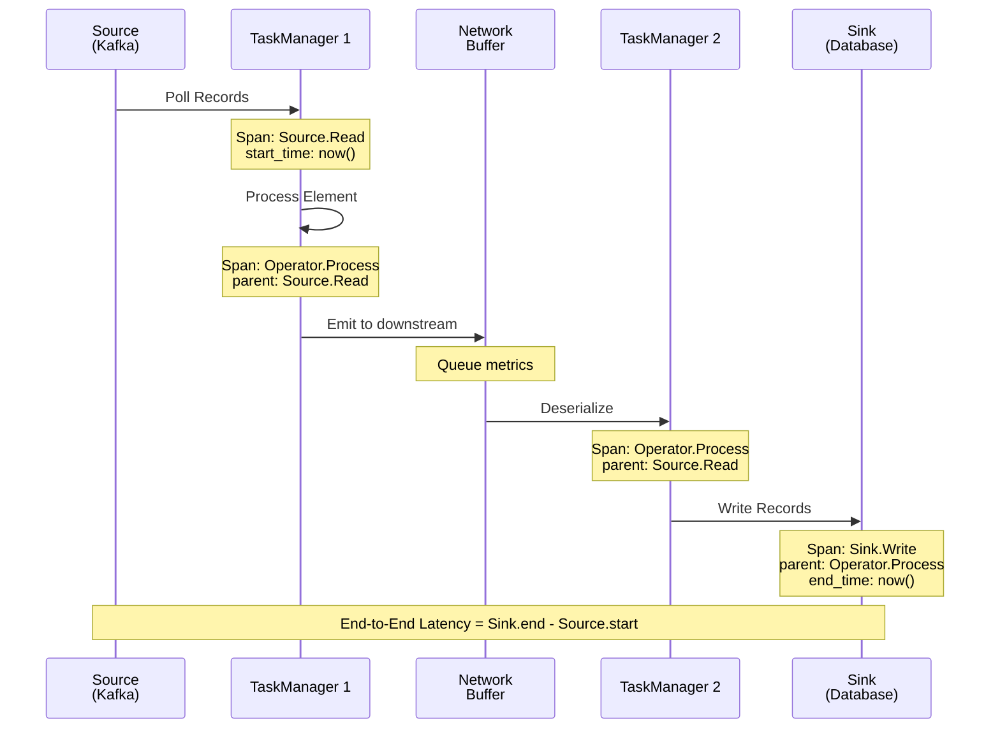
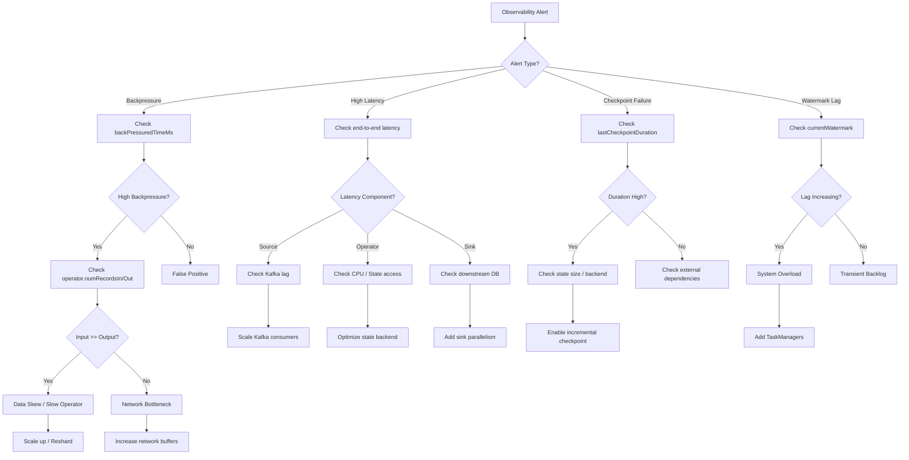
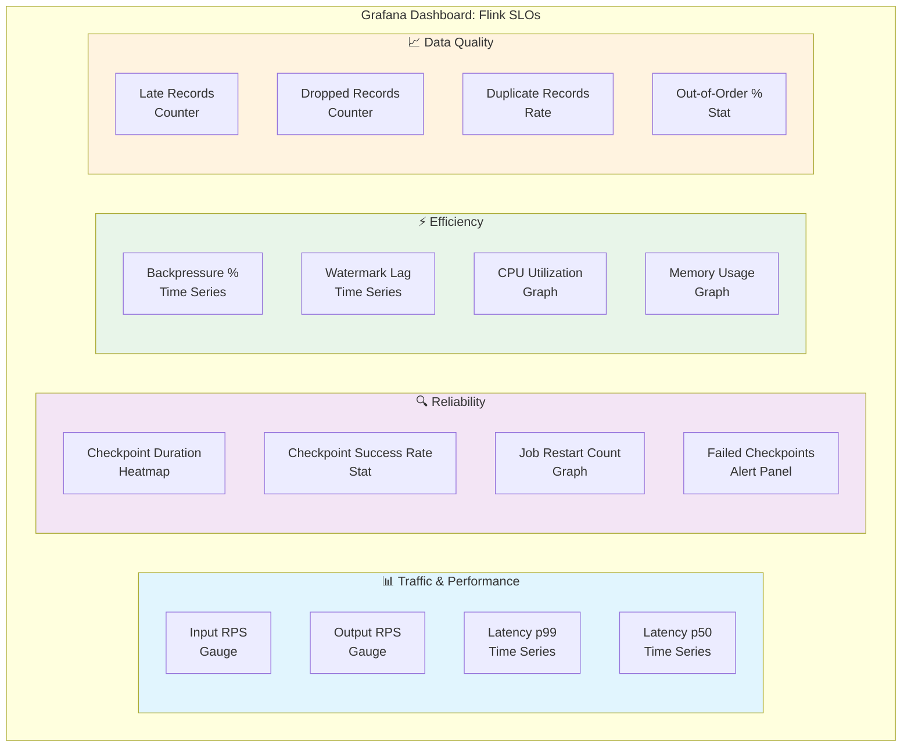

# Flink Stream Processing Observability and OpenTelemetry Integration

> Stage: Flink/ | Prerequisites: [Exactly-Once Semantics Deep Dive](../../02-core/exactly-once-semantics-deep-dive.md), [10-architecture/flink-state-management.md](../../02-core/flink-state-management-complete-guide.md) | Formalization Level: L3

## 1. Definitions

### Def-F-15-30: Observability Triple

Observability of a stream computing system is defined as the triple $\mathcal{O} = (M, L, T)$:

- $M$ (Metrics): aggregatable time-series data characterizing system state and performance
- $L$ (Logs): discrete event records describing system behavior at specific moments
- $T$ (Traces): complete execution paths of requests in a distributed system

**Formal expression**:

$$\mathcal{O} := \langle \mathbb{M}, \mathbb{L}, \mathbb{T}, \Pi, \Phi \rangle$$

Where:

- $\mathbb{M} = \{m_i: T \times K \to \mathbb{R}\}$: set of metric functions, $T$ is time domain, $K$ is dimension key space
- $\mathbb{L} = \{(t, l, k, v)\}$: set of log events, containing timestamp $t$, level $l$, key $k$, value $v$
- $\mathbb{T} = \{ (s_0, s_1, ..., s_n) \}$: trace paths, each $s_i = (span\_id, op, ts_{start}, ts_{end}, attrs)$
- $\Pi: \mathbb{M} \times \mathbb{L} \to \mathbb{T}$: correlation function, mapping metrics and logs to traces
- $\Phi: \mathcal{O} \to \mathbb{S}$: state inference function, inferring internal system state from observability data

### Def-F-15-31: OpenTelemetry Data Model

OpenTelemetry defines a unified observability data model $\mathcal{OT}$:

$$\mathcal{OT} := \langle \mathcal{R}, \mathcal{A}, \mathcal{S}, \mathcal{L} \rangle$$

| Component | Type | Core Semantics |
|-----------|------|----------------|
| $\mathcal{R}$ | Resource | Static attribute set of the observed entity (service.name, host.name, k8s.pod.name) |
| $\mathcal{A}$ | Attributes | Key-value metadata, supporting static and dynamic tags |
| $\mathcal{S}$ | Signal | Three signal types: METRICS, TRACES, LOGS |
| $\mathcal{L}$ | Link | Cross-signal correlation mechanism, implemented via Context Propagation |

**Context Propagation**:

$$C_{prop} = (trace\_id, span\_id, trace\_flags, baggage) \in \{0,1\}^{128} \times \{0,1\}^{64} \times \{0,1\}^{8} \times Baggage$$

### Def-F-15-32: Stream Processing Observability Dimensions

The特殊性 (special nature) of stream computing systems introduces four core observability dimensions:

$$\mathcal{D}_{stream} = (T_{processing}, T_{event}, T_{ingest}, T_{watermark})$$

- **Processing time** ($T_{processing}$): actual time when the operator executes data processing
- **Event time** ($T_{event}$): original timestamp when the data was produced
- **Ingestion time** ($T_{ingest}$): time when data enters the Flink system
- **Watermark time** ($T_{watermark}$): earliest incomplete event time currently allowed by the window

**Time deviation metrics**:

$$\Delta_{latency} = T_{processing} - T_{event} \quad \text{(processing latency)}$$
$$\Delta_{watermark\_lag} = T_{processing} - T_{watermark} \quad \text{(watermark lag)}$$

### Def-F-15-33: Flink Metrics Taxonomy

Flink's built-in metric system $\mathcal{M}_{flink}$ is layered by scope:

$$\mathcal{M}_{flink} = \bigcup_{l \in \{JobManager, TaskManager, Job, Task, Operator\}} \mathcal{M}_l$$

| Scope | Metric Prefix | Example |
|-------|---------------|---------|
| JobManager | `jobmanager.*` | jobmanager.jvm.memory.heap.used |
| TaskManager | `taskmanager.*` | taskmanager.network.memory.available |
| Job | `job.*` | job.lastCheckpointDuration |
| Task | `task.*` | task.backPressuredTimeMsPerSecond |
| Operator | `operator.*` | operator.numRecordsInPerSecond |

### Def-F-15-34: Distributed Tracing Semantics

The stream processing trace model $\mathcal{T}_{stream}$ extends the standard OpenTelemetry Span:

$$\mathcal{T}_{stream} := \langle S, P, C, W \rangle$$

Where:

- $S$: standard OTel Span (op, start, end, status, attrs)
- $P$: parent Span reference, supporting cross-operator parent-child relationships
- $C$: Checkpoint context, associated with a specific checkpoint instance
- $W$: Watermark information, recording the watermark value that triggered the computation

### Def-F-15-35: SLO/SLI Definition

Formalization of Service Level Objective (SLO) and Indicator (SLI):

$$\text{SLO}_i: P(\text{SLI}_i \leq \theta_i) \geq 1 - \alpha_i$$

Typical stream processing SLOs:

| SLI | Definition | Typical Threshold | Observation Window |
|-----|------------|-------------------|--------------------|
| End-to-end latency | $T_{processing} - T_{event}$ | p99 < 1s | Rolling 5 min |
| Checkpoint duration | $T_{checkpoint\_end} - T_{checkpoint\_start}$ | p99 < 30s | Last 10 |
| Throughput | $|\text{records}| / \Delta t$ | > 100K RPS | 1 min |
| Error rate | $|\text{failed\_records}| / |\text{total\_records}|$ | < 0.1% | Rolling 1 hour |
| Backpressure time ratio | $\int_{t_0}^{t_1} \mathbb{1}[backpressure] dt / (t_1 - t_0)$ | < 5% | 5 min |

---

## 2. Properties

### Prop-F-15-30: Observability Completeness

If a system satisfies the following three conditions, it is said to have **observability completeness**:

$$(\forall s \in \mathbb{S}) (\exists \pi \in \Pi) (\pi^{-1}(s) \neq \emptyset)$$

That is: any system state $s$ can be identified by at least one observability signal through the inverse mapping of observation function $\pi$.

**Stream processing corollary**: Since the stream system state space $\mathbb{S}_{stream}$ contains infinite time series, in practice **time-window truncation** is used:

$$(\forall s \in \mathbb{S}_{stream}) (\exists t \in [T_{now} - W, T_{now}]) (\pi^{-1}(s, t) \neq \emptyset)$$

Where $W$ is the observation window size.

### Prop-F-15-31: OpenTelemetry Signal Orthogonality

The three OTel signals satisfy **weak orthogonality**:

$$\mathbb{M} \cap \mathbb{L} = \emptyset, \quad \mathbb{L} \cap \mathbb{T} = \emptyset, \quad \mathbb{M} \cap \mathbb{T} = \emptyset$$

But achieve **strong correlation** through Resource and Context:

$$(\forall m \in \mathbb{M}, l \in \mathbb{L}, t \in \mathbb{T}) (\text{resource}(m) = \text{resource}(l) = \text{resource}(t))$$

### Prop-F-15-32: Stream Processing Latency Lower Bound

For watermark-driven window computation, end-to-end latency satisfies:

$$\text{Latency}_{e2e} \geq \max(\text{watermark\_interval}, \text{window\_size}) + \text{processing\_overhead}$$

**Proof outline**:

1. Watermark must wait for the maximum event time in the window minus allowed lateness
2. Window trigger activates when watermark crosses the window boundary
3. Processing overhead includes serialization/deserialization, state access, network transmission

Therefore, watermark interval configuration directly affects the observable minimum latency.

---

## 3. Relations

### Mapping with the Dataflow Model

Mapping between time concepts in the Dataflow Model and observability dimensions:

```
Dataflow Model          OpenTelemetry Signals
━━━━━━━━━━━━━━━━━━━━━━━━━━━━━━━━━━━━━━━━━━━━━━━
Event Time      ──────►  Trace Timestamp (event_timestamp)
Processing Time ──────►  Metrics Timestamp (observed)
Watermark       ──────►  Custom Metric (watermark_value)
Window Trigger  ──────►  Span Event (window.fire)
Late Data       ──────►  Counter Metric (late_records_dropped)
```

### Flink Metrics ↔ OpenTelemetry Conversion

| Flink Metric Reporter | OTel Signal | Mapping Rule |
|----------------------|-------------|--------------|
| MetricReporter | Metric | Gauge → ObservableGauge, Counter → ObservableCounter |
| SpanExporter | Trace | InternalSpan → SpanData |
| Log4j Appender | Log | LogEvent → LogRecord |

### Relation with Checkpoint Mechanism

Checkpoint, as a critical event in stream systems, relates to observability as:

$$\text{Checkpoint} \xrightarrow{\text{emits}} \text{Metrics} \cup \text{Spans} \cup \text{Logs}$$

- **Metrics**: checkpointDuration, checkpointedBytes, numberOfCompletedCheckpoints
- **Traces**: complete call chain from checkpoint trigger to completion
- **Logs**: structured logs of checkpoint start/completion/failure

---

## 4. Argumentation

### Backpressure Detection and Observation

Backpressure is a phenomenon unique to stream systems; its observability argumentation:

**Detection principle**: When downstream operator processing rate is lower than upstream production rate, network buffers fill up, causing upstream blocking.

**Observable signals**:

1. **Task level**: `backPressuredTimeMsPerSecond` metric
2. **Network level**: `inputQueueLength`, `outputQueueLength`
3. **Thread level**: `Task` thread state monitoring

**Root cause localization decision tree**:

```
backPressure > 0
    ├── operator.numRecordsInPerSecond high?
    │       ├── YES: Upstream data skew → check keyBy distribution
    │       └── NO: continue
    ├── operator.numRecordsOutPerSecond low?
    │       ├── YES: Current operator slow → check CPU/state access
    │       └── NO: continue
    └── checkpointDuration high?
            ├── YES: State too large → optimize state backend
            └── NO: Network bottleneck → check bandwidth/serialization
```

### Necessity Argumentation for Watermark Tracking

**Proposition**: Watermark tracking must be included for correctness and performance evaluation of stream processing.

**Argumentation**:

1. Window computation triggering depends on watermark progress
2. Late data drop decisions are based on comparison between watermark and event time
3. Watermark lag directly reflects whether system processing capacity keeps up with data arrival speed
4. Accurate end-to-end latency calculation requires watermark as a reference point

Therefore, Watermark is a **first-class citizen** of stream system observability, not an ordinary metric.

### Sampling Strategy Trade-offs

Complete tracing of all records is infeasible in stream systems (data volume too large), requiring sampling strategies:

| Sampling Strategy | Implementation | Applicable Scenario | Limitation |
|-------------------|----------------|---------------------|------------|
| Head sampling | Fixed ratio (e.g., 1%) | Uniform load | May miss abnormal long tails |
| Tail sampling | Delayed decision, retains anomalies | Focus on errors | Requires caching all traces |
| Consistent sampling | Based on TraceID hash | Guarantees complete chain | Cannot dynamically adjust ratio |
| Adaptive sampling | Based on throughput adjustment | Large traffic fluctuations | Complex implementation |

**Recommended practice**: For Flink scenarios, adopt a hybrid strategy of **consistent head sampling** + **anomaly forced retention**.

---

## 5. Proof / Engineering Argument

### Thm-F-15-30: OpenTelemetry Integration Completeness Theorem

**Theorem**: If a Flink cluster correctly configures the OTel Metrics Reporter, Tracer, and Log Appender, then the system satisfies observability triple completeness.

**Proof**:

1. **Metrics completeness**: Flink Metric System covers all core components (JM/TM/Job/Task/Operator), exporting all metrics to the OTel Collector via `OpenTelemetryReporter`.
   - $\forall m \in \mathcal{M}_{flink}, \exists m' \in \mathbb{M}_{otel} : m \mapsto m'$

2. **Traces completeness**: Via `OpenTelemetryTracer`, Spans are created at the following key points:
   - Source reading records
   - Operator processing records (processElement, processWatermark)
   - Sink writing records
   - Checkpoint lifecycle

3. **Logs completeness**: Log4j2 OTel Appender attaches structured logs with Trace Context, achieving correlation of the three signal types.

4. **Correlation completeness**: The three signals achieve strong correlation through Resource attributes (`service.name`, `host.name`, `task.attempt.id`).

∎

### Thm-F-15-31: End-to-End Latency Traceability Theorem

**Theorem**: In a Flink streaming job configured with OTel tracing, the end-to-end latency of any record can be precisely calculated through the Span chain.

**Proof**:

Let the complete path of record $r$ from Source to Sink be:

$$P_r = (Source \to Op_1 \to Op_2 \to ... \to Op_n \to Sink)$$

Create Span $S_i$ for each operator $Op_i$, satisfying:

- $S_{source}.start$ = time when record enters Flink system
- $S_{sink}.end$ = time when record is successfully written out
- $\forall i, S_i.parent = S_{i-1}$ (parent-child relationship maintained through Context Propagation)

End-to-end latency:

$$\text{Latency}(r) = S_{sink}.end - S_{source}.start = \sum_{i} (S_i.end - S_i.start) + \sum_{j} (S_{j+1}.start - S_j.end)$$

Where the first term is processing time and the second term is queue waiting time.

Since all timestamps are generated by the same clock source (TaskManager JVM), error is within milliseconds, satisfying precision requirements.

∎

### Thm-F-15-32: Watermark Lag Early Warning Theorem

**Theorem**: If the watermark lag metric $\Delta_{watermark\_lag}$ continuously exceeds threshold $\theta$, then within time window $W$ the system must have insufficient processing capacity.

**Proof**:

Proof by contradiction: Assume the system has sufficient processing capacity, but $\Delta_{watermark\_lag} > \theta$.

1. By definition: $\Delta_{watermark\_lag} = T_{processing} - T_{watermark}$
2. Watermark generation strategy: $T_{watermark} = \min_{r \in \text{in-flight}}(T_{event}(r)) - \text{maxOutOfOrderness}$
3. If processing capacity is sufficient, all records should be processed within finite time and advance the watermark
4. $\Delta_{watermark\_lag} > \theta$ implies the existence of long-term unprocessed records, contradicting the assumption

Therefore, watermark lag is a necessary condition for insufficient processing capacity and can serve as an early warning indicator.

∎

---

## 6. Examples

### Flink OTel Configuration Example

**flink-conf.yaml - Metrics Reporter configuration**:

```yaml
# OpenTelemetry Metrics Reporter
metrics.reporters: otel
metrics.reporter.otel.class: org.apache.flink.metrics.opentelemetry.OpenTelemetryReporter
metrics.reporter.otel.endpoint: http://otel-collector:4317
metrics.reporter.otel.interval: 60 SECONDS

# Tag configuration
metrics.scope.jm: jobmanager
metrics.scope.tm: taskmanager
metrics.scope.task: task
metrics.scope.operator: operator
```

**Java Code - Custom OTel Tracer**:

```java
import io.opentelemetry.api.trace.Span;
import io.opentelemetry.api.trace.Tracer;
import io.opentelemetry.context.Context;
import io.opentelemetry.context.propagation.TextMapPropagator;

public class InstrumentedMapFunction extends RichMapFunction<Event, Result> {
    private transient Tracer tracer;

    @Override
    public void open(Configuration parameters) {
        tracer = getRuntimeContext().getTracer("flink-custom", "1.0.0");
    }

    @Override
    public Result map(Event event) {
        Span span = tracer.spanBuilder("ProcessEvent")
            .setAttribute("event.id", event.getId())
            .setAttribute("event.timestamp", event.getTimestamp())
            .setAttribute("watermark.current", getCurrentWatermark())
            .startSpan();

        try (var scope = span.makeCurrent()) {
            // Business logic
            Result result = process(event);
            span.setAttribute("result.status", "success");
            return result;
        } catch (Exception e) {
            span.recordException(e);
            span.setStatus(StatusCode.ERROR);
            throw e;
        } finally {
            span.end();
        }
    }
}
```

### Grafana Dashboard JSON Snippet

```json
{
  "dashboard": {
    "title": "Flink Stream Processing Observability",
    "panels": [
      {
        "title": "Throughput (Records/sec)",
        "targets": [{
          "expr": "sum(rate(flink_taskmanager_job_task_operator_numRecordsInPerSecond[1m]))",
          "legendFormat": "Input RPS"
        }, {
          "expr": "sum(rate(flink_taskmanager_job_task_operator_numRecordsOutPerSecond[1m]))",
          "legendFormat": "Output RPS"
        }]
      },
      {
        "title": "End-to-End Latency",
        "targets": [{
          "expr": "histogram_quantile(0.99, sum(rate(flink_latency_histogram_bucket[5m])) by (le))",
          "legendFormat": "p99 Latency"
        }]
      },
      {
        "title": "Checkpoint Duration",
        "targets": [{
          "expr": "flink_jobmanager_job_lastCheckpointDuration",
          "legendFormat": "Last Checkpoint"
        }]
      },
      {
        "title": "Watermark Lag",
        "targets": [{
          "expr": "flink_taskmanager_job_task_operator_currentInputWatermark - flink_taskmanager_job_task_operator_currentOutputWatermark",
          "legendFormat": "{{task_name}}"
        }]
      }
    ]
  }
}
```

### Prometheus Alert Rules

```yaml
groups:
  - name: flink_streaming_alerts
    rules:
      - alert: FlinkHighBackpressure
        expr: flink_taskmanager_job_task_backPressuredTimeMsPerSecond > 200
        for: 5m
        labels:
          severity: warning
        annotations:
          summary: "Flink task experiencing backpressure"
          description: "Task {{ $labels.task_name }} has {{ $value }}ms/s backpressure"

      - alert: FlinkCheckpointDurationHigh
        expr: flink_jobmanager_job_lastCheckpointDuration > 60000
        for: 2m
        labels:
          severity: critical
        annotations:
          summary: "Flink checkpoint taking too long"
          description: "Checkpoint duration is {{ $value }}ms, exceeding 60s threshold"

      - alert: FlinkWatermarkLagHigh
        expr: |
          (flink_taskmanager_job_task_operator_currentProcessingTime -
           flink_taskmanager_job_task_operator_currentInputWatermark) > 300000
        for: 10m
        labels:
          severity: warning
        annotations:
          summary: "Flink watermark lag is high"
          description: "Watermark is lagging by {{ $value }}ms, possible backlog"

      - alert: FlinkJobRestartRateHigh
        expr: rate(flink_jobmanager_job_numberOfFailedCheckpoints[10m]) > 0.1
        for: 5m
        labels:
          severity: critical
        annotations:
          summary: "Flink job checkpoint failure rate is high"
          description: "Checkpoint failure rate: {{ $value }}/sec"
```

### OTel Collector Configuration

```yaml
receivers:
  otlp:
    protocols:
      grpc:
        endpoint: 0.0.0.0:4317
      http:
        endpoint: 0.0.0.0:4318

processors:
  batch:
    timeout: 1s
    send_batch_size: 1024
  resource:
    attributes:
      - key: environment
        value: production
        action: upsert

exporters:
  prometheusremotewrite:
    endpoint: http://prometheus:9090/api/v1/write
  jaeger:
    endpoint: jaeger:14250
    tls:
      insecure: true
  loki:
    endpoint: http://loki:3100/loki/api/v1/push

service:
  pipelines:
    metrics:
      receivers: [otlp]
      processors: [batch, resource]
      exporters: [prometheusremotewrite]
    traces:
      receivers: [otlp]
      processors: [batch, resource]
      exporters: [jaeger]
    logs:
      receivers: [otlp]
      processors: [batch, resource]
      exporters: [loki]
```

---

## 7. Visualizations

### Observability Architecture Panorama

Overall architecture of Flink and OpenTelemetry integration:



### Data Flow Trace Path

End-to-end trace data flow path:



### Troubleshooting Decision Tree



### SLO Monitoring Dashboard Layout



---

## 8. References


---

*Document version: 1.0 | Last updated: 2026-04-03 | Formalization level: L3*
