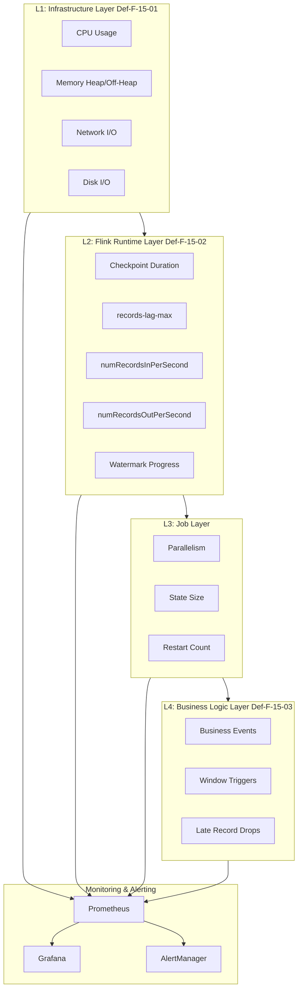
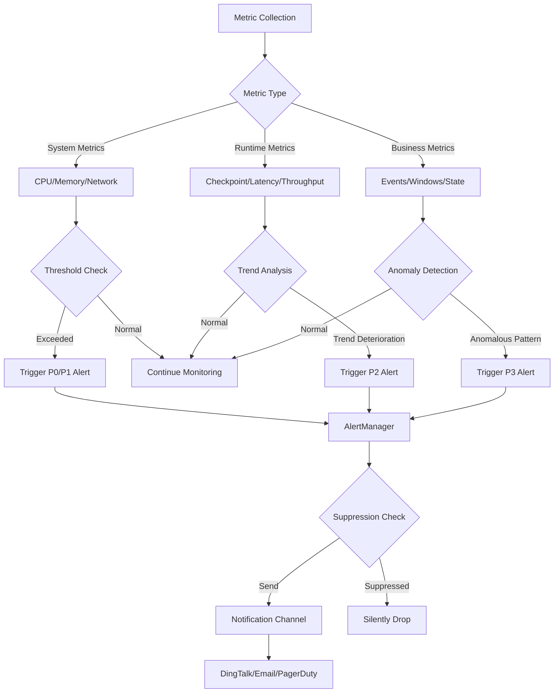
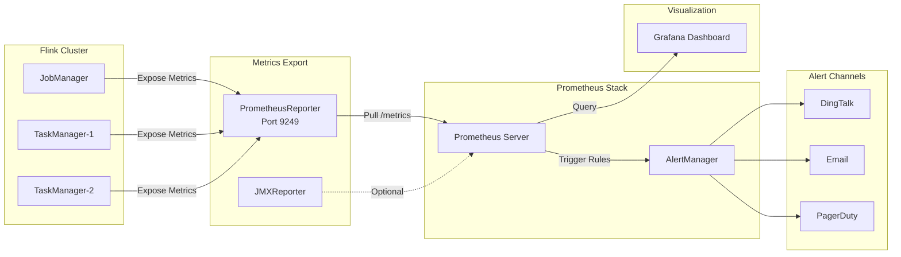

# Flink Metrics System - From Infrastructure to Business

> **Stage**: Flink | **Prerequisites**: [12-fault-tolerance/checkpoint-mechanism.md](../../02-core/checkpoint-mechanism-deep-dive.md) | **Formalization Level**: L3

## 1. Definitions

### Def-F-15-01: System Metrics

System metrics describe the infrastructure resource states that the Flink cluster relies on, including but not limited to:

- **CPU Utilization** (`system.CPU.usage`): CPU usage percentage of JobManager (JM) and TaskManager (TM)
- **Memory Usage** (`system.memory.*`): Heap, off-heap, and direct memory usage and limits
- **Network I/O** (`system.network.*`): Network bytes sent/received, connection count, TCP states
- **Disk I/O** (`system.disk.*`): Disk read/write rates, disk space utilization
- **Thread States** (`system.thread-count`): Total JVM threads and state distribution

System metrics are collected by Flink's `SystemMetricsReporter` via JMX or custom reporters, with a default sampling interval of 10 seconds.

### Def-F-15-02: Flink Runtime Metrics

Flink runtime metrics reflect the core operational status of the stream processing engine:

- **Checkpoint Metrics**
  - `checkpointDuration`: Duration of a single Checkpoint completion
  - `checkpointSize`: Size of Checkpoint state data
  - `numFailedCheckpoints`: Number of failed Checkpoints
  - `lastCheckpointRestoreTimestamp`: Timestamp of the most recent restore

- **Latency Metrics**
  - `records-lag-max`: Maximum consumer lag (for Kafka and other sources)
  - `currentOutputWatermark`: Current output Watermark
  - `latency`: End-to-end processing latency (requires LatencyMarker configuration)

- **Throughput Metrics**
  - `numRecordsInPerSecond`: Input records per second
  - `numRecordsOutPerSecond`: Output records per second
  - `numBytesInPerSecond`: Input bytes per second
  - `numBytesOutPerSecond`: Output bytes per second

### Def-F-15-03: Business Metrics

Business metrics are related to specific job logic and registered via custom `MetricGroup`:

- **Event Processing Metrics**
  - Business event counts (e.g., orders, clicks)
  - Distribution of specific event types
  - Invalid/anomalous event ratios

- **Window Metrics**
  - `windowTriggerCount`: Number of window triggers
  - `windowEmitCount`: Number of output records from windows
  - `windowLateRecordDropCount`: Number of late records dropped

- **State Access Metrics**
  - State read/write latency
  - State size growth rate
  - Number of TTL-expired records

### Def-F-15-04: Health Score

The health score is a quantitative assessment of the overall job running condition:

$$
H(s) = w_1 \cdot f_{checkpoint}(s) + w_2 \cdot f_{throughput}(s) + w_3 \cdot f_{latency}(s) + w_4 \cdot f_{error}(s)
$$

Where:

- $H(s) \in [0, 1]$, with 1 indicating perfect health
- $w_1 + w_2 + w_3 + w_4 = 1$ are weight coefficients
- $f_{checkpoint}(s)$: Checkpoint success rate score
- $f_{throughput}(s)$: Throughput stability score
- $f_{latency}(s)$: Latency compliance score
- $f_{error}(s)$: Error rate score

---

## 2. Properties

### Prop-F-15-01: Metric Hierarchy Dependency

**Proposition**: An anomaly in an upper-layer metric necessarily causes or reflects an anomaly in a lower-layer metric.

Formal statement:
$$
\forall m_i \in \text{Layer}_k, m_j \in \text{Layer}_{k+1}: \text{Abnormal}(m_j) \Rightarrow \exists m_i: \text{Correlated}(m_i, m_j)
$$

**Proof Sketch**:

- Business-layer latency increase (Def-F-15-03) $\rightarrow$ Runtime-layer `records-lag-max` increase (Def-F-15-02)
- Runtime-layer Checkpoint timeout (Def-F-15-02) $\rightarrow$ System-layer GC time too long or insufficient memory (Def-F-15-01)

### Prop-F-15-02: Key Metric Threshold Sensitivity

**Proposition**: `records-lag-max` and `checkpointDuration` exhibit nonlinear sensitivity to system stability.

Let $L$ be latency and $T_{checkpoint}$ be the Checkpoint interval. When:
$$
\text{records-lag-max} > \alpha \cdot T_{checkpoint} \quad (\alpha \approx 0.3)
$$

The system enters the **unstable zone**, where even stable input rates may cause cascading failures due to backpressure accumulation.

### Prop-F-15-03: Health Score Monotonicity

**Proposition**: The health score $H(s)$ maintains local continuity during stable operation and exhibits stepwise drops during failures.

Formal:
$$
\frac{dH}{dt} \approx 0 \text{ (stable period)} \quad \text{vs} \quad \Delta H < -\theta \text{ (failure period)}
$$

---

## 3. Relations

### 3.1 Metric Hierarchy Architecture

The Flink monitoring metric system adopts a four-layer architecture model:

| Layer | Metric Type | Collection Frequency | Response Time | Typical Users |
|------|----------|----------|----------|------------|
| L1: Infrastructure | Def-F-15-01 | 10-60s | Minute-level | SRE/Ops |
| L2: Flink Runtime | Def-F-15-02 | 1-10s | Second-level | Platform Engineers |
| L3: Job Layer | Job Config/Resources | On-demand | Minute-level | Job Developers |
| L4: Business Logic | Def-F-15-03 | Event-driven | Real-time | Business Analysts |

### 3.2 Metric Correlation Graph

Causal relationships among key metrics:

```
System Metrics (Def-F-15-01)
    │
    ├── High CPU ──→ TM heartbeat timeout ──→ Task failure
    │
    ├── Insufficient memory ──→ Full GC ──→ Checkpoint timeout
    │
    └── Network congestion ──→ Backpressure propagation ──→ Latency increase

Runtime Metrics (Def-F-15-02)
    │
    ├── records-lag-max ──→ Consumer lag ──→ Data loss risk
    │
    ├── checkpointDuration ──→ Increased recovery time
    │
    └── numRecordsIn/Out ──→ Throughput evaluation

Business Metrics (Def-F-15-03)
    │
    ├── Abnormal window trigger ──→ Business latency perception
    │
    └── Slow state access ──→ Processing latency increase
```

### 3.3 Metric-to-Health Mapping

$$
\text{Health}(s) = g\left(\bigcup_{i=1}^{4} \text{Metrics}_i(s)\right)
$$

Where $g$ is an aggregation function supporting weighted average, minimum, or machine-learning-based anomaly detection models.

---

## 4. Argumentation

### 4.1 Alert Strategy Comparison

#### Threshold-Based Alerting

**Principle**: Set fixed upper/lower bounds; trigger when exceeded.

**Applicable Scenarios**:

- Resource metrics (CPU > 80%)
- Absolute error metrics (failure count > 0)

**Limitations**:

- Cannot adapt to load fluctuations
- Prone to false positives (e.g., CPU rises during daily peaks)

#### Trend-Based Alerting

**Principle**: Based on time-series forecasting, detect deviation from trend.

**Algorithm**:
$$
\text{Alert} = |x_t - \hat{x}_t| > k \cdot \sigma_t
$$

Where $\hat{x}_t$ is the forecast value and $\sigma_t$ is the forecast standard deviation.

**Applicable Scenarios**:

- Deterioration trends in latency metrics
- Gradual throughput decline

#### Anomaly Detection

**Principle**: Use statistical or machine learning methods to identify anomalous patterns.

**Methods**:

- **Statistical**: 3-sigma rule, IQR
- **Machine Learning**: Isolation Forest, LSTM prediction

**Applicable Scenarios**:

- Joint anomalies in complex multi-dimensional metrics
- Business metrics without explicit thresholds

### 4.2 Metric Collection Method Comparison

| Method | Implementation | Pros | Cons |
|------|------|------|------|
| JMX | Built-in | No extra dependencies | High performance overhead |
| Prometheus PushGateway | External Reporter | Cloud-native friendly | Requires extra component |
| InfluxDB | Built-in Reporter | Time-series storage optimized | Depends on external storage |
| REST API | Flink Web UI | Ready to use | Not suitable for high-frequency collection |

---

## 5. Engineering Argument

### 5.1 Prometheus + Grafana Monitoring Solution Argument

**Architecture Rationale**:

1. **Prometheus Pull Model**: Flink exposes `/metrics` endpoint via `PrometheusReporter`; Prometheus actively pulls, avoiding data loss in Push mode during network partitions.

2. **Time-Series Data Storage**: Prometheus TSDB is optimized for metric data, supporting efficient range queries and aggregations.

3. **Grafana Visualization**: Supports PromQL queries, providing rich chart types and alert configurations.

### 5.2 Key Metric Collection Configuration

```yaml
# flink-conf.yaml configuration example
metrics.reporters: prom
metrics.reporter.prom.class: org.apache.flink.metrics.prometheus.PrometheusReporter
metrics.reporter.prom.port: 9249
metrics.reporter.prom.filter.includes: "*checkpoint*,*records*,*lag*,*latency*"
```

**Rationale**:

- Port 9249 is the standard Prometheus exporter port
- Filter reduces unnecessary metric transmission, lowering storage costs

### 5.3 Alert Rule Design Principles

**Principle 1: Tiered Alerting**

```
P0 (Critical): Job failure, consecutive Checkpoint failures, data loss
P1 (High):     Latency exceeds SLA, sustained high resource usage
P2 (Medium):   Single-point performance degradation, non-critical error increase
P3 (Low):      Trend warning, capacity planning hint
```

**Principle 2: Alert Suppression**

- Parent issue suppresses child alerts (e.g., suppress all Task-level alerts when job fails)
- Silence period avoids repeated alerts

---

## 6. Examples

### 6.1 Typical PromQL Queries

```promql
# Records per second input
flink_taskmanager_job_task_operator_numRecordsInPerSecond

# Checkpoint duration (quantile)
histogram_quantile(0.99,
  sum(rate(flink_jobmanager_checkpoint_duration_time[5m])) by (le)
)

# Consumer lag
kafka_consumer_records_lag_max{job="flink-consumer"}

# End-to-end latency (custom metric)
flink_taskmanager_job_task_operator_latency_histogram_max
```

### 6.2 Grafana Dashboard Configuration Snippet

```json
{
  "dashboard": {
    "title": "Flink Job Health Dashboard",
    "panels": [
      {
        "title": "Throughput Metrics",
        "targets": [
          {
            "expr": "sum(rate(flink_taskmanager_job_task_numRecordsInPerSecond[1m]))",
            "legendFormat": "Input Rate"
          },
          {
            "expr": "sum(rate(flink_taskmanager_job_task_numRecordsOutPerSecond[1m]))",
            "legendFormat": "Output Rate"
          }
        ],
        "type": "graph"
      }
    ]
  }
}
```

### 6.3 Health Score Calculation Example

```java
// Custom MetricReporter implementing health score
public class HealthScoreReporter implements MetricReporter {
    private static final double W_CHECKPOINT = 0.4;
    private static final double W_THROUGHPUT = 0.3;
    private static final double W_LATENCY = 0.2;
    private static final double W_ERROR = 0.1;

    public double calculateHealthScore(JobMetrics metrics) {
        double checkpointScore = metrics.getCheckpointSuccessRate();
        double throughputScore = normalize(metrics.getRecordsPerSecond(), BASELINE);
        double latencyScore = 1.0 - normalize(metrics.getLatencyMs(), SLA_THRESHOLD);
        double errorScore = 1.0 - metrics.getErrorRate();

        return W_CHECKPOINT * checkpointScore
             + W_THROUGHPUT * throughputScore
             + W_LATENCY * latencyScore
             + W_ERROR * errorScore;
    }
}
```

---

## 7. Visualizations

### 7.1 Flink Monitoring Metric Hierarchy Diagram

The four-layer architecture of the Flink monitoring system from infrastructure to business logic:



### 7.2 Metric Correlation and Alert Decision Tree

Complete decision flow from anomaly detection to alert triggering:



### 7.3 Prometheus + Grafana Monitoring Architecture Diagram

Complete data flow architecture of the Flink monitoring system:



---

## 8. References
