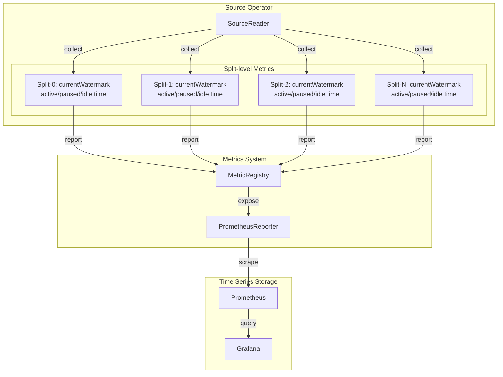
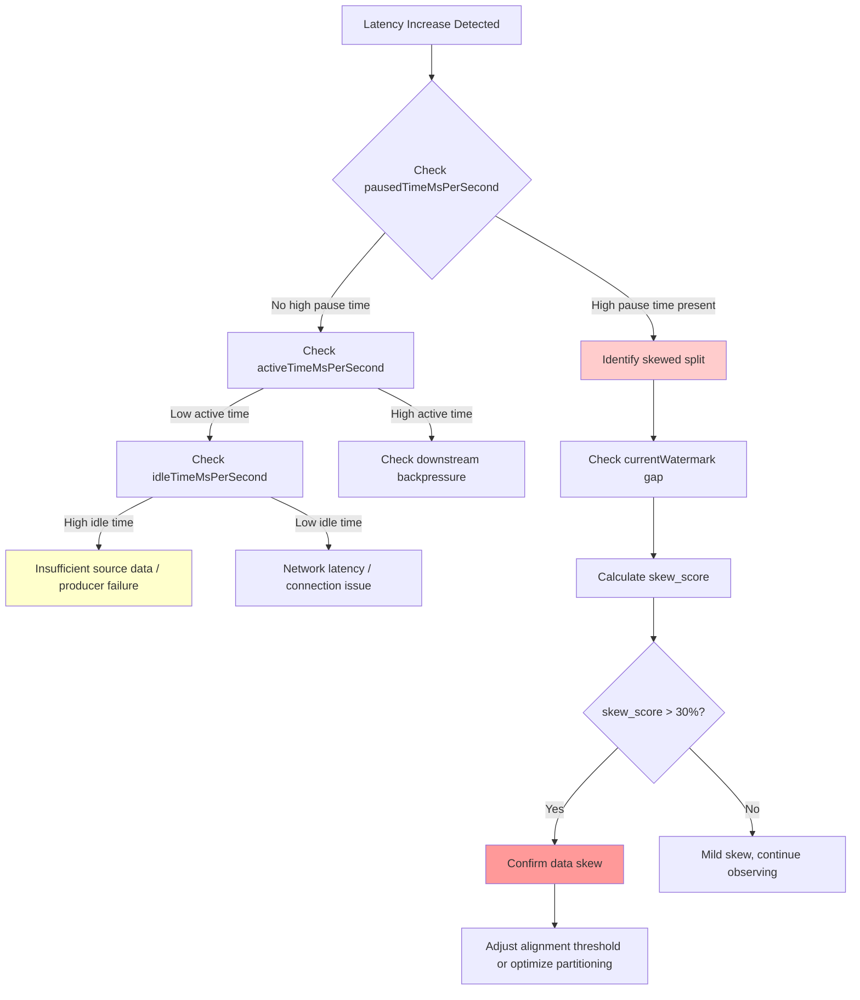
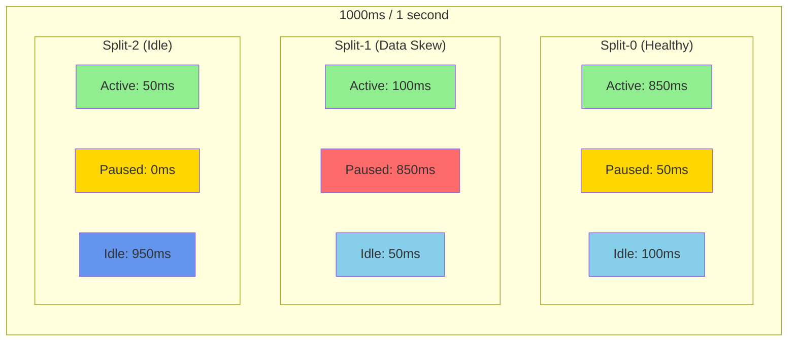

# Flink 2.1 Split-level Watermark Metrics - Fine-Grained Observability

> Stage: Flink | Prerequisites: [metrics-and-monitoring.md](./metrics-and-monitoring.md), [time-semantics-and-watermark.md](../../02-core/time-semantics-and-watermark.md) | Formalization Level: L3

## 1. Definitions

### Def-F-15-09: Split-level Metrics

Split-level metrics are fine-grained source connector metrics introduced in Flink 2.1, providing **split-level** real-time state visibility:

**Definition**: Let source $S$ consist of $k$ splits $\{split_1, split_2, ..., split_k\}$. Split-level metrics are time-series data independently collected for each $split_i$:

$$
M_{split}(split_i, t) = \langle w_i(t), a_i(t), p_i(t), idle_i(t) \rangle
$$

Where:

- $w_i(t)$: Current Watermark value of split $split_i$ at time $t$
- $a_i(t)$: Active time of the split at time $t$
- $p_i(t)$: Paused time of the split at time $t$
- $idle_i(t)$: Idle time of the split at time $t$

Unlike traditional operator-level metrics, split-level metrics can reveal the behavioral characteristics of **individual splits** rather than aggregated averages.

### Def-F-15-10: Watermark Progress Metrics

Watermark progress metrics describe how Event Time advances through the processing pipeline:

**Definition**: For source split $split_i$, its Watermark progress is defined as:

$$
WP(split_i, t) = \min_{e \in B_i(t)} \{ T_{event}(e) \}
$$

Where:

- $B_i(t)$: The pending-record buffer of split $split_i$ at time $t$
- $T_{event}(e)$: The event timestamp of record $e$

The global Watermark is determined by taking the minimum Watermark across all splits:

$$
WP_{global}(t) = \min_{i=1}^{k} WP(split_i, t)
$$

**New Metric in Flink 2.1**: `currentWatermark` directly exposes the $WP(split_i, t)$ value for each split.

### Def-F-15-11: Active Time / Paused Time / Idle Time

**Definition**: The time distribution of a split's lifecycle state consists of three mutually exclusive and exhaustive time components:

Let $\Delta t$ be the sampling period (typically 1 second). Then for split $split_i$ during $[t, t+\Delta t]$, the state times are:

$$
\Delta t = T_{active}^{(i)} + T_{paused}^{(i)} + T_{idle}^{(i)}
$$

**Active Time**:
$$
T_{active}^{(i)} = \int_{t}^{t+\Delta t} \mathbb{1}_{[state=READING]}(\tau) \, d\tau
$$
The time during which the split is reading records from the data source and sending them downstream.

**Paused Time**:
$$
T_{paused}^{(i)} = \int_{t}^{t+\Delta t} \mathbb{1}_{[state=PAUSED]}(\tau) \, d\tau
$$
The time during which the split is paused from reading due to Watermark alignment policy (used to handle data skew).

**Idle Time**:
$$
T_{idle}^{(i)} = \int_{t}^{t+\Delta t} \mathbb{1}_{[state=IDLE]}(\tau) \, d\tau
$$
The time during which the split is idle because no new data is available.

---

## 2. Properties

### Prop-F-15-05: Time Distribution Normalization

**Proposition**: For any split $split_i$ and any sampling period $\Delta t$, active time, paused time, and idle time satisfy:

$$
activeTimeMsPerSecond + pausedTimeMsPerSecond + idleTimeMsPerSecond = 1000 \, (ms)
$$

**Proof Sketch**:

By the definition of Def-F-15-11, the three states form a complete event group:

- A split can only be in one of three states at any moment: `READING`, `PAUSED`, or `IDLE`
- According to the state machine design, state transitions are deterministic and mutually exclusive
- Therefore, the time integral covers the entire sampling period:

$$
\begin{aligned}
&\int_{t}^{t+\Delta t} \left[ \mathbb{1}_{[READING]}(\tau) + \mathbb{1}_{[PAUSED]}(\tau) + \mathbb{1}_{[IDLE]}(\tau) \right] d\tau \\
=& \int_{t}^{t+\Delta t} 1 \, d\tau = \Delta t = 1000ms
\end{aligned}
$$

∎

### Prop-F-15-06: Monotonicity of Paused Time Under Watermark Alignment

**Proposition**: When Watermark alignment is enabled, the paused time of a leading split is positively correlated with its Watermark lead:

$$
split_i \text{ leads} \Rightarrow T_{paused}^{(i)} \propto \left( WP(split_i, t) - WP_{global}(t) \right)
$$

**Proof Sketch**:

1. Let $WP_{global}(t) = \min_j WP(split_j, t)$, i.e., the Watermark of the slowest split.
2. When $WP(split_i, t) - WP_{global}(t) > threshold$, the alignment policy triggers.
3. The source connector pauses read task assignment to $split_i$, and $T_{paused}^{(i)}$ begins to accumulate.
4. The larger the lead gap, the longer it takes to wait for other splits to catch up.

Therefore, paused time reflects the Watermark gap between splits and is a quantitative indicator of data skew.

### Prop-F-15-07: Watermark Progress Freeze on Idle Detection

**Proposition**: When a split enters the idle state, its Watermark progress is frozen and no longer affects the global Watermark:

$$
T_{idle}^{(i)} > 0 \Rightarrow WP(split_i, t) = WP(split_i, t_{idle\_start})
$$

**Proof Sketch**:

1. The idle state is triggered by `SourceReader#reportIdle()`.
2. Idle splits are excluded from global Watermark computation:

$$
WP_{global}^{\prime}(t) = \min_{j: T_{idle}^{(j)} = 0} WP(split_j, t)
$$

1. This mechanism prevents slow or stalled splits from blocking Watermark progress for the entire pipeline.

---

## 3. Relations

### 3.1 Split-level Metrics vs. Traditional Metrics

| Dimension | Operator-level Metrics | Split-level Metrics (Flink 2.1) |
|-----------|------------------------|---------------------------------|
| **Granularity** | Aggregated across entire Source operator | Independent per split |
| **Watermark Visibility** | Global Watermark only | Per-split Watermark + Global |
| **Time Decomposition** | None | Active / Paused / Idle three states |
| **Data Skew Detection** | Indirect (inferred via latency) | Direct (quantified via paused time) |
| **Collection Overhead** | Low | Medium (proportional to number of splits) |
| **Applicable Scenarios** | Health monitoring | Problem diagnosis and optimization |

### 3.2 Split-level Metrics Septuple Definition

The 7 new split-level metrics in Flink 2.1 constitute a complete split state description:

```
┌─────────────────────────────────────────────────────────────┐
│                    Split State Snapshot                     │
├─────────────────────────────────────────────────────────────┤
│  currentWatermark          →  Current Watermark (epoch ms)  │
│  activeTimeMsPerSecond     →  Active time per sec (0-1000ms)│
│  pausedTimeMsPerSecond     →  Paused time per sec (0-1000ms)│
│  idleTimeMsPerSecond       →  Idle time per sec (0-1000ms)  │
│  accumulatedActiveTimeMs   →  Accumulated active time (ms)  │
│  accumulatedPausedTimeMs   →  Accumulated paused time (ms)  │
│  accumulatedIdleTimeMs     →  Accumulated idle time (ms)    │
└─────────────────────────────────────────────────────────────┘
```

### 3.3 Metrics Correlation Matrix

| Diagnostic Goal | Key Metric Combination | Relationship Description |
|-----------------|------------------------|--------------------------|
| Data Skew | `pausedTimeMsPerSecond` + `currentWatermark` | Long pause time + leading Watermark indicates skew |
| Source Read Bottleneck | `activeTimeMsPerSecond` vs. expected throughput | High active time but low throughput indicates read bottleneck |
| Idle Source | `idleTimeMsPerSecond` > threshold | High idle time ratio indicates insufficient data inflow |
| Watermark Stalled | `currentWatermark` unchanged + `pausedTimeMsPerSecond`=0 | No progress and no pause indicates source issue |

---

## 4. Argumentation

### 4.1 Data Skew Detection Methodology Comparison

#### Traditional Method: Latency-Based Inference

**Principle**: Infer data skew by observing downstream operator `records-lag-max` or output latency.

**Limitations**:

- **Lagging**: Latency is an indirect result of skew; by the time it is detected, skew has already affected the business.
- **Ambiguity**: Unable to distinguish between data skew and insufficient source read capacity.
- **Missing Granularity**: Can only pinpoint to the operator level, not the specific split.

#### Flink 2.1 Method: Paused-Time Quantification

**Principle**: Directly measure the time each split is forced to pause due to Watermark alignment.

**Advantages**:

- **Real-time**: Paused time accumulates immediately when the alignment policy triggers.
- **Precision**: Quantifies the severity of skew (millisecond-level accuracy).
- **Locatable**: Directly points to the specific split (e.g., a specific Kafka partition).

**Skew Severity Score**:

$$
SkewScore(split_i) = \frac{accumulatedPausedTimeMs}{accumulatedActiveTimeMs + accumulatedPausedTimeMs} \times 100\%
$$

| Score Range | Skew Level | Recommended Action |
|-------------|------------|--------------------|
| 0-10% | Normal | No intervention needed |
| 10-30% | Mild Skew | Monitor and observe |
| 30-50% | Moderate Skew | Consider adjusting alignment threshold |
| >50% | Severe Skew | Must optimize data distribution |

### 4.2 Relationship Between Watermark Alignment Policy and Paused Time

Flink's Watermark alignment mechanism (`watermarkAlignment`) controls paused time through the following logic:

```
if (splitWatermark - globalWatermark > maxWatermarkDrift):
    pauseSplit(split)      # Pause reading, pausedTime starts accumulating
    waitForGlobalAdvance() # Wait for global Watermark to catch up
else:
    resumeSplit(split)     # Resume reading, activeTime accumulates
```

**Configuration Parameter Effects on Paused Time**:

| Parameter | Description | Effect on Paused Time |
|-----------|-------------|-----------------------|
| `alignment.max-watermark-drift` | Maximum allowed Watermark gap | Smaller value → more frequent pauses |
| `alignment.max-split-watermark-gap` | Maximum gap between splits | Affects trigger condition |

### 4.3 Idle Source Detection Mechanism

Idle source identification relies on the `idleTimeout` configuration:

```
if (noRecordsFetchedFor(split, idleTimeout)):
    markIdle(split)        # Mark as idle, idleTime starts accumulating
    excludeFromAlignment(split)  # Do not participate in Watermark alignment
```

**Essential Difference Between Idle and Paused**:

- **Idle**: The data source has no data to read (external factor)
- **Paused**: Data exists but is intentionally not read (internal control policy)

---

## 5. Engineering Argument

### 5.1 Prometheus Metrics Exposure Configuration

Flink 2.1 exposes split-level metrics via `PrometheusReporter`. Configuration is as follows:

```yaml
# flink-conf.yaml
metrics.reporters: prom
metrics.reporter.prom.class: org.apache.flink.metrics.prometheus.PrometheusReporter
metrics.reporter.prom.port: 9249

# Enable split-level metric collection
metrics.scope.source.split: "<host>.<job_name>.<source_id>.<split_id>"
```

**Exposed Metric Format**:

```
flink_taskmanager_job_task_source_split_currentWatermark{split_id="partition-0"}
flink_taskmanager_job_task_source_split_activeTimeMsPerSecond{split_id="partition-0"}
flink_taskmanager_job_task_source_split_pausedTimeMsPerSecond{split_id="partition-0"}
flink_taskmanager_job_task_source_split_idleTimeMsPerSecond{split_id="partition-0"}
flink_taskmanager_job_task_source_split_accumulatedActiveTimeMs{split_id="partition-0"}
flink_taskmanager_job_task_source_split_accumulatedPausedTimeMs{split_id="partition-0"}
flink_taskmanager_job_task_source_split_accumulatedIdleTimeMs{split_id="partition-0"}
```

**Argument**:

- Using the `split_id` label enables PromQL split-level aggregation and filtering
- Compliant with OpenMetrics standard, compatible with Grafana and other visualization tools

### 5.2 Grafana Dashboard Configuration

**Split-level Watermark Monitoring Panel**:

```json
{
  "title": "Split-level Watermark Progress",
  "type": "timeseries",
  "targets": [
    {
      "expr": "flink_taskmanager_job_task_source_split_currentWatermark",
      "legendFormat": "{{split_id}}",
      "refId": "A"
    }
  ],
  "fieldConfig": {
    "unit": "dateTimeAsIso",
    "min": 0,
    "custom": {
      "lineWidth": 2,
      "fillOpacity": 10
    }
  }
}
```

**Time Distribution Stacked Chart**:

```json
{
  "title": "Split Time Distribution (ms/s)",
  "type": "barchart",
  "targets": [
    {
      "expr": "flink_taskmanager_job_task_source_split_activeTimeMsPerSecond",
      "legendFormat": "Active - {{split_id}}"
    },
    {
      "expr": "flink_taskmanager_job_task_source_split_pausedTimeMsPerSecond",
      "legendFormat": "Paused - {{split_id}}"
    },
    {
      "expr": "flink_taskmanager_job_task_source_split_idleTimeMsPerSecond",
      "legendFormat": "Idle - {{split_id}}"
    }
  ],
  "fieldConfig": {
    "stacking": { "mode": "normal" },
    "unit": "ms"
  }
}
```

### 5.3 Alert Rule Design

**Data Skew Alert**:

```yaml
# Prometheus alert rules
groups:
  - name: flink_split_level_alerts
    rules:
      - alert: FlinkSplitHighPausedTime
        expr: |
          (
            flink_taskmanager_job_task_source_split_pausedTimeMsPerSecond
            /
            (flink_taskmanager_job_task_source_split_activeTimeMsPerSecond
             + flink_taskmanager_job_task_source_split_pausedTimeMsPerSecond)
          ) > 0.3
        for: 5m
        labels:
          severity: warning
        annotations:
          summary: "Flink Source Split experiencing data skew"
          description: "Split {{ $labels.split_id }} has {{ $value | humanizePercentage }} paused time due to watermark alignment"
```

**Idle Source Alert**:

```yaml
      - alert: FlinkSplitIdleTimeout
        expr: |
          flink_taskmanager_job_task_source_split_idleTimeMsPerSecond > 900
        for: 10m
        labels:
          severity: info
        annotations:
          summary: "Flink Source Split is idle"
          description: "Split {{ $labels.split_id }} has been idle for extended period"
```

**Watermark Stalled Alert**:

```yaml
      - alert: FlinkSplitWatermarkStalled
        expr: |
          (
            changes(flink_taskmanager_job_task_source_split_currentWatermark[5m]) == 0
            and
            flink_taskmanager_job_task_source_split_pausedTimeMsPerSecond == 0
            and
            flink_taskmanager_job_task_source_split_activeTimeMsPerSecond > 100
          )
        for: 3m
        labels:
          severity: critical
        annotations:
          summary: "Flink Source Split watermark is stalled"
          description: "Split {{ $labels.split_id }} is active but watermark not advancing"
```

---

## 6. Examples

### 6.1 Kafka Split Watermark Monitoring

**Scenario**: Kafka Topic has 12 partitions, read by a Flink job using `FlinkKafkaConsumer`.

**Monitoring Goal**: Detect which partition is producing data skew.

**PromQL Queries**:

```promql
# Current Watermark of each partition
flink_taskmanager_job_task_source_split_currentWatermark{job="flink-job", source_id="KafkaSource"}

# Calculate Watermark gap (difference from minimum)
(
  flink_taskmanager_job_task_source_split_currentWatermark
  -
  min by (source_id) (flink_taskmanager_job_task_source_split_currentWatermark)
) / 1000  # Convert to seconds

# Paused time ratio per partition (skew indicator)
(
  flink_taskmanager_job_task_source_split_accumulatedPausedTimeMs
  /
  (
    flink_taskmanager_job_task_source_split_accumulatedActiveTimeMs
    + flink_taskmanager_job_task_source_split_accumulatedPausedTimeMs
  )
) * 100
```

**Diagnostic Output Example**:

```
split_id        | currentWatermark | pausedTimeMsPerSecond | skew_score
----------------|------------------|-----------------------|------------
partition-0     | 1743580800000    | 50                    | 5%
partition-1     | 1743580800000    | 45                    | 4%
partition-2     | 1743584400000    | 850                   | 85%  <-- Severe skew
partition-3     | 1743580800000    | 60                    | 6%
...
```

**Conclusion**: `partition-2`'s Watermark leads other partitions by 1 hour, with 85% paused time ratio, indicating severe data skew.

### 6.2 Data Skew Diagnosis Case

**Symptom**: User reports window computation latency continuously increasing, but Kafka consumer group lag is normal.

**Diagnosis Steps**:

1. **Check global Watermark**: Found global Watermark advancing slowly

```promql
min(flink_taskmanager_job_task_source_split_currentWatermark)
```

1. **Check each split's Watermark**: Found most splits normal, but `partition-5` is stalled

```promql
flink_taskmanager_job_task_source_split_currentWatermark
```

1. **Analyze time distribution**: Found `partition-5`'s `idleTimeMsPerSecond` is close to 1000ms

```promql
flink_taskmanager_job_task_source_split_idleTimeMsPerSecond{split_id="partition-5"}
```

1. **Root cause**: The data producer for this partition has failed, with no new data being written

**Resolution**:

- Check upstream data producer status
- Consider enabling idle timeout to auto-advance this split's Watermark
- Or adjust Watermark policy to use processing time for this split

### 6.3 Source Read Performance Analysis

**Scenario**: Evaluate Kafka Source read efficiency.

**Analysis Queries**:

```promql
# Active time ratio per split (read efficiency)
(
  flink_taskmanager_job_task_source_split_activeTimeMsPerSecond / 1000
) * 100

# Evaluate efficiency combined with read rate
flink_taskmanager_job_task_source_split_activeTimeMsPerSecond
and
flink_taskmanager_job_task_operator_numRecordsInPerSecond
```

**Performance Interpretation**:

| activeTime Ratio | Throughput | Interpretation |
|------------------|------------|----------------|
| High (>80%) | High | High read efficiency, resources fully utilized |
| High (>80%) | Low | Possible backpressure, downstream processing slow |
| Low (<20%) | Low | Insufficient source data or network latency |
| Medium (20-80%) | Medium | Normal fluctuation range |

---

## 7. Visualizations

### 7.1 Split-level Metrics Architecture Diagram

Position of split-level metrics in the Flink monitoring system:



### 7.2 Data Skew Diagnosis Decision Tree

Complete process for diagnosing data skew using split-level metrics:



### 7.3 Time Distribution Visualization Example

Conceptual stacked area chart of split-level time distribution:



---

## 8. References
