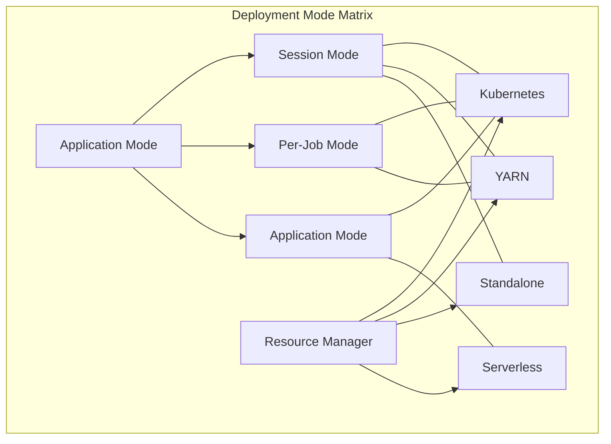
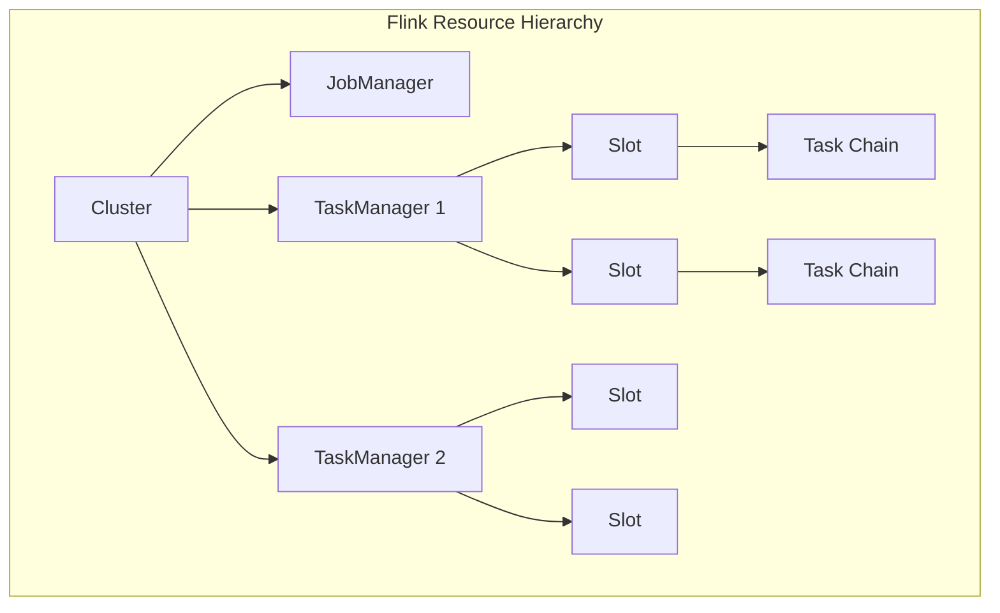
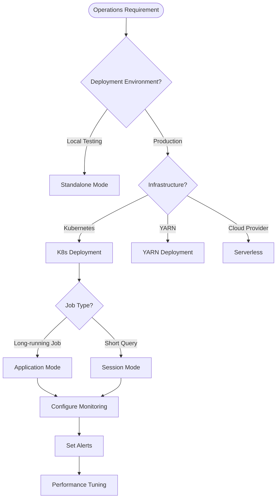
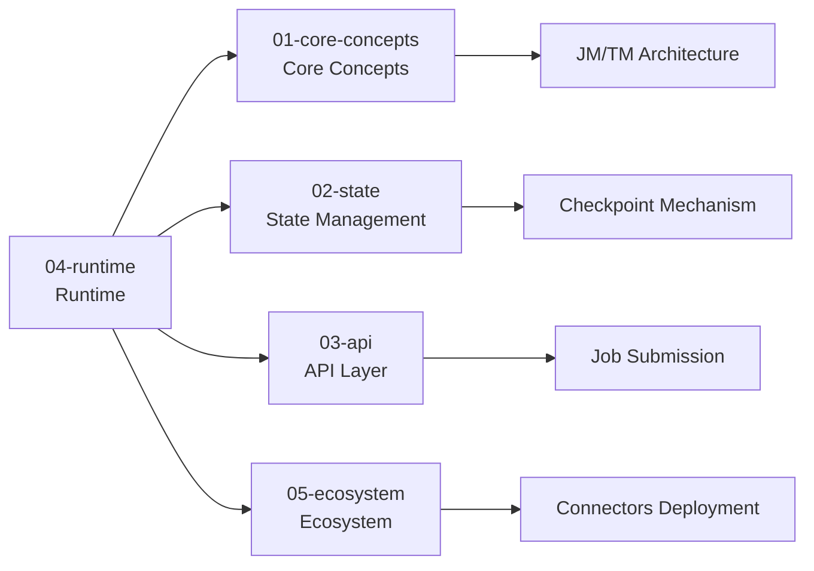
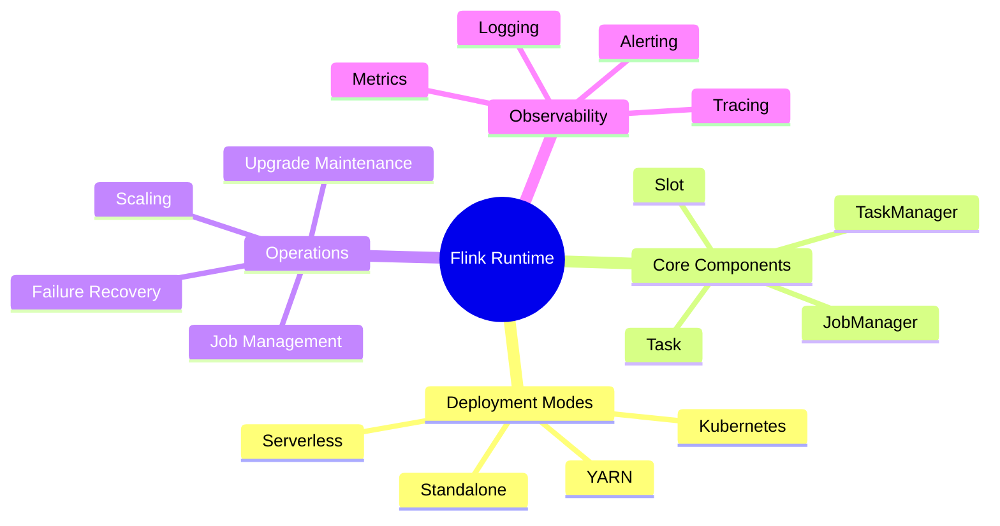

# Flink Runtime and Operations Overview

> Stage: Flink | Prerequisites: [Flink/01-concepts/](../01-concepts/) | Formalization Level: L4

This document is the authoritative navigation center for the Flink runtime layer, comprehensively covering the deployment, operations, and observability of Flink jobs. From core concepts of distributed execution (JobManager, TaskManager, Slot, Task) to production deployment modes, operational procedures, and monitoring systems, this directory provides a complete technical reference for Flink platform engineers and SREs.

---

## Directory Structure Navigation

```
04-runtime/
├── README.md                          # This file - Runtime Overview
├── 04.01-deployment/                  # Deployment modes and architectures
│   ├── kubernetes-deployment.md
│   ├── flink-kubernetes-operator-deep-dive.md
│   ├── flink-serverless-architecture.md
│   └── evolution/                     # Deployment evolution topics
├── 04.02-operations/                  # Operations guides
│   ├── production-checklist.md
│   └── rest-api-complete-reference.md
└── 04.03-observability/               # Observability system
    ├── flink-observability-complete-guide.md
    ├── metrics-and-monitoring.md
    ├── distributed-tracing.md
    └── evolution/                     # Observability evolution
```

---

## 1. Definitions

### Def-F-04-01: Flink Runtime Architecture

The Flink runtime is a **distributed data stream processing engine** that adopts the Master-Worker architecture pattern:

```
┌─────────────────────────────────────────────────────────────┐
│                        Flink Runtime                        │
├─────────────────────────────────────────────────────────────┤
│  ┌─────────────────┐         ┌─────────────────────────┐   │
│  │   JobManager    │◄───────►│     TaskManager 1       │   │
│  │   (Master)      │         │   ┌─────┬─────┬─────┐   │   │
│  │  ┌───────────┐  │         │   │Slot │Slot │Slot │   │   │
│  │  │Dispatcher │  │         │   │ 1   │ 2   │ 3   │   │   │
│  │  │JobMaster  │  │         │   └──┬──┴──┬──┴──┬──┘   │   │
│  │  │RM         │  │         └──────┴─────┴─────┴──────┘   │
│  │  └───────────┘  │                   ▲                   │
│  └─────────────────┘                   │                   │
│           ▲                            │                   │
│           │         ┌──────────────────┴──────────────┐   │
│           └─────────┤       TaskManager 2 ... N       │   │
│                     └─────────────────────────────────┘   │
└─────────────────────────────────────────────────────────────┘
```

### Def-F-04-02: Core Runtime Components

| Component | Role | Responsibility |
|-----------|------|----------------|
| **JobManager (JM)** | Control Node | Job scheduling, Checkpoint coordination, failure recovery |
| **TaskManager (TM)** | Worker Node | Executing specific Tasks, managing local Slot resources |
| **Slot** | Resource Unit | The smallest resource allocation unit on a TM, can run one Task chain |
| **Task** | Execution Unit | Parallel instance of an operator, actually executes computation logic |

---

## 2. Deployment Modes in Detail

### 2.1 Deployment Architecture Overview

Flink supports multiple deployment modes to adapt to different infrastructure and operational requirements:



### 2.2 Deployment Mode Comparison

| Feature | Session Mode | Per-Job Mode | Application Mode |
|---------|--------------|--------------|------------------|
| **Cluster Lifecycle** | Long-running | Created/destroyed with job | Created/destroyed with application |
| **Resource Isolation** | Shared | Exclusive | Exclusive |
| **Startup Latency** | Low | High | Medium |
| **Resource Utilization** | High | Low | Medium |
| **Applicable Scenarios** | Short queries/high-frequency submission | Long jobs/strict isolation | Microservice-style applications |

### 2.3 Kubernetes Deployment (Recommended)

**Architecture Advantages**:

- Native cloud environment support
- Declarative configuration management
- Auto-scaling capabilities
- Deep integration with cloud ecosystem

**Core Documents**:

- 📘 [Kubernetes Deployment Production Guide](./04.01-deployment/kubernetes-deployment-production-guide.md) - Production environment best practices
- 📘 [Flink Kubernetes Operator Deep Dive](./04.01-deployment/flink-kubernetes-operator-deep-dive.md) - Declarative job management
- 📘 [Flink Kubernetes Autoscaler Deep Dive](./04.01-deployment/flink-kubernetes-autoscaler-deep-dive.md) - Auto-scaling mechanisms
- 🆕 [Flink Serverless Architecture](./04.01-deployment/flink-serverless-architecture.md) - Serverless deployment solution

### 2.4 Deployment Evolution Topics

The `04.01-deployment/evolution/` directory contains the evolution of deployment technologies:

| Document | Topic | Value |
|----------|-------|-------|
| [standalone-deploy.md](./04.01-deployment/evolution/standalone-deploy.md) | Standalone cluster deployment | Traditional deployment mode |
| [yarn-deploy.md](./04.01-deployment/evolution/yarn-deploy.md) | YARN integration | Big data ecosystem compatibility |
| [k8s-deploy.md](./04.01-deployment/evolution/k8s-deploy.md) | Kubernetes evolution | Cloud-native transformation path |
| [serverless-deploy.md](./04.01-deployment/evolution/serverless-deploy.md) | Serverless architecture | Cost optimization solution |
| [autoscaling-evolution.md](./04.01-deployment/evolution/autoscaling-evolution.md) | Autoscaling evolution | Elastic capability improvement |
| [ha-evolution.md](./04.01-deployment/evolution/ha-evolution.md) | High availability evolution | Reliability assurance |

---

## 3. Operations Guide

### 3.1 Operations Workflow


### 3.2 Core Operations Scenarios

| Scenario | Key Operations | Reference Document |
|----------|----------------|--------------------|
| **Job Deployment** | JAR submission, SQL submission, image deployment | [Kubernetes Deployment Guide](./04.01-deployment/kubernetes-deployment.md) |
| **State Management** | Savepoint, Checkpoint operations | [Flink/02-core/](../02-core/) |
| **Scaling** | Parallelism adjustment, resource configuration | [Autoscaler Deep Dive](./04.01-deployment/flink-kubernetes-autoscaler-deep-dive.md) |
| **Failure Recovery** | Restart strategy, troubleshooting | [Production Checklist](./04.02-operations/production-checklist.md) |
| **Version Upgrade** | State compatibility, rolling upgrade | [Upgrade Strategy](./04.01-deployment/evolution/upgrade-strategy.md) |

### 3.3 Production Checklist

The [Production Checklist](./04.02-operations/production-checklist.md) provides a complete checklist before job go-live:

```markdown
□ Resource Configuration Check
  □ TaskManager memory configuration
  □ Network buffer settings
  □ Checkpoint parameter tuning

□ Reliability Check
  □ Checkpoint enabled and interval
  □ Restart strategy configuration
  □ State backend selection

□ Observability Check
  □ Metrics reporting configuration
  □ Log aggregation settings
  □ Alert rule definitions

□ Security Check
  □ Authentication and authorization configuration
  □ Network security policies
  □ Sensitive information masking
```

### 3.4 REST API Complete Reference

The [REST API Complete Reference](./04.02-operations/rest-api-complete-reference.md) contains all runtime management interfaces:

| API Category | Functional Coverage |
|--------------|---------------------|
| Cluster Management | Configuration view, Dashboard info |
| Job Management | Submit, cancel, trigger Savepoint |
| Checkpoint | Trigger, view status, configuration management |
| JAR Management | Upload, run, delete job packages |

---

## 4. Observability System

### 4.1 Three Pillars of Observability

```
┌─────────────────────────────────────────────────────────┐
│                 Flink Observability System              │
├─────────────────────┬───────────────────────────────────┤
│     Metrics         │          Logging                  │
│  (Quantitative)     │         (Structured Logs)         │
├─────────────────────┼───────────────────────────────────┤
│ • System metrics    │ • Application logs                │
│ • Business metrics  │ • Audit logs                      │
│ • Latency/Throughput│ • GC logs                         │
├─────────────────────┴───────────────────────────────────┤
│                   Distributed Tracing                   │
├─────────────────────────────────────────────────────────┤
│ • End-to-end latency analysis                           │
│ • Call chain visualization                              │
│ • Performance bottleneck location                       │
└─────────────────────────────────────────────────────────┘
```

### 4.2 Metrics Monitoring System

**Core Metrics Categories**:

| Category | Key Metrics | Monitoring Significance |
|----------|-------------|-------------------------|
| **JobManager** | Active jobs, Task slot occupancy rate | Cluster load status |
| **TaskManager** | CPU/memory usage, GC time | Node health status |
| **Task** | Record processing rate, Watermark latency | Job performance |
| **Checkpoint** | Duration, failure rate, size | Fault tolerance health |
| **Network** | Backpressure metrics, buffer usage | Data stream health |

**Core Documents**:

- 📘 [Flink Observability Complete Guide](./04.03-observability/flink-observability-complete-guide.md)
- 📊 [Metrics and Monitoring Guide](./04.03-observability/metrics-and-monitoring.md)
- 🔍 [Distributed Tracing in Practice](./04.03-observability/distributed-tracing.md)

### 4.3 OpenTelemetry Integration

Flink supports the modern cloud-native observability standard OpenTelemetry:

- 📘 [OpenTelemetry Streaming Observability](./04.03-observability/opentelemetry-streaming-observability.md)
- 📘 [Flink OpenTelemetry Integration](./04.03-observability/flink-opentelemetry-observability.md)

**Integration Value**:

- Unified telemetry data format
- Compatible with Prometheus, Grafana, Jaeger ecosystem
- Reduced vendor lock-in

### 4.4 Observability Evolution

The `04.03-observability/evolution/` directory contains the evolution of monitoring technologies:

| Document | Topic | Evolution Direction |
|----------|-------|---------------------|
| [metrics-evolution.md](./04.03-observability/evolution/metrics-evolution.md) | Metrics system evolution | Pull→Push→Adaptive sampling |
| [logging-evolution.md](./04.03-observability/evolution/logging-evolution.md) | Logging system evolution | Text→Structured→Trace correlation |
| [tracing-evolution.md](./04.03-observability/evolution/tracing-evolution.md) | Tracing system evolution | Optional→Native→Auto-instrumentation |
| [alerting-evolution.md](./04.03-observability/evolution/alerting-evolution.md) | Alerting system evolution | Threshold→Intelligent anomaly detection |

---

## 5. Resource Management and Scheduling

### 5.1 Resource Model



### 5.2 Slot and Task Mapping

**Slot Sharing Mechanism**:

- Different operators of the same job can share a Slot (if in the same SlotSharingGroup)
- Reduces network transmission overhead
- Improves resource utilization

**Configuration Parameters**:

```yaml
taskmanager.numberOfTaskSlots: 4  # Slots per TM
parallelism.default: 2            # Default parallelism
```

### 5.3 Scheduling Strategy Evolution

| Version | Scheduling Feature | Description |
|---------|--------------------|-------------|
| 1.14 | Fine-grained resource management | Slot-level resource configuration |
| 1.17 | Adaptive scheduler | Dynamic parallelism adjustment |
| 1.19 | Unified stream-batch scheduling | Unified scheduling semantics |
| 2.0+ | Cloud-native scheduling | Deep integration with K8s scheduler |

---

## 6. Quick Navigation and Decision Making

### 6.1 Operations Scenario Decision Tree



### 6.2 Subdirectory Core Content Overview

| Subdirectory | Core Content | Target Audience |
|--------------|--------------|-----------------|
| **04.01-deployment** | K8s/YARN/Standalone/Serverless deployment guides | Platform engineers |
| **04.02-operations** | Production checklist, REST API reference | SRE, Operations engineers |
| **04.03-observability** | Metrics, Logging, Tracing, Alerting | Observability engineers |

---

## 7. Production Environment Best Practices

### 7.1 Deployment Architecture Recommendations

```yaml
# Production-grade K8s deployment configuration example
apiVersion: flink.apache.org/v1beta1
kind: FlinkDeployment
metadata:
  name: production-job
spec:
  image: flink:2.0.0-scala_2.12
  flinkVersion: v2.0
  jobManager:
    resource:
      memory: 4Gi
      cpu: 2
  taskManager:
    resource:
      memory: 8Gi
      cpu: 4
    replicas: 3
  job:
    jarURI: local:///opt/flink/examples/streaming/StateMachineExample.jar
    parallelism: 6
    upgradeMode: savepoint
    state: running
```

### 7.2 Key Configuration Parameters

| Configuration Item | Recommended Value | Description |
|--------------------|-------------------|-------------|
| `state.backend` | rocksdb | Large state scenarios |
| `state.checkpoint-storage` | filesystem | Reliable storage |
| `execution.checkpointing.interval` | 1-10min | Adjust according to SLA |
| `restart-strategy` | fixed-delay | Fixed delay retry |
| `taskmanager.memory.network.fraction` | 0.15 | Network buffers |

### 7.3 Troubleshooting Checklist

| Symptom | Possible Cause | Investigation Direction |
|---------|----------------|-------------------------|
| Checkpoint timeout | Large state / network latency | Check state size, network config |
| Backpressure | Slow downstream processing | View backPressureRatio metrics |
| OOM | Insufficient memory config | Tune memory parameters, check state growth |
| Job failure | Code exception / insufficient resources | Check exception logs, resource usage |

---

## 8. Relations with Other Directories



---

## 9. Visualization Summary



---

## 10. Related Resources

### 10.1 Official Documentation

- 🔗 [Flink Deployment Docs](https://nightlies.apache.org/flink/flink-docs-stable/docs/deployment/overview/)
- 🔗 [Flink Configuration Docs](https://nightlies.apache.org/flink/flink-docs-stable/docs/deployment/config/)
- 🔗 [Flink Monitoring Docs](https://nightlies.apache.org/flink/flink-docs-stable/docs/ops/monitoring/)

### 10.2 Community Resources

- 🔗 [Flink Kubernetes Operator](https://nightlies.apache.org/flink/flink-kubernetes-operator-docs-stable/)
- 🔗 [Flink Best Practices Repository](https://github.com/apache/flink-playgrounds)

---

## References
