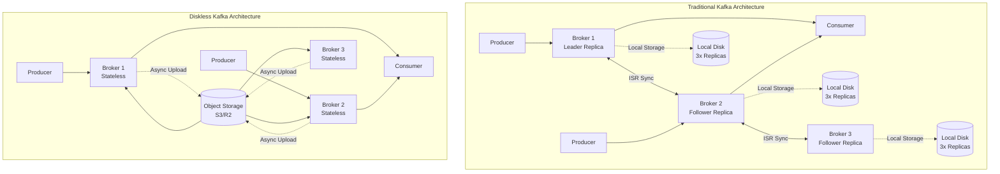
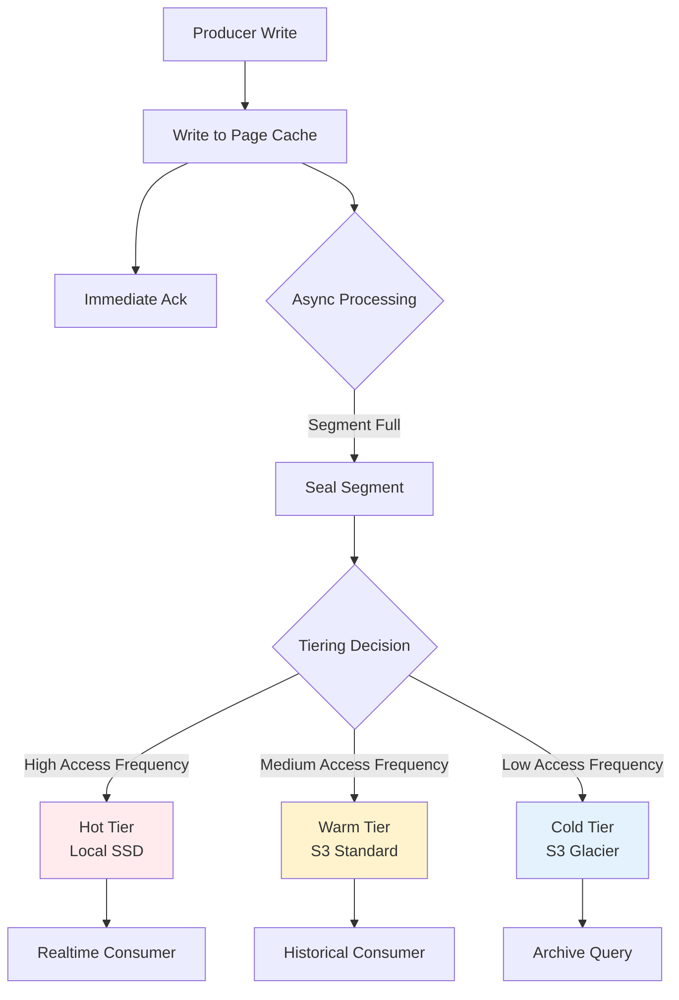
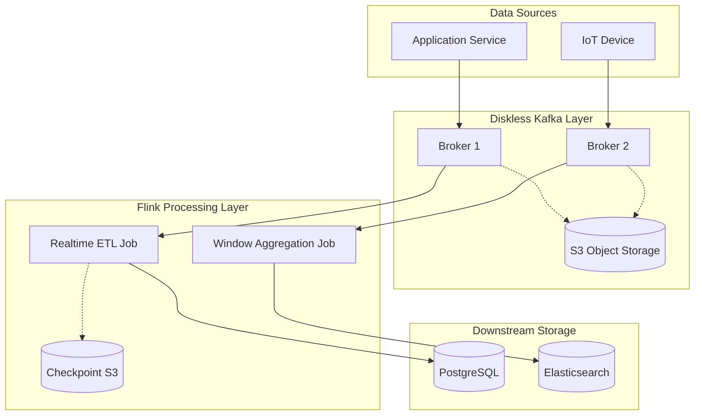

# Diskless Kafka and Flink Integration Deep Dive

> **Stage**: Flink/05-ecosystem | **Prerequisites**: [diskless-kafka-cloud-native.md](./diskless-kafka-cloud-native.md) | **Formalization Level**: L4

---

## 1. Definitions

### Def-F-DK-01: Diskless Kafka

**Definition**: Diskless Kafka is an architectural paradigm that completely offloads the persistent storage responsibility of Kafka Brokers to cloud object storage (S3, GCS, Azure Blob), with Brokers retaining only compute and network I/O functions.

$$
\mathcal{DK} = \langle B_{stateless}, S_{object}, C_{cache}, \phi_{tier} \rangle
$$

Where:

- B_stateless: Stateless Broker set, responsible for protocol processing and compute
- S_object: Cloud object storage layer, assuming persistence responsibility
- C_cache: Local cache layer (memory/temporary SSD), hot data acceleration
- φ_tier: Tiered storage mapping function, defining data migration strategy between cache and object storage

**Major Implementations**:

- **WarpStream**: Commercial Diskless Kafka service, Kafka protocol compatible
- **AutoMQ**: Open source Diskless Kafka implementation, based on KIP-1150
- **Apache Kafka 3.7+**: Built-in Tiered Storage

### Def-F-DK-02: Tiered Storage Semantics

**Definition**: Tiered storage model defines data lifecycle management strategy, automatically migrating data between performance tier and cost tier.

$$
\mathcal{T} = \langle L_{hot}, L_{warm}, L_{cold}, \tau_{migration}, \rho_{cost} \rangle
$$

Where:

- L_hot: Hot tier (local memory/SSD), recently written data
- L_warm: Warm tier (object storage standard), historical data loaded on demand
- L_cold: Cold tier (object storage archive), compliance-retained data
- τ_migration: Data migration trigger function (time/access pattern driven)
- ρ_cost: Cross-tier access cost function

---

## 2. Diskless Kafka Architecture Deep Dive

### 2.1 Traditional Kafka vs Diskless Kafka



### 2.2 WarpStream vs AutoMQ Comparison

| Feature | WarpStream | AutoMQ | Kafka 3.7+ Tiered Storage |
|---------|-----------|--------|---------------------------|
| **Deployment Mode** | Fully Managed SaaS | Self-Hosted/Cloud Marketplace | Self-Hosted |
| **Protocol Compatibility** | 100% Kafka Protocol | 100% Kafka Protocol | Native Kafka |
| **Object Storage** | AWS S3 Only | S3/GCS/Azure | Pluggable RSM |
| **Latency Guarantee** | < 10ms P99 | < 20ms P99 | < 15ms P99 |
| **Cost Model** | Pay-as-you-go | Open Source Free + Cloud Resources | Open Source Free |
| **Flink Integration** | Standard Kafka Connector | Standard Kafka Connector | Standard Kafka Connector |
| **Multi-Region Replication** | Native Support | Self-Configure Required | Self-Configure Required |

---

## 3. Integration Modes with Flink

### 3.1 Flink Source Integration Optimization

**Configuration Essentials**:

```java
// [伪代码片段 - 不可直接运行] 仅展示核心逻辑
// Diskless Kafka optimized Flink Kafka Source
KafkaSource<String> source = KafkaSource.<String>builder()
    .setBootstrapServers("warpstream.kafka.svc:9092")
    .setTopics("events-topic")
    .setGroupId("flink-consumer-group")
    .setStartingOffsets(OffsetsInitializer.earliest())
    // Diskless optimization configs
    .setProperty("max.poll.records", "500")
    .setProperty("fetch.min.bytes", "524288")
    .setProperty("fetch.max.wait.ms", "1000")
    // Retry policy for object storage
    .setProperty("retry.backoff.ms", "1000")
    .setProperty("request.timeout.ms", "120000")
    .setProperty("session.timeout.ms", "45000")
    .build();
```

### 3.2 Exactly-Once Semantics Guarantee

| Component | Traditional Kafka | Diskless Kafka | Impact |
|-----------|-------------------|----------------|--------|
| **Producer Idempotency** | PID + Sequence Number | Compatible | No difference |
| **Transaction Support** | Two-Phase Commit | Compatible | No difference |
| **Consumer Offset Commit** | __consumer_offsets Topic | Compatible | No difference |
| **Flink Checkpoint** | Asynchronous Barrier Snapshot | Compatible | No difference |

**Flink Exactly-Once Configuration**:

```java

// [伪代码片段 - 不可直接运行] 仅展示核心逻辑
import org.apache.flink.streaming.api.environment.StreamExecutionEnvironment;
import org.apache.flink.streaming.api.CheckpointingMode;

StreamExecutionEnvironment env =
    StreamExecutionEnvironment.getExecutionEnvironment();

// Checkpoint configuration
env.enableCheckpointing(60000);
env.getCheckpointConfig().setCheckpointingMode(
    CheckpointingMode.EXACTLY_ONCE);

// Unaligned checkpoint optimization (to handle object storage latency)
env.getCheckpointConfig().enableUnalignedCheckpoints();
```

---

## 4. Performance Impact Analysis

### 4.1 Latency Characteristics

| Scenario | Traditional Kafka | Diskless Kafka |
|----------|-------------------|----------------|
| **Realtime Consumer** | < 5ms | < 5ms (cache hit) |
| **Historical Backfill** | < 5ms | 50-200ms (object storage) |
| **Cold Data Read** | < 5ms | 50-200ms or higher |

### 4.2 Throughput Impact

| Consumption Mode | Traditional Kafka | Diskless Kafka |
|------------------|-------------------|----------------|
| **Realtime Consumption** | 100MB/s | 95MB/s |
| **Historical Backfill** | 100MB/s | 60MB/s |
| **Cold Data Read** | 100MB/s | 20MB/s |

### 4.3 Flink Job Impact Assessment

| Flink Job Type | Traditional Kafka | Diskless Kafka | Recommendation |
|----------------|-------------------|----------------|----------------|
| **Realtime ETL** | Excellent | Good | Usable |
| **Window Aggregation** | Excellent | Excellent | No difference |
| **Historical Backfill** | Excellent | Needs optimization | Increase parallelism |
| **CDC Realtime Sync** | Excellent | Good | Usable |

---

## 5. Cost Comparison Analysis

### 5.1 TCO Model (Monthly, 100TB Data Volume)

| Cost Item | Traditional Kafka (AWS MSK) | Diskless Kafka | Savings Ratio |
|-----------|-----------------------------|----------------|---------------|
| **Compute Resources** | $4,800 | $1,200 | 75% |
| **Storage (Hot Data)** | $2,400 | $0 | 100% |
| **Object Storage** | $800 | $2,300 | - |
| **Network Egress** | $1,500 | $0 | 100% |
| **Operations Labor** | $6,000 | $2,000 | 67% |
| **Total** | **$15,500** | **$5,500** | **65%** |

### 5.2 Cost Curve by Scale

| Monthly Data Volume | Traditional Kafka | Diskless Kafka | Savings |
|---------------------|-------------------|----------------|---------|
| 10TB | $3,200 | $1,800 | 44% |
| 50TB | $9,500 | $3,800 | 60% |
| 100TB | $15,500 | $5,500 | 65% |
| 500TB | $58,000 | $18,000 | 69% |
| 1PB | $105,000 | $32,000 | 70% |

---

## 6. Production Deployment Best Practices

### 6.1 Flink Configuration Tuning

```properties
# flink-conf.yaml
# Optimization configs for Diskless Kafka

# Increase network buffer
taskmanager.memory.network.fraction: 0.2
taskmanager.memory.network.max: 2gb

# Checkpoint optimization
execution.checkpointing.interval: 60s
execution.checkpointing.timeout: 10min
state.backend.incremental: true

# Restart strategy
restart-strategy: fixed-delay
restart-strategy.fixed-delay.attempts: 10
restart-strategy.fixed-delay.delay: 30s
```

### 6.2 Kafka Consumer Configuration

```java
// [伪代码片段 - 不可直接运行] 仅展示核心逻辑
Properties props = new Properties();
props.put("bootstrap.servers", "warpstream.kafka.svc:9092");
props.put("group.id", "flink-diskless-consumer");
props.put("max.poll.records", 500);
props.put("request.timeout.ms", 120000);
props.put("retry.backoff.ms", 1000);
props.put("partition.assignment.strategy",
    "org.apache.kafka.clients.consumer.CooperativeStickyAssignor");
```

### 6.3 Monitoring Metrics

| Metric | Alert Threshold | Description |
|--------|-----------------|-------------|
| **consumer-lag** | > 10,000 | Consumption lag |
| **fetch-latency-avg** | > 500ms | Fetch latency increase |
| **records-consumed-rate** | < 50% of expected | Throughput drop |
| **diskless-cache-hit-ratio** | < 80% | Low local cache hit rate |

---

## 7. Visualizations

### 7.1 Data Flow and Tiering Decisions



### 7.2 Flink + Diskless Kafka Integration Architecture



---

## 8. References


---

**Document Version History**:

| Version | Date | Changes |
|---------|------|---------|
| v1.0 | 2026-04-06 | Initial version, Diskless Kafka deep dive and Flink integration guide |

---

*This document follows the AnalysisDataFlow six-section template specification*
