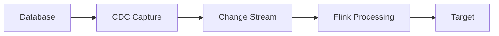

# CDC Connector Evolution Feature Tracking

> **Stage**: Flink/connectors/evolution | **Prerequisites**: [CDC Connector][^1] | **Formality Level**: L3

## 1. Definitions

### Def-F-Conn-CDC-01: Change Data Capture

Change Data Capture:
$$
\text{CDC} : \text{DB Changes} \to \text{Stream}<\text{ChangeEvent}>
$$

### Def-F-Conn-CDC-02: Change Event

Change event:
$$
\text{ChangeEvent} = \langle \text{Op}, \text{Before}, \text{After}, \text{Source} \rangle
$$

## 2. Properties

### Prop-F-Conn-CDC-01: Consistency Guarantee

Consistency guarantee:
$$
\text{CDC} \implies \text{ExactlyOnce} \land \text{Ordering}
$$

## 3. Relations

### CDC Evolution

| Version | Feature | Status | Reference Document |
|---------|---------|--------|-------------------|
| 2.3 | Debezium Integration | GA | - |
| 2.4 | Native CDC | GA | - |
| 2.5 | Multi-Source CDC | GA | - |
| 3.0 | Unified CDC Framework | GA | [CDC 3.0 Guide](../flink-cdc-3.0-data-integration.md) |
| 3.6.0 | Flink 2.2 Support / JDK 11 / Oracle Source / Hudi Sink / Schema Evolution Enhancement | GA (2026-03-30) | [CDC 3.6.0 Complete Guide](../flink-cdc-3.6.0-guide.md) |

## 4. Argumentation

### 4.1 Supported Databases

| Database | Capture Mode | Status |
|----------|-------------|--------|
| MySQL | Binlog | GA |
| PostgreSQL | WAL | GA |
| Oracle | LogMiner | GA |
| MongoDB | Oplog | GA |
| SQL Server | CDC Tables | Beta |

## 5. Proof / Engineering Argument

### 5.1 MySQL CDC Source

```java
MySqlSource<String> mySqlSource = MySqlSource.<String>builder()
    .hostname("mysql")
    .port(3306)
    .databaseList("inventory")
    .tableList("inventory.products")
    .username("flink")
    .password("flinkpwd")
    .deserializer(new JsonDebeziumDeserializationSchema())
    .build();
```

## 6. Examples

### 6.1 Processing CDC Events

```java
stream.process(new ProcessFunction<String, Row>() {
    @Override
    public void processElement(String event, Context ctx, Collector<Row> out) {
        JsonObject json = JsonParser.parseString(event).getAsJsonObject();
        String op = json.get("op").getAsString();

        switch (op) {
            case "c": // CREATE
            case "r": // READ (snapshot)
                out.collect(parseAfter(json));
                break;
            case "u": // UPDATE
                out.collect(parseAfter(json));
                break;
            case "d": // DELETE
                out.collect(parseBefore(json));
                break;
        }
    }
});
```

## 7. Visualizations



## 8. References

[^1]: Flink CDC Connector Documentation

---

## Tracking Information

| Property | Value |
|----------|-------|
| Version | 2.4-3.6.0 |
| Current Status | Continuously Evolving |
| Latest GA Version | 3.6.0 (2026-03-30) |
| Recommended Version | 3.6.0 (Flink 1.20.x/2.2.x + JDK 11+) |
