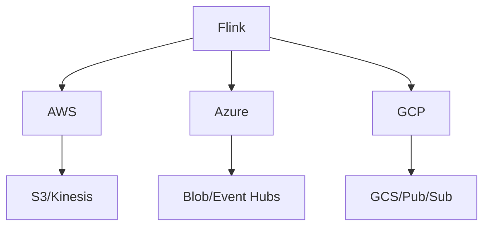

# Cloud Provider Connector Evolution Feature Tracking

> Stage: Flink/connectors/evolution | Prerequisites: [Cloud Connectors][^1] | Formalization Level: L3

## 1. Definitions

### Def-F-Conn-Cloud-01: Cloud Storage

Cloud Storage:
$$
\text{CloudStorage} \in \{\text{S3}, \text{GCS}, \text{Azure Blob}\}
$$

### Def-F-Conn-Cloud-02: Cloud MQ

Cloud Message Queue:
$$
\text{CloudMQ} \in \{\text{Kinesis}, \text{Pub/Sub}, \text{Event Hubs}\}
$$

## 2. Properties

### Prop-F-Conn-Cloud-01: Native Integration

Native Integration:
$$
\text{CloudConnector} \xrightarrow{\text{native SDK}} \text{CloudService}
$$

## 3. Relations

### Cloud Connector Evolution

| Version | Feature | Status |
|---------|---------|--------|
| 2.4 | S3 Improvements | GA |
| 2.4 | GCS Enhancements | GA |
| 2.5 | More Cloud Services | GA |
| 3.0 | Unified Cloud API | In Design |

## 4. Argumentation

### 4.1 Cloud Service Support

| Cloud Service | AWS | Azure | GCP |
|---------------|-----|-------|-----|
| Object Storage | ✅ | ✅ | ✅ |
| Message Queue | ✅ | ✅ | ✅ |
| Database | ✅ | ✅ | ✅ |
| Data Warehouse | ✅ | ✅ | ✅ |

## 5. Formal Proof / Engineering Argument

### 5.1 S3 FileSystem

```java
env.getConfig().setDefaultFileSystemScheme("s3://");

FileSink<String> sink = FileSink
    .forRowFormat(new Path("s3://bucket/output"), new SimpleStringEncoder<>())
    .build();
```

## 6. Examples

### 6.1 AWS Kinesis

```java
FlinkKinesisConsumer<String> consumer = new FlinkKinesisConsumer<>(
    "stream-name",
    new SimpleStringSchema(),
    kinesisProps
);
consumer.setConsumerType(ConsumerType.ENHANCED_FAN_OUT);
```

## 7. Visualizations



## 8. References

[^1]: Flink Cloud Connector Documentation

---

## Tracking Information

| Property | Value |
|----------|-------|
| Version | 2.4-3.0 |
| Current Status | Evolving |
