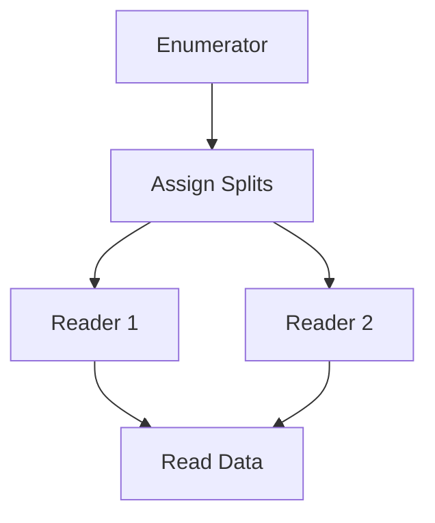

# Custom Connector Development Evolution Feature Tracking

> **Stage**: Flink/connectors/evolution | **Prerequisites**: [Connector Framework][^1] | **Formality Level**: L3

## 1. Definitions

### Def-F-Conn-Custom-01: Connector Framework

Connector framework:
$$
\text{Framework} = \langle \text{SourceAPI}, \text{SinkAPI}, \text{TableAPI} \rangle
$$

### Def-F-Conn-Custom-02: SplitEnumerator

Split enumerator:
$$
\text{Enumerator} : \text{Discovery} \to \{\text{Split}_i\}
$$

## 2. Properties

### Prop-F-Conn-Custom-01: Extensibility

Extensibility:
$$
\forall \text{Source} : \text{Implements}(\text{Source}, \text{SourceInterface})
$$

## 3. Relations

### Connector Framework Evolution

| Version | Feature | Status |
|---------|---------|--------|
| 2.3 | FLIP-27 Source | GA |
| 2.4 | New Sink API | GA |
| 2.5 | Table API Enhancement | GA |
| 3.0 | Unified Framework | In Design |

## 4. Argumentation

### 4.1 Source Components

| Component | Responsibility |
|-----------|---------------|
| Split | Data split definition |
| SplitEnumerator | Split assignment |
| SourceReader | Data reading |
| SourceReaderContext | Runtime context |

## 5. Proof / Engineering Argument

### 5.1 Custom Source

```java
public class MySource implements Source<String, MySplit, MyCheckpoint> {

    @Override
    public SplitEnumerator<MySplit, MyCheckpoint> createEnumerator(
            SplitEnumeratorContext<MySplit> enumContext) {
        return new MySplitEnumerator(enumContext);
    }

    @Override
    public SourceReader<String, MySplit> createReader(
            SourceReaderContext readerContext) {
        return new MySourceReader(readerContext);
    }
}
```

## 6. Examples

### 6.1 Split Implementation

```java
public class MySplit implements SourceSplit {
    private final String splitId;
    private final long startOffset;
    private final long endOffset;

    @Override
    public String splitId() {
        return splitId;
    }
}
```

## 7. Visualizations



## 8. References

[^1]: Flink Connector Development Documentation

---

## Tracking Information

| Property | Value |
|----------|-------|
| Version | 2.4-3.0 |
| Current Status | Evolving |
