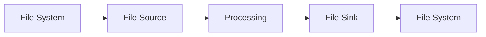

# File System Connector Evolution Feature Tracking

> Stage: Flink/connectors/evolution | Prerequisites: [File Connectors][^1] | Formalization Level: L3

## 1. Definitions

### Def-F-Conn-File-01: File Source

File Source:
$$
\text{FileSource} : \text{Path} \to \text{Stream}
$$

### Def-F-Conn-File-02: File Sink

File Sink:
$$
\text{FileSink} : \text{Stream} \xrightarrow{\text{batch}} \text{File}
$$

## 2. Properties

### Prop-F-Conn-File-01: Exactly-Once

Exactly-Once file write:
$$
\text{TwoPhaseCommit} + \text{Staging} \implies \text{Exactly-Once}
$$

## 3. Relations

### File Connector Evolution

| Version | Feature | Status |
|---------|---------|--------|
| 2.3 | StreamingFileSink | GA |
| 2.4 | FileSource FLIP-27 | GA |
| 2.5 | Format Enhancements | GA |
| 3.0 | Unified File API | In Design |

## 4. Argumentation

### 4.1 Supported Formats

| Format | Source | Sink | Compression |
|--------|--------|------|-------------|
| CSV | ✅ | ✅ | ✅ |
| JSON | ✅ | ✅ | ✅ |
| Parquet | ✅ | ✅ | ✅ |
| ORC | ✅ | ✅ | ✅ |
| Avro | ✅ | ✅ | ✅ |

## 5. Formal Proof / Engineering Argument

### 5.1 FileSource

```java
FileSource<String> source = FileSource
    .forRecordStreamFormat(
        new TextLineFormat(),
        new Path("hdfs:///input"))
    .setFileEnumeratorParallelism(10)
    .build();
```

## 6. Examples

### 6.1 Parquet Sink

```java
FileSink<GenericRecord> sink = FileSink
    .forBulkFormat(
        new Path("hdfs:///output"),
        ParquetAvroWriters.forGenericRecord(schema))
    .withBucketAssigner(new DateTimeBucketAssigner<>())
    .withRollingPolicy(OnCheckpointRollingPolicy.build())
    .build();
```

## 7. Visualizations



## 8. References

[^1]: Flink File Connector Documentation

---

## Tracking Information

| Property | Value |
|----------|-------|
| Version | 2.4-3.0 |
| Current Status | Evolving |
