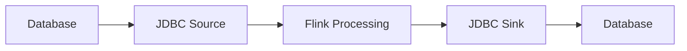

# JDBC Connector Evolution Feature Tracking

> **Stage**: Flink/connectors/evolution | **Prerequisites**: [JDBC Connector][^1] | **Formality Level**: L3

## 1. Definitions

### Def-F-Conn-JDBC-01: JDBC Source

JDBC Source:
$$
\text{JDBCSource} : \text{SQL} \to \text{Stream}
$$

### Def-F-Conn-JDBC-02: JDBC Sink

JDBC Sink:
$$
\text{JDBCSink} : \text{Stream} \xrightarrow{\text{batch}} \text{Database}
$$

## 2. Properties

### Prop-F-Conn-JDBC-01: Batch Optimization

Batch optimization:
$$
\text{Throughput} \propto \text{BatchSize}
$$

## 3. Relations

### JDBC Evolution

| Version | Feature | Status |
|---------|---------|--------|
| 2.3 | Basic JDBC | GA |
| 2.4 | Sharded Read | GA |
| 2.5 | Async Write | GA |
| 3.0 | Connection Pool Optimization | In Design |

## 4. Argumentation

### 4.1 Database Support

| Database | Source | Sink |
|----------|--------|------|
| MySQL | ✅ | ✅ |
| PostgreSQL | ✅ | ✅ |
| Oracle | ✅ | ✅ |
| SQL Server | ✅ | ✅ |

## 5. Proof / Engineering Argument

### 5.1 JDBC Source

```java
// [伪代码片段 - 不可直接运行] 仅展示核心逻辑
JdbcSourceBuilder<Row> builder = JdbcSourceBuilder.<Row>builder()
    .setDriverName("com.mysql.cj.jdbc.Driver")
    .setUrl("jdbc:mysql://localhost:3306/mydb")
    .setQuery("SELECT * FROM orders WHERE order_time > ?")
    .setResultConverter(rowConverter);
```

## 6. Examples

### 6.1 JDBC Sink

```java
// [伪代码片段 - 不可直接运行] 仅展示核心逻辑
JdbcSink.sink(
    "INSERT INTO orders (id, amount) VALUES (?, ?)",
    (ps, order) -> {
        ps.setString(1, order.getId());
        ps.setDouble(2, order.getAmount());
    },
    JdbcExecutionOptions.builder()
        .withBatchSize(1000)
        .withBatchIntervalMs(200)
        .build(),
    new JdbcConnectionOptions.JdbcConnectionOptionsBuilder()
        .withUrl("jdbc:mysql://localhost:3306/mydb")
        .build()
);
```

## 7. Visualizations



## 8. References

[^1]: Flink JDBC Connector Documentation

---

## Tracking Information

| Property | Value |
|----------|-------|
| Version | 2.4-3.0 |
| Current Status | Evolving |
