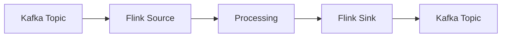

# Kafka Connector Evolution Feature Tracking

> Stage: Flink/connectors/evolution | Prerequisites: [Kafka Connector][^1] | Formalization Level: L3

## 1. Definitions

### Def-F-Conn-Kafka-01: Source Connector

Kafka Source:
$$
\text{KafkaSource} : \text{Topic} \times \text{Partition} \to \text{Stream}
$$

### Def-F-Conn-Kafka-02: Sink Connector

Kafka Sink:
$$
\text{KafkaSink} : \text{Stream} \to \text{Topic}
$$

## 2. Properties

### Prop-F-Conn-Kafka-01: Exactly-Once

Exactly-Once semantics:
$$
\text{KafkaSink} + \text{Transactions} \implies \text{Exactly-Once}
$$

## 3. Relations

### Kafka Connector Evolution

| Version | Feature | Status |
|---------|---------|--------|
| 2.3 | Legacy API | Deprecated |
| 2.4 | FLIP-27 Source | GA |
| 2.5 | Enhanced Sink | GA |
| 3.0 | Unified API | In Design |

## 4. Argumentation

### 4.1 Source vs Sink

| Feature | Source | Sink |
|---------|--------|------|
| Partition Discovery | Dynamic | Static |
| Offset Commit | Automatic | - |
| Transaction | - | Supported |

## 5. Formal Proof / Engineering Argument

### 5.1 Kafka Source

```java
KafkaSource<String> source = KafkaSource.<String>builder()
    .setBootstrapServers("kafka:9092")
    .setTopics("input-topic")
    .setGroupId("flink-group")
    .setStartingOffsets(OffsetsInitializer.earliest())
    .setValueOnlyDeserializer(new SimpleStringSchema())
    .build();
```

## 6. Examples

### 6.1 Exactly-Once Sink

```java
KafkaSink<String> sink = KafkaSink.<String>builder()
    .setBootstrapServers("kafka:9092")
    .setRecordSerializer(KafkaRecordSerializationSchema.builder()
        .setTopic("output-topic")
        .setValueSerializationSchema(new SimpleStringSchema())
        .build())
    .setDeliveryGuarantee(DeliveryGuarantee.EXACTLY_ONCE)
    .build();
```

## 7. Visualizations



## 8. References

[^1]: Flink Kafka Connector Documentation

---

## Tracking Information

| Property | Value |
|----------|-------|
| Version | 2.4-3.0 |
| Current Status | Evolving |
