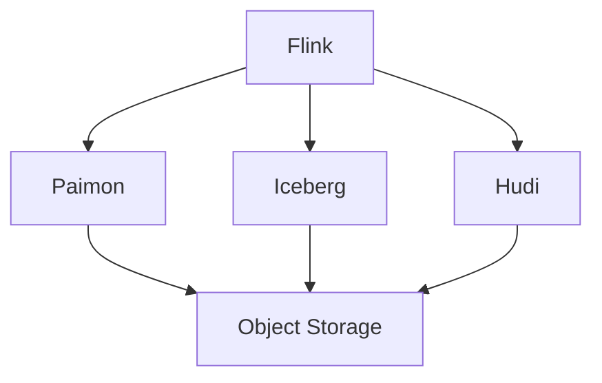

> **Status**: 🔮 Forward-looking Content | **Risk Level**: High | **Last Updated**: 2026-04
>
> The content described in this document is in early planning stages and may differ from the final implementation. Please refer to official Apache Flink releases for accuracy.
>
# Lakehouse Connector Evolution Feature Tracking

> **Stage**: Flink/connectors/evolution | **Prerequisites**: [Lakehouse Connectors][^1] | **Formality Level**: L3

## 1. Definitions

### Def-F-Conn-LH-01: Lakehouse

Lakehouse architecture:
$$
\text{Lakehouse} = \text{Data Lake} + \text{ACID} + \text{Metadata}
$$

### Def-F-Conn-LH-02: Table Format

Table format:
$$
\text{TableFormat} \in \{\text{Iceberg}, \text{Hudi}, \text{Delta}, \text{Paimon}\}
$$

## 2. Properties

### Prop-F-Conn-LH-01: Time Travel

Time travel:
$$
\text{Query}(t) = \text{Table}_{\text{version}=t}
$$

## 3. Relations

### Lakehouse Evolution

| Version | Feature | Status |
|---------|---------|--------|
| 2.4 | Iceberg Support | GA |
| 2.4 | Paimon Release | GA |
| 2.5 | Hudi Enhancement | GA |
| 2.5 | Delta Support | Preview |

## 4. Argumentation

### 4.1 Format Comparison

| Feature | Iceberg | Hudi | Delta | Paimon |
|---------|---------|------|-------|--------|
| Streaming Read | ⚠️ | ✅ | ⚠️ | ✅ |
| Streaming Write | ⚠️ | ✅ | ⚠️ | ✅ |
| Time Travel | ✅ | ✅ | ✅ | ✅ |
| CDC | ❌ | ✅ | ❌ | ✅ |

## 5. Proof / Engineering Argument

### 5.1 Paimon Sink

```java
FlinkSink.forRowData()
    .withTable(table)
    .withOverwritePartition(partition)
    .build();
```

## 6. Examples

### 6.1 Iceberg Table

```sql
CREATE TABLE iceberg_table (
    id INT,
    data STRING
) WITH (
    'connector' = 'iceberg',
    'catalog-type' = 'hive',
    'warehouse' = 'hdfs:///iceberg-warehouse',
    'database-name' = 'default',
    'table-name' = 'test_table'
);
```

## 7. Visualizations



## 8. References

[^1]: Flink Lakehouse Documentation

---

## Tracking Information

| Property | Value |
|----------|-------|
| Version | 2.4-3.0 |
| Current Status | Evolving |
