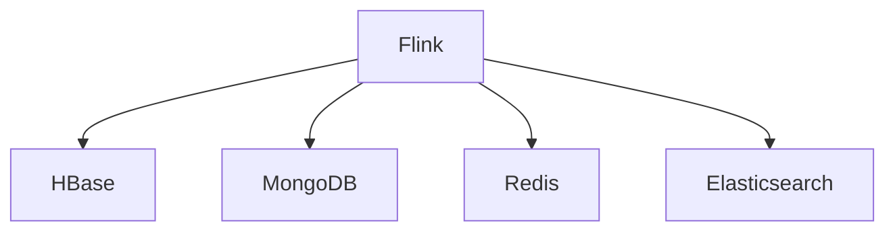

# NoSQL Connector Evolution Feature Tracking

> **Stage**: Flink/connectors/evolution | **Prerequisites**: [NoSQL Connectors][^1] | **Formalization Level**: L3

## 1. Definitions

### Def-F-Conn-NoSQL-01: Key-Value Store

Key-value store:
$$
\text{KVStore} : \text{Key} \to \text{Value}
$$

### Def-F-Conn-NoSQL-02: Document Store

Document store:
$$
\text{DocStore} : \text{ID} \to \text{Document}
$$

## 2. Properties

### Prop-F-Conn-NoSQL-01: Lookup Join

Lookup Join:
$$
\text{Stream} \bowtie_{\text{key}} \text{NoSQL} \to \text{Enriched}
$$

## 3. Relations

### NoSQL Evolution

| Version | Feature | Status |
|------|------|------|
| 2.3 | HBase | GA |
| 2.4 | MongoDB CDC | GA |
| 2.4 | Redis | GA |
| 2.5 | Cassandra Enhancement | GA |
| 3.0 | Unified NoSQL API | In Design |

## 4. Argumentation

### 4.1 Supported Databases

| Database | Source | Sink | Lookup |
|--------|--------|------|--------|
| HBase | ✅ | ✅ | ✅ |
| MongoDB | ✅(CDC) | ✅ | ✅ |
| Redis | - | ✅ | ✅ |
| Cassandra | ✅ | ✅ | ✅ |
| Elasticsearch | ✅ | ✅ | ✅ |

## 5. Formal Proof / Engineering Argument

### 5.1 HBase Sink

```java
HBaseSinkFunction<Row> sink = new HBaseSinkFunction<>(
    "table-name",
    HBaseConfiguration.create(),
    new RowMutationConverter(),
    1000 // batch size
);
```

## 6. Examples

### 6.1 MongoDB CDC

```java
MongoDBSource<String> source = MongoDBSource.<String>builder()
    .setUri("mongodb://localhost:27017")
    .setDatabase("inventory")
    .setCollection("products")
    .setDeserializationSchema(new JsonDeserializationSchema())
    .build();
```

## 7. Visualizations



## 8. References

[^1]: Flink NoSQL Connector Documentation

---

## Tracking Information

| Attribute | Value |
|------|-----|
| Version | 2.4-3.0 |
| Current Status | Evolving |
