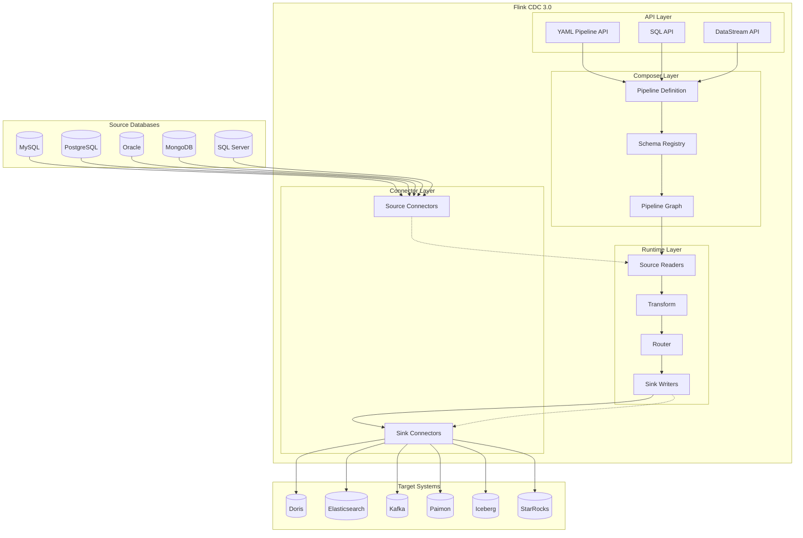
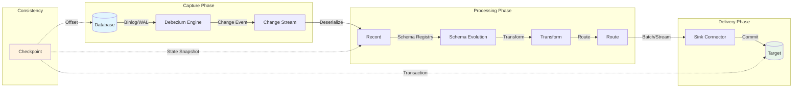
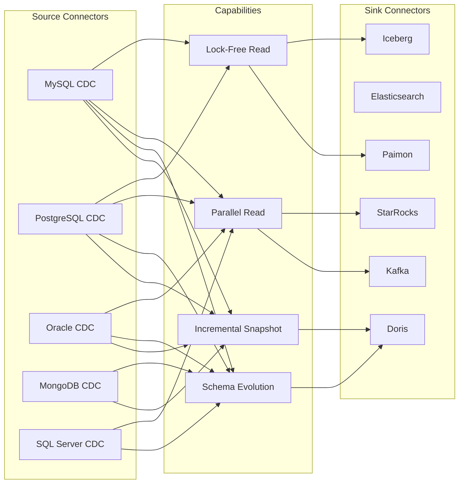
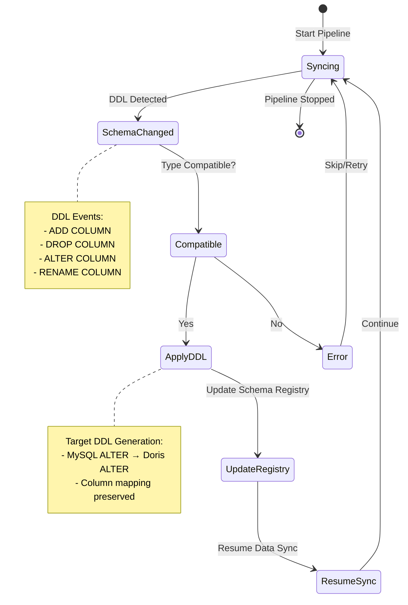
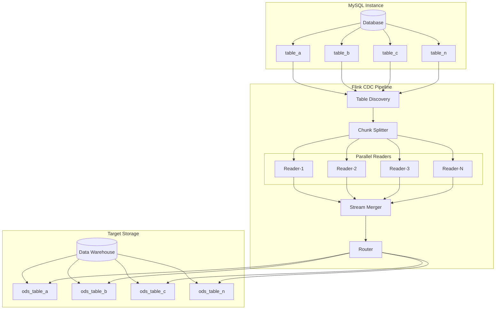

# Flink CDC 3.0 Data Integration Framework

> **Stage**: Flink | **Prerequisites**: [Flink CDC Basics](../04.04-cdc-debezium-integration-en.md), [Flink SQL Complete Guide](../../../Flink/03-api/03.02-table-sql-api/flink-table-sql-complete-guide-en.md) | **Formality Level**: L4
>
> **📢 Version Notice**: This document describes CDC 3.0 features. See the latest version [Flink CDC 3.6.0 Feature Sync Complete Guide](./flink-cdc-3.6.0-guide-en.md) for Flink 2.2.x support, JDK 11 upgrade, Oracle Source, Hudi Sink, and other new features.

---

## 1. Definitions

### Def-F-04-50: CDC (Change Data Capture) Formal Definition

**Change Data Capture (CDC)** is a technique to identify and capture data changes in a database, enabling real-time propagation of these changes to other systems.

> **Formal Definition**: Let database state be a time function $D: T \rightarrow \mathcal{S}$, where $\mathcal{S}$ is the set of all possible database states. A CDC system defines a **change stream** $C: T \rightarrow \mathcal{P}(\Delta)$, satisfying:
>
> $$D(t_2) = D(t_1) \oplus \bigoplus_{\delta \in C([t_1, t_2])} \delta$$
>
> where $\oplus$ denotes state application operation, and $\Delta$ is the set of change operations (INSERT/UPDATE/DELETE).

**Two CDC Implementation Modes**:

| Mode | Principle | Pros | Cons |
|------|-----------|------|------|
| **Query Mode** | Polling queries to detect changes | Simple to implement | High latency, heavy database load |
| **Log Mode** | Parsing database transaction logs (binlog/WAL) | Low latency, non-intrusive | Complex implementation, depends on DB features |

### Def-F-04-51: Flink CDC 3.0 Definition

**Flink CDC 3.0** is a distributed data integration framework based on Apache Flink, focused on providing end-to-end real-time data synchronization capabilities.

> **Formal Definition**: Flink CDC 3.0 is a quintuple $\mathcal{F}_{CDC3} = (\mathcal{P}, \mathcal{C}_{src}, \mathcal{C}_{sink}, \mathcal{T}, \mathcal{R})$, where:
>
> - $\mathcal{P}$: Pipeline definition space (YAML/SQL/DataStream)
> - $\mathcal{C}_{src}$: Source connector collection (MySQL, PostgreSQL, etc.)
> - $\mathcal{C}_{sink}$: Sink connector collection (Doris, Kafka, etc.)
> - $\mathcal{T}$: Transformation function space (Filter, Projection, UDF)
> - $\mathcal{R}$: Routing rule collection (Route, Table Mapping)

### Def-F-04-52: Pipeline API Definition

**Pipeline API** is the declarative data integration DSL introduced in Flink CDC 3.0, using YAML to describe end-to-end data synchronization pipelines.

```yaml
# Pipeline API structure formalized: Pipeline ::= SourceConfig + SinkConfig + [Transform] + [Route] + [Option]
SourceConfig ::= (connector-type, hostname, port, database, table)
SinkConfig ::= (connector-type, endpoints, database, table)
Transform ::= (source-table, projection, filter)
Route ::= (source-table, sink-table, [description])
```

### Def-F-04-53: Schema Evolution Definition

**Schema Evolution** refers to the ability to automatically handle source database schema changes (add column, drop column, type change) and synchronize them to the target side.

> **Formal Definition**: Let source table schema be $S_{src}(t)$ and target table schema be $S_{sink}(t)$. Schema Evolution guarantees:
>
> $$\forall t: S_{sink}(t) = f(S_{src}(t))$$
>
> where $f$ is the schema mapping function, supporting operations including:
>
> - **ADD COLUMN**: $S' = S \cup \{c: \tau\}$
> - **DROP COLUMN**: $S' = S \setminus \{c\}$
> - **ALTER COLUMN**: $S' = S[c \rightarrow \tau']$
> - **RENAME COLUMN**: $S' = S[c \rightarrow c']$

---

## 2. Properties

### Lemma-F-04-40: CDC Consistency Guarantee

**Lemma**: Under Exactly-Once semantics, Flink CDC 3.0 guarantees end-to-end ordering and no loss of change events.

> **Proof Sketch**:
>
> 1. The source guarantees atomicity and order of change events through database transaction logs
> 2. Flink Checkpoint mechanism guarantees persistence of intermediate state
> 3. The sink guarantees final consistency through two-phase commit (2PC)
> 4. By transitivity: source order $\Rightarrow$ processing order $\Rightarrow$ target order $\square$

### Lemma-F-04-41: Latency Upper Bound

**Lemma**: Flink CDC 3.0 data synchronization latency has an upper bound $L_{max}$.

> **Proof**:
> Let:
>
> - $L_{capture}$: Log capture latency (typically < 100ms)
> - $L_{network}$: Network transmission latency
> - $L_{process}$: Flink processing latency (depends on parallelism and operator complexity)
> - $L_{commit}$: Sink commit latency
>
> Total latency: $L_{total} = L_{capture} + L_{network} + L_{process} + L_{commit}$
>
> Under normal load, $L_{total} < 1s$ (typical value 200-500ms) $\square$

### Prop-F-04-40: Lock-Free Read Correctness

**Proposition**: Flink CDC 3.0's lock-free read mechanism does not violate database transaction isolation.

> **Argument**:
> Lock-free reads are based on database MVCC mechanisms, reading a consistent snapshot rather than locking the table:
>
> - MySQL: Uses consistent snapshot under `REPEATABLE READ` isolation level
> - PostgreSQL: Leverages multi-version concurrency control snapshot export
> - During snapshot reading, concurrent transaction modifications do not affect read results
> - Therefore, lock-free reads are semantically equivalent to a read-only transaction $\square$

### Prop-F-04-41: Parallel Read Linear Speedup

**Proposition**: Under uniform data distribution, Flink CDC 3.0 parallel read approaches linear speedup.

> **Proof**:
> Let total data volume be $N$, single-parallelism processing rate be $r$, and parallelism be $p$.
> Theoretical speedup: $S(p) = \frac{T(1)}{T(p)} = \frac{N/r}{N/(r \cdot p)} = p$
>
> Actual speedup is limited by:
>
> - Data skew factor $\alpha$ ($0 < \alpha \leq 1$)
> - Coordination overhead $\beta$ (typically small)
>
> Actual speedup: $S_{actual}(p) = \frac{p}{1/\alpha + \beta} \approx p$ (when data is uniform and $\beta \rightarrow 0$) $\square$

---

## 3. Relations

### 3.1 Flink CDC 3.0 and Debezium Relationship

```
┌─────────────────────────────────────────────────────────────┐
│                     Flink CDC 3.0                           │
│  ┌─────────────┐    ┌─────────────┐    ┌─────────────┐      │
│  │   YAML API  │    │   SQL API   │    │DataStream   │      │
│  │  (Pipeline) │    │   (Flink)   │    │   API       │      │
│  └──────┬──────┘    └──────┬──────┘    └──────┬──────┘      │
│         └─────────────────┬────────────────────┘             │
│                           ▼                                  │
│  ┌────────────────────────────────────────────────────────┐  │
│  │         Flink CDC Connectors (MySQL, PG, etc.)         │  │
│  │  ┌─────────┐  ┌─────────┐  ┌─────────┐  ┌─────────┐    │  │
│  │  │Debezium │  │Debezium │  │Debezium │  │  Custom │    │  │
│  │  │ Engine  │  │ Engine  │  │ Engine  │  │ Connect │    │  │
│  │  │ (MySQL) │  │  (PG)   │  │(Oracle) │  │         │    │  │
│  │  └─────────┘  └─────────┘  └─────────┘  └─────────┘    │  │
│  └────────────────────────────────────────────────────────┘  │
└─────────────────────────────────────────────────────────────┘
```

**Relationship Notes**:

- Flink CDC 3.0 integrates Debezium Engine at the source layer as the change capture engine
- Debezium is responsible for parsing database binlog/WAL and normalizing change events into a unified format
- Flink CDC adds on top of Debezium: distributed processing, Checkpoint, Schema Evolution, Transform, etc.

### 3.2 Flink CDC 3.0 and Flink SQL Relationship

| Dimension | Flink CDC 3.0 | Flink SQL (CDC) |
|-----------|---------------|-----------------|
| **Abstraction Level** | Pipeline-level (end-to-end) | Table-level (single table) |
| **Primary API** | YAML Pipeline API | SQL DDL/DML |
| **Schema Handling** | Automatic schema sync | Manual management required |
| **Full Database Sync** | Native support | Manual configuration per table |
| **Data Transformation** | Built-in Transform DSL | SQL expressions |
| **Applicable Scenarios** | Data integration, ETL | Stream processing analytics |

**Integration Points**:

- Flink CDC 3.0 SQL API is built on top of Flink SQL
- Both share the same connector ecosystem (specified via `connector='mysql-cdc'`, etc.)
- Flink CDC 3.0 Pipeline can be converted to Flink SQL jobs for execution

### 3.3 Comparison with CDC 2.x

| Feature | Flink CDC 2.x | Flink CDC 3.0 |
|---------|---------------|---------------|
| **Primary API** | DataStream API | YAML Pipeline API + SQL API |
| **Full Database Sync** | Requires programming | Declarative support |
| **Schema Evolution** | Limited support | Full support |
| **Table Merge** | Custom required | Native Route support |
| **Transform** | Requires Flink operators | Built-in Transform DSL |
| **Connector Framework** | Independent connectors | Unified Pipeline Connector API |
| **Operational Complexity** | High (requires code) | Low (configuration-driven) |

---

## 4. Argumentation

### 4.1 Four-Layer Architecture Design Advantages

Flink CDC 3.0 adopts a layered architecture with clear responsibilities:

```
┌─────────────────────────────────────────────────────────────────┐
│ Layer 4: API Layer (User Interface)                              │
│  - YAML Pipeline API (Declarative)                               │
│  - SQL API (Flink SQL Integration)                               │
│  - DataStream API (Programmatic)                                 │
├─────────────────────────────────────────────────────────────────┤
│ Layer 3: Pipeline Composer (Orchestration)                       │
│  - Pipeline definition parsing and validation                    │
│  - Schema Registry management                                    │
│  - Job generation and optimization                               │
├─────────────────────────────────────────────────────────────────┤
│ Layer 2: Runtime Layer (Execution Engine)                        │
│  - Flink job execution                                           │
│  - Checkpoint and state management                               │
│  - Parallelism management and resource scheduling                │
├─────────────────────────────────────────────────────────────────┤
│ Layer 1: Connector Layer (Connectors)                            │
│  - Source Connectors (MySQL, PG, Oracle, MongoDB, SQL Server)   │
│  - Sink Connectors (Doris, ES, Kafka, Paimon, Iceberg, StarRocks)│
│  - Pipeline Connector API (Unified Interface)                    │
└─────────────────────────────────────────────────────────────────┘
```

**Architecture Advantages**:

1. **Separation of Concerns**: API layer targets different user groups (DBAs use YAML, developers use SQL/code), Composer handles complexity, Runtime guarantees reliability, Connector layer guarantees extensibility.
2. **Extensibility**: Adding new Source/Sink only requires implementing the Pipeline Connector API, without modifying upper-layer logic.
3. **Maintainability**: Layering makes fault isolation, version upgrades, and feature iteration more controllable.

### 4.2 Why YAML Pipeline API is Needed

Pain points of traditional CDC solutions:

- **Debezium + Kafka Connect**: Scattered configuration, difficult schema change management
- **DataStream API**: Requires writing Java/Scala code, high barrier to entry
- **Flink SQL**: Single-table processing, full-database sync configuration is tedious

YAML Pipeline API design decisions:

- **Declarative**: Describe "what to do" rather than "how to do it"
- **Complete Functionality**: Covers Source, Sink, Transform, Route full workflow
- **Version Controllable**: YAML files can be managed in Git
- **High Reusability**: Templated configuration supports multi-environment reuse

---

## 5. Proof / Engineering Argument

### Thm-F-04-40: Full Database Sync Completeness

**Theorem**: Flink CDC 3.0's full database sync capability can capture changes from all tables matching the criteria in the source database.

> **Proof**:
>
> **Preconditions**:
>
> - Let source database be $DB$, containing table collection $T = \{t_1, t_2, ..., t_n\}$
> - Configuration specifies table name matching pattern $pattern$
> - Matched table collection $T_{match} = \{t \in T \mid match(t, pattern)\}$
>
> **Proof Steps**:
>
> 1. **Discovery Phase**: Flink CDC connector queries database metadata (`INFORMATION_SCHEMA` or equivalent system tables) to obtain all tables:
>    $$T_{discovered} = query\_metadata(DB)$$
>
> 2. **Filtering Phase**: Applies user-configured table name pattern filtering:
>    $$T_{selected} = \{t \in T_{discovered} \mid match(t.name, pattern)\}$$
>
> 3. **Initialization Phase**: Creates independent reader subtasks for each selected table:
>    $$\forall t \in T_{selected}: init\_reader(t)$$
>
> 4. **Capture Phase**: Each reader subtask independently captures changes for the corresponding table:
>    $$\forall t \in T_{selected}: capture\_changes(t) \rightarrow stream_t$$
>
> 5. **Merge Phase**: All table change streams are merged into a unified output stream:
>    $$output = \bigcup_{t \in T_{selected}} stream_t$$
>
> **Completeness Guarantee**:
>
> - Metadata queries guarantee no physical table is missed
> - Regex/wildcard matching guarantees pattern expressiveness
> - Independent reading per table guarantees no change is lost
> - Therefore, $\forall t \in T_{match}: t \in T_{selected}$ and all changes are captured $\square$

### Thm-F-04-41: Schema Evolution Consistency

**Theorem**: With Schema Evolution enabled, Flink CDC 3.0 guarantees that the target schema always maintains a consistent mapping with the source schema.

> **Proof**:
>
> **Definition**: Let the consistency mapping relationship between source schema $S_{src}$ and target schema $S_{sink}$ be:
> $$consistent(S_{src}, S_{sink}) \iff \forall c \in S_{src}: \exists c' \in S_{sink} \cdot compatible(c.type, c'.type)$$
>
> **Inductive Proof**:
>
> **Base**: At initial sync, $S_{sink}^{(0)} = map(S_{src}^{(0)})$, obviously satisfying consistency.
>
> **Inductive Hypothesis**: Assume after the $k$-th schema change, $consistent(S_{src}^{(k)}, S_{sink}^{(k)})$ holds.
>
> **Inductive Step**: Consider the $(k+1)$-th schema change event $e$:
>
> | Change Type | Source Operation | CDC Processing | Target State | Consistency |
> |-------------|------------------|----------------|--------------|-------------|
> | ADD COLUMN | $S_{src}^{(k+1)} = S_{src}^{(k)} \cup \{c_{new}\}$ | Detect change, generate DDL | $S_{sink}^{(k+1)} = S_{sink}^{(k)} \cup \{c'_{new}\}$ | ✓ |
> | DROP COLUMN | $S_{src}^{(k+1)} = S_{src}^{(k)} \setminus \{c\}$ | Detect change, generate DDL | $S_{sink}^{(k+1)} = S_{sink}^{(k)} \setminus \{c'\}$ | ✓ |
> | ALTER COLUMN | $S_{src}^{(k+1)} = S_{src}^{(k)}[c \rightarrow \tau']$ | Type compatibility check | $S_{sink}^{(k+1)} = S_{sink}^{(k)}[c' \rightarrow \tau'']$ | ✓ |
> | RENAME COLUMN | $S_{src}^{(k+1)} = S_{src}^{(k)}[c \rightarrow c_{new}]$ | Detect change, generate DDL | $S_{sink}^{(k+1)} = S_{sink}^{(k)}[c' \rightarrow c'_{new}]$ | ✓ |
>
> Since schema change events in the CDC stream propagate in order of occurrence, and the target applies DDL in sequence, consistency is maintained.
>
> By mathematical induction, $\forall k \geq 0: consistent(S_{src}^{(k)}, S_{sink}^{(k)})$ $\square$

### 5.1 Production Best Practices Argument

#### Practice 1: Lock-Free Read Configuration

```yaml
source:
  type: mysql
  hostname: localhost
  port: 3306
  username: cdc_user
  password: ${CDC_PASSWORD}
  # Lock-free read key configuration
  scan.incremental.snapshot.enabled: true
  scan.snapshot.fetch.size: 1024
  scan.startup.mode: initial
```

**Argument**: `scan.incremental.snapshot.enabled: true` enables lock-free incremental snapshots, avoiding `FLUSH TABLES WITH READ LOCK` impact on business databases through chunk splitting and parallel reading.

#### Practice 2: Parallelism Tuning

```yaml
pipeline:
  parallelism: 4
  local-time-zone: Asia/Shanghai

source:
  # Source parallelism (usually related to MySQL instance count or database count)
  parallelism: 2
```

**Argument**: Parallelism settings need to consider:

- Source side: generally not exceeding database connection limits (avoid too many connections)
- Global: adjusted according to data volume and throughput requirements
- Recommendation: start with smaller values and tune gradually based on monitoring

#### Practice 3: Resume from Checkpoint Guarantee

```yaml
pipeline:
  # Checkpoint configuration
  execution.checkpointing.interval: 60000
  execution.checkpointing.mode: EXACTLY_ONCE
  execution.checkpointing.timeout: 600000
  execution.checkpointing.max-concurrent-checkpoints: 1
```

**Argument**: Periodic checkpoints guarantee:

1. After job failure, recovery from the latest checkpoint is possible
2. Exactly-Once semantics guarantee no duplicate data
3. State persistence to external storage (HDFS/S3, etc.)

---

## 6. Examples

### 6.1 Complete YAML Configuration: MySQL → Doris Sync

```yaml
################################################################################
# CDC Pipeline Definition: MySQL to Doris Data Synchronization
# Version: Flink CDC 3.0 ################################################################################

# Pipeline basic configuration
pipeline:
  name: mysql-to-doris-sync
  parallelism: 4
  local-time-zone: Asia/Shanghai

  # Checkpoint configuration (resume from checkpoint)
  execution.checkpointing.interval: 60000
  execution.checkpointing.mode: EXACTLY_ONCE
  execution.checkpointing.timeout: 600000

  # Error handling strategy
  error-handle.mode: CONTINUE

# Source configuration: MySQL
source:
  type: mysql
  name: mysql-source
  hostname: mysql.example.com
  port: 3306
  username: ${MYSQL_USER}
  password: ${MYSQL_PASSWORD}

  # Database selection
  database-list: inventory,orders

  # Table name matching (supports regex)
  table-list: inventory\..*,orders\..*

  # Lock-free read configuration
  scan.incremental.snapshot.enabled: true
  scan.snapshot.fetch.size: 1024
  scan.incremental.snapshot.chunk.size: 8096

  # Startup mode
  scan.startup.mode: initial  # Options: initial, latest-offset, specific-offset, timestamp

  # Connection pool configuration
  connection.pool.size: 20
  connect.timeout: 30s

  # Schema change capture
  include.schema.changes: true

# Sink configuration: Doris
sink:
  type: doris
  name: doris-sink
  fenodes: doris-fe:8030
  username: ${DORIS_USER}
  password: ${DORIS_PASSWORD}

  # Target database
  database: ods

  # Table prefix (optional)
  table.prefix: cdc_

  # Doris-specific configuration
  sink.enable.batch-mode: true
  sink.flush.queue-size: 2
  sink.buffer-flush.interval: 10s
  sink.buffer-flush.max-rows: 50000
  sink.max-retries: 3

  # Table creation options
  table.create.properties.replication_num: 3
  table.create.properties.storage_format: MOR  # Merge-on-Read

# Data transformation rules (optional)
transform:
  # Rule 1: Filter sensitive fields
  - source-table: inventory\.customers
    projection: id, name, email, region
    filter: region = 'APAC'
    description: "Filter APAC customers, exclude PII"

  # Rule 2: Data masking
  - source-table: orders\.payments
    projection: |
      id,
      order_id,
      CONCAT(LEFT(credit_card, 4), '****', RIGHT(credit_card, 4)) as credit_card_masked,
      amount,
      currency,
      created_at
    description: "Mask credit card numbers"

# Routing rules (table mapping and merge)
route:
  # Rule 1: Single table mapping (default behavior, explicit declaration)
  - source-table: inventory\.products
    sink-table: ods.cdc_products
    description: "Direct mapping for products"

  # Rule 2: Multi-table merge (sharding scenario)
  - source-table: orders\.order_\d+
    sink-table: ods.cdc_orders_all
    description: "Merge all order shards"

  # Rule 3: Regex replacement (dynamic table name mapping)
  - source-table: inventory\.(.*)
    sink-table: ods.cdc_$1
    description: "Dynamic table naming"
```

### 6.2 SQL API Example

```sql
-- MySQL CDC Source Table
CREATE TABLE mysql_users (
    id BIGINT PRIMARY KEY NOT ENFORCED,
    name STRING,
    email STRING,
    created_at TIMESTAMP(3)
) WITH (
    'connector' = 'mysql-cdc',
    'hostname' = 'mysql.example.com',
    'port' = '3306',
    'username' = 'cdc_user',
    'password' = 'password',
    'database-name' = 'db',
    'table-name' = 'users'
);

-- Doris Sink Table
CREATE TABLE doris_users (
    id BIGINT,
    name STRING,
    email STRING,
    created_at TIMESTAMP(3)
) WITH (
    'connector' = 'doris',
    'fenodes' = 'doris-fe:8030',
    'table.identifier' = 'ods.users',
    'username' = 'root',
    'password' = ''
);

-- Sync job
INSERT INTO doris_users
SELECT * FROM mysql_users;
```

### 6.3 DataStream API Example

```java
import org.apache.flink.cdc.connectors.mysql.source.MySqlSource;
import org.apache.flink.cdc.connectors.mysql.table.StartupOptions;
import org.apache.flink.cdc.debezium.JsonDebeziumDeserializationSchema;
import org.apache.flink.streaming.api.environment.StreamExecutionEnvironment;

public class MySqlToKafkaCDC {
    public static void main(String[] args) throws Exception {
        StreamExecutionEnvironment env =
            StreamExecutionEnvironment.getExecutionEnvironment();
        env.enableCheckpointing(60000);

        // Build MySQL CDC Source
        MySqlSource<String> mysqlSource = MySqlSource.<String>builder()
            .hostname("mysql.example.com")
            .port(3306)
            .databaseList("inventory")
            .tableList("inventory.products", "inventory.orders")
            .username("cdc_user")
            .password("password")
            .deserializer(new JsonDebeziumDeserializationSchema())
            .startupOptions(StartupOptions.initial())
            .build();

        // Add Source and output to Kafka
        env.fromSource(mysqlSource, WatermarkStrategy.noWatermarks(), "MySQL CDC")
            .addSink(new FlinkKafkaProducer<>(
                "kafka:9092",
                "cdc-topic",
                new SimpleStringSchema()
            ));

        env.execute("MySQL CDC to Kafka");
    }
}
```

---

## 7. Visualizations

### 7.1 Flink CDC 3.0 Architecture Diagram



### 7.2 Data Flow Processing Diagram



### 7.3 Connector Support Matrix



### 7.4 Schema Evolution Processing Flow



### 7.5 Full Database Sync Architecture



---

## 8. References


---

*Document Version: v1.0 | Created: 2026-04-20 | Translated from: Flink CDC 3.0 数据集成框架*
