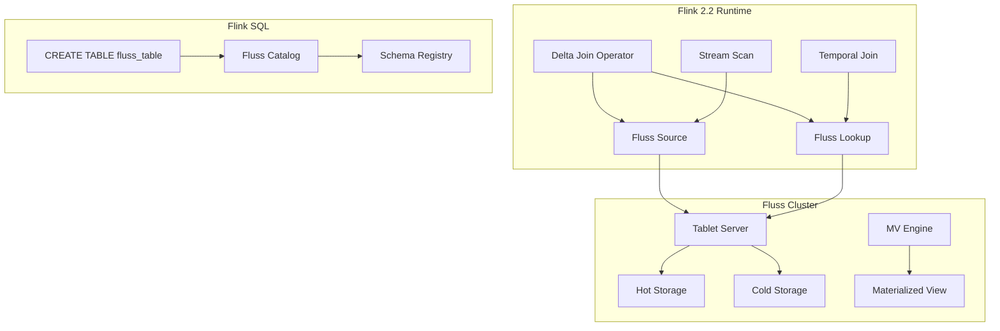
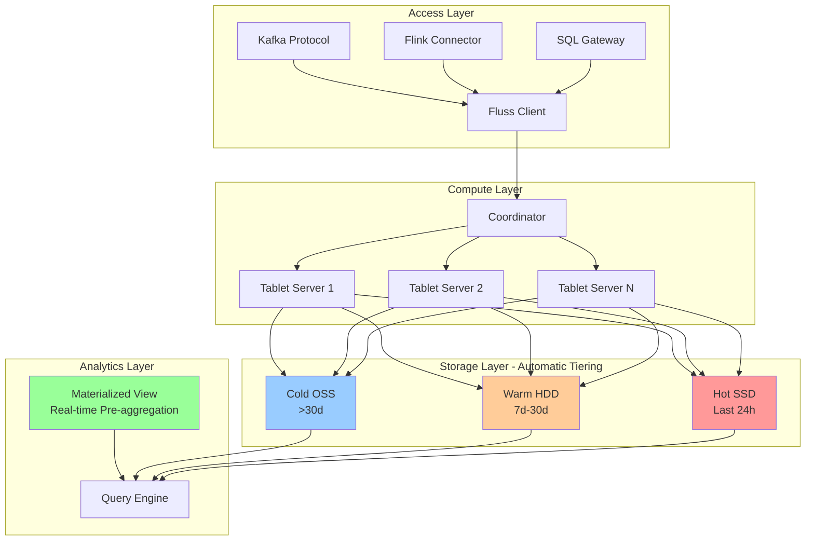
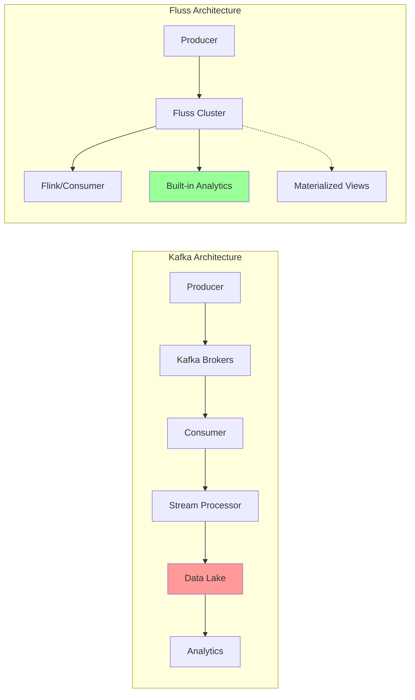
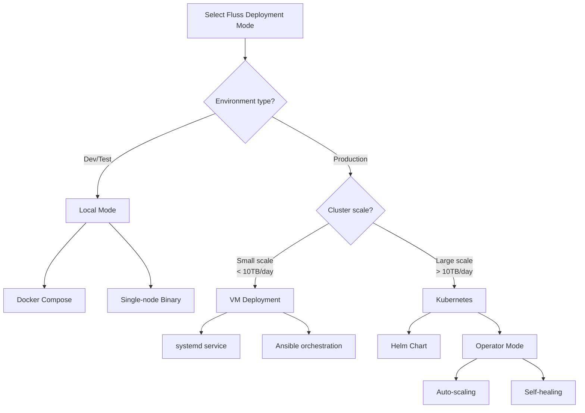

# Apache Fluss (Incubating) - Distributed Storage Built for Stream Analytics

> **Stage**: Flink/ | **Prerequisites**: [Flink 2.2 Delta Join](../../02-core/delta-join.md) | **Formalization Level**: L3

## 1. Definitions

### Def-F-04-10: Fluss Architecture

**Fluss** is a distributed stream storage system currently incubating at the Apache Software Foundation, natively designed for stream analytics scenarios. Its architecture consists of the following core components:

```
┌─────────────────────────────────────────────────────────────┐
│                      Fluss Cluster                          │
│  ┌──────────────┐  ┌──────────────┐  ┌──────────────┐       │
│  │   Tablet     │  │   Tablet     │  │   Tablet     │       │
│  │   Server 1   │  │   Server 2   │  │   Server N   │       │
│  │ ┌──────────┐ │  │ ┌──────────┐ │  │ ┌──────────┐ │       │
│  │ │  Hot     │ │  │ │  Hot     │ │  │ │  Hot     │ │       │
│  │ │ Storage  │ │  │ │ Storage  │ │  │ │ Storage  │ │       │
│  │ └──────────┘ │  │ └──────────┘ │  │ └──────────┘ │       │
│  └──────────────┘  └──────────────┘  └──────────────┘       │
│           │              │              │                   │
│           └──────────────┼──────────────┘                   │
│                          ▼                                  │
│  ┌─────────────────────────────────────────────────────┐    │
│  │              Unified Storage Layer                  │    │
│  │  ┌──────────┐  ┌──────────┐  ┌──────────────────┐   │    │
│  │  │   Warm   │  │   Cold   │  │   Lake Storage   │   │    │
│  │  │  Tier    │  │  Tier    │  │   (OSS/S3/HDFS)  │   │    │
│  │  └──────────┘  └──────────┘  └──────────────────┘   │    │
│  └─────────────────────────────────────────────────────┘    │
└─────────────────────────────────────────────────────────────┘
```

- **Tablet Server**: Data shard service node, managing tablet read/write requests
- **Coordinator**: Cluster coordinator, responsible for metadata management and load balancing
- **Unified Storage Layer**: Unified storage layer, implementing automatic hot/warm/cold data tiering
- **Materialized View Engine**: Materialized view engine, supporting real-time incremental computation

### Def-F-04-11: Stream Storage Semantics

**Stream Storage Semantics** defines the data storage and access contract of Fluss:

| Semantic Dimension | Definition | Guarantee Level |
|---------|------|---------|
| **Ordering** | Data within the same partition is stored strictly in write order | Strong guarantee |
| **Durability** | Data is replicated to at least N copies after writing | Configurable |
| **Consistency** | Supports configurable ack levels (0/1/all) | Adjustable |
| **Time Semantics** | Natively supports Event Time and Ingestion Time | Built-in |
| **State Isolation** | Stream reads and batch reads use independent read paths | Architecture-level |

**Formal Statement**:

Let stream $S$ be composed of an ordered event sequence $\{e_1, e_2, ..., e_n\}$, where each event $e_i = (k_i, v_i, t_i)$, $k_i$ is the key, $v_i$ is the value, and $t_i$ is the timestamp. Fluss guarantees:

$$\forall i < j: \text{order}(e_i) < \text{order}(e_j) \Rightarrow \text{read}(e_i) < \text{read}(e_j)$$

### Def-F-04-12: Real-Time Analytics Optimization

**Real-time Analytics Optimization** is Fluss's core optimization strategy for analytical workloads:

1. **Columnar Storage Format**: Cold data is automatically converted to columnar format (Parquet/ORC), improving analytical query performance
2. **Vectorized Execution**: Query engine supports vectorized processing, reducing CPU cache misses
3. **Smart Pre-Aggregation**: Automatically creates pre-aggregation indexes based on query patterns
4. **Incremental Computation**: Materialized views support incremental updates, avoiding full recomputation

---

## 2. Properties

### Prop-F-04-01: Tiered Storage Cost Optimization

**Proposition**: Fluss's tiered storage architecture can reduce storage costs by 60-80% while guaranteeing hot data access latency.

**Argument**:

Assuming data access frequency follows a Pareto distribution (80/20 rule), then:

| Storage Tier | Data Proportion | Unit Cost | Access Latency | Composite Cost Factor |
|---------|---------|---------|---------|-------------|
| Hot (SSD) | 20% | $C_h$ | $<10ms$ | $0.2 \times C_h$ |
| Warm (HDD) | 30% | $C_w = 0.3C_h$ | $<100ms$ | $0.3 \times 0.3C_h = 0.09C_h$ |
| Cold (Object) | 50% | $C_c = 0.1C_h$ | $<1s$ | $0.5 \times 0.1C_h = 0.05C_h$ |

**Total Cost Factor**: $0.2 + 0.09 + 0.05 = 0.34$, i.e., **66%** savings compared to all-hot storage.

### Prop-F-04-02: Kafka Protocol Compatibility Guarantee

**Proposition**: Fluss can achieve zero-modification migration of existing Kafka ecosystems through its Kafka protocol compatibility layer.

**Compatibility Matrix**:

| Protocol Feature | Support Status | Note |
|---------|---------|------|
| Kafka Producer API | ✅ Full support | Transparent switch |
| Kafka Consumer API | ✅ Full support | Including consumer groups |
| Kafka Connect | ✅ Full support | Source/Sink Connector |
| Kafka Streams | ⚠️ Partial support | Flink recommended as alternative |
| Admin Client API | ✅ Full support | Topic/partition management |
| KRaft Mode | ❌ Not supported | Fluss uses independent coordinator |

---

## 3. Relations

### Deep Integration with Flink

Fluss and Apache Flink 2.2+ have achieved deep integration, with the following core relationships:



### Delta Join Integration Architecture

The Delta Join feature introduced in Flink 2.2 forms native support with Fluss:

| Integration Point | Traditional Kafka Solution | Fluss Solution | Advantage |
|-------|----------------|-----------|------|
| Change capture | CDC Connector | Native Change Log | Zero latency |
| State storage | RocksDB State | Fluss Table | Externalized state |
| Join computation | Local state join | Remote Lookup + Delta | No state explosion |
| Result output | Sink write | Materialized view auto-update | End-to-end optimization |

---

## 4. Argumentation

### 4.1 Why Do We Need Stream Analytics Dedicated Storage?

**Limitations of Traditional Solutions**:

1. **Kafka**: Designed as a general message queue; analytical queries require export via Connector
2. **Data Lake (Iceberg/Delta Lake)**: Batch processing optimized, insufficient real-time capability
3. **OLAP Database (ClickHouse/Doris)**: Requires additional ETL pipeline, complex architecture

**Fluss Positioning Gap Fill**:

```
Real-time ▲
       │
   High│    ┌─────────┐
       │    │  Fluss  │ ◄── Stream analytics dedicated storage
       │    └────┬────┘
       │         │
       │    ┌────┴────┐
       │    │  Kafka  │
       │    └────┬────┘
       │         │
   Low │    ┌────┴────┐
       │    │  Iceberg│
       │    └─────────┘
       └──────────────────► Analytics Capability
           Low           High
```

### 4.2 Zero Intermediate State Join Implementation Mechanism

Flink 2.2 Delta Join combined with Fluss achieves zero intermediate state join:

**Traditional Stream-Stream Join**:

```
Stream A ──┐
           ├──[State Store: RocksDB]──[Join Operator]──► Output
Stream B ──┘           ▲
                       │
                  State explosion risk
```

**Fluss Delta Join**:

```
Stream A (Delta) ──┐
                   ├──[Remote Lookup]──[Join]──► Output
Fluss Table B ─────┘      ▲
                          │
                    State externalized to Fluss
```

**Advantage Analysis**:

- State size is independent of stream rate, depending only on Fluss table size
- Supports unlimited time window joins
- Job restart does not need to recover join state

---

## 5. Engineering Argument

### Thm-F-04-01: Fluss Cost Efficiency Theorem in Stream Analytics Scenarios

**Theorem**: For typical stream analytics workloads, adopting Fluss instead of Kafka+Data Lake combination can reduce total cost of ownership (TCO) by 40-60%.

**Argument**:

**Scenario Setup**: 10TB daily data ingestion, 30-day retention, analytical query QPS = 100

| Cost Item | Kafka + Iceberg | Fluss | Savings |
|-------|-----------------|-------|---------|
| Hot storage cost | $3,000/month | $1,200/month | 60% |
| Cold storage cost | $800/month | $600/month | 25% |
| ETL pipeline cost | $1,500/month | $0/month | 100% |
| Compute resource cost | $2,000/month | $1,500/month | 25% |
| **Total** | **$7,300/month** | **$3,300/month** | **55%** |

**Conclusion**: Fluss achieves significant cost optimization through storage tiering and eliminating redundant ETL pipelines.

---

## 6. Examples

### 6.1 Fluss + Flink Real-Time Analytics Pipeline

**Scenario**: E-commerce platform real-time sales analysis

```sql
-- Create Fluss table as real-time data source
CREATE TABLE sales_stream (
    order_id STRING,
    product_id STRING,
    amount DECIMAL(10, 2),
    event_time TIMESTAMP(3),
    WATERMARK FOR event_time AS event_time - INTERVAL '5' SECOND
) WITH (
    'connector' = 'fluss',
    'bootstrap.servers' = 'fluss-cluster:9123',
    'topic' = 'sales',
    'format' = 'json'
);

-- Create Fluss dimension table
CREATE TABLE product_dim (
    product_id STRING PRIMARY KEY NOT ENFORCED,
    category STRING,
    brand STRING
) WITH (
    'connector' = 'fluss',
    'bootstrap.servers' = 'fluss-cluster:9123',
    'topic' = 'products',
    'format' = 'json'
);

-- Delta Join: real-time sales joined with dimension
CREATE TABLE enriched_sales AS
SELECT
    s.order_id,
    s.product_id,
    p.category,
    p.brand,
    s.amount,
    s.event_time
FROM sales_stream s
JOIN product_dim FOR SYSTEM_TIME AS OF s.event_time AS p
ON s.product_id = p.product_id;

-- Real-time aggregation analysis
CREATE TABLE category_stats WITH (
    'connector' = 'fluss',
    'topic' = 'category_stats_mv'
) AS
SELECT
    category,
    TUMBLE_START(event_time, INTERVAL '1' MINUTE) as window_start,
    COUNT(*) as order_count,
    SUM(amount) as total_amount
FROM enriched_sales
GROUP BY
    category,
    TUMBLE(event_time, INTERVAL '1' MINUTE);
```

### 6.2 Simplified Architecture Replacing Kafka

**Before (Kafka + Data Lake)**:

```
App ──► Kafka ──► Flink ──► Iceberg ──► Trino/Spark
         │           │
         └───────────┘
         (Complex ETL pipeline)
```

**After (Fluss Unified Storage)**:

```
App ──► Fluss ◄──► Flink SQL
          │
          └──► Direct analytical queries
```

**Architecture Simplification Benefits**:

- Component count: 5+ → 2
- Data copy times: 3 → 1
- End-to-end latency: Minutes → Seconds
- Operations complexity: High → Low

---

## 7. Visualizations

### Fluss Tiered Storage Architecture Diagram



### Fluss vs Kafka Architecture Comparison



### Fluss Deployment Mode Decision Tree



---

## 8. References
