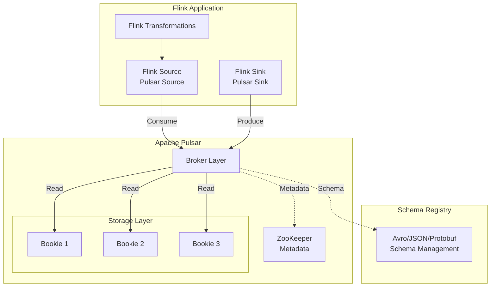
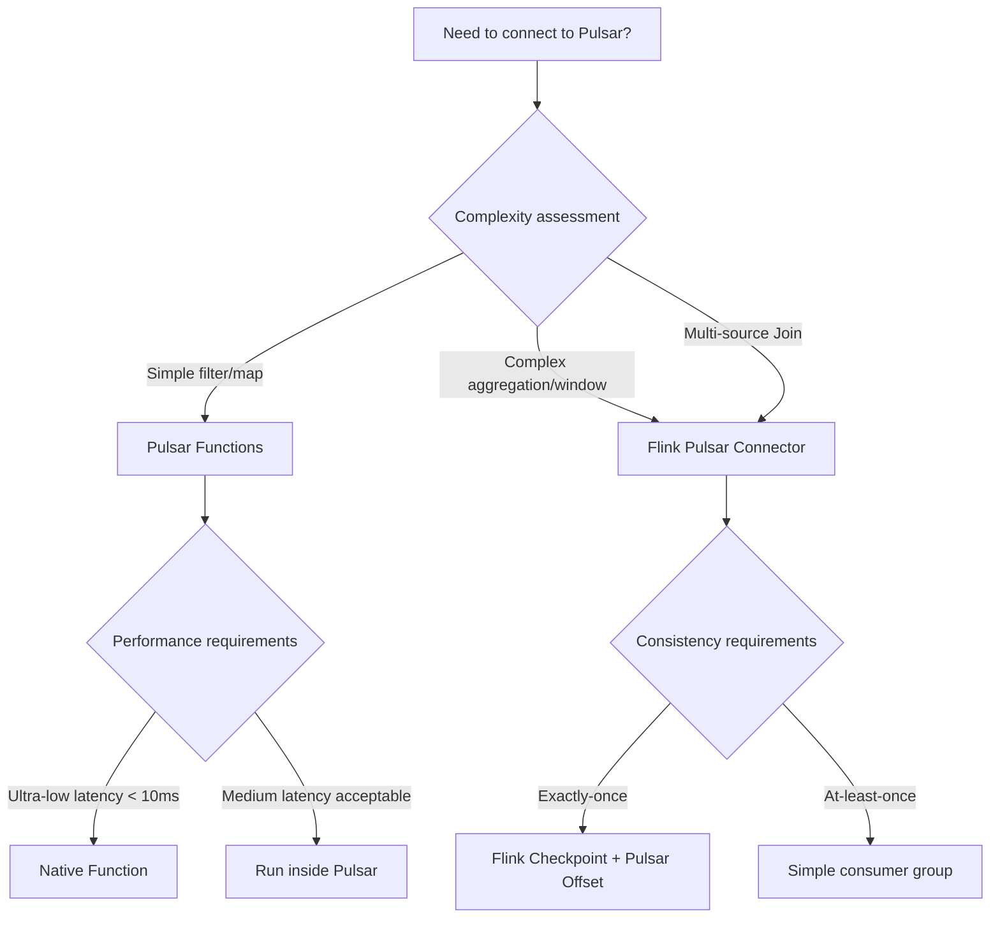
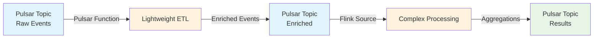
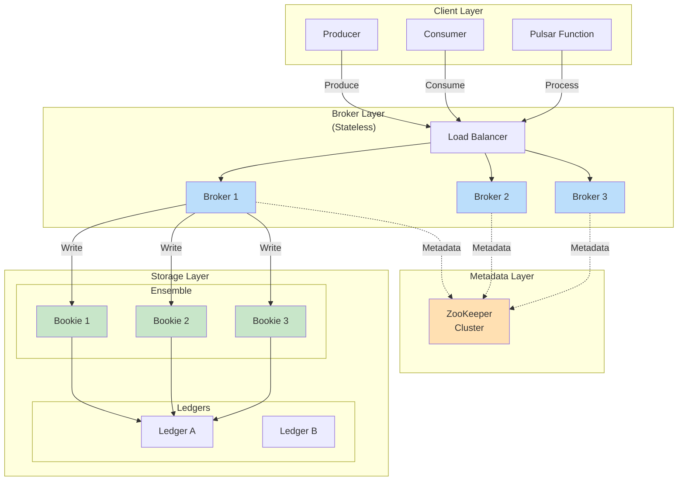
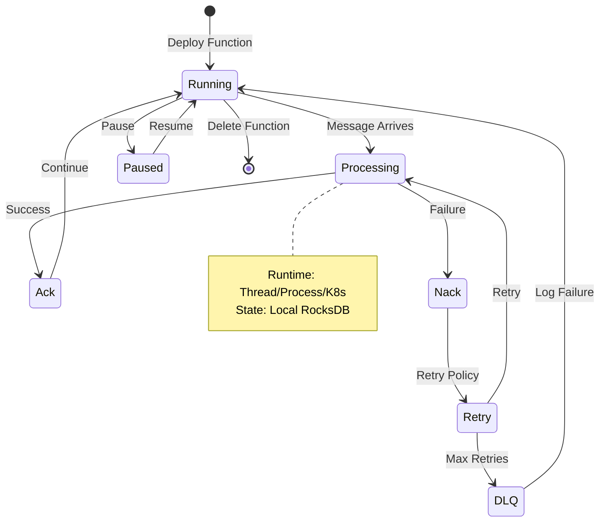
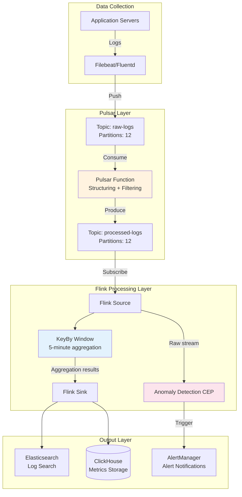

# Pulsar Connector Guide

> **Stage**: Flink/Connectors | **Prerequisites**: [Flink-01-04 Connector Fundamentals](flink-connectors-ecosystem-complete-guide.md), [Flink-03-01 State Management](../../02-core/flink-state-management-complete-guide.md) | **Formalization Level**: L3-L4

## 1. Concept Definitions (Definitions)

### 1.1 Pulsar Fundamentals

**Def-F-04-01 (Pulsar Cluster Topology)**
Apache Pulsar adopts a **layered architecture** consisting of three layers:

- **Broker Layer**: Stateless compute layer handling client connections and message routing
- **BookKeeper Layer**: Stateful storage layer implementing persistent log storage through Apache BookKeeper
- **ZooKeeper Layer**: Metadata management layer coordinating cluster state and configuration

$$
\text{Pulsar}_{\text{Cluster}} = \langle \mathcal{B}_{\text{brokers}}, \mathcal{W}_{\text{bookies}}, \mathcal{Z}_{\text{zk}} \rangle
$$

**Def-F-04-02 (Namespaces and Topics)**
Pulsar's topic hierarchy is organized as:

- **Tenant**: Highest isolation level, corresponding to an organization or business line
- **Namespace**: Logical grouping under a tenant
- **Topic**: Actual message stream

$$
\text{Topic}_{\text{URI}} = \text{persistent}://\langle tenant \rangle/\langle namespace \rangle/\langle topic \rangle
$$

**Def-F-04-03 (Unified Messaging Model)**
Pulsar supports both:

- **Queue Semantics**: Traditional message queue (JMS), supporting individual message acknowledgment
- **Stream Semantics**: Kafka-style stream processing, supporting partitioned consumption

$$
\text{Pulsar}_{\text{Model}} = \text{Queue}_{\text{Semantic}} \cap \text{Stream}_{\text{Semantic}}
$$

### 1.2 Pulsar vs Kafka Comparison

| Dimension | Apache Pulsar | Apache Kafka |
|------|---------------|--------------|
| Architecture | Layered (Broker + BookKeeper) | Single-layer (Broker as storage) |
| Storage Scaling | Independent scaling, no data replication | Partition rebalancing requires data migration |
| Multi-tenancy | Native support, resource isolation | Added later |
| Message Acknowledgment | Individual + Cumulative | Partition-level offset only |
| Delayed Messages | Built-in support | Requires external implementation |
| Geo-replication | Built-in cross-datacenter replication | MirrorMaker external implementation |
| Message Retention | Unified time/size-based policy | Partition-level policy |

---

## 2. Property Derivation (Properties)

### 2.1 Layered Architecture Advantages

**Prop-F-04-01 (Compute-Storage Separation)**
Pulsar's layered architecture enables:

- Compute layer (Broker) to scale horizontally independently
- Storage layer (BookKeeper) to scale on demand
- Broker failures do not affect data durability

**Lemma-F-04-01 (Stateless Broker)**
The stateless design of the Broker layer means:
$$
\forall b \in \mathcal{B}_{\text{brokers}}: \text{failure}(b) \Rightarrow \text{recovery}(b) \leq T_{\text{reconnect}}
$$
Clients can immediately reconnect to other Brokers without waiting for data migration.

### 2.2 Subscription Mode Semantics

Pulsar supports four subscription modes:

| Subscription Mode | Semantics | Applicable Scenarios |
|---------|------|---------|
| **Exclusive** | Exclusive consumption, single consumer | Strict ordering guarantee |
| **Shared** | Round-robin distribution, multiple consumers | High-throughput parallel processing |
| **Failover** | Active-standby switchover, single active | High-availability consumption |
| **Key_Shared** | Key-based sticky routing | Same-key ordering guarantee |

**Lemma-F-04-02 (Key_Shared Ordering Guarantee)**
For Key_Shared subscription mode:
$$
\forall k \in \mathcal{K}_{\text{keys}}: \text{order}(m_i, m_j | \text{key}=k) \Rightarrow \text{process}(c_x, m_i) \prec \text{process}(c_x, m_j)
$$
Messages with the same key are routed to the same consumer, guaranteeing processing order.

---

## 3. Relationship Establishment (Relations)

### 3.1 Pulsar-Flink Connector Architecture



### 3.2 Pulsar Functions vs Flink Positioning

| Feature | Pulsar Functions | Apache Flink |
|------|------------------|--------------|
| Deployment Mode | Pulsar internal runtime | Independent cluster |
| State Management | Lightweight local state | Distributed state backend |
| Processing Semantics | At-least-once (default) | Exactly-Once |
| Window Support | Basic Tumbling | Rich window types |
| Complexity | Simple ETL | Complex stream processing |
| Latency | Low latency (ms) | Medium latency (sub-second) |
| Ecosystem Integration | Pulsar native | Multi-connector ecosystem |

**Integration Relationship**: Pulsar Functions are suitable for lightweight message transformations, while Flink is suitable for complex stream analytics; the two can work together.

---

## 4. Argumentation Process (Argumentation)

### 4.1 Connector Selection Argumentation

**Scenario Decision Tree**:



### 4.2 Subscription Mode Selection Argumentation

**Thm-F-04-01 (Subscription Mode Selection Theorem)**
For Flink consuming Pulsar scenarios, subscription mode selection depends on:

$$
\text{Subscription}_{\text{opt}} = \begin{cases}
\text{Exclusive} & \text{if } \text{parallelism} = 1 \land \text{ordering} = \text{strict} \\
\text{Failover} & \text{if } \text{parallelism} = 1 \land \text{HA} = \text{required} \\
\text{Shared} & \text{if } \text{ordering} = \text{none} \land \text{throughput} = \text{max} \\
\text{Key\_Shared} & \text{if } \exists k: \text{ordering}(k) = \text{strict}
\end{cases}
$$

---

## 5. Formal Proof / Engineering Argument (Proof / Engineering Argument)

### 5.1 Pulsar Source Configuration Argumentation

**Thm-F-04-02 (Exactly-once Source Guarantee)**
Flink Pulsar Source provides Exactly-Once semantics when Checkpoint is enabled.

**Proof**:

1. Pulsar supports cursor-based persistence of consumption positions
2. Flink Checkpoint saves Pulsar Offset as operator state
3. Upon failure recovery, consumption resumes from the Checkpoint-restored Offset
4. Pulsar message acknowledgment is idempotent
5. Therefore:

$$
\forall m \in \text{messages}: \text{count}_{\text{process}}(m) = 1 \lor \text{count}_{\text{process}}(m) = 0
$$
Failed messages will be reprocessed but not double-counted.

### 5.2 Performance Optimization Engineering Argumentation

**Batch Consumption Optimization**:

```java
// [伪代码片段 - 不可直接运行] 仅展示核心逻辑
// Configure batch pull
PulsarSource<String> source = PulsarSource.builder()
    .setTopics("persistent://public/default/my-topic")
    .setConfig(PulsarSourceOptions.PULSAR_MAX_NUM_MESSAGES, 1000)
    .setConfig(PulsarSourceOptions.PULSAR_MAX_NUM_BYTES, 10 * 1024 * 1024)
    .setConfig(PulsarSourceOptions.PULSAR_RECEIVE_QUEUE_SIZE, 2000)
    .build();
```

**Optimization Principles**:

- Reduce network round trips
- Amortize acknowledgment overhead
- Improve throughput but may increase latency

**Compression Configuration**:

```java
// [伪代码片段 - 不可直接运行] 仅展示核心逻辑
// Producer compression configuration
PulsarSink<String> sink = PulsarSink.builder()
    .setTopics("persistent://public/default/output-topic")
    .setConfig(PulsarSinkOptions.PULSAR_COMPRESSION_TYPE, CompressionType.LZ4)
    .setConfig(PulsarSinkOptions.PULSAR_BATCHING_ENABLED, true)
    .setConfig(PulsarSinkOptions.PULSAR_BATCHING_MAX_MESSAGES, 1000)
    .build();
```

---

## 6. Example Verification (Examples)

### 6.1 Pulsar Source Complete Example

```java
import org.apache.flink.connector.pulsar.source.PulsarSource;
import org.apache.flink.connector.pulsar.source.enumerator.cursor.StartCursor;
import org.apache.flink.connector.pulsar.source.reader.deserializer.PulsarDeserializationSchema;

import org.apache.flink.streaming.api.environment.StreamExecutionEnvironment;
import org.apache.flink.streaming.api.datastream.DataStream;
import org.apache.flink.streaming.api.CheckpointingMode;


public class PulsarSourceExample {

    public static void main(String[] args) throws Exception {
        StreamExecutionEnvironment env =
            StreamExecutionEnvironment.getExecutionEnvironment();

        // Enable Checkpoint to guarantee Exactly-once
        env.enableCheckpointing(60000);
        env.getCheckpointConfig().setCheckpointingMode(
            CheckpointingMode.EXACTLY_ONCE
        );

        // Configure Pulsar Source
        PulsarSource<Event> source = PulsarSource.builder()
            .setServiceUrl("pulsar://localhost:6650")
            .setAdminUrl("http://localhost:8080")
            .setTopics("persistent://my-tenant/my-ns/events")
            .setStartCursor(StartCursor.earliest())
            .setSubscriptionName("flink-subscription")
            .setSubscriptionType(SubscriptionType.Key_Shared)
            .setDeserializationSchema(
                PulsarDeserializationSchema.pulsarSchema(
                    Schema.AVRO(Event.class)
                )
            )
            .build();

        DataStream<Event> stream = env.fromSource(
            source,
            WatermarkStrategy.forBoundedOutOfOrderness(
                Duration.ofSeconds(5)
            ),
            "Pulsar Source"
        );

        // Processing logic
        stream.filter(e -> e.getSeverity().equals("ERROR"))
              .map(e -> new Alert(e.getTimestamp(), e.getMessage()))
              .addSink(alertSink);

        env.execute("Pulsar Log Processing");
    }
}
```

### 6.2 Pulsar Sink Delayed Message Example

```java
import org.apache.flink.connector.pulsar.sink.PulsarSink;
import org.apache.flink.connector.pulsar.sink.writer.delayer.MessageDelayer;

public class DelayedMessageExample {

    public static void main(String[] args) {

        // Delayed message routing - event-time based delayed delivery
        MessageDelayer<Notification> delayer =
            MessageDelayer.fixed(Duration.ofMinutes(30));

        // Or dynamic delay based on message content
        MessageDelayer<Notification> dynamicDelayer =
            (element, currentTimestamp) -> {
                // Deliver at specified time
                return element.getScheduledTime().toEpochMilli();
            };

        PulsarSink<Notification> sink = PulsarSink.builder()
            .setServiceUrl("pulsar://localhost:6650")
            .setAdminUrl("http://localhost:8080")
            .setTopics("persistent://my-tenant/my-ns/notifications")
            .setSerializationSchema(
                PulsarSerializationSchema.pulsarSchema(
                    Schema.AVRO(Notification.class)
                )
            )
            .setMessageDelayer(dynamicDelayer)
            .setTopicRoutingMode(TopicRoutingMode.MESSAGE_KEY_HASH)
            .build();
    }
}
```

### 6.3 Pulsar Functions Integration Example

```java
// Pulsar Function definition (runs inside Pulsar)
public class EnrichmentFunction implements Function<String, String> {

    private transient UserService userService;

    @Override
    public String process(String input, Context context) {
        // Lightweight transformation: add user metadata
        Event event = Event.fromJson(input);
        User user = userService.getById(event.getUserId());
        event.setUserTier(user.getTier());
        return event.toJson();
    }
}
```

**Hybrid Architecture - Pulsar Functions + Flink**:



```java
// Flink consuming data preprocessed by Pulsar Functions

import org.apache.flink.streaming.api.environment.StreamExecutionEnvironment;
import org.apache.flink.streaming.api.datastream.DataStream;
import org.apache.flink.streaming.api.windowing.time.Time;

public class EnrichedStreamProcessing {

    public static void main(String[] args) throws Exception {
        StreamExecutionEnvironment env =
            StreamExecutionEnvironment.getExecutionEnvironment();

        // Consume data preprocessed by Pulsar Functions
        PulsarSource<EnrichedEvent> source = PulsarSource.builder()
            .setTopics("persistent://public/default/enriched-events")
            .setSubscriptionName("flink-analytics")
            .setSubscriptionType(SubscriptionType.Shared)
            .setDeserializationSchema(...)
            .build();

        DataStream<EnrichedEvent> stream = env.fromSource(...);

        // Complex aggregation: 5-minute tumbling window
        stream.keyBy(EnrichedEvent::getUserTier)
              .window(TumblingEventTimeWindows.of(Time.minutes(5)))
              .aggregate(new TierMetricsAggregate())
              .addSink(metricsSink);

        env.execute();
    }
}
```

### 6.4 Performance Optimization Configuration Example

```java
// [伪代码片段 - 不可直接运行] 仅展示核心逻辑
// Complete optimization configuration
PulsarSource<String> optimizedSource = PulsarSource.builder()
    .setServiceUrl("pulsar://pulsar-cluster:6650")
    .setAdminUrl("http://pulsar-cluster:8080")
    // Topic configuration
    .setTopicsPattern("persistent://tenant/ns/topic-.*")
    .setTopicDiscoveryInterval(Duration.ofMinutes(1))
    // Consumption configuration
    .setSubscriptionName("flink-optimized-sub")
    .setSubscriptionType(SubscriptionType.Key_Shared)
    .setStartCursor(StartCursor.latest())
    // Batching configuration
    .setConfig(PulsarSourceOptions.PULSAR_MAX_NUM_MESSAGES, 500)
    .setConfig(PulsarSourceOptions.PULSAR_MAX_NUM_BYTES, 5 * 1024 * 1024)
    .setConfig(PulsarSourceOptions.PULSAR_RECEIVE_QUEUE_SIZE, 1000)
    // Client cache
    .setConfig(PulsarSourceOptions.PULSAR_MEMORY_LIMIT_BYTES, 64 * 1024 * 1024L)
    .build();

// Sink optimization configuration
PulsarSink<String> optimizedSink = PulsarSink.builder()
    .setServiceUrl("pulsar://pulsar-cluster:6650")
    .setAdminUrl("http://pulsar-cluster:8080")
    .setTopics("persistent://tenant/ns/output")
    // Batching and compression
    .setConfig(PulsarSinkOptions.PULSAR_BATCHING_ENABLED, true)
    .setConfig(PulsarSinkOptions.PULSAR_BATCHING_MAX_MESSAGES, 1000)
    .setConfig(PulsarSinkOptions.PULSAR_BATCHING_MAX_PUBLISH_DELAY_MS, 10)
    .setConfig(PulsarSinkOptions.PULSAR_COMPRESSION_TYPE, CompressionType.ZSTD)
    // Retry policy
    .setConfig(PulsarSinkOptions.PULSAR_MAX_PENDING_MESSAGES, 1000)
    .setConfig(PulsarSinkOptions.PULSAR_MAX_PENDING_MESSAGES_ACROSS_PARTITIONS, 5000)
    .build();
```

### 6.5 Schema Evolution Handling

```java
// Handle schema evolution

import org.apache.flink.streaming.api.datastream.DataStream;

public class SchemaEvolutionExample {

    public static void main(String[] args) {

        // Configure schema auto-discovery
        PulsarSource<GenericRecord> source = PulsarSource.builder()
            .setTopics("persistent://public/default/events")
            .setDeserializationSchema(
                PulsarDeserializationSchema.pulsarSchema(
                    Schema.AUTO_CONSUME()
                )
            )
            .setProperties(ImmutableMap.of(
                "schemaVerificationEnable", "true",
                "schemaCompatibilityStrategy", "FORWARD"
            ))
            .build();

        // Process different schema versions
        DataStream<EventV2> stream = env.fromSource(source, ...)
            .map(record -> {
                SchemaVersion version = record.getSchemaVersion();
                if (version.equals(SchemaVersion.V1)) {
                    return migrateFromV1(record);
                }
                return (EventV2) record.getNativeObject();
            });
    }
}
```

---

## 7. Visualizations (Visualizations)

### 7.1 Pulsar Layered Architecture Deep Dive



### 7.2 Pulsar Functions Runtime Model



### 7.3 Real-world Case: Log Processing Pipeline



---

## 8. References (References)
