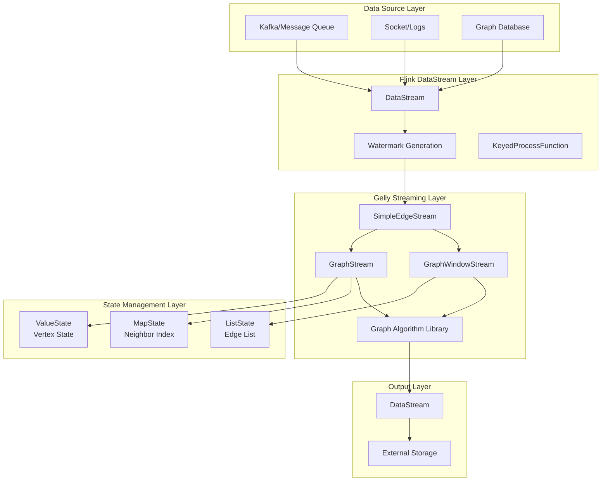
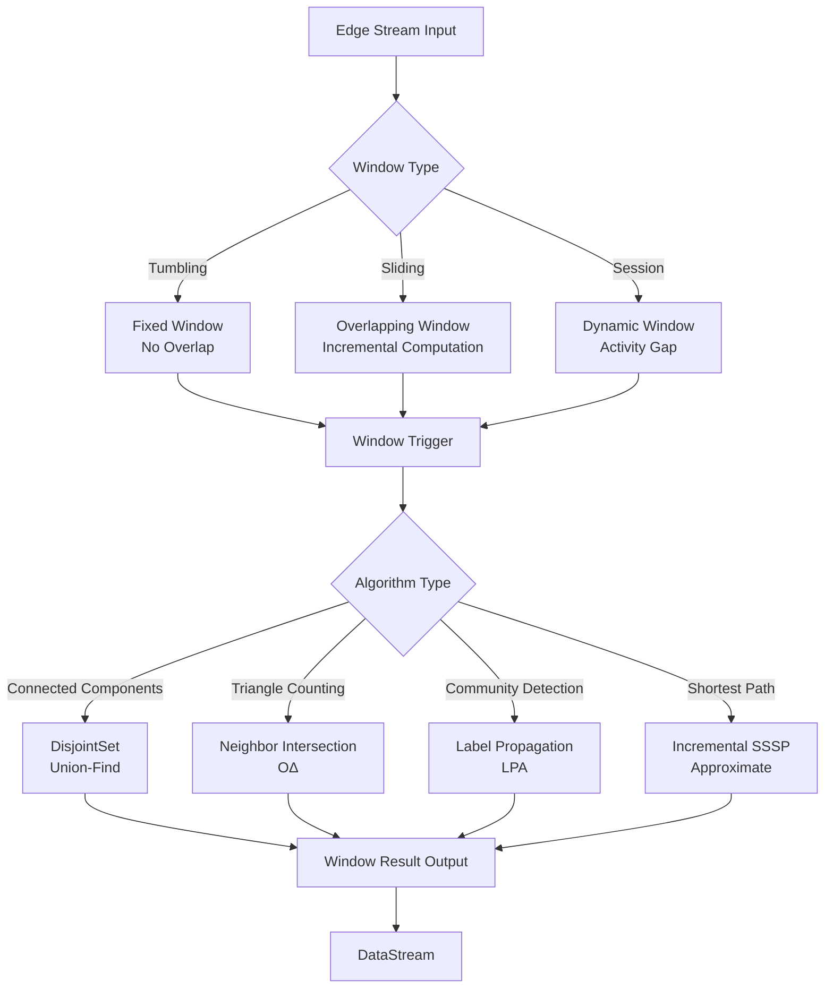
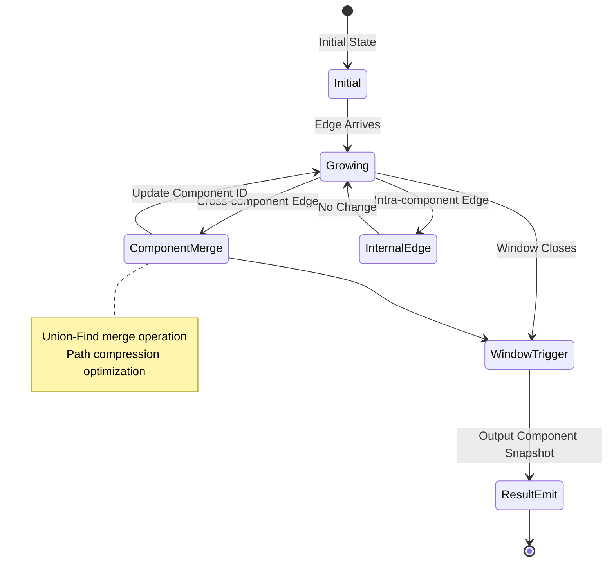
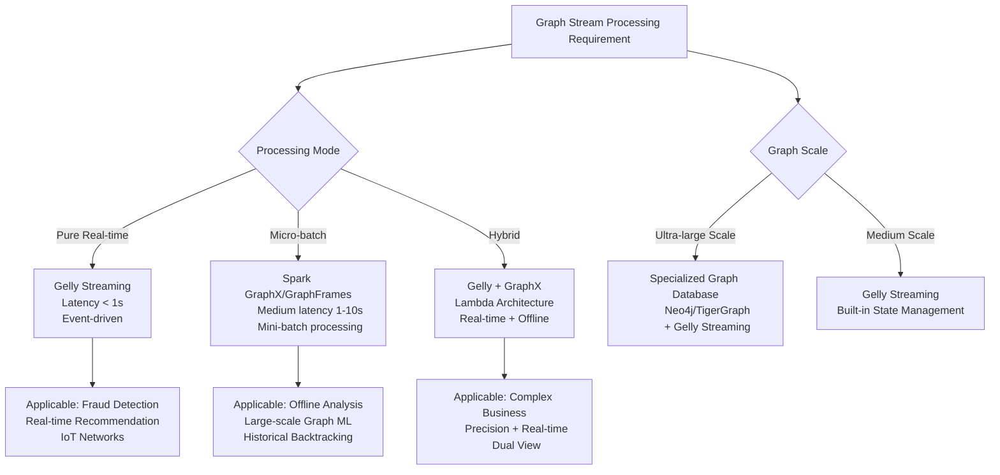

# Flink Gelly Streaming - Graph Stream Processing

> Stage: Flink | Prerequisites: [Flink Gelly](flink-gelly.md), [Flink DataStream API](../../01-concepts/datastream-v2-semantics.md) | Formalization Level: L4

---

## 1. Concept Definitions

### 1.1 Graph Stream Data Model

**Def-F-14-31** (Graph Stream Data Model). Let a graph stream be a sequence of graphs evolving over time $\mathcal{G} = \{G_t\}_{t=0}^{\infty}$, where the graph state at each time point is:

$$
G_t = (V_t, E_t, A_t^V, A_t^E)
$$

- $V_t$: vertex set at time $t$
- $E_t \subseteq V_t \times V_t \times \mathbb{T}$: timestamped edge set, $\mathbb{T}$ is the time domain
- $A_t^V: V_t \to \Sigma^*$: vertex attribute function
- $A_t^E: E_t \to \Sigma^*$: edge attribute function

The evolution of the graph stream is driven by the edge stream $\mathcal{E} = \{e_1, e_2, ..., e_n\}$, where each edge $e_i = (u_i, v_i, t_i, a_i)$ contains source vertex, target vertex, timestamp, and attributes.

**Def-F-14-32** (Edge Addition Stream Model). Gelly Streaming adopts the edge addition stream model, defining graph update operations as:

$$
G_{t+1} = G_t \oplus \{e | timestamp(e) = t+1\}
$$

Where $\oplus$ is the graph merge operation, including implicit vertex creation (automatically creating endpoints when they do not exist).

Edge addition stream model assumptions:

1. **Monotonicity**: Edges only increase (edge deletion is implemented via marking)
2. **Temporal Ordering**: Edges arrive in non-decreasing timestamp order
3. **Bounded Latency**: Edge latency $\delta = t_{arrive} - t_{event}$ is bounded

**Def-F-14-33** (GraphStream Abstraction). The core abstraction of Gelly Streaming `GraphStream<K, VV, EV>` is defined as:

```
GraphStream<K, VV, EV> = DataStream<Edge<K, EV>> × StateBackend
                         × WindowAssigner × Trigger
```

Where:

- `K`: vertex identifier type
- `VV`: vertex value type (stored in the state backend)
- `EV`: edge value type
- `StateBackend`: distributed state storage (Memory/RocksDB)
- `WindowAssigner`: time window assigner
- `Trigger`: window trigger strategy

**Def-F-14-34** (Graph Window Slice). Let time window $W = [t_{start}, t_{end})$, the graph window slice is defined as:

$$
G[W] = (V_W, E_W) = \left(\bigcup_{(u,v,t)\in E_W}\{u,v\}, \{(u,v,t)\in E | t\in W\}\right)
$$

Window slices support three semantics:

- **Tumbling Window**: Non-overlapping fixed-length windows $W_i = [i\cdot T, (i+1)\cdot T)$
- **Sliding Window**: Overlapping windows $W_i = [i\cdot S, i\cdot S+L)$, slide step $S < L$
- **Session Window**: Dynamic-length windows, defined by activity gap $gap$

### 1.2 Distributed Graph Summarization

**Def-F-14-35** (Distributed Graph Summarization). Let graph $G=(V,E)$, graph summarization is the compressed graph $G'=(V',E')$ induced by mapping function $\phi: V \to V'$, where:

$$
E' = \{(\phi(u), \phi(v), agg(\{w(u,v) | \phi(u)=u' \land \phi(v)=v'\})) | (u,v)\in E\}
$$

$agg$ is the edge weight aggregation function (SUM/MAX/AVG).

In streaming scenarios, graph summarization must support incremental updates:

$$
\phi_{t+1} = \begin{cases}
\phi_t \cup \{v_{new} \to c_{new}\} & \text{if } v_{new} \text{ creates new cluster} \\
\phi_t \cup \{v_{new} \to c_{existing}\} & \text{if } v_{new} \text{ merges into existing cluster}
\\
\phi_t \setminus \{v_{del} \to c\} & \text{if } v_{del} \text{ is deleted}
\end{cases}
$$

---

## 2. Property Derivations

### 2.1 Graph Stream Algorithm Complexity

**Lemma-F-14-11** (Window Slice Complexity). For time window $W$, let the number of edges in the window be $|E_W|$ and the number of vertices be $|V_W|$, then:

1. **Storage Complexity**: $O(|V_W| + |E_W|)$, maintained by the state backend
2. **Incremental Update Complexity**: $O(\Delta|E_W| \cdot d_{avg})$, where $d_{avg}$ is the average degree
3. **Full Recomputation Complexity**: $O(|E_W| \cdot T_{algo})$, where $T_{algo}$ is the algorithm time complexity

**Proof.**

- Storage: The state backend stores vertex states and edge sets in Key-Value form, space is linear in graph size
- Incremental: Each new edge triggers local updates at its two endpoints, affecting the endpoint neighbor sets, whose size is proportional to the degree
- Full: When the window triggers, the complete algorithm is executed, complexity is determined by the algorithm itself $\square$

**Lemma-F-14-12** (Approximation Bound for Streaming Connected Components). Under the edge addition stream model, let the graph evolution rate be $\lambda$ (edges/sec) and the algorithm processing latency be $\tau$, then the lag error bound for connected component identification is:

$$
|CC_{true}(t) - CC_{approx}(t)| \leq \lambda \cdot \tau \cdot (1 + \frac{2}{|V|})
$$

**Lemma-F-14-13** (Memory Bound for Triangle Counting). For the $k$-hop neighbor storage strategy, the memory consumption upper bound for streaming triangle counting is:

$$
M_{triangle} \leq |V| \cdot d_{max}^k \cdot (|K| + |VV|)
$$

Where $d_{max}$ is the maximum degree, $k$ is the hop count, $|K|$ is the vertex ID size, and $|VV|$ is the vertex value size.

### 2.2 State Management Properties

**Prop-F-14-21** (State Consistency Guarantee). Gelly Streaming state updates satisfy:

1. **Atomicity**: All state updates triggered by a single edge processing are atomically committed within a transaction
2. **Fault Tolerance**: Failures within Checkpoint period $T_{cp}$, state rolls back to the latest checkpoint
3. **Repeatable Read**: The same edge sequence produces the same state after any failure recovery

---

## 3. Relationship Establishment

### 3.1 Static Graph vs Stream Graph Comparison

| Dimension | Static Graph (Gelly Batch) | Stream Graph (Gelly Streaming) |
|------|---------------------|----------------------|
| **Data Model** | $G = (V, E)$ snapshot | $\mathcal{G} = \{G_t\}_{t=0}^{\infty}$ sequence |
| **Processing Mode** | Full batch processing | Incremental/window processing |
| **Algorithm Output** | Precise converged result | Approximate/sliding result |
| **State Storage** | Iteration cache | Keyed State |
| **Latency Requirement** | Minutes-hours level | Milliseconds-seconds level |
| **Memory Strategy** | Full graph in memory | Window state + incremental index |

### 3.2 Gelly Streaming and DataStream Relationship

```
DataStream<Edge<K, EV>>
         ↓
    SimpleEdgeStream  (Graph stream abstraction)
         ↓
    ┌────┴────┐
    ↓         ↓
GraphStream  GraphWindowStream
    ↓              ↓
Graph Algorithms  Windowed Analytics
    ↓              ↓
DataStream<Result>  DataStream<WindowResult>
```

**Mapping Table**:

| Gelly Streaming | Underlying DataStream | State Type |
|----------------|----------------|---------|
| `SimpleEdgeStream` | `DataStream<Edge>` | Stateless |
| `GraphStream` | `KeyedProcessFunction` | `ValueState<VertexState>` |
| `GraphWindowStream` | `WindowedStream` | `ListState<Edge>` + `MapState<Vertex>` |
| `DisjointSet` (Connected Components) | `KeyedBroadcastState` | `MapState<ComponentID>` |

### 3.3 Integration with Graph Databases

| System Type | Positioning | Integration Mode |
|---------|------|---------|
| **Gelly Streaming** | Stream graph compute engine | Real-time analytics layer |
| **Neo4j** | Transactional graph database | Query result import/export |
| **JanusGraph** | Distributed graph storage | Bulk data exchange |
| **TigerGraph** | Native parallel graph database | Complementary (batch vs real-time) |

---

## 4. Argumentation

### 4.1 Stream Graph Processing Applicability Analysis

**Prop-F-14-22** (Stream Graph Algorithm Selection Decision Tree). Criteria for choosing stream processing for a given graph analysis problem:

1. **Real-time Requirement** $R < 10s$: Must adopt stream processing
2. **Graph Evolution Frequency** $f_{change} > 1/T_{batch}$: Batch processing cannot keep up with change speed
3. **Algorithm Decomposability**: Algorithm can be expressed in incremental update form
4. **Accuracy Tolerance**: Approximate results are acceptable (error $< \epsilon$)

**Counterexample Analysis**:

- **Global PageRank**: Requires full-graph iterative convergence, not suitable for pure stream processing (requires approximate algorithms such as incremental PageRank)
- **Graph Coloring**: Requires global consistency constraints, may produce conflicts in stream environments

### 4.2 Limitations of Edge Addition Model

**Boundary Discussion**: The edge addition model assumes monotonically increasing edges. In practical applications, the following must be handled:

1. **Edge Deletion**: Implemented via tombstone marking + garbage collection
2. **Attribute Update**: Treated as edge deletion + re-addition
3. **Out-of-order Arrival**: Relies on Watermark mechanism, late data joins subsequent windows

---

## 5. Proof / Engineering Argument

### 5.1 Streaming Connected Components Correctness

**Thm-F-14-21** (Correctness of Streaming Connected Components Algorithm). Let edge stream $\mathcal{E}$ arrive in non-decreasing timestamp order, and the algorithm outputs connected component identifier $C_t(v)$ at each time $t$, then:

$$
\forall t, \forall u,v\in V_t: C_t(u) = C_t(v) \iff \exists\text{path } u \leadsto v \text{ in } G_t
$$

**Proof.** By induction:

*Base*: $t=0$, $G_0 = \emptyset$, all vertices form their own component, the proposition holds.

*Inductive Hypothesis*: Assume the proposition holds at time $t$.

*Inductive Step*: At time $t+1$, edge $e=(u,v)$ is added. Two cases:

1. **$C_t(u) = C_t(v)$**: Edge is added inside a component, component structure unchanged, proposition holds
2. **$C_t(u) \neq C_t(v)$**: Two different components merge, the algorithm updates all $C(v')$ to $C(u)$, in the new graph $u,v$ are connected and belong to the same component, other vertex connectivity unchanged

By induction, the proposition holds for all $t$. $\square$

### 5.2 Incremental Triangle Counting Complexity

**Thm-F-14-22** (Incremental Triangle Counting Complexity Upper Bound). Let the maximum degree of graph $G$ be $\Delta$, the time complexity of the streaming triangle counting algorithm processing a single edge is $O(\Delta)$.

**Proof Sketch.**

A new edge $e=(u,v)$ can form triangles only with common neighbors of $u$ and $v$. The common neighbor set $N(u) \cap N(v)$ satisfies:

$$
|N(u) \cap N(v)| \leq \min(|N(u)|, |N(v)|) \leq \Delta
$$

The algorithm needs to query the neighbor sets of $u$ and $v$ ($O(1)$ hash lookup) and compute their intersection ($O(\Delta)$), therefore single-edge processing time is $O(\Delta)$. $\square$

### 5.3 Engineering Performance Optimization Argument

**Partitioning Strategy Argument**:

| Strategy | Applicable Scenario | Load Balance | Communication Overhead |
|------|---------|---------|---------|
| **Hash Partition** | General scenarios | Good | High |
| **Range Partition** | Temporal graphs | Medium | Medium |
| **DGR (Degree-Based)** | Power-law graphs | Poor | Low |
| **HDRF** | Stream partitioning | Medium | Low |

**Thm-F-14-23** (Impact of Partitioning Strategy on Locality). For graphs with power-law degree distribution, degree-aware partitioning (DGR) can reduce cross-partition edges by $O(\log |V|)$ times compared to hash partitioning.

---

## 6. Examples

### 6.1 Social Network Real-time Analysis

**Scenario**: Twitter real-time social network, analyzing user influence propagation and community evolution.

```java

// [伪代码片段 - 不可直接运行] 仅展示核心逻辑
import org.apache.flink.streaming.api.datastream.DataStream;
import org.apache.flink.streaming.api.windowing.time.Time;

// Create SimpleEdgeStream from DataStream
DataStream<Edge<Long, Double>> tweetEdges = tweets
    .flatMap(new TweetToEdgeMapper())  // Extract follow/retweet relationships
    .assignTimestampsAndWatermarks(
        WatermarkStrategy.<Edge<Long, Double>>forBoundedOutOfOrderness(
            Duration.ofSeconds(5)
        ).withTimestampAssigner((e, ts) -> e.getTimestamp())
    );

SimpleEdgeStream<Long, Double> edgeStream = new SimpleEdgeStream<>(tweetEdges, env);

// Create GraphWindowStream with 5-minute tumbling window
GraphWindowStream<Long, NullValue, Double> windowedGraph = edgeStream
    .slice(Time.minutes(5), Time.minutes(5));  // Tumbling window

// Compute connected components for each window
DataStream<Component<Long>> communities = windowedGraph
    .apply(new ConnectedComponentsAlgorithm<>())
    .mapWindowResult((window, components) -> {
        // Component feature extraction
        int componentCount = components.size();
        int maxComponentSize = components.stream()
            .mapToInt(c -> c.getVertices().size())
            .max().orElse(0);
        return new ComponentAnalysis(window.getEnd(), componentCount, maxComponentSize);
    });

// Community evolution detection
communities
    .keyBy(ComponentAnalysis::getWindowEnd)
    .window(SlidingEventTimeWindows.of(Time.hours(1), Time.minutes(10)))
    .aggregate(new CommunityEvolutionDetector())
    .addSink(new AlertSink());
```

### 6.2 Financial Risk Control Real-time Graph Analysis

**Scenario**: Real-time transaction network, detecting suspicious capital aggregation and rapid transfer patterns.

```java

// [伪代码片段 - 不可直接运行] 仅展示核心逻辑
import org.apache.flink.streaming.api.datastream.DataStream;
import org.apache.flink.streaming.api.windowing.time.Time;

// Build transaction edge stream
DataStream<Edge<String, TransactionInfo>> txEdges = transactions
    .map(tx -> new Edge<>(
        tx.getFromAccount(),
        tx.getToAccount(),
        new TransactionInfo(tx.getAmount(), tx.getTimestamp(), tx.getType())
    ));

SimpleEdgeStream<String, TransactionInfo> txStream = new SimpleEdgeStream<>(txEdges, env);

// Sliding window graph analysis (1-hour window, 5-minute slide)
GraphWindowStream<String, AccountInfo, TransactionInfo> slidingGraph = txStream
    .slice(Time.hours(1), Time.minutes(5));

// Compute triangle counting (detect closed-loop transactions)
DataStream<TriangleCountResult> triangleCounts = slidingGraph
    .apply(new TriangleCountAlgorithm<>())
    .mapWindowResult((window, count) ->
        new TriangleCountResult(window.getEnd(), count)
    );

// Anomaly detection: sudden spike in triangle count may indicate money laundering
triangleCounts
    .keyBy(TriangleCountResult::getWindowEnd)
    .process(new AnomalyDetectionProcessFunction(
        /* threshold */ 100,
        /* z-score threshold */ 3.0
    ))
    .filter(alert -> alert.getSeverity() > AlertSeverity.MEDIUM)
    .addSink(new FraudAlertSink());
```

### 6.3 Building GraphStream from DataStream

```java
// Define vertex state

import org.apache.flink.streaming.api.datastream.DataStream;
import org.apache.flink.streaming.api.windowing.time.Time;

public class VertexState {
    private long degree;
    private double pagerank;
    private long lastUpdateTime;
    // getters/setters
}

// Custom GraphStream construction
DataStream<Edge<Long, Double>> edgeStream = ...;

// Method 1: Use SimpleEdgeStream (stateless edge stream)
SimpleEdgeStream<Long, Double> simpleStream = new SimpleEdgeStream<>(edgeStream, env);

// Method 2: Use GraphStream with vertex state
GraphStream<Long, VertexState, Double> graphStream = simpleStream
    .mapEdges(edge -> {
        edge.setValue(Math.log(edge.getValue() + 1));  // Log transformation of edge weight
        return edge;
    })
    .filterVertices((id, state) -> state.getDegree() > 10)  // Filter low-degree vertices
    .withVertexState(
        // Initial state factory
        id -> new VertexState(0, 1.0, System.currentTimeMillis()),
        // State update function
        (state, edge, isSource) -> {
            state.setDegree(state.getDegree() + 1);
            state.setLastUpdateTime(System.currentTimeMillis());
            return state;
        }
    );

// Global aggregation: Compute graph statistics
DataStream<GraphStatistics> stats = graphStream
    .globalAggregate(new GraphStatisticsAggregator() {
        @Override
        public GraphStatistics createAccumulator() {
            return new GraphStatistics();
        }

        @Override
        public void add(Edge<Long, Double> edge, GraphStatistics acc) {
            acc.incrementEdgeCount();
            acc.addToTotalWeight(edge.getValue());
        }

        @Override
        public GraphStatistics getResult(GraphStatistics acc) {
            acc.setAverageWeight(acc.getTotalWeight() / acc.getEdgeCount());
            return acc;
        }
    });

// Neighborhood aggregation: Compute weighted in-degree for each vertex
DataStream<Vertex<Long, Double>> weightedDegrees = graphStream
    .neighborhood(new NeighborhoodAggregation<Long, VertexState, Double, Double>() {
        @Override
        public Double mapEdge(Edge<Long, Double> edge, boolean isIncoming) {
            return isIncoming ? edge.getValue() : 0.0;
        }

        @Override
        public Double reduceEdges(Double v1, Double v2) {
            return v1 + v2;
        }

        @Override
        public Vertex<Long, Double> applyToVertex(
            Long vertexId,
            VertexState state,
            Double aggregatedValue
        ) {
            return new Vertex<>(vertexId, aggregatedValue);
        }
    });

// Convert results back to DataStream for subsequent processing
weightedDegrees
    .keyBy(Vertex::getId)
    .window(TumblingEventTimeWindows.of(Time.minutes(1)))
    .aggregate(new TopKAggregator(100))  // Top 100 high-influence users
    .addSink(new DashboardSink());
```

### 6.4 State Backend Configuration Optimization

```java
// [伪代码片段 - 不可直接运行] 仅展示核心逻辑
// RocksDB state backend configuration (large state scenarios)
RocksDBStateBackend rocksDbBackend = new RocksDBStateBackend(
    "hdfs://namenode:8020/flink/checkpoints",
    true  // incremental checkpoint
);

// Configure RocksDB tuning
DefaultConfigurableOptionsFactory optionsFactory = new DefaultConfigurableOptionsFactory();
optionsFactory.setRocksDBOptions("max_background_jobs", "4");
optionsFactory.setRocksDBOptions("write_buffer_size", "64MB");
optionsFactory.setRocksDBOptions("target_file_size_base", "32MB");
rocksDbBackend.setRocksDBOptions(optionsFactory);

env.setStateBackend(rocksDbBackend);

// Enable incremental checkpoint and local recovery
env.getCheckpointConfig().enableExternalizedCheckpoints(
    ExternalizedCheckpointCleanup.RETAIN_ON_CANCELLATION
);
env.getCheckpointConfig().setPreferCheckpointForRecovery(true);
```

---

## 7. Visualizations

### 7.1 Gelly Streaming Architecture Hierarchy



### 7.2 Window Slicing and Algorithm Execution Flow



### 7.3 Streaming Connected Components State Evolution



### 7.4 Gelly Streaming vs Spark GraphX Comparison Matrix



### 7.5 Triangle Counting Algorithm Flow

```mermaid
flowchart LR
    A[New Edge Arrives<br/>e=u,v] --> B[Query u Neighbor Set<br/>N]
    A --> C[Query v Neighbor Set<br/>N']

    B --> D[Compute Intersection<br/>N ∩ N']
    C --> D

    D --> E{Intersection Size}
    E -->|> 0| F[Form<br/>|N∩N'| New<br/>Triangles]
    E -->|= 0| G[No New Triangle]

    F --> H[Update Global Count]
    G --> I[Keep State]

    H --> J[Update Neighbor Index]
    I --> J

    J --> K[Wait for Next Edge]

    style F fill:#90EE90
    style G fill:#FFB6C1
```

---

## 8. References


---

*Document Version: 1.0 | Created: 2026-04-02 | Status: Complete*
