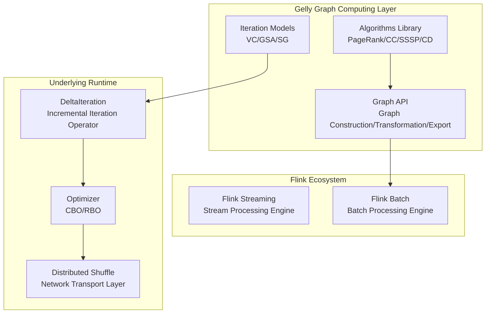
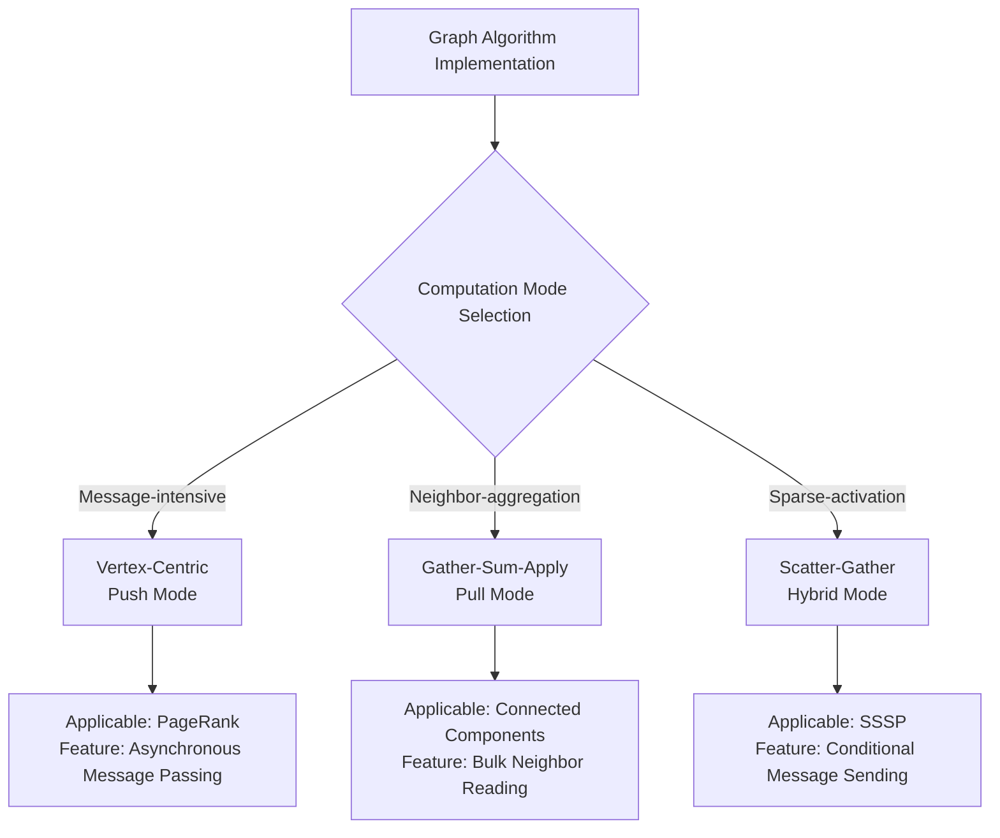
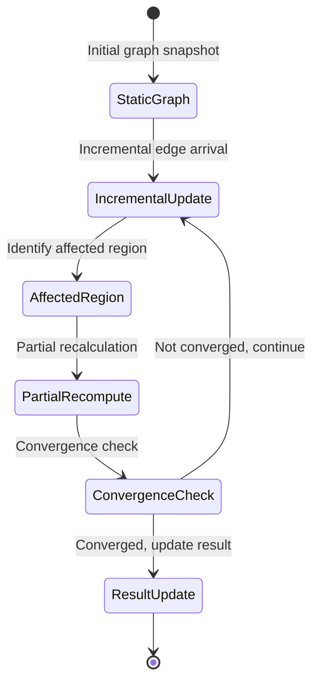
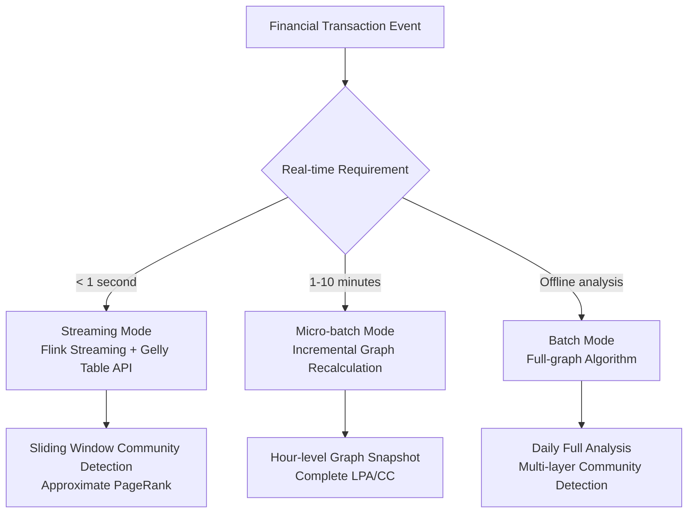

# Flink Gelly - Large-Scale Graph Computing

> Stage: Flink | **Prerequisites**: [Flink DataStream V2 Semantics](../../01-concepts/datastream-v2-semantics.md), [Iteration Mechanisms](./flink-gelly-streaming-graph-processing.md) | **Formalization Level**: L3

## 1. Concept Definitions

**Def-F-14-01** (Graph Data Model). Let the graph data model be a pair $G = (V, E)$, where:

- $V$ is the vertex set, each vertex $v ∈ V$ has a unique identifier $id(v)$ and attribute value $A_V(v): ℙ(V) → Σ^*$
- $E ⊆ V × V$ is the edge set, each edge $e = (u, v) ∈ E$ has direction, weight $w(e) ∈ ℝ^+$ and attribute value $A_E(e): ℙ(E) → Σ^*$

In Flink Gelly, a graph is represented as two DataSets:

```
Graph<K, VV, EV> = (DataSet<Vertex<K, VV>>, DataSet<Edge<K, EV>>)
```

Where:

- `K`: Vertex identifier type
- `VV`: Vertex value type
- `EV`: Edge value type

**Def-F-14-02** (Iterative Graph Algorithm - BSP Model). The BSP (Bulk Synchronous Parallel) model defines the execution semantics of graph algorithms:

Let the computation state at iteration $i$ be $S_i = (V_i, E_i, M_i)$, where $M_i$ is the message set. The BSP execution process is:

$$
S_{i+1} = Γ(S_i) = (V_i', E_i', M_{i+1})
$$

Where $Γ$ is the global synchronization operation, comprising three ordered phases:

1. **Local Computation (Compute)**: Each vertex $v$ executes a user-defined function based on its current state and received messages $M_i(v)$, generating a new state and new messages
2. **Global Communication (Communication)**: Route messages to destination vertices
3. **Synchronization Barrier (Synchronization)**: Wait for all vertices to complete computation before entering the next iteration

Termination condition: Stop when $M_i = ∅$ or the maximum iteration count $I_{max}$ is reached.

**Def-F-14-03** (Incremental Graph Update). Let the original graph be $G_t = (V_t, E_t)$, and the incremental update be $ΔG = (ΔV^+, ΔV^-, ΔE^+, ΔE^-)$, where:

- $ΔV^+$: Added vertex set
- $ΔV^-$: Deleted vertex set
- $ΔE^+$: Added edge set
- $ΔE^-$: Deleted edge set

The incremental graph update is defined as:

$$
G_{t+1} = (V_t \setminus ΔV^- \cup ΔV^+, E_t \setminus ΔE^- \cup ΔE^+ \\ \{(u,v) | u ∈ ΔV^- ∨ v ∈ ΔV^-\})
$$

Incremental algorithm recalculation only performs local computation on the affected region $A(ΔG) ⊆ V$, rather than recomputing the entire graph.

---

## 2. Property Derivation

**Lemma-F-14-01** (Gelly Graph Invariant). For any valid Flink Gelly graph instance, the following hold:

1. **Identifier Uniqueness**: $∀ v_1, v_2 ∈ V: id(v_1) = id(v_2) ⇒ v_1 = v_2$
2. **Edge Validity**: $∀ (u,v) ∈ E: u ∈ V ∧ v ∈ V$
3. **Partition Locality**: An edge resides in the same partition as its source vertex

**Proof.** Guaranteed by the DataSet distributed hash partitioning strategy and Gelly's `Graph.fromDataSet` constructor. $□$

**Lemma-F-14-02** (BSP Iteration Monotonicity). Under the BSP model, if the vertex computation function is monotonic (i.e., state updates depend only on previous states), then algorithm convergence is unaffected by message delivery order.

**Lemma-F-14-03** (Incremental Update Impact Scope). The impact scope $A(ΔG)$ of an incremental update $ΔG$ satisfies:

$$
|A(ΔG)| ≤ |ΔV^+| + |ΔV^-| + 2|ΔE^+| + 2|ΔE^-| + Σ_{v ∈ ΔV} degree(v)
$$

That is, the computational complexity of an incremental update is linearly related to the change scale, rather than the full graph scale.

---

## 3. Relation Establishment

### 3.1 Relationship between Gelly and Flink Core APIs

| Gelly Component | Underlying Implementation | Data Stream Semantics |
|-----------------|---------------------------|-----------------------|
| `Graph` | `DataSet<Vertex>` + `DataSet<Edge>` | Batch data set |
| `VertexCentricIteration` | `DeltaIteration` | Incremental iteration operator |
| `Gather-Sum-Apply` | `MapFunction` + `ReduceFunction` | Parallel aggregation operation |
| `Scatter-Gather` | `JoinFunction` + `CoGroup` | Message passing pattern |

### 3.2 Graph Algorithm to Computation Model Mapping

```
Vertex-Centric Model ←─BSP─→ Pregel/Giraph
         ↓
   Gather-Sum-Apply ←───→ Gelly GSA
         ↓
   Scatter-Gather   ←───→ Gelly SG
```

### 3.3 Fusion Point with Stream Computing

| Dimension | Batch Graph Computing | Streaming Graph Computing |
|-----------|----------------------|---------------------------|
| Graph State | Static snapshot | Dynamic evolution |
| Update Mode | Full recomputation | Incremental update |
| Result Timeliness | Offline, hour-level | Real-time, second-level |
| Applicable Algorithms | Global convergence algorithms | Approximate/sliding-window algorithms |

---

## 4. Argumentation

### 4.1 Algorithm Applicability Analysis

**Prop-F-14-01** (Algorithm Selection Decision Tree). Criteria for selecting a Gelly computation mode for a given graph algorithm problem:

1. **Message-intensive** (e.g., PageRank): Prefer Vertex-Centric Iteration
2. **Neighbor-aggregation** (e.g., Connected Components): Prefer Gather-Sum-Apply
3. **Sparse-activation** (e.g., SSSP from single source): Prefer Scatter-Gather

**Counterexample Analysis**: For dense graphs ($|E| ≈ |V|^2$), the GSA mode may degrade into a full-graph broadcast during the Gather phase because it needs to pull data from all neighbors, in which case the Vertex-Centric push mode is superior.

### 4.2 Incremental Computation Boundary Discussion

**Boundary Condition**: When the graph update frequency $f_{update}$ and algorithm convergence time $T_{converge}$ satisfy $f_{update} > 1/T_{converge}$, the incremental algorithm may be unable to complete convergence between two updates, requiring downgrade to approximate algorithms or sampling strategies.

---

## 5. Formal Proof / Engineering Argument

### 5.1 Core Algorithm Correctness Proof

**Thm-F-14-01** (PageRank Convergence in Gelly). Let the adjacency matrix of graph $G=(V,E)$ be $A$, and the damping coefficient be $d$. Then the PageRank iteration implemented in Gelly:

$$
PR_{i+1}(v) = \frac{1-d}{|V|} + d \sum_{u ∈ N_{in}(v)} \frac{PR_i(u)}{|N_{out}(u)|}
$$

Converges to the principal eigenvector as $i → ∞$.

**Proof Sketch.**

1. The iterative formula corresponds to the matrix form of the original Google PageRank: $\vec{PR}_{i+1} = d \cdot M \cdot \vec{PR}_i + \frac{1-d}{|V|} \cdot \vec{1}$
2. Matrix $M$ is a column-stochastic matrix; according to the Perron-Frobenius theorem, a unique stationary distribution exists
3. Gelly's BSP iteration guarantees global synchronization each round, and the numerical computation is consistent with the theoretical model
4. The convergence condition $\|\vec{PR}_{i+1} - \vec{PR}_i\|_1 < \epsilon$ is automatically detected by the framework $\square$

### 5.2 Engineering Implementation Argument

**Gelly Architecture Advantages Argument**:

| Feature | Engineering Benefit | Theoretical Basis |
|---------|---------------------|-----------------|
| DataSet Foundation | Automatically gains Flink optimizer (CBO), memory management, serialization advantages | Relational algebra equivalence transformation |
| Iteration Operator Reuse | Utilizes `DeltaIteration` caching mechanism to reduce data transfer | Iteration spatial locality principle |
| Three Programming Models | Covers optimal implementation choices for different algorithm patterns | Computation-communication trade-off theory |

---

## 6. Example Verification

### 6.1 Social Network Real-Time Recommendation

**Scenario**: Based on a user-item interaction graph, compute Personalized PageRank in real time for recommendations.

```java
// [伪代码片段 - 不可直接运行] 仅展示核心逻辑
// Build user-item bipartite graph
Graph<Long, Double, Double> bipartiteGraph = Graph.fromDataSet(
    users.union(items),  // Vertex DataSet
    interactions,        // Edge DataSet (user -> item, weight = interaction strength)
    env
);

// Run Personalized PageRank for each user
DataSet<Vertex<Long, Double>> recommendations = bipartiteGraph
    .runVertexCentricIteration(
        new PersonalizedPageRankComputeFunction(targetUser),
        new PersonalizedPageRankMessageCombiner(),
        maxIterations
    )
    .getVertices();

// Filter item vertices, sort recommendations by PageRank value
DataSet<Tuple2<Long, Double>> topItems = recommendations
    .filter(v -> isItemVertex(v.getId()))
    .map(v -> new Tuple2<>(v.getId(), v.getValue()))
    .sortPartition(1, Order.DESCENDING)
    .first(topK);
```

**Streaming Enhancement**: Combine with Flink Streaming's `IntervalJoin` to merge incremental user behaviors into the graph snapshot in real time, triggering local recalculation.

### 6.2 Fraud Detection Graph Analysis

**Scenario**: In a financial transaction network, identify abnormal capital concentration patterns through community detection.

```java
// [伪代码片段 - 不可直接运行] 仅展示核心逻辑
// Build transaction graph: vertices = accounts, edges = transactions (with amount and timestamp)
Graph<String, AccountInfo, Transaction> transactionGraph = ...;

// Apply Label Propagation algorithm to detect communities
Graph<String, AccountInfo, Transaction> communities = transactionGraph
    .runScatterGatherIteration(
        new LabelPropagationScatter(),   // Send labels to neighbors
        new LabelPropagationGather(),    // Collect neighbor labels
        maxIterations
    );

// Identify suspicious communities: small size but high transaction density
DataSet<Community> suspiciousCommunities = communities
    .getVertices()
    .groupBy(Community::getLabel)
    .reduceGroup(new AnomalyScoreCalculator());
```

**Temporal Graph Analysis Enhancement**:

```java

// [伪代码片段 - 不可直接运行] 仅展示核心逻辑
import org.apache.flink.streaming.api.datastream.DataStream;
import org.apache.flink.streaming.api.windowing.time.Time;

// Convert transaction stream to temporal graph slices
DataStream<Graph<String, AccountInfo, Transaction>> timeSliceGraphs =
    transactions
        .keyBy(Transaction::getTimestamp)
        .window(TumblingEventTimeWindows.of(Time.hours(1)))
        .aggregate(new GraphBuilderAggregate());

// Detect community evolution anomalies
timeSliceGraphs
    .keyBy(Graph::getTimeSlice)
    .process(new CommunityEvolutionMonitor());
```

---

## 7. Visualizations

### 7.1 Gelly Architecture Hierarchy Diagram

Gelly's position in the Flink technology stack:



### 7.2 Comparison Matrix of Three Iteration Models



### 7.3 Dynamic Graph Update Processing Flow



### 7.4 Fraud Detection Scenario Decision Tree



---

## 8. References
