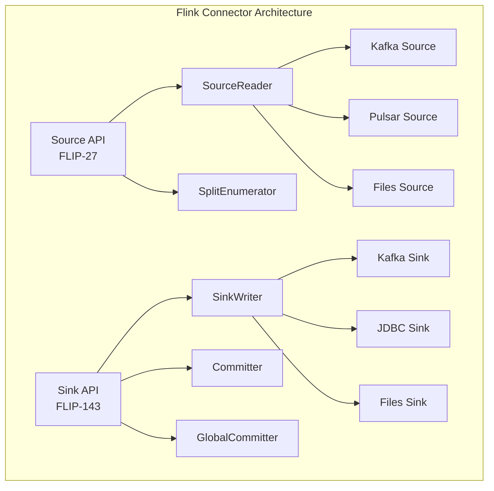
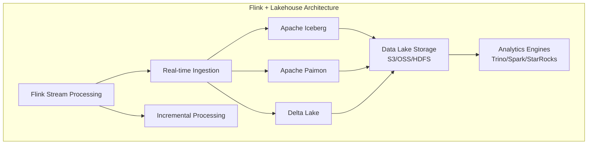
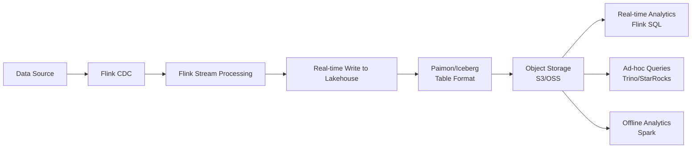
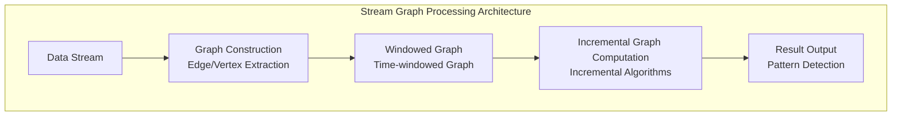
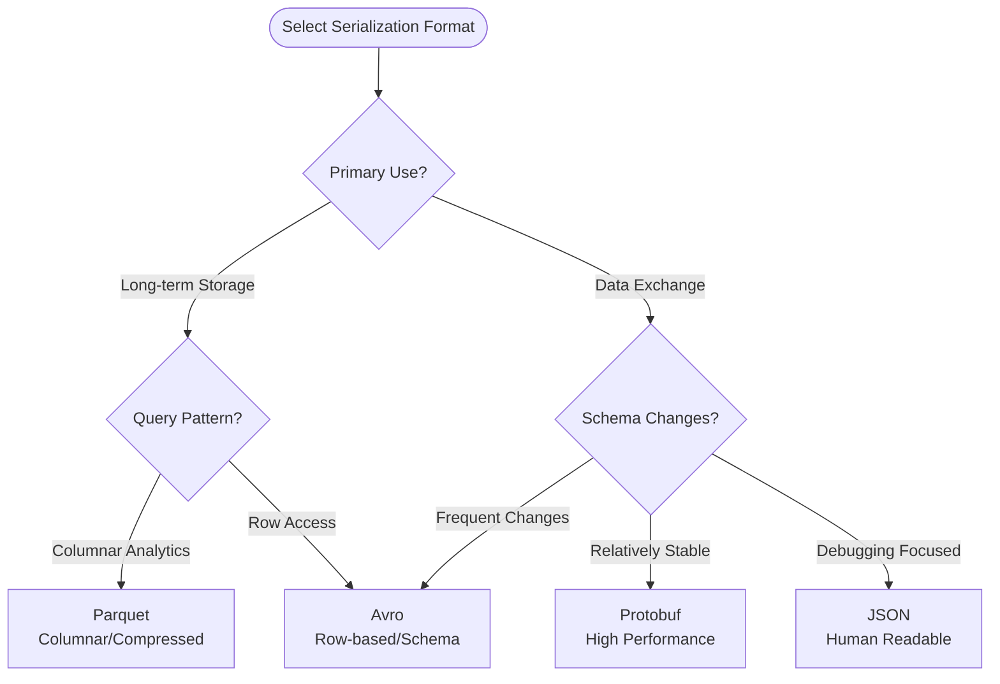
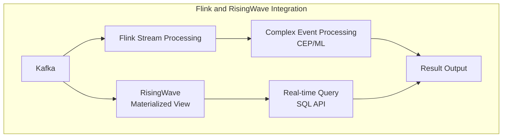
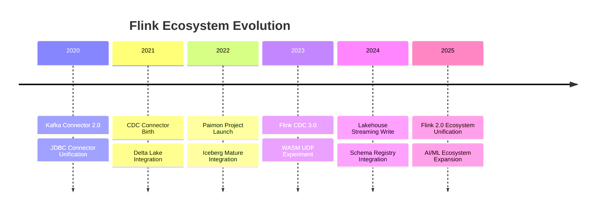
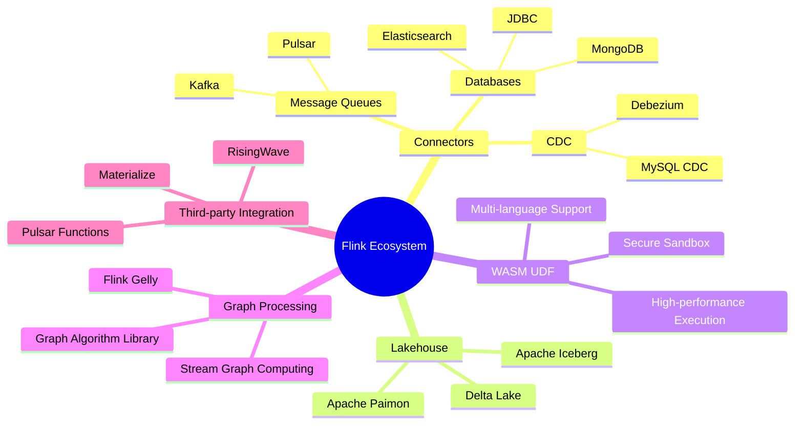

# Flink Ecosystem Overview

> **Status**: Forward-looking | **Expected Release**: From 2026-Q3 | **Last Updated**: 2026-04-12
> 
> ⚠️ The features described in this document are in early discussion stages and have not been officially released. Implementation details may change.

> Stage: Flink | Prerequisites: [Flink API Layer](../03-api/) | Formalization Level: L3

This document is the authoritative navigation center for the Flink ecosystem layer, comprehensively covering Flink's integration capabilities with external systems. From Source/Sink Connectors, Lakehouse storage integration, WASM UDF extensions, to graph computing and machine learning ecosystems, this directory provides a complete technical reference for building end-to-end stream processing solutions.

---

## Directory Structure Navigation

```
05-ecosystem/
├── README.md                          # This file - Ecosystem Overview
├── 05.01-connectors/                  # Connector Ecosystem
│   ├── flink-connectors-ecosystem-complete-guide.md
│   ├── kafka-integration-patterns.md
│   ├── flink-cdc-3.0-data-integration.md
│   └── evolution/                     # Connector Evolution
├── 05.02-lakehouse/                   # Lakehouse Integration
│   ├── streaming-lakehouse-architecture.md
│   ├── flink-iceberg-integration.md
│   ├── flink-paimon-integration.md
│   └── streaming-lakehouse-deep-dive-2026.md
├── 05.03-wasm-udf/                    # WASM UDF Extensions
│   ├── wasm-streaming.md
│   └── wasi-0.3-async-preview.md
├── 05.04-graph/                       # Graph Processing
│   ├── flink-gelly.md
│   └── flink-gelly-streaming-graph-processing.md
└── ecosystem/                         # Third-party System Integration
    ├── risingwave-integration-guide.md
    ├── pulsar-functions-integration.md
    └── materialize-comparison.md
```

---

## 1. Concept Definitions

### Def-F-05-01: Flink Ecosystem Boundary

The Flink ecosystem defines the **complete set of interfaces** through which the stream processing engine interacts with the **external world**:

```
┌─────────────────────────────────────────────────────────────────┐
│                        Flink Ecosystem Boundary                  │
├─────────────────────────────────────────────────────────────────┤
│                                                                  │
│    ┌─────────┐    ┌─────────┐    ┌─────────┐    ┌─────────┐    │
│    │Sources  │    │Sinks    │    │ Catalog │    │Formats  │    │
│    │(Connectors)│  │(Connectors)│ │(Metadata)│   │(Serialization)│
│    └────┬────┘    └────┬────┘    └────┬────┘    └────┬────┘    │
│         │              │              │              │         │
│    ┌────▼──────────────▼──────────────▼──────────────▼────┐    │
│    │                    Flink Core                        │    │
│    │            (Runtime, State, API)                     │    │
│    └────┬───────────────────────────────────────────┬────┘    │
│         │                                          │         │
│    ┌────▼────┐                              ┌──────▼────┐    │
│    │UDF/UDTF │                              │ML/AI Integration│
│    │(WASM)   │                              │(FLIP-531) │    │
│    └─────────┘                              └───────────┘    │
│                                                                  │
└─────────────────────────────────────────────────────────────────┘
```

### Def-F-05-02: Ecosystem Layering

| Layer | Component Type | Typical Representatives |
|------|----------|----------|
| **Data Ingestion Layer** | Source Connectors | Kafka, Pulsar, CDC, JDBC |
| **Data Output Layer** | Sink Connectors | Elasticsearch, JDBC, HBase |
| **Storage Integration Layer** | Lakehouse | Iceberg, Paimon, Delta Lake |
| **Compute Extension Layer** | UDF/CEP/ML | WASM UDF, Flink ML, AI Agents |
| **Ecosystem Integration Layer** | Third-party Systems | RisingWave, Materialize, Pulsar |

---

## 2. Connectors Ecosystem

### 2.1 Connector Architecture Overview

Flink Connectors are the bridge between Flink and external systems, adopting a unified Source/Sink API design:



### 2.2 Connector Classification Navigation

#### 2.2.1 Message Queue Connectors

| Connector | Version Support | Key Features | Documentation |
|--------|----------|----------|------|
| **Apache Kafka** | Officially Maintained | Exactly-Once, Dynamic Discovery, Partition Migration | [Kafka Integration Patterns](./05.01-connectors/kafka-integration-patterns.md) |
| **Apache Pulsar** | Officially Maintained | Multi-tenancy, Tiered Storage, Geo-Replication | [Pulsar Integration Guide](./05.01-connectors/pulsar-integration-guide.md) |
| **Diskless Kafka** | Experimental | Cloud-native Diskless Architecture | [Diskless Kafka Deep Dive](./05.01-connectors/diskless-kafka-deep-dive.md) |

#### 2.2.2 Database Connectors

| Connector | Support Mode | Key Features | Documentation |
|--------|----------|----------|------|
| **JDBC** | Source/Sink | Batch Write, Connection Pool | [JDBC Complete Guide](./05.01-connectors/jdbc-connector-complete-guide.md) |
| **MongoDB** | Source/Sink | Change Stream, Batch Write | [MongoDB Guide](./05.01-connectors/mongodb-connector-complete-guide.md) |
| **Elasticsearch** | Sink | Bulk Indexing, Dynamic Templates | [ES Connector Guide](./05.01-connectors/flink-elasticsearch-connector-guide.md) |

#### 2.2.3 CDC Connectors

**CDC (Change Data Capture)** is the foundational capability for real-time data integration:

| Connector | Data Sources | Core Features |
|--------|--------|----------|
| Debezium | MySQL/PostgreSQL/MongoDB | Log-based CDC |
| MySQL CDC | MySQL | Native Support, Schema Evolution |
| Oracle CDC | Oracle | Supports Multiple Capture Modes |

**Core Documentation**:

- 📘 [Flink CDC 3.0 Data Integration](./05.01-connectors/flink-cdc-3.0-data-integration.md)
- 📘 [Flink CDC 3.6.0 Guide](./05.01-connectors/flink-cdc-3.6.0-guide.md)
- 🔗 [Debezium Integration](./05.01-connectors/04.04-cdc-debezium-integration.md)

### 2.3 Connector Evolution History

The `05.01-connectors/evolution/` directory records the evolution of connector technology:

| Document | Topic | Evolution Milestone |
|------|------|------------|
| [connector-framework.md](./05.01-connectors/evolution/connector-framework.md) | Connector Framework Evolution | Source API v1→v2 |
| [kafka-connector.md](./05.01-connectors/evolution/kafka-connector.md) | Kafka Connector Evolution | Flink Kafka 0.9→3.0 |
| [cdc-connector.md](./05.01-connectors/evolution/cdc-connector.md) | CDC Connector Evolution | Debezium→Flink CDC |
| [lakehouse-connector.md](./05.01-connectors/evolution/lakehouse-connector.md) | Lakehouse Connector Evolution | Batch→Streaming Write |

---

## 3. Lakehouse Integration

### 3.1 Lakehouse Architecture Positioning

The Lakehouse architecture combines the openness of data lakes with the management capabilities of data warehouses. Flink, as a stream processing engine, provides real-time write capabilities:



### 3.2 Lakehouse System Comparison

| Feature | Apache Iceberg | Apache Paimon | Delta Lake |
|------|----------------|---------------|------------|
| **Positioning** | Generic Table Format | Streaming Lakehouse | Open Table Format |
| **Streaming Write** | ✅ | ✅ Native Optimization | ✅ |
| **Incremental Read** | ✅ | ✅ Native Support | ✅ |
| **Time Travel** | ✅ | ✅ | ✅ |
| **Flink Integration** | Official Connector | Native Support | Community Connector |
| **Use Cases** | General Analytics | Real-time Lake Ingestion | Databricks Ecosystem |

### 3.3 Apache Iceberg Integration

**Core Features**:

- Hidden Partitioning
- Partition Evolution
- Time Travel Queries
- Optimistic Concurrency Control

**Core Documentation**:

- 📘 [Flink Iceberg Integration Guide](./05.02-lakehouse/flink-iceberg-integration.md)
- 🔗 [Flink Delta Lake Integration](./05.01-connectors/flink-delta-lake-integration.md)

### 3.4 Apache Paimon Integration

**Core Features**:

- Unified Batch-Streaming Storage
- LSM Tree Structure Optimization
- Incremental Snapshot Generation
- Real-time Analytics Capability

**Core Documentation**:

- 📘 [Flink Paimon Integration Guide](./05.02-lakehouse/flink-paimon-integration.md)
- 📘 [Flink Paimon Connector](./05.01-connectors/flink-paimon-integration.md)
- 📘 [Streaming Lakehouse Deep Dive 2026](./05.02-lakehouse/streaming-lakehouse-deep-dive-2026.md)

### 3.5 Streaming Lakehouse Architecture



---

## 4. WASM UDF Extensions

### 4.1 WASM Positioning in Flink

WebAssembly (WASM) provides Flink with a **language-agnostic user-defined function (UDF) execution environment**:

```
┌─────────────────────────────────────────────────────────────┐
│                    WASM UDF Architecture                    │
├─────────────────────────────────────────────────────────────┤
│                                                             │
│   ┌──────────┐  ┌──────────┐  ┌──────────┐  ┌──────────┐   │
│   │Rust UDF  │  │C++ UDF   │  │Go UDF    │  │Python UDF│   │
│   └────┬─────┘  └────┬─────┘  └────┬─────┘  └────┬─────┘   │
│        │             │             │             │         │
│        └─────────────┴──────┬──────┴─────────────┘         │
│                             │                              │
│                      ┌──────▼──────┐                       │
│                      │ WASM Module │                       │
│                      └──────┬──────┘                       │
│                             │                              │
│                  ┌──────────▼──────────┐                   │
│                  │   WASI Runtime      │                   │
│                  │  (Secure Sandbox)   │                   │
│                  └──────────┬──────────┘                   │
│                             │                              │
│                  ┌──────────▼──────────┐                   │
│                  │   Flink Runtime     │                   │
│                  └─────────────────────┘                   │
│                                                             │
└─────────────────────────────────────────────────────────────┘
```

### 4.2 WASM UDF Advantages

| Feature | Description |
|------|------|
| **Language Agnostic** | Supports Rust, C/C++, Go, AssemblyScript, etc. |
| **Near-Native Performance** | JIT compilation, approaching C++ UDF performance |
| **Security Isolation** | WASI sandbox guarantees runtime safety |
| **Portability** | Compile once, run everywhere |
| **Version Management** | UDFs managed as independent artifacts |

### 4.3 Core Documentation

- 📘 [WASM Streaming](./05.03-wasm-udf/wasm-streaming.md)
- 🆕 [WASI 0.3 Async Preview](./05.03-wasm-udf/wasi-0.3-async-preview.md)
- 🔗 [09-language-foundations WASM UDF Framework](../03-api/09-language-foundations/09-wasm-udf-frameworks.md)

---

## 5. Graph Processing Ecosystem

### 5.1 Flink Gelly Overview

Gelly is Apache Flink's graph processing API, supporting both batch and stream graph computing:

| Feature | Support Status |
|------|----------|
| Graph Construction | ✅ Full Support |
| Graph Transformation | ✅ map, filter, join |
| Iterative Algorithms | ✅ Batch Iteration, Incremental Iteration |
| Graph Algorithm Library | ✅ PageRank, Community Detection, Triangles |

### 5.2 Stream Graph Processing

**Application Scenarios**:

- Real-time Social Network Analysis
- Financial Fraud Detection
- Knowledge Graph Real-time Updates
- IoT Topology Analysis

**Core Documentation**:

- 📘 [Flink Gelly Complete Guide](./05.04-graph/flink-gelly.md)
- 📘 [Flink Gelly Stream Graph Processing](./05.04-graph/flink-gelly-streaming-graph-processing.md)

### 5.3 Graph Processing Architecture



---

## 6. Format System

### 6.1 Serialization Format Support

Flink supports multiple data serialization formats for data exchange in different scenarios:

| Format | Type | Use Cases |
|------|------|----------|
| **Avro** | Row | Schema evolution, cross-language |
| **Parquet** | Bulk | Columnar storage, analytics optimization |
| **ORC** | Bulk | Hive compatible, high compression |
| **JSON** | Row | Debug-friendly, Web integration |
| **Protobuf** | Row | High performance, microservices |
| **Debezium JSON** | CDC | Change data capture |
| **Canal JSON** | CDC | MySQL incremental sync |

### 6.2 Format Selection Decision



---

## 7. Third-party System Integration

### 7.1 Stream Processing System Comparison

The `ecosystem/` directory contains comparisons and integration guides with other stream processing systems:

| System | Positioning | Relationship with Flink | Documentation |
|------|------|---------------|------|
| **RisingWave** | Stream Processing Database | Complementary/Migration | [Integration Guide](./ecosystem/risingwave-integration-guide.md) |
| **Materialize** | SQL Stream Processing | Competitive Comparison | [Comparison Analysis](./ecosystem/materialize-comparison.md) |
| **Pulsar Functions** | Lightweight Stream Computing | Integration Solution | [Integration Guide](./ecosystem/pulsar-functions-integration.md) |

### 7.2 Integration Architecture Patterns



---

## 8. Quick Navigation and Selection

### 8.1 Scenario-based Navigation

| Application Scenario | Recommended Ecosystem Component | Key Documentation |
|----------|--------------|----------|
| **Real-time Data Warehouse** | Kafka → Flink → Paimon/Iceberg | [Lakehouse Integration](./05.02-lakehouse/) |
| **CDC Data Sync** | Flink CDC → Kafka/Sink | [CDC 3.0 Guide](./05.01-connectors/flink-cdc-3.0-data-integration.md) |
| **Full-text Search** | Flink → Elasticsearch | [ES Connector](./05.01-connectors/flink-elasticsearch-connector-guide.md) |
| **Polyglot UDF** | WASM UDF | [WASM Streaming](./05.03-wasm-udf/wasm-streaming.md) |
| **Real-time Graph Analytics** | Flink Gelly | [Gelly Guide](./05.04-graph/flink-gelly.md) |
| **Feature Engineering** | PyFlink → Feature Store | [AI/ML Ecosystem](../06-ai-ml/) |

### 8.2 Subdirectory Core Content Overview

| Subdirectory | Document Count | Core Topics | Value Positioning |
|--------|----------|----------|----------|
| **05.01-connectors** | 20+ | Kafka, CDC, JDBC, NoSQL | Core Data Integration Capability |
| **05.02-lakehouse** | 6+ | Iceberg, Paimon, Delta | Modern Data Architecture Foundation |
| **05.03-wasm-udf** | 2+ | WebAssembly UDF | Multi-language Extension Capability |
| **05.04-graph** | 2+ | Gelly Graph Computing | Relationship Analysis Scenarios |
| **ecosystem** | 3+ | Third-party System Integration | Ecosystem Interoperability |

---

## 9. Ecosystem Evolution Trends

### 9.1 Technology Evolution Direction



### 9.2 Future Development Directions

1. **Unified Connector Framework**: Full implementation of FLIP-27 Source API and FLIP-143 Sink API
2. **Native Lakehouse Support**: Paimon becomes the preferred Flink streaming storage
3. **AI/ML Ecosystem Expansion**: Deep integration with Vector DB and LLM services (see [06-ai-ml](../06-ai-ml/))
4. **Serverless Connectors**: Cloud-native serverless deployment mode support

---

## 10. Visualization Summary



---

## 11. Related Resources

### 11.1 Official Resources

- 🔗 [Flink Connectors Documentation](https://nightlies.apache.org/flink/flink-docs-stable/docs/connectors/datastream/overview/)
- 🔗 [Flink CDC Documentation](https://nightlies.apache.org/flink/flink-cdc-docs-stable/)
- 🔗 [Apache Iceberg](https://iceberg.apache.org/)
- 🔗 [Apache Paimon](https://paimon.apache.org/)

### 11.2 Community Ecosystem

- 🔗 [Flink Connector Repository](https://github.com/apache/flink-connector-)
- 🔗 [Flink CDC Repository](https://github.com/apache/flink-cdc)
- 🔗 [Ververica Platform Ecosystem](https://www.ververica.com/)

---

## References
