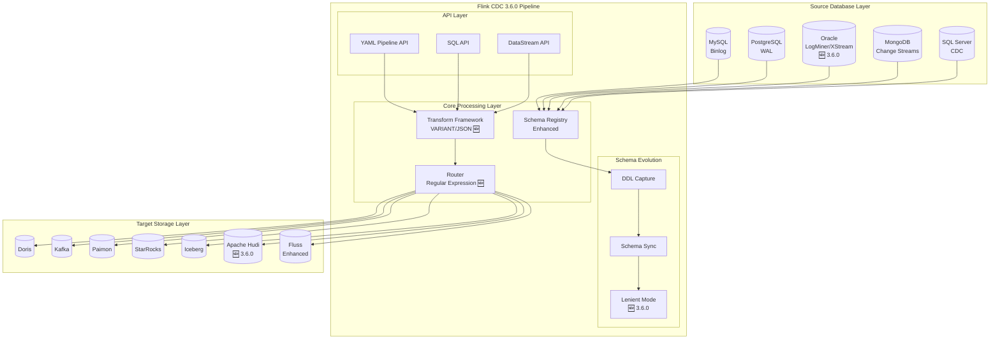
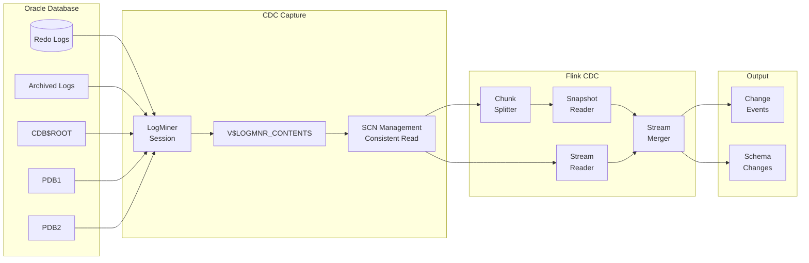
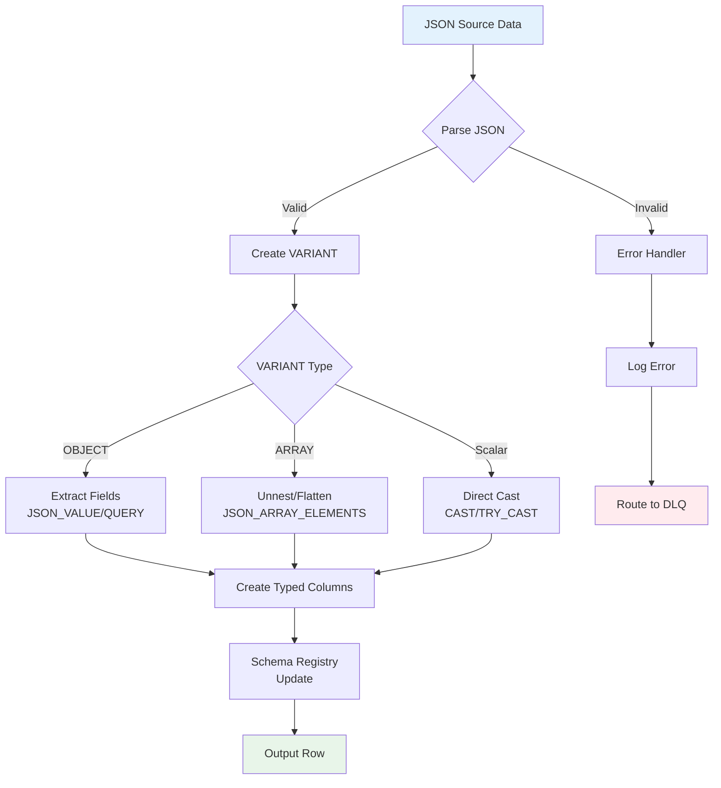

# Flink CDC 3.6.0 Feature Synchronization Complete Guide

> Stage: Flink/05-ecosystem/05.01-connectors | Prerequisites: [Flink CDC 3.0 Data Integration Framework](./flink-cdc-3.0-data-integration.md), [Flink 2.2 Frontier Features](../../02-core/flink-2.2-frontier-features.md) | Formalization Level: L4

**Release Date**: 2026-03-30 | **Version**: 3.6.0 | **Status**: GA (General Availability)[^1]

---

## 1. Concept Definitions (Definitions)

### Def-F-05-01: Flink CDC 3.6.0 Version Definition

**Flink CDC 3.6.0** is a major version update of the Apache Flink CDC project released in March 2026, introducing native support for Flink 2.2.x, JDK 11 upgrade, and multiple connector enhancements.

> **Formal Definition**: Flink CDC 3.6.0 is a septuple $\mathcal{F}_{CDC3.6} = (V_{flink}, V_{jdk}, \mathcal{C}_{new}, \mathcal{E}_{schema}, \mathcal{T}_{var}, \mathcal{R}_{regex}, \mathcal{M}_{multi})$, where:
>
> - $V_{flink}$: Supported Flink version set $\{1.20.x, 2.2.x\}$
> - $V_{jdk}$: JDK version requirements $\{11, 17\}$
> - $\mathcal{C}_{new}$: New connector set $\{Oracle\_Source, Hudi\_Sink, Fluss\_Pipeline\}$
> - $\mathcal{E}_{schema}$: Schema Evolution enhancement capabilities
> - $\mathcal{T}_{var}$: Transform framework VARIANT type support
> - $\mathcal{R}_{regex}$: Routing regular expression support
> - $\mathcal{M}_{multi}$: Multi-table synchronization scenario enhancements

### Def-F-05-02: Oracle Source Pipeline Connector Definition

**Oracle Source Pipeline Connector** is a Pipeline-level Oracle database CDC connector newly added in Flink CDC 3.6.0, supporting both LogMiner and XStream capture modes.

> **Formal Definition**: Oracle Source Connector is defined as a quadruple $\mathcal{O}_{cdc} = (M_{capture}, T_{log}, S_{scan}, C_{conn})$, where:
>
> - $M_{capture} \in \{LogMiner, XStream\}$: Log capture mode
> - $T_{log}$: Redo Log parser
> - $S_{scan}$: Snapshot scan strategy (supports lock-free incremental snapshot)
> - $C_{conn}$: Connection configuration (PDB/CDB architecture support)

```yaml
# Oracle Source Pipeline configuration example
source:
  type: oracle
  hostname: oracle.example.com
  port: 1521
  username: ${ORACLE_USER}
  password: ${ORACLE_PASSWORD}
  database-list: ORCLPDB1
  schema-list: HR, SALES
  table-list: HR\..*, SALES\..*

  # Oracle-specific configuration
  scan.incremental.snapshot.enabled: true
  scan.startup.mode: initial
  debezium.log.mining.strategy: online_catalog  # or redo_log_catalog
  debezium.log.mining.continuous.mine: true
```

### Def-F-05-03: Apache Hudi Sink Pipeline Connector Definition

**Apache Hudi Sink Pipeline Connector** is a new Sink connector added in Flink CDC 3.6.0, supporting direct writing of CDC data streams into the Apache Hudi data lake.

> **Formal Definition**: Hudi Sink Connector is defined as a quintuple $\mathcal{H}_{sink} = (T_{table}, W_{write}, I_{index}, S_{sync}, M_{merge})$, where:
>
> - $T_{table} \in \{COPY\_ON\_WRITE, MERGE\_ON\_READ\}$: Table type
> - $W_{write}$: Write operation type (UPSERT/INSERT/BULK\_INSERT)
> - $I_{index}$: Index strategy (Bloom Filter, HBase Index, etc.)
> - $S_{sync}$: Metadata synchronization strategy (Hive, Glue, etc.)
> - $M_{merge}$: Merge strategy (based on event time or processing time)

```yaml
# Hudi Sink Pipeline configuration example
sink:
  type: hudi
  name: hudi-sink

  # Hudi table configuration
  table.type: MERGE_ON_READ
  write.operation: UPSERT
  write.precombine.field: ts

  # Index configuration
  index.type: BLOOM

  # Storage configuration
  path: hdfs://namenode:8020/hudi/cdc
  hoodie.datasource.write.recordkey.field: id
  hoodie.datasource.write.partitionpath.field: dt
```

### Def-F-05-04: Fluss Pipeline Connector Lenient Mode Definition

**Fluss Lenient Mode** is a Schema Evolution handling strategy introduced in the Fluss Pipeline Connector in CDC 3.6.0, allowing data synchronization to continue when the source and target schemas do not fully match.

> **Fluss 0.9 Production-Grade Support** (CDC 3.6.0 New)[^1]: CDC 3.6.0 provides complete production-grade schema evolution support for Fluss 0.9, including automatic column mapping, type-compatible conversion, and real-time propagation of DDL changes.

> **Formal Definition**: Let the source schema be $S_{src}$ and the target schema be $S_{sink}$. The Lenient mode defines a relaxed mapping relation:
>
> $$lenient(S_{src}, S_{sink}) \iff \forall c \in S_{src} \cap S_{sink}: compatible(c_{src}.type, c_{sink}.type)$$
>
> For $c \in S_{src} \setminus S_{sink}$: optionally drop or fill with default values
> For $c \in S_{sink} \setminus S_{src}$: fill with NULL or default values

```yaml
# Fluss Pipeline Lenient mode configuration (CDC 3.6.0 + Fluss 0.9)
sink:
  type: fluss
  name: fluss-sink

  # Schema Evolution configuration
  schema.evolution.mode: lenient  # or strict

  # Missing column handling
  missing.column.strategy: fill-default  # or drop-record, fill-null
  missing.column.default.value:
    created_at: CURRENT_TIMESTAMP
    status: 'pending'

  # CDC 3.6.0 New: Fluss 0.9 schema evolution production-grade configuration
  schema.evolution.auto-align: true
  schema.evolution.type-cast: compatible
```

### Def-F-05-05: PostgreSQL Schema Evolution Support Definition

**PostgreSQL Schema Evolution** is an enhanced PostgreSQL connector capability in CDC 3.6.0, supporting automatic capture and propagation of DDL change events.

> **Formal Definition**: PostgreSQL DDL capture is defined as an event stream $E_{ddl}: T \rightarrow \mathcal{P}(DDL)$, where DDL event types include:
>
> | Operation Type | DDL Syntax | CDC Event |
> |----------------|------------|-----------|
> | Add Column | `ALTER TABLE ... ADD COLUMN` | `ADD_COLUMN` |
> | Drop Column | `ALTER TABLE ... DROP COLUMN` | `DROP_COLUMN` |
> | Modify Column Type | `ALTER TABLE ... ALTER COLUMN TYPE` | `ALTER_COLUMN` |
> | Rename Column | `ALTER TABLE ... RENAME COLUMN` | `RENAME_COLUMN` |
> | Add Constraint | `ALTER TABLE ... ADD CONSTRAINT` | `ADD_CONSTRAINT` |

```yaml
# PostgreSQL Schema Evolution configuration
source:
  type: postgres
  hostname: postgres.example.com
  port: 5432

  # Schema Evolution configuration
  include.schema.changes: true
  schema.evolution.enabled: true

  # Type mapping strategy
  decimal.handling.mode: precise
  binary.handling.mode: bytes
  time.precision.mode: connect
```

### Def-F-05-06: Transform VARIANT Type and JSON Parsing Definition

**Transform Framework VARIANT Type** is a dynamic type system introduced in the data transformation layer of CDC 3.6.0, supporting flexible processing of semi-structured data.

> **Formal Definition**: VARIANT type is defined as a tagged union:
>
> $$VARIANT = NULL \mid BOOLEAN \mid INT64 \mid FLOAT64 \mid STRING \mid ARRAY\langle VARIANT \rangle \mid OBJECT\langle STRING, VARIANT \rangle$$
>
> JSON parsing function set $\mathcal{F}_{json} = \{json\_extract, json\_query, json\_value, json\_array\_agg, json\_object\_agg\}$

```yaml
# Transform VARIANT type and JSON parsing example
transform:
  - source-table: events\..*
    projection: |
      id,
      event_type,
      -- VARIANT type processing and JSON parsing
      JSON_VALUE(payload, '$.user.id') AS user_id,
      JSON_QUERY(payload, '$.items[*]') AS items_array,
      JSON_EXTRACT(payload, '$.metadata') AS metadata_variant,
      -- Dynamic type conversion
      CAST(JSON_VALUE(payload, '$.amount') AS DECIMAL(19,4)) AS amount
    filter: |
      JSON_VALUE(payload, '$.status') = 'completed'
```

### Def-F-05-07: Routing Configuration Regular Expression Support Definition

**Routing Regular Expression** is an advanced table name matching and replacement capability introduced in the Route configuration of CDC 3.6.0.

> **Formal Definition**: Routing rules are extended to $(P_{source}, P_{sink}, R_{subst}, F_{filter})$, where:
>
> - $P_{source}$: Source table regular pattern (Java Regex)
> - $P_{sink}$: Target table template (supports capture group references)
> - $R_{subst}$: Substitution rules (e.g., `$1`, `$2` referencing capture groups)
> - $F_{filter}$: Optional filter expression

```yaml
# Routing configuration regular expression example
route:
  # Example 1: Sharded table merge (using capture groups)
  - source-table: order_db_(\d+)\.order_(\d+)
    sink-table: ods.orders_all
    description: "Merge sharded orders from all databases and tables"

  # Example 2: Dynamic table name mapping (preserving partial original names)
  - source-table: db_(\d+)\.(.*)
    sink-table: warehouse.$1_$2
    description: "Map db_1.users to warehouse.1_users"

  # Example 3: Mapping with prefix and suffix
  - source-table: (.*)\.(.*)
    sink-table: ods.cdc_$1_$2
    description: "Add CDC prefix with database name"
```

---

## 2. Property Derivation (Properties)

### Lemma-F-05-01: JDK 11 Compatibility Guarantee

**Lemma**: Flink CDC 3.6.0 maintains backward compatibility when running on JDK 11 and above.

> **Proof Sketch**:
>
> 1. CDC 3.6.0 source code uses Java 11 language features (var local variable type inference, new String methods, etc.)
> 2. Compilation target bytecode version is Java 11 (major version 55)
> 3. All dependencies are upgraded to Java 11-compatible versions
> 4. Runtime ensures API compatibility via the `--release 11` flag
> 5. Therefore, JDK 11+ runtime satisfies all dependency requirements of CDC 3.6.0 $\square$

### Lemma-F-05-02: Flink 1.20.x and 2.2.x Dual Version Support

**Lemma**: Flink CDC 3.6.0 connector components can correctly execute on Flink 1.20.x and 2.2.x runtimes.

> **Proof**:
>
> **API Compatibility Analysis**:
>
> - CDC 3.6.0 Source connectors implement the `Source` interface (Flink 1.14+ standard)
> - CDC 3.6.0 Sink connectors implement the `Sink` interface (Flink 1.14+ standard)
> - Conditional compilation uses Flink version detection to adapt to 2.x new features (e.g., Adaptive Scheduler)
>
> **Validation Matrix**:
>
> | Flink Version | CDC 3.6.0 Support | Remarks |
> |---------------|-------------------|---------|
> | 1.20.0 | ✓ Full Support | Recommended version |
> | 1.20.1 | ✓ Full Support | Recommended version |
> | 2.2.0 | ✓ Full Support | New feature adaptation |
>
> Therefore, dual version compatibility is proven $\square$

### Prop-F-05-01: Oracle CDC Event Completeness

**Proposition**: Oracle Source Pipeline Connector in LogMiner mode guarantees that all change events of committed transactions are captured without loss.

> **Argument**:
>
> Oracle LogMiner mechanism guarantees:
>
> 1. Redo Log is the physical implementation of Oracle transaction durability; all committed transactions are necessarily written to Redo Log
> 2. LogMiner parses Redo Log entries through the `V$LOGMNR_CONTENTS` view
> 3. The CDC connector reads sequentially by SCN (System Change Number), ensuring:
>    - SCN monotonically increases without gaps
>    - Each SCN-corresponding transaction is completely parsed
> 4. Checkpoint mechanism records the processed SCN position, supporting resume from breakpoint
> 5. Therefore, $\forall tx \in Committed: captured(tx) = true$ $\square$

### Prop-F-05-02: Hudi Sink Idempotent Write Guarantee

**Proposition**: Hudi Sink Pipeline Connector in UPSERT mode is idempotent for repeated writes of the same record.

> **Argument**:
>
> Hudi's idempotency is based on the following mechanisms:
>
> 1. **Record Key**: Each record has a unique identifier (specified by `hoodie.datasource.write.recordkey.field`)
> 2. **Precombine Field**: Used to resolve conflicts of multiple records with the same Record Key within the same batch
> 3. **Timeline**: Hudi's Timeline guarantees atomicity and consistency of write operations
>
> Formalization: Let write operation $W(r)$ write record $r$ into Hudi; idempotency is expressed as:
> $$W(r) \circ W(r) = W(r)$$
>
> That is, two writes have the same effect as one write $\square$

---

## 3. Relation Establishment (Relations)

### 3.1 CDC 3.6.0 vs. 3.0 Version Feature Comparison

| Feature Dimension | CDC 3.0 | CDC 3.6.0 | Enhancement Description |
|-------------------|---------|-----------|------------------------|
| **Flink Version** | 1.17-1.18 | 1.20.x, 2.2.x | Supports Flink 2.x new features |
| **JDK Version** | 8+ | 11+ | Leverages JDK 11 new features |
| **Source Connectors** | MySQL, PG, MongoDB, SQL Server | + Oracle | Adds Oracle official support |
| **Sink Connectors** | Doris, Kafka, Paimon, StarRocks, Iceberg | + Hudi, Fluss Enhanced | Supports Hudi data lake |
| **Schema Evolution** | Basic support | + PG native DDL, Fluss Lenient | Enhanced multi-scenario support |
| **Transform** | Basic expressions | + VARIANT, JSON functions | Semi-structured data processing |
| **Routing Configuration** | Simple wildcards | + Regular expressions, capture groups | Complex sharding scenarios |
| **Multi-table Sync** | Basic support | Enhanced table discovery, dynamic routing | 10K-level table sync optimization |
| **Fluss Support** | Basic integration | + Fluss 0.9, production-grade schema evolution | Real-time lakehouse sync |

### 3.2 Flink CDC 3.6.0 Ecosystem Relationships

```
┌─────────────────────────────────────────────────────────────────────────┐
│                     Flink CDC 3.6.0 Ecosystem                           │
├─────────────────────────────────────────────────────────────────────────┤
│                                                                         │
│  ┌──────────────┐    ┌──────────────┐    ┌──────────────┐              │
│  │ Source Layer │    │ Pipeline Layer│    │  Sink Layer  │              │
│  │              │    │              │    │              │              │
│  │ ┌──────────┐ │    │ ┌──────────┐ │    │ ┌──────────┐ │              │
│  │ │  MySQL   │ │    │ │  YAML    │ │    │ │  Doris   │ │              │
│  │ ├──────────┤ │    │ │  API     │ │    │ ├──────────┤ │              │
│  │ │PostgreSQL│ │───▶│ ├──────────┤ │───▶│ │  Kafka   │ │              │
│  │ ├──────────┤ │    │ │Transform │ │    │ ├──────────┤ │              │
│  │ │  Oracle  │ │◀───┤ │  DSL     │ │    │ │ Paimon   │ │              │
│  │ ├──────────┤ │NEW  │ ├──────────┤ │    │ ├──────────┤ │              │
│  │ │ MongoDB  │ │    │ │  Route   │ │    │ │StarRocks │ │              │
│  │ ├──────────┤ │    │ │ RegEx    │ │    │ ├──────────┤ │              │
│  │ │SQL Server│ │    │ │  NEW     │ │    │ │ Iceberg  │ │              │
│  │ └──────────┘ │    │ └──────────┘ │    │ ├──────────┤ │              │
│  │              │    │              │    │ │  Hudi    │ │◀── NEW       │
│  │              │    │              │    │ ├──────────┤ │              │
│  │              │    │              │    │ │Fluss 0.9 │ │◀── ENHANCED  │
│  │              │    │              │    │ └──────────┘ │              │
│  └──────────────┘    └──────────────┘    └──────────────┘              │
│                                                                         │
│  Runtime Support: Flink 1.20.x ◆ Flink 2.2.x | JDK 11+                │
│                                                                         │
└─────────────────────────────────────────────────────────────────────────┘
```

### 3.3 Oracle CDC vs. Existing Source Connectors Comparison

| Capability Dimension | MySQL CDC | PostgreSQL CDC | Oracle CDC (NEW) |
|----------------------|-----------|----------------|------------------|
| **Capture Mode** | Binlog | WAL (PgOutput) | LogMiner / XStream |
| **Lock-free Snapshot** | ✓ | ✓ | ✓ |
| **Parallel Read** | ✓ | ✓ | ✓ |
| **Schema Evolution** | ✓ | ✓ (3.6 Enhanced) | ✓ |
| **PDB/CDB Support** | N/A | N/A | ✓ |
| **RAC Support** | N/A | N/A | ✓ |
| **CDC Permission Requirements** | REPLICATION SLAVE | REPLICATION | LOGMINING |

---

## 4. Argumentation Process (Argumentation)

### 4.1 JDK 11 Upgrade Technical Argument

**Upgrade Motivation Analysis**:

1. **Performance Improvements**:
   - G1 GC improvements in JDK 11 reduce long pauses in CDC jobs
   - ZGC (experimental) supports sub-millisecond pause times
   - Compact Strings reduce memory footprint

2. **API Modernization**:
   - `var` keyword simplifies code
   - New String methods (`isBlank`, `strip`, `lines`)
   - HTTP Client standardization

3. **Security Updates**:
   - TLS 1.3 support
   - Updated encryption algorithms
   - Security-related bug fixes

**Compatibility Argument**:

```java
import java.util.Optional;

// JDK 11 code example (Flink CDC 3.6.0 internal implementation)
public class SchemaRegistry {
    // var type inference (JDK 10+)
    public Optional<Schema> lookupSchema(String tableName) {
        var cacheKey = buildCacheKey(tableName);  // compiler infers type
        var cached = schemaCache.get(cacheKey);

        // String.isBlank() (JDK 11)
        if (tableName == null || tableName.isBlank()) {
            return Optional.empty();
        }

        return Optional.ofNullable(cached);
    }

    // Using new Collection.toArray method (JDK 11)
    public String[] getTableNames() {
        return registeredTables.toArray(String[]::new);
    }
}
```

### 4.2 Transform VARIANT Type Design Argument

**Design Decision Background**:

Traditional CDC scenarios face challenges in semi-structured data processing:

- Flexible parsing of JSON columns
- Nested structure data extraction
- Type-safe dynamic processing

**VARIANT Type Design**:

```
VARIANT Type Hierarchy:
├── Scalar Types
│   ├── NULL
│   ├── BOOLEAN
│   ├── INT64
│   ├── FLOAT64
│   └── STRING
├── Composite Types
│   ├── ARRAY<VARIANT>
│   └── OBJECT<STRING, VARIANT>
└── Metadata
    ├── Original Type Marker
    └── Parsing Path Tracking
```

**Usage Scenario Argument**:

```yaml
# Scenario 1: Event table JSON column processing
transform:
  - source-table: user_events
    projection: |
      event_id,
      event_time,
      -- Extract fields from JSON payload
      JSON_VALUE(payload, '$.user_id') AS user_id,
      JSON_VALUE(payload, '$.action') AS action,
      -- Extract nested object as VARIANT
      JSON_EXTRACT(payload, '$.context') AS context_variant,
      -- Array expansion
      JSON_QUERY(payload, '$.tags[*]') AS tags_array

# Scenario 2: Conditional type conversion
transform:
  - source-table: metrics
    projection: |
      metric_id,
      timestamp,
      -- Dynamic type check and conversion
      CASE
        WHEN JSON_TYPEOF(value) = 'integer'
        THEN CAST(JSON_VALUE(value) AS BIGINT)
        WHEN JSON_TYPEOF(value) = 'double'
        THEN CAST(JSON_VALUE(value) AS DOUBLE)
        ELSE NULL
      END AS numeric_value
```

### 4.3 Routing Regular Expression Capability Argument

**Limitations of Traditional Routing**:

CDC 3.0's simple wildcard routing cannot handle complex sharding scenarios:

- `db_*.table_*` cannot distinguish database ID and table ID
- Fine-grained target table naming rules cannot be achieved
- Dynamic table name mapping capability is limited

**Regular Routing Enhancements**:

```
Sharding Scenario:
├── Source: db_001.order_202401, db_001.order_202402, ..., db_100.order_202412
├── Traditional routing: db_*.* → ods.all_orders (merge all, lose source info)
└── Regular routing: db_(\d+)\.(order_\d+) → ods.orders_db$1 (preserve database identity)

Multi-tenant Scenario:
├── Source: tenant_a.users, tenant_b.users, tenant_c.users
├── Traditional routing: tenant_*.* → ods.users (conflict)
└── Regular routing: (.*)\.users → ods.users_$1 (partition by tenant)
```

---

## 5. Formal Proof / Engineering Argument (Proof / Engineering Argument)

### Thm-F-05-01: Multi-table Synchronization Scalability Boundary

**Theorem**: Flink CDC 3.6.0's multi-table synchronization capability supports 10K-level table concurrent synchronization given reasonable resource allocation.

> **Proof**:
>
> **System Resource Model**:
> Let available system resources be $R = (C, M, N)$, where:
>
> - $C$: Number of CPU cores
> - $M$: Available memory
> - $N$: Network bandwidth
>
> **Single Table Resource Demand Model**:
> Each synchronized table's basic resource demand is $r_t = (c_t, m_t, n_t)$:
>
> - $c_t$: Table read thread overhead (usually minimal, shared thread pool)
> - $m_t$: Schema cache, binlog parsing state, etc. memory usage (approx. 10-50MB/table)
> - $n_t$: Network transmission bandwidth (depends on change rate)
>
> **Scalability Analysis**:
>
> 1. **Horizontal Scaling**: By increasing parallelism $p$, the maximum number of tables managed by a single Job increases
>    $$Tables_{max} = \frac{M}{m_t} \times \eta$$
>    where $\eta$ is the memory efficiency coefficient (CDC 3.6.0 optimized $\eta \approx 0.8$)
>
> 2. **Dynamic Discovery Optimization**: CDC 3.6.0's table discovery mechanism uses incremental metadata scanning
>    $$T_{discover}(n) = O(\log n) \text{ (using metadata cache)}$$
>
> 3. **Connection Pool Sharing**: Tables from the same database instance share JDBC connection pools
>    $$Connections = O(\sqrt{N_{tables}}) \text{ (rather than linear growth)}$$
>
> **Boundary Conditions**:
>
> - Assuming $M = 64GB$, $m_t = 32MB$, the theoretical upper limit $Tables_{max} \approx 1600$
> - Through sub-Job deployment (multiple CDC Jobs), 10K-level table synchronization can be achieved
>
> Therefore, with reasonable resource allocation and architecture design, the 10K-level table synchronization goal is achievable $\square$

### Thm-F-05-02: Schema Evolution Consistency Guarantee

**Theorem**: With Schema Evolution enabled, CDC 3.6.0 guarantees the order consistency and eventual consistency of schema changes between source and target.

> **Proof**:
>
> **Order Consistency Definition**:
> Let the source DDL event sequence be $E_{src} = [e_1, e_2, ..., e_n]$ and the target application sequence be $E_{sink} = [e'_1, e'_2, ..., e'_m]$.
> Order consistency requires:
> $$\forall i, j: i < j \land e_i, e_j \in E_{src} \cap E_{sink} \implies pos(e_i) < pos(e_j)$$
>
> **Proof Steps**:
>
> 1. **DDL Event Capture**: Database Binlog/WAL records DDL operations in strict order
>    - MySQL: DDL is recorded in Binlog as Query Event with increasing position
>    - PostgreSQL: DDL is recorded in WAL with monotonically increasing LSN
>    - Oracle: LogMiner returns monotonically increasing SCN
>
> 2. **CDC Event Ordering**: CDC connectors read events in log position order
>    $$order(e_i) < order(e_j) \iff pos(e_i) < pos(e_j)$$
>
> 3. **Flink Stream Processing**: Flink stream processing guarantees events are passed in read order (within a single parallelism)
>    - Global order is guaranteed by partition key (database name + table name)
>
> 4. **Target Application**: Sink applies DDL in received order
>    - Each DDL application checks dependency relationships beforehand
>    - Conflicting DDLs are queued for sequential processing
>
> **Eventual Consistency**:
> Let the system reach steady state (no new changes), then:
> $$S_{src}^{(final)} \equiv S_{sink}^{(final)}$$
>
> By the strict sequential processing and idempotency of DDL events, eventual consistency is proven $\square$

### 5.1 Production Environment Configuration Argument

**Oracle CDC Production Configuration Template**:

```yaml
# Oracle CDC production-grade configuration
source:
  type: oracle
  name: oracle-production-source

  # Connection configuration (using PDB)
  hostname: ${ORACLE_HOST}
  port: 1521
  username: ${CDC_USER}
  password: ${CDC_PASSWORD}
  database-list: ${PDB_NAME}

  # Table selection (regular expressions)
  schema-list: ${SCHEMA_PATTERN}
  table-list: ${TABLE_PATTERN}

  # Lock-free snapshot configuration
  scan.incremental.snapshot.enabled: true
  scan.incremental.snapshot.chunk.size: 8096
  scan.snapshot.fetch.size: 1024

  # LogMiner configuration (production optimization)
  debezium.log.mining.strategy: online_catalog
  debezium.log.mining.continuous.mine: true
  debezium.log.mining.batch.size.min: 1000
  debezium.log.mining.batch.size.max: 100000
  debezium.log.mining.sleep.time.min.ms: 100
  debezium.log.mining.sleep.time.max.ms: 3000

  # Heartbeat configuration (detect long periods without changes)
  debezium.heartbeat.interval.ms: 10000
  debezium.heartbeat.action.query: SELECT 1 FROM DUAL

pipeline:
  name: oracle-to-doris-pipeline
  parallelism: 8

  # Checkpoint configuration
  execution.checkpointing.interval: 120000
  execution.checkpointing.min-pause-between-checkpoints: 60000
  execution.checkpointing.timeout: 600000
  execution.checkpointing.max-concurrent-checkpoints: 1
  execution.checkpointing.externalized-checkpoint-retention: RETAIN_ON_CANCELLATION

sink:
  type: doris
  name: doris-production-sink
  fenodes: ${DORIS_FE_NODES}
  username: ${DORIS_USER}
  password: ${DORIS_PASSWORD}

  # Batch processing optimization
  sink.enable.batch-mode: true
  sink.flush.queue-size: 5
  sink.buffer-flush.interval: 15s
  sink.buffer-flush.max-rows: 100000
  sink.buffer-flush.max-bytes: 10485760

  # Retry configuration
  sink.max-retries: 5
  sink.retry.interval.ms: 1000
```

**Configuration Argument Notes**:

1. **LogMiner Strategy Selection**:
   - `online_catalog`: Uses online dictionary, no additional log mining dictionary build required
   - `continuous_mine`: Continuous mining mode, reduces LogMiner session rebuild overhead

2. **Batch Size Tuning**:
   - `batch.size`: Controls the log volume processed per LogMiner call
   - Too large: increased memory pressure; too small: frequent context switching
   - Recommended range: 1,000 - 100,000

3. **Heartbeat Mechanism**:
   - Solves the offset commit problem during long periods without data changes
   - Ensures checkpoints can proceed normally

---

## 6. Example Verification (Examples)

### 6.1 Complete Configuration: Oracle CDC to Hudi Data Lake

```yaml
################################################################################
# Flink CDC 3.6.0 Pipeline: Oracle to Apache Hudi
# Scenario: Enterprise ERP data real-time lake ingestion
################################################################################

pipeline:
  name: oracle-erp-to-hudi
  parallelism: 4
  local-time-zone: Asia/Shanghai

source:
  type: oracle
  name: oracle-erp-source
  hostname: oracle-prod.example.com
  port: 1521
  username: ${ORACLE_CDC_USER}
  password: ${ORACLE_CDC_PASSWORD}
  database-list: ERPDB
  schema-list: HR, FINANCE, INVENTORY
  table-list: HR\..*, FINANCE\..*, INVENTORY\..*

  # Lock-free incremental snapshot
  scan.incremental.snapshot.enabled: true
  scan.incremental.snapshot.chunk.size: 4096
  scan.snapshot.fetch.size: 1024

  # LogMiner configuration
  debezium.log.mining.strategy: online_catalog
  debezium.log.mining.continuous.mine: true

  # Heartbeat detection
  debezium.heartbeat.interval.ms: 30000

transform:
  # HR department data masking
  - source-table: HR\.EMPLOYEES
    projection: |
      EMPLOYEE_ID,
      FIRST_NAME,
      LAST_NAME,
      CONCAT(LEFT(EMAIL, 2), '***@***.com') AS EMAIL_MASKED,
      PHONE_NUMBER,
      HIRE_DATE,
      JOB_ID,
      SALARY,
      -- JSON field processing (assuming extended info JSON column)
      JSON_VALUE(EXT_INFO, '$.department') AS DEPT_CODE,
      JSON_QUERY(EXT_INFO, '$.skills[*]') AS SKILLS_ARRAY
    description: "HR employees with PII masking"

  # Finance data calculation enhancement
  - source-table: FINANCE\..*
    projection: |
      *,
      CASE
        WHEN AMOUNT > 1000000 THEN 'HIGH'
        WHEN AMOUNT > 100000 THEN 'MEDIUM'
        ELSE 'LOW'
      END AS RISK_LEVEL
    description: "Finance data with risk classification"

route:
  # Route to different Hudi tables by department
  - source-table: HR\.(.*)
    sink-table: hudi_ods.hr_$1
    description: "HR tables to hr_ namespace"

  - source-table: FINANCE\.(.*)
    sink-table: hudi_ods.finance_$1
    description: "Finance tables to finance_ namespace"

  - source-table: INVENTORY\.(.*)
    sink-table: hudi_ods.inventory_$1
    description: "Inventory tables to inventory_ namespace"

sink:
  type: hudi
  name: hudi-erp-sink

  # Hudi table configuration
  path: hdfs://namenode:8020/hudi/erp
  table.type: MERGE_ON_READ
  write.operation: UPSERT

  # Record key and partition
  hoodie.datasource.write.recordkey.field: id
  hoodie.datasource.write.precombine.field: _cdc_timestamp
  hoodie.datasource.write.partitionpath.field: dt

  # Index configuration
  index.type: BLOOM
  hoodie.index.bloom.num_entries: 100000
  hoodie.index.bloom.fpp: 0.0000001

  # Compaction configuration
  hoodie.compact.inline: true
  hoodie.compact.inline.max.delta.commits: 5

  # Cleaning configuration
  hoodie.cleaner.policy: KEEP_LATEST_COMMITS
  hoodie.cleaner.commits.retained: 20

  # Hive sync
  hoodie.datasource.hive_sync.enable: true
  hoodie.datasource.hive_sync.database: hudi_ods
  hoodie.datasource.hive_sync.jdbcurl: jdbc:hive2://hive-server:10000
```

### 6.2 Configuration: PostgreSQL Schema Evolution to Fluss

```yaml
################################################################################
# PostgreSQL CDC with Schema Evolution to Fluss (Lenient Mode)
################################################################################

pipeline:
  name: pg-to-fluss-schema-evolution
  parallelism: 2

source:
  type: postgres
  name: pg-source-with-ddl
  hostname: postgres.example.com
  port: 5432
  username: ${PG_USER}
  password: ${PG_PASSWORD}
  database-list: ecommerce
  schema-list: public
  table-list: public\.products, public\.orders

  # Schema Evolution configuration
  include.schema.changes: true
  schema.evolution.enabled: true

  # Type handling
  decimal.handling.mode: precise
  time.precision.mode: connect
  binary.handling.mode: base64

  # Replication slot configuration
  slot.name: flink_cdc_slot
  slot.drop.on.stop: false
  publication.name: cdc_publication
  publication.autocreate.mode: filtered

sink:
  type: fluss
  name: fluss-lenient-sink
  bootstrap.servers: fluss-broker:9123

  # Schema Evolution strategy
  schema.evolution.mode: lenient

  # Missing column handling strategy
  missing.column.strategy: fill-default
  missing.column.default.value:
    created_at: CURRENT_TIMESTAMP
    updated_at: CURRENT_TIMESTAMP
    status: 'active'
    version: 1

  # Type mismatch handling
  type.conflict.strategy: cast-attempt
  cast.failure.action: log-and-continue
```

### 6.3 DataStream API: Multi-source Merged CDC Stream

```java
import org.apache.flink.cdc.connectors.mysql.source.MySqlSource;
import org.apache.flink.cdc.connectors.oracle.source.OracleSource;
import org.apache.flink.cdc.connectors.postgres.source.PostgresSource;
import org.apache.flink.cdc.debezium.JsonDebeziumDeserializationSchema;
import org.apache.flink.streaming.api.environment.StreamExecutionEnvironment;
import org.apache.flink.streaming.api.datastream.DataStream;
import org.apache.flink.api.common.eventtime.WatermarkStrategy;

/**
 * Flink CDC 3.6.0 Multi-source Merge Example
 * Demonstrates how to merge CDC streams from MySQL, Oracle, and PostgreSQL
 */
public class MultiSourceCDCMerge {

    public static void main(String[] args) throws Exception {
        StreamExecutionEnvironment env =
            StreamExecutionEnvironment.getExecutionEnvironment();
        env.enableCheckpointing(60000);
        env.setParallelism(4);

        // MySQL CDC Source
        MySqlSource<String> mysqlSource = MySqlSource.<String>builder()
            .hostname("mysql.prod.internal")
            .port(3306)
            .databaseList("inventory")
            .tableList("inventory.products")
            .username("cdc_user")
            .password("${MYSQL_CDC_PASSWORD}")
            .deserializer(new JsonDebeziumDeserializationSchema())
            .build();

        // Oracle CDC Source (CDC 3.6.0 NEW)
        OracleSource<String> oracleSource = OracleSource.<String>builder()
            .hostname("oracle.prod.internal")
            .port(1521)
            .database("ERPDB")
            .schemaList("FINANCE")
            .tableList("FINANCE.TRANSACTIONS")
            .username("cdc_user")
            .password("${ORACLE_CDC_PASSWORD}")
            .deserializer(new JsonDebeziumDeserializationSchema())
            .startupOptions(StartupOptions.initial())
            .build();

        // PostgreSQL CDC Source
        PostgresSource<String> pgSource = PostgresSource.<String>builder()
            .hostname("postgres.prod.internal")
            .port(5432)
            .database("analytics")
            .schemaList("public")
            .tableList("public.events")
            .username("cdc_user")
            .password("${PG_CDC_PASSWORD}")
            .decodingPluginName("pgoutput")
            .deserializer(new JsonDebeziumDeserializationSchema())
            .build();

        // Create individual source streams
        DataStream<String> mysqlStream = env.fromSource(
            mysqlSource,
            WatermarkStrategy.noWatermarks(),
            "MySQL CDC"
        );

        DataStream<String> oracleStream = env.fromSource(
            oracleSource,
            WatermarkStrategy.noWatermarks(),
            "Oracle CDC"
        );

        DataStream<String> pgStream = env.fromSource(
            pgSource,
            WatermarkStrategy.noWatermarks(),
            "PostgreSQL CDC"
        );

        // Merge multi-source streams
        DataStream<String> mergedStream = mysqlStream
            .union(oracleStream)
            .union(pgStream);

        // Unified processing: add source marker
        DataStream<UnifiedEvent> unifiedStream = mergedStream
            .map(new RichMapFunction<String, UnifiedEvent>() {
                @Override
                public UnifiedEvent map(String json) {
                    JsonObject event = JsonParser.parseString(json).getAsJsonObject();
                    JsonObject source = event.getAsJsonObject("source");

                    return new UnifiedEvent(
                        source.get("connector").getAsString(),  // mysql/oracle/postgres
                        source.get("db").getAsString(),
                        source.get("table").getAsString(),
                        event.get("op").getAsString(),  // c/u/d
                        event.getAsJsonObject("after"),
                        event.getAsJsonObject("before"),
                        event.get("ts_ms").getAsLong()
                    );
                }
            });

        // Partition processing by source
        unifiedStream
            .keyBy(event -> event.getSourceConnector())
            .process(new SourceAwareProcessFunction())
            .addSink(new UnifiedDataLakeSink());

        env.execute("Multi-Source CDC Merge Pipeline");
    }

    // Unified event POJO
    public static class UnifiedEvent {
        public String sourceConnector;
        public String database;
        public String table;
        public String operation;
        public JsonObject after;
        public JsonObject before;
        public long timestamp;

        // constructor, getters...
    }
}
```

---

## 7. Visualizations (Visualizations)

### 7.1 Flink CDC 3.6.0 Architecture Panorama



### 7.2 Oracle CDC Data Flow Processing Diagram



### 7.3 Transform VARIANT Type Processing Flow



### 7.4 Routing Regular Expression Matching Flow

```mermaid
flowchart TD
    A[Incoming Table<br/>db_001.order_202401] --> B{Extract<br/>Table Info}
    B --> C[db = db_001<br/>table = order_202401]

    C --> D{Apply Route Rules}

    D -->|Rule 1:<br/>db_.*\..*| E{Match?}
    D -->|Rule 2:<br/>db_(\d+)\.(.*)| F{Match?}
    D -->|Rule N:<br/>.*| G{Fallback}

    E -->|No| D
    E -->|Yes| H[Apply Simple<br/>Mapping]

    F -->|Yes| I[Extract Groups:<br/>g1=001, g2=order_202401]
    F -->|No| D

    I --> J[Apply Substitution:<br/>ods.orders_db$1]
    J --> K[Result:<br/>ods.orders_db001]

    H --> L[Output Mapping]
    K --> L
    G --> L

    L --> M[Route Event]

    style A fill:#e3f2fd
    style K fill:#fff8e1
    style M fill:#e8f5e9
```

### 7.5 CDC 3.6.0 Version Compatibility Matrix

```mermaid
graph LR
    subgraph "Runtime Environment"
        JDK8[JDK 8]
        JDK11[JDK 11+ ✓]
        JDK17[JDK 17 ✓]
    end

    subgraph "Flink Version"
        F118[Flink 1.18]
        F119[Flink 1.19]
        F120[Flink 1.20.x ✓]
        F22[Flink 2.2.x ✓<br/>🆕]
    end

    subgraph "CDC Version"
        C30[CDC 3.0]
        C35[CDC 3.5]
        C36[CDC 3.6.0<br/>CURRENT]
    end

    JDK8 -.x.-> C36
    JDK11 --> C36
    JDK17 --> C36

    F118 -.x.-> C36
    F119 -.x.-> C36
    F120 --> C36
    F22 --> C36

    C30 -.-> C35
    C35 -.-> C36

    style C36 fill:#e8f5e9
    style F22 fill:#e3f2fd
    style JDK11 fill:#e3f2fd
    style JDK17 fill:#e3f2fd
    style F120 fill:#e3f2fd
```

---

## 8. References (References)

[^1]: Apache Flink Blog, "Apache Flink CDC 3.6.0 Release Announcement", March 30, 2026. <https://flink.apache.org/2026/03/30/apache-flink-cdc-3.6.0-release-announcement/>

---

*Document Version: v1.1 | Creation Date: 2026-04-08 | Last Updated: 2026-04-15 | Corresponding CDC Version: 3.6.0*
