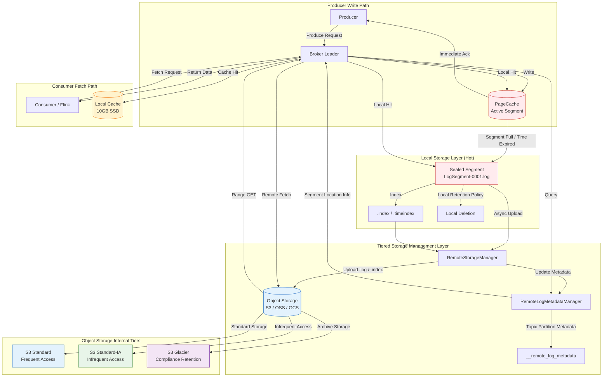
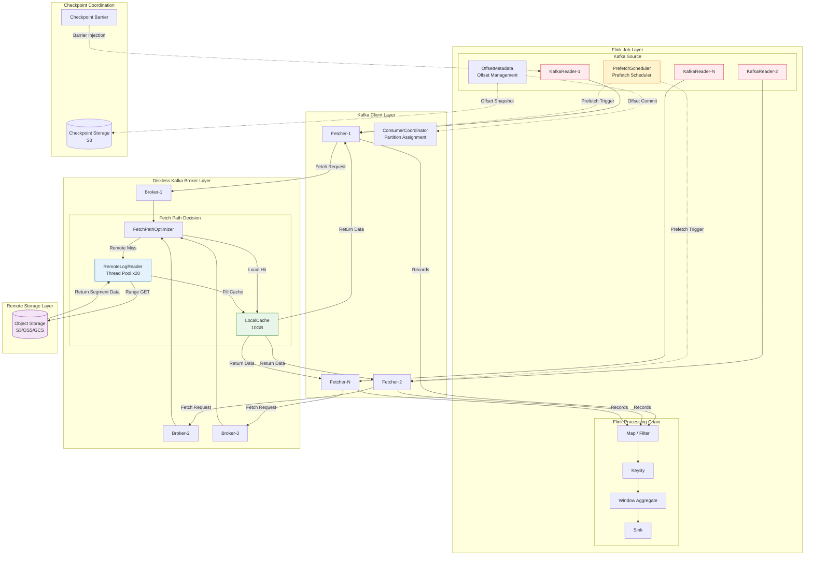
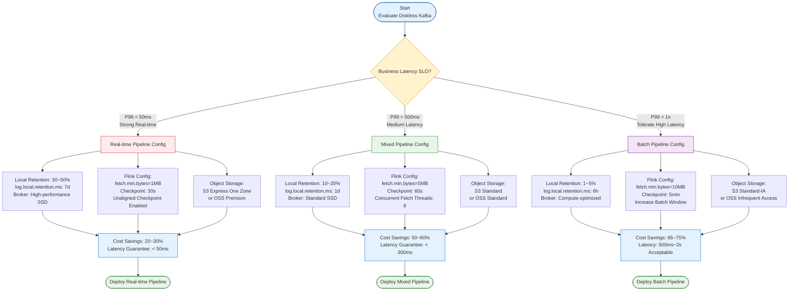

# Flink Diskless Kafka Connector Deep Dive

> **Stage**: Flink/05-ecosystem | **Prerequisites**: [diskless-kafka-cloud-native.md](./diskless-kafka-cloud-native.md) | **Formalization Level**: L5

---

## 1. Concept Definitions (Definitions)

### Def-F-05-60: Diskless Kafka

**Definition**: Diskless Kafka is an architectural paradigm that fully or largely offloads the persistent storage responsibilities of Kafka Brokers to remote tiered storage (Tiered Storage / Object Storage), while Brokers retain only computation, network I/O, and metadata management functions.

$$
\mathcal{DK} = \langle B_{\text{stateless}}, S_{\text{remote}}, C_{\text{local}}, \phi_{\text{tier}}, \mathcal{M}_{\text{meta}} \rangle
$$

Where:

- $B_{\text{stateless}}$: Stateless broker set, responsible for protocol processing, replica coordination, and consumer request scheduling
- $S_{\text{remote}}$: Remote tiered storage layer (S3, OSS, GCS, Azure Blob), assuming primary persistence responsibilities
- $C_{\text{local}}$: Local cache layer (memory PageCache / temporary SSD), for hot data acceleration and recent segment retention
- $\phi_{\text{tier}}: \mathcal{D} \times \mathcal{T} \rightarrow \{L_{\text{hot}}, L_{\text{warm}}, L_{\text{cold}}\}$: Tiered storage mapping function, defining data migration strategy across time dimensions and access patterns
- $\mathcal{M}_{\text{meta}}$: Local metadata management subsystem (RemoteLogMetadataManager), maintaining indexes, offset mappings, and lifecycle states of remote segments

**Major Implementation Forms**:

- **Apache Kafka 3.0+ KIP-405**: Native tiered storage, offloading old LogSegments to object storage via the `RemoteStorageManager` interface
- **Apache Kafka 3.7+**: Enhanced Tiered Storage, supporting finer-grained segment management and fetch path optimization
- **AutoMQ**: Open-source Diskless Kafka implementation, built on KIP-1150, focusing on cloud-native stateless architecture
- **WarpStream**: Commercial Diskless Kafka service, fully Kafka protocol compatible, with Brokers having no local disks

---

### Def-F-05-61: Kafka Tiered Storage

**Definition**: The Kafka tiered storage model defines lifecycle management policies for data between the local performance layer and the remote cost layer, achieving a balance between storage cost and access performance through automatic migration mechanisms.

$$
\mathcal{T} = \langle L_{\text{hot}}, L_{\text{warm}}, L_{\text{cold}}, \tau_{\text{migration}}, \rho_{\text{cost}}, \theta_{\text{retention}} \rangle
$$

Where:

- $L_{\text{hot}}$: Hot tier (local SSD / memory PageCache), retaining active write segments and recent historical segments, latency $< 5\text{ms}$
- $L_{\text{warm}}$: Warm tier (object storage standard class, e.g., S3 Standard / OSS Standard), retaining medium-term historical data, latency $50\text{ms} \sim 200\text{ms}$
- $L_{\text{cold}}$: Cold tier (object storage archive class, e.g., S3 Glacier / OSS Archive), long-term compliance retention data, latency $> 1\text{s}$
- $\tau_{\text{migration}}: (t_{\text{age}}, f_{\text{access}}) \rightarrow \{0, 1\}$: Data migration trigger predicate, deciding whether to migrate based on segment age $t_{\text{age}}$ and access frequency $f_{\text{access}}$
- $\rho_{\text{cost}}: L \rightarrow \mathbb{R}^+$: Cross-tier unit storage cost function
- $\theta_{\text{retention}}: \mathbb{R}^+ \rightarrow \mathbb{R}^+$: Retention policy function, defining data retention duration per tier

**Key Parameters** (Kafka server configuration):

| Parameter | Description | Default |
|-----------|-------------|---------|
| `remote.log.storage.system.enable` | Enable tiered storage | `false` |
| `rlmm.config.remote.log.metadata.manager.listener.name` | Metadata manager listener name | — |
| `rsm.config.remote.log.storage.manager.class.name` | RSM implementation class | — |
| `log.local.retention.bytes` | Local retention bytes | `-1` (disabled) |
| `log.local.retention.ms` | Local retention time | `-1` (disabled) |
| `log.segment.bytes` | Single log segment size | `1GB` |

---

### Def-F-05-62: LogSegment Local/Remote State

**Definition**: Under the tiered storage architecture, a Kafka Topic Partition's log consists of a series of LogSegments, each in one of three states: active local segment, sealed local segment, or remote segment.

$$
\mathcal{LS} = \langle \text{seg}_i, s_i, O_{\text{start}}, O_{\text{end}}, F_{\text{log}}, F_{\text{idx}}, F_{\text{timeidx}} \rangle
$$

Where:

- $\text{seg}_i$: The $i$-th log segment identifier
- $s_i \in \{\text{ACTIVE}, \text{SEALED}, \text{REMOTE}\}$: Segment state
- $O_{\text{start}}, O_{\text{end}}$: Segment start and end offsets
- $F_{\text{log}}$: Segment data file (`.log`), containing actual message records
- $F_{\text{idx}}$: Offset index file (`.index`), accelerating offset-based lookup
- $F_{\text{timeidx}}$: Timestamp index file (`.timeindex`), accelerating time-based lookup

**State Transition Rules**:

$$
\text{ACTIVE} \xrightarrow{\text{segment full / roll}} \text{SEALED} \xrightarrow{\tau_{\text{migration}}=1} \text{REMOTE}
$$

When a segment enters the `REMOTE` state, $F_{\text{log}}$, $F_{\text{idx}}$, and $F_{\text{timeidx}}$ are uploaded to remote storage, and only a metadata entry is retained locally in `RemoteLogMetadataManager`. When consumers request data within this segment's range, the Broker triggers a remote fetch.

---

### Def-F-05-63: Fetch Path Optimization

**Definition**: Fetch path optimization is the Kafka Broker's tiered routing mechanism when processing consumer Fetch requests, selecting the optimal data retrieval path based on the requested offset range and segment distribution state.

$$
\mathcal{FP}(O_{\text{fetch}}, S_{\text{partition}}) = \arg\min_{p \in \mathcal{P}} \{ \lambda(p) \mid \text{Data}(O_{\text{fetch}}) \subseteq \text{Range}(p) \}
$$

Where:

- $O_{\text{fetch}}$: Consumer request start offset
- $S_{\text{partition}}$: Partition segment state set
- $\mathcal{P} = \{p_{\text{local}}, p_{\text{remote}}, p_{\text{cache}}\}$: Available fetch path set
- $\lambda(p)$: Path latency cost function
- $\text{Data}(O_{\text{fetch}})$: Dataset corresponding to the requested offset
- $\text{Range}(p)$: Offset range that path $p$ can provide

**Path Priority** (from high to low):

1. **Local active segment path** $p_{\text{local-active}}$: Direct read from local active log segment, lowest latency ($< 5\text{ms}$)
2. **Local sealed segment path** $p_{\text{local-sealed}}$: Read from local sealed segment not yet migrated, low latency ($< 10\text{ms}$)
3. **Local cache path** $p_{\text{cache}}$: Hit remote segment data cached in local SSD / memory, medium latency ($10\text{ms} \sim 50\text{ms}$)
4. **Remote storage path** $p_{\text{remote}}$: Download segment data from object storage, highest latency ($50\text{ms} \sim 500\text{ms}$)

---

### Def-F-05-64: Cost-Performance Trade-off Function

**Definition**: The cost-performance trade-off function of a Diskless Kafka deployment quantifies the quantitative relationship between storage cost savings and read performance degradation, providing a decision basis for Flink job resource planning.

$$
\mathcal{C}(\vec{x}) = \alpha \cdot C_{\text{storage}}(\vec{x}) + \beta \cdot C_{\text{compute}}(\vec{x}) + \gamma \cdot L_{\text{read}}(\vec{x})
$$

Where:

- $\vec{x} = (r_{\text{local}}, r_{\text{remote}}, B_{\text{bandwidth}}, P_{\text{flink}})$: Decision variable vector
- $r_{\text{local}}$: Local data retention ratio
- $r_{\text{remote}}$: Remote storage data ratio ($r_{\text{local}} + r_{\text{remote}} = 1$)
- $B_{\text{bandwidth}}$: Object storage egress bandwidth configuration
- $P_{\text{flink}}$: Flink consumer parallelism
- $C_{\text{storage}}(\vec{x})$: Total storage cost function
- $C_{\text{compute}}(\vec{x})$: Compute resource cost function (including Broker and Flink TaskManager)
- $L_{\text{read}}(\vec{x})$: Average read latency function
- $\alpha, \beta, \gamma$: Weight coefficients, reflecting business sensitivity to cost and latency

**Pareto Optimality Condition**:

$$
\nabla C_{\text{storage}} \cdot \nabla L_{\text{read}} \leq 0 \quad \text{(cost reduction does not reduce latency)}
$$

---

### Def-F-05-65: Remote Segment Concurrency Control Policy

**Definition**: The remote segment concurrency control policy is a flow control mechanism coordinated between Brokers and Flink consumers for remote data retrieval, preventing high-latency reads from object storage from overwhelming consumer threads and Broker resources.

$$
\mathcal{CC} = \langle N_{\text{max-concurrent}}, T_{\text{timeout}}, B_{\text{prefetch}}, R_{\text{retry}} \rangle
$$

Where:

- $N_{\text{max-concurrent}}$: Maximum concurrent remote fetch requests per Broker
- $T_{\text{timeout}}$: Remote fetch timeout threshold
- $B_{\text{prefetch}}$: Prefetch buffer size, used to hide remote read latency
- $R_{\text{retry}}$: Remote fetch retry policy (exponential backoff / fixed interval)

**Broker-side Constraint**:

$$
\sum_{p \in \mathcal{P}_{\text{active}}} \mathbb{1}_{[\text{remote}(p)]} \leq N_{\text{max-concurrent}}
$$

Where $\mathcal{P}_{\text{active}}$ is the current active consumer partition assignment set, and $\mathbb{1}_{[\text{remote}(p)]}$ is the indicator function for whether partition $p$ triggers a remote read.

---

### Def-F-05-66: Flink Kafka Source Prefetch Policy

**Definition**: The Flink Kafka Source prefetch policy is a proactive data retrieval mechanism in Flink consumers when perceiving underlying Tiered Storage, triggering remote segment loading ahead of time by predicting consumer offset progress to amortize high latency overhead.

$$
\mathcal{PF} = \langle \Delta_{\text{lookahead}}, W_{\text{prefetch}}, S_{\text{trigger}}, \eta_{\text{hit}} \rangle
$$

Where:

- $\Delta_{\text{lookahead}}$: Lookahead offset window, determining how many segments ahead to initiate prefetch
- $W_{\text{prefetch}}$: Prefetch worker thread count, controlling concurrent prefetch tasks
- $S_{\text{trigger}} \in \{\text{SEQUENTIAL}, \text{ADAPTIVE}, \text{HINTED}\}$: Trigger mode
  - `SEQUENTIAL`: Fixed interval trigger during sequential consumption
  - `ADAPTIVE`: Adaptive adjustment based on historical consumption rate
  - `HINTED`: Trigger based on Kafka metadata hints (segment state change events)
- $\eta_{\text{hit}}$: Prefetch hit rate target threshold

---

## 2. Property Derivation (Properties)

### Lemma-F-05-60: Local Segment Read Latency Upper Bound

**Lemma**: Under the Diskless Kafka architecture, if the data requested by the consumer falls entirely within the range of local active or sealed segments, then end-to-end read latency has a deterministic upper bound.

**Formal Statement**:

Let $D_{\text{local}}$ be the local disk read latency random variable, and $D_{\text{network}}$ be the network transmission latency random variable, then the total latency $L_{\text{local}}$ satisfies:

$$
L_{\text{local}} = D_{\text{local}} + D_{\text{network}} \leq L_{\max}^{\text{local}} = \frac{S_{\text{fetch}}}{B_{\text{disk}}} + \frac{S_{\text{fetch}}}{B_{\text{network}}} + \delta_{\text{jitter}}
$$

Where:

- $S_{\text{fetch}}$: Fetch request data size (limited by `fetch.max.bytes`, default 50MB)
- $B_{\text{disk}}$: Local disk sequential read bandwidth
- $B_{\text{network}}$: Consumer to Broker network bandwidth
- $\delta_{\text{jitter}}$: System jitter upper bound (scheduling, GC, etc.)

**Proof Sketch**:

1. Local active segments reside in memory PageCache, $D_{\text{local}} \approx 0$ (on cache hit) or $\leq S_{\text{fetch}} / B_{\text{disk}}$ (on cache miss)
2. Local sealed segments are on SSD/HDD, $D_{\text{local}} \leq S_{\text{fetch}} / B_{\text{disk}}$
3. Network transmission is constrained by TCP congestion control, $D_{\text{network}} \leq S_{\text{fetch}} / B_{\text{network}}$
4. By the additive inequality, $L_{\text{local}} \leq L_{\max}^{\text{local}}$

**Engineering Significance**: When real-time Flink jobs consume active topics, as long as consumer lag stays within the local retention window, they can enjoy the same low-latency guarantee as traditional Kafka.

---

### Prop-F-05-60: Cost-Performance Trade-off Pareto Frontier

**Proposition**: In the dual-objective optimization problem of storage cost and read latency for Diskless Kafka, there exists no global optimal solution that simultaneously strictly reduces both storage cost and read latency; the decision space forms a Pareto frontier.

**Formal Statement**:

Let the objective function be $(C_{\text{storage}}(\vec{x}), L_{\text{read}}(\vec{x}))$, and the feasible region be $\mathcal{X}$. Then the Pareto frontier $\mathcal{P}^*$ is defined as:

$$
\mathcal{P}^* = \{ \vec{x}^* \in \mathcal{X} \mid \nexists \vec{x} \in \mathcal{X}: C_{\text{storage}}(\vec{x}) \leq C_{\text{storage}}(\vec{x}^*) \land L_{\text{read}}(\vec{x}) \leq L_{\text{read}}(\vec{x}^*) \land (C_{\text{storage}}(\vec{x}) < C_{\text{storage}}(\vec{x}^*) \lor L_{\text{read}}(\vec{x}) < L_{\text{read}}(\vec{x}^*)) \}
$$

**Proof Sketch**:

1. **Monotonicity**: Reducing the local retention ratio $r_{\text{local}}$ decreases $C_{\text{storage}}$ (object storage unit cost is lower than local SSD), but increases $L_{\text{read}}$ (more requests hit the remote path)
2. **Non-improvability**: For any point $\vec{x}^*$ on the frontier, improvement in either objective necessarily leads to degradation in the other
3. **Convexity**: Under the assumption that object storage latency obeys linear bandwidth constraints and local storage cost obeys linear capacity constraints, the feasible region is convex, and the Pareto frontier is a continuous curve

**Corollary**: The optimal deployment strategy for Flink jobs on Diskless Kafka depends on the business tolerance for latency $\gamma$:

- High sensitivity ($\gamma \gg \alpha$): Increase $r_{\text{local}}$, accept higher storage cost
- Low sensitivity ($\gamma \ll \alpha$): Decrease $r_{\text{local}}$, maximize cost savings
- Balanced strategy ($\gamma \approx \alpha$): Select the Pareto frontier inflection point, achieving a balance between cost and latency

---

### Lemma-F-05-61: Remote Segment Concurrent Read Throughput Lower Bound

**Lemma**: When Flink consumers trigger remote segment reads, under concurrency control policy constraints, single-partition consumption throughput has a theoretical lower bound.

**Formal Statement**:

Let $N_{\text{concurrent}}$ be the actual number of concurrent remote requests ($N_{\text{concurrent}} \leq N_{\text{max-concurrent}}$), $L_{\text{remote}}$ be the single remote fetch latency, and $S_{\text{segment}}$ be the segment size, then the single-partition remote read throughput $T_{\text{remote}}$ satisfies:

$$
T_{\text{remote}} \geq \frac{N_{\text{concurrent}} \cdot S_{\text{segment}}}{L_{\text{remote}} + \frac{S_{\text{segment}}}{B_{\text{egress}}}}
$$

Where $B_{\text{egress}}$ is the object storage egress bandwidth.

**Proof Sketch**:

1. Single remote read total time = object storage time-to-first-byte $L_{\text{remote}}$ + data transfer time $S_{\text{segment}} / B_{\text{egress}}$
2. Under $N_{\text{concurrent}}$ concurrency, pipelining hides part of the latency; reads completed per unit time $\geq N_{\text{concurrent}} / (L_{\text{remote}} + S_{\text{segment}} / B_{\text{egress}})$
3. Multiply by single read data size $S_{\text{segment}}$ to obtain the lower bound

**Engineering Significance**: By increasing $N_{\text{concurrent}}$ (Broker-side `remote.log.reader.threads` configuration) and $S_{\text{segment}}$ (increasing `log.segment.bytes`), consumption throughput in historical backfill scenarios can be significantly improved.

---

## 3. Relation Establishment (Relations)

### 3.1 Diskless Kafka vs. Traditional Kafka Architecture Mapping

Diskless Kafka does not completely abandon Kafka's core design; rather, it replaces the persistence layer from local disk to remote object storage while retaining Kafka protocol semantics and the replication model. The architectural mapping between the two is as follows:

| Component | Traditional Kafka | Diskless Kafka / Tiered Storage | Semantic Equivalence |
|-----------|-------------------|--------------------------------|----------------------|
| **Persistence Layer** | Local disk (3x replicas) | Object storage (cross-region redundancy) | Strong equivalence: both guarantee Durability |
| **Replication Protocol** | ISR + Leader/Follower | ISR + Leader/Follower (active segments) | Strong equivalence: active segment replication unchanged |
| **Consumer Fetch** | Local disk read | Tiered routing (local / remote) | Weak equivalence: latency characteristics differ |
| **Offset Management** | `__consumer_offsets` | `__consumer_offsets` (local) | Strong equivalence: metadata not migrated |
| **Transaction Log** | `__transaction_state` | `__transaction_state` (local) | Strong equivalence: transaction state retained locally |
| **Log Compaction** | Local background thread | Remote trigger + local coordination | Weak equivalence: compaction latency increases |

**Key Differences**:

1. **Replication Bandwidth**: Traditional Kafka follower replication goes through the local network; Diskless Kafka active segment replication still uses the local network, but remote segments no longer require ISR synchronization (relying on object storage multi-AZ redundancy)
2. **Failure Recovery**: Traditional Kafka relies on local logs for leader failover; Diskless Kafka leader failover requires rebuilding local cache or reading directly from remote storage
3. **Catch-up Read**: Slow consumers in traditional Kafka always read from local disk; in Diskless Kafka, if lag exceeds the local retention window, remote reads are triggered

### 3.2 Flink Kafka Source and Tiered Storage Integration Relation

The Flink Kafka Source connector interacts with Diskless Kafka through the Kafka Consumer API. Its integration relation can be formalized as a three-layer abstraction:

$$
\text{Flink Kafka Source} \xrightarrow{\text{Consumer API}} \text{Kafka Client} \xrightarrow{\text{Fetch Protocol}} \text{Broker} \xrightarrow{\text{RSM}} \text{Remote Storage}
$$

**Integration Key Points**:

1. **Transparency**: Flink Kafka Source itself is not aware whether data comes from remote storage; this decision is made by the Broker-side fetch path optimization (Def-F-05-63)
2. **Observability Gap**: Standard Kafka Consumer Metrics do not distinguish between local and remote reads; Broker-side exposure of `remote-fetch-rate`, `remote-fetch-latency-avg`, and other metrics is required
3. **Configuration Propagation**: Flink passes consumer configurations to the Kafka Client via `setProperty()`, which in turn affects Broker Fetch behavior (e.g., `fetch.min.bytes`, `max.poll.records`)
4. **Checkpoint Coupling**: When Flink Checkpoint triggers, the Kafka Source commits consumption offsets. If a large number of remote reads occur within the checkpoint interval, latency fluctuations may affect checkpoint alignment time

### 3.3 Object Storage Selection Correlation Matrix

The remote storage layer of Diskless Kafka can connect to multiple object storage services. Different selections have significant impact on Flink consumption performance:

| Object Storage | Time-to-First-Byte (P99) | Throughput Limit | Co-located with Flink | Recommended Scenario |
|----------------|-------------------------|------------------|----------------------|----------------------|
| **AWS S3 Standard** | $50\text{ms} \sim 100\text{ms}$ | $100\text{Gbps}+$ | Supported | General production |
| **AWS S3 Express One Zone** | $10\text{ms} \sim 20\text{ms}$ | $\text{Single bucket } 200\text{Gbps}$ | Single AZ | Low-latency backfill |
| **Alibaba Cloud OSS Standard** | $50\text{ms} \sim 150\text{ms}$ | $\text{Single stream } 10\text{Gbps}$ | Supported | China deployment |
| **Alibaba Cloud OSS Premium** | $\sim 10\text{ms}$ | $\text{Single stream } 20\text{Gbps}$ | Supported | High-frequency backfill |
| **GCS Standard** | $50\text{ms} \sim 100\text{ms}$ | $\text{Single project } 200\text{Gbps}$ | Supported | GCP ecosystem |
| **MinIO (Self-hosted)** | $5\text{ms} \sim 20\text{ms}$ | Hardware-dependent | Strongly constrained | Private cloud / edge |

**Selection Principles**:

- Deploy in the same region as the Flink cluster to avoid cross-region traffic charges and latency
- Prioritize object storage with strong consistency reads (S3 strong consistency default since 2020-12; OSS defaults to eventual consistency, verify version)
- Evaluate egress bandwidth limits to ensure they meet Flink consumer peak throughput

---

## 4. Argumentation Process (Argumentation)

### 4.1 Local-First Read Strategy Boundary Discussion

The Kafka Broker's fetch path optimization (Def-F-05-63) theoretically prioritizes serving local data, but the following boundary conditions may lead to suboptimal behavior:

**Boundary Condition One: Local Retention Window Too Narrow**

When `log.local.retention.bytes` or `log.local.retention.ms` is set too small, causing the consumption range of active consumers (small lag) to exactly straddle the local/remote boundary, consumers will alternately hit local and remote paths, producing latency jitter.

$$
\text{Jitter} = |L_{\text{local}} - L_{\text{remote}}| \approx 50\text{ms} \sim 500\text{ms}
$$

**Mitigation Strategy**: Ensure the local retention window is at least 2x the data volume consumed within a Flink job checkpoint interval, providing a buffer for consumption fluctuations.

**Boundary Condition Two: Remote Segment Index Missing**

After Kafka Broker migrates a segment to remote storage, the local retention time for `.index` and `.timeindex` files is limited. If a consumer uses timestamp-based lookup (`offsetsForTimes`) and the target timestamp falls in a remote segment, the Broker must first download the index file or segment header, adding extra latency.

**Mitigation Strategy**: Enable `remote.log.index.file.cache.total.size.bytes` in Broker configuration to allow local caching of more remote index files.

**Boundary Condition Three: Head-of-Line Blocking from High-Concurrency Remote Reads**

When multiple Flink parallel instances simultaneously trigger historical backfill, the Broker's remote read thread pool may saturate, causing subsequent requests to queue. Let the thread pool size be $N_{\text{threads}}$, the request arrival rate be $\lambda$, and the service rate be $\mu$, then the queuing probability:

$$
P_{\text{queue}} = \frac{(\lambda / \mu)^{N_{\text{threads}}}}{N_{\text{threads}}!} \cdot P_0 \quad \text{(Erlang-C formula)}
$$

**Mitigation Strategy**: Increase `remote.log.reader.threads` (default 10), or stagger consumer instance startup on the Flink side.

### 4.2 Counter-Intuitive Phenomena in Cost Savings

Although Diskless Kafka's storage cost is significantly lower than traditional Kafka, under specific scenarios **total cost may rise instead of falling**:

**Counterexample One: High-Frequency Random Reads**

Object storage charges by request (PUT/GET/List). If a Flink job frequently performs small-range historical backfills (e.g., 1MB per backfill), GET request costs may exceed storage savings:

$$
C_{\text{total}} = C_{\text{storage}} + C_{\text{requests}} + C_{\text{egress}}
$$

When $C_{\text{requests}} > C_{\text{storage}}^{\text{traditional}} - C_{\text{storage}}^{\text{remote}}$, total cost increases.

**Mitigation Strategy**: Increase `fetch.min.bytes` (e.g., 1MB) and `fetch.max.wait.ms` (e.g., 1s) to reduce request frequency.

**Counterexample Two: Cross-Region Reads**

If the Flink cluster and object storage bucket are in different regions, object storage egress fees may be extremely high (AWS S3 cross-region egress $0.09/\text{GB}$). For high-throughput Flink jobs (e.g., $1\text{GB/s}$), monthly egress fees can reach $236\text{K}$ USD.

**Mitigation Strategy**: Enforce same-region deployment, or use object storage's "same-region read free" policy.

### 4.3 Interaction with Kafka LogSegments and Index Files

Under the Tiered Storage architecture, the lifecycle of LogSegments and their index files fundamentally changes:

**Upload Phase** (Broker side):

1. After segment sealing (triggered by `log.roll.ms` / `log.segment.bytes`), the Broker's `RemoteStorageManager` asynchronously uploads segment files
2. Upload order: `.log` → `.index` → `.timeindex` → `.txnindex` (transaction index)
3. After upload completes, `RemoteLogMetadataManager` updates metadata, marking the segment state as `REMOTE`
4. Local segment files are deleted according to retention policy (`log.local.retention.*`)

**Read Phase** (Broker processing Fetch requests):

1. Broker parses the Fetch request offset, querying local logs and `RemoteLogMetadataManager`
2. If the target segment is `REMOTE`:
   - Check if the segment is cached locally (`remote.log.storage.cache.total.size.bytes`)
   - If cache hit, serve directly
   - If cache miss, trigger async remote fetch:
     - First fetch `.index` file (if not cached), to locate the physical position of the target message in `.log`
     - Then fetch the corresponding byte range of `.log` (Range GET, S3 supports HTTP Range requests)
3. Data is returned to the consumer

**Impact on Flink Consumers**:

- **Sequential consumption**: Ideal case, Flink reads in offset order, and the Broker can efficiently use Range GET to read continuous data
- **Random lookups**: If Flink jobs restart frequently (e.g., in test environments), each startup from the latest offset or a specified offset may trigger scattered remote reads
- **Timestamp-based consumption**: `OffsetsInitializer.timestamp()` requires `.timeindex`; if the index is not cached, the first query latency is high

---

## 5. Formal Proof / Engineering Argument (Proof / Engineering Argument)

### 5.1 Cost-Performance Trade-off Engineering Argument

**Proposition**: For a Diskless Kafka cluster with monthly data volume $V$ and local retention ratio $r$, when the Flink job historical backfill frequency is $f$, there exists an optimal local retention ratio $r^*$ that minimizes total cost.

**Argument**:

**Cost Model**:

$$
C_{\text{total}}(r) = \underbrace{r \cdot V \cdot c_{\text{local}}}_{\text{Local Storage Cost}} + \underbrace{(1-r) \cdot V \cdot c_{\text{remote}}}_{\text{Remote Storage Cost}} + \underbrace{f \cdot (1-r) \cdot V \cdot c_{\text{egress}}}_{\text{Remote Read Egress Cost}} + \underbrace{N_{\text{broker}}(r) \cdot c_{\text{compute}}}_{\text{Broker Compute Cost}}
$$

Where:

- $c_{\text{local}}$: Local SSD unit cost ($\text{GB/month}$)
- $c_{\text{remote}}$: Object storage unit cost ($\text{GB/month}$)
- $c_{\text{egress}}$: Object storage egress unit cost ($\text{GB}$)
- $N_{\text{broker}}(r)$: Required broker count, decreasing with local storage pressure ($N_{\text{broker}}'(r) < 0$)

**Performance Constraint**:

$$
L_{\text{avg}}(r) = (1 - p_{\text{remote}}(r)) \cdot L_{\text{local}} + p_{\text{remote}}(r) \cdot L_{\text{remote}} \leq L_{\text{SLO}}
$$

Where $p_{\text{remote}}(r)$ is the remote read probability, negatively correlated with $r$.

**Optimization Problem**:

$$
\min_{r} C_{\text{total}}(r) \quad \text{s.t.} \quad L_{\text{avg}}(r) \leq L_{\text{SLO}}, \quad 0 \leq r \leq 1
$$

**Solution**:

Differentiate $C_{\text{total}}(r)$:

$$
\frac{dC_{\text{total}}}{dr} = V(c_{\text{local}} - c_{\text{remote}}) - f \cdot V \cdot c_{\text{egress}} + N_{\text{broker}}'(r) \cdot c_{\text{compute}}
$$

Since $c_{\text{local}} \gg c_{\text{remote}}$ (typically $10\text{x} \sim 50\text{x}$), and $N_{\text{broker}}'(r) < 0$, the derivative sign depends on $f \cdot c_{\text{egress}}$:

- If $f$ is small (low-frequency backfill): $\frac{dC_{\text{total}}}{dr} > 0$, $r^* = 0$ (maximize remote ratio)
- If $f$ is large (high-frequency backfill): $\frac{dC_{\text{total}}}{dr}$ may change sign within $(0,1)$, and an interior optimal solution exists
- If $L_{\text{SLO}}$ constraint is tight: $r^*$ is determined by the performance constraint, $r^* = p_{\text{remote}}^{-1}\left(\frac{L_{\text{SLO}} - L_{\text{local}}}{L_{\text{remote}} - L_{\text{local}}}\right)$

**Engineering Conclusion**:

| Job Type | Backfill Frequency $f$ | Optimal Strategy | Recommended $r$ |
|----------|------------------------|------------------|-----------------|
| Real-time ETL | Very low (failure recovery only) | Maximize remote | $0.01 \sim 0.05$ |
| Daily batch | Medium (daily full backfill) | Balanced | $0.1 \sim 0.2$ |
| Interactive analytics | High (ad-hoc queries) | Maximize local | $0.3 \sim 0.5$ |
| Mixed workload | Variable | Adaptive tiering | Dynamic adjustment |

### 5.2 Consumption Strategy Optimization Engineering Argument

**Proposition**: When running Flink jobs on Diskless Kafka, by adjusting consumer configuration and prefetch strategy, the impact of remote read latency on job throughput can be reduced to a negligible level.

**Argument**:

Let Flink job throughput be $T$, single Fetch latency be $L$, and Fetch data size be $S$, then the theoretical throughput upper bound is:

$$
T_{\max} = \frac{S}{L}
$$

For remote reads $L_{\text{remote}} \approx 100\text{ms}$, if $S = 1\text{MB}$, then $T_{\max} = 10\text{MB/s}$, which may be far below Flink processing capacity.

**Optimization Strategy One: Increase Fetch Data Size**

Raise `fetch.min.bytes` from the default 1 byte to $1\text{MB}$, and `fetch.max.bytes` to $50\text{MB}$:

$$
T_{\max}' = \frac{50\text{MB}}{100\text{ms}} = 500\text{MB/s}
$$

**Optimization Strategy Two: Concurrent Prefetch to Hide Latency**

Flink Kafka Source can configure `split.reader.fetching.threads` (Flink 1.18+) for multi-threaded concurrent Fetch. Let concurrency be $N$, then effective throughput:

$$
T_{\text{effective}} = N \cdot \frac{S}{L_{\text{remote}}} \quad \text{(pipelined)}
$$

**Optimization Strategy Three: Adaptive Batching**

Flink's `StreamingAdaptablePartitionReader` can automatically increase batch size when remote reads are detected, trading latency for throughput:

```java
// Flink 1.18+ adaptive batching configuration
env.setBufferTimeout(1000); // Increase buffer timeout to aggregate more records
```

**Verification Condition**:

If the Flink job target throughput is $T_{\text{target}}$, then after optimization it must satisfy:

$$
N_{\text{parallel}} \cdot T_{\max}' \geq T_{\text{target}}
$$

Where $N_{\text{parallel}}$ is the Kafka Source parallelism (usually equal to the Topic Partition count).

**Example**: For a job with $T_{\text{target}} = 1\text{GB/s}$ and $N_{\text{parallel}} = 32$:

$$
T_{\max}' \geq \frac{1\text{GB/s}}{32} = 32\text{MB/s}
$$

At $L_{\text{remote}} = 100\text{ms}$, $S \geq 3.2\text{MB}$ is required, which can be satisfied by configuring `fetch.min.bytes=5242880` (5MB).

---

## 6. Example Verification (Examples)

### 6.1 Flink Kafka Source Configuration (Tiered Storage Aware)

The following configuration is optimized for Diskless Kafka / Tiered Storage, balancing real-time consumption and historical backfill scenarios:

```java
import org.apache.flink.api.common.eventtime.WatermarkStrategy;
import org.apache.flink.api.common.serialization.SimpleStringSchema;
import org.apache.flink.connector.kafka.source.KafkaSource;
import org.apache.flink.connector.kafka.source.enumerator.initializer.OffsetsInitializer;
import org.apache.flink.connector.kafka.source.reader.deserializer.KafkaRecordDeserializationSchema;
import org.apache.flink.streaming.api.environment.StreamExecutionEnvironment;

public class DisklessKafkaFlinkJob {
    public static void main(String[] args) {
        StreamExecutionEnvironment env =
            StreamExecutionEnvironment.getExecutionEnvironment();

        // Global parallelism and checkpoint configuration
        env.setParallelism(32);
        env.enableCheckpointing(60000);
        env.getCheckpointConfig().setCheckpointingMode(
            CheckpointingMode.EXACTLY_ONCE);
        env.getCheckpointConfig().setCheckpointTimeout(600000);

        // Unaligned checkpoint optimization (to handle object storage latency fluctuations)
        env.getCheckpointConfig().enableUnalignedCheckpoints();
        env.getCheckpointConfig().setMaxConcurrentCheckpoints(1);

        // Kafka Source config: tiered storage aware optimization
        KafkaSource<String> source = KafkaSource.<String>builder()
            .setBootstrapServers("kafka-broker:9092")
            .setTopics("events-topic")
            .setGroupId("flink-diskless-consumer-group")
            .setStartingOffsets(OffsetsInitializer.earliest())
            // Deserialization
            .setDeserializer(KafkaRecordDeserializationSchema.valueOnly(
                new SimpleStringSchema()))
            // === Diskless Kafka Core Optimization Config ===
            // Increase single fetch data size to amortize remote read latency
            .setProperty("fetch.min.bytes", "5242880")      // 5 MB
            .setProperty("fetch.max.bytes", "52428800")     // 50 MB
            .setProperty("max.partition.fetch.bytes", "10485760") // 10 MB / partition
            // Increase poll timeout to allow broker to accumulate more data
            .setProperty("fetch.max.wait.ms", "1000")
            // Increase max poll records to improve batch processing efficiency
            .setProperty("max.poll.records", "5000")
            // Long timeout and retry for object storage
            .setProperty("request.timeout.ms", "120000")
            .setProperty("session.timeout.ms", "45000")
            .setProperty("retry.backoff.ms", "1000")
            .setProperty("retries", "5")
            // Partition assignment strategy: cooperative sticky assignor to reduce rebalance frequency
            .setProperty("partition.assignment.strategy",
                "org.apache.kafka.clients.consumer.CooperativeStickyAssignor")
            // Consumer heartbeat interval optimization
            .setProperty("heartbeat.interval.ms", "15000")
            // Offset commit strategy: periodic auto commit (coordinated with Flink checkpoint)
            .setProperty("enable.auto.commit", "false")
            .build();

        env.fromSource(source, WatermarkStrategy.noWatermarks(), "Diskless Kafka Source")
            .map(new ParseEventFunction())
            .keyBy(Event::getUserId)
            .window(TumblingEventTimeWindows.of(Time.minutes(5)))
            .aggregate(new CountAggregateFunction())
            .addSink(new DorisSinkFunction());

        env.execute("Flink Diskless Kafka Tiered Storage Job");
    }
}
```

### 6.2 Consumer Group and Broker Collaborative Configuration

**Kafka Broker Configuration** (`server.properties`):

```properties
# ========== Tiered Storage Core Config ==========
# Enable tiered storage
remote.log.storage.system.enable=true

# RemoteStorageManager implementation class (S3 example)
rlmm.config.remote.log.metadata.manager.listener.name=PLAINTEXT
rsm.config.remote.log.storage.manager.class.name=org.apache.kafka.server.log.remote.storage.RemoteStorageManager

# Local retention policy: keep only last 24 hours or 100GB
log.local.retention.ms=86400000
log.local.retention.bytes=107374182400

# Segment size optimization: increase segment size to improve remote read efficiency
log.segment.bytes=1073741824        # 1 GB
log.roll.ms=86400000                # 24h roll

# Remote read thread pool
remote.log.reader.threads=20
remote.log.storage.cache.total.size.bytes=10737418240  # 10 GB local cache

# Metadata manager configuration
remote.log.metadata.manager.class.name=org.apache.kafka.rlm.metadata.storage.TopicBasedRemoteLogMetadataManager
```

**Flink TaskManager Memory Configuration** (`flink-conf.yaml`):

```yaml
# ========== TaskManager Optimization for Diskless Kafka ==========
# Increase network memory fraction to handle buffer requirements under high latency
taskmanager.memory.network.fraction: 0.2
taskmanager.memory.network.min: 2gb
taskmanager.memory.network.max: 4gb

# Increase JVM off-heap memory for Kafka consumer local buffering
taskmanager.memory.framework.off-heap.size: 512mb
taskmanager.memory.task.off-heap.size: 1gb

# Checkpoint configuration
execution.checkpointing.interval: 60s
execution.checkpointing.timeout: 10min
execution.checkpointing.max-concurrent-checkpoints: 1
execution.checkpointing.unaligned.enabled: true

# State backend configuration
state.backend: rocksdb
state.backend.incremental: true
state.checkpoints.dir: s3://flink-checkpoints/diskless-kafka-job

# Restart strategy
restart-strategy: fixed-delay
restart-strategy.fixed-delay.attempts: 10
restart-strategy.fixed-delay.delay: 30s

# Kafka Source specific: fetcher threads (Flink 1.18+)
kafka.source.fetcher.threads: 8
```

### 6.3 Monitoring Metrics and Alert Configuration

**Key Monitoring Metrics**:

| Metric Level | Metric Name | Type | Alert Threshold | Description |
|--------------|-------------|------|-----------------|-------------|
| **Broker** | `kafka.log.remote.fetch.rate` | Counter | — | Remote fetch request rate |
| **Broker** | `kafka.log.remote.fetch.latency.avg` | Gauge | $> 500\text{ms}$ | Remote fetch average latency |
| **Broker** | `kafka.log.remote.fetch.bytes.rate` | Counter | — | Remote fetch byte rate |
| **Broker** | `kafka.log.remote.storage.cache.hit.rate` | Gauge | $< 0.6$ | Remote storage cache hit rate |
| **Flink** | `numRecordsInPerSecond` | Gauge | $< \text{expected } 50\%$ | Source input throughput |
| **Flink** | `currentOutputWatermark` | Gauge | stalled $> 5\text{min}$ | Watermark progress |
| **Flink** | `KafkaConsumer.lag` | Gauge | $> 10000$ | Consumer lag |
| **Flink** | `checkpointDuration` | Gauge | $> 300\text{s}$ | Abnormal checkpoint duration |

**Prometheus Alert Rules**:

```yaml
groups:
  - name: diskless-kafka-flink
    rules:
      - alert: HighRemoteFetchLatency
        expr: kafka_log_remote_fetch_latency_avg > 500
        for: 5m
        labels:
          severity: warning
        annotations:
          summary: "Diskless Kafka remote fetch latency too high"
          description: "Broker {{ $labels.broker }} remote fetch latency {{ $value }}ms"

      - alert: LowRemoteCacheHitRate
        expr: kafka_log_remote_storage_cache_hit_rate < 0.6
        for: 10m
        labels:
          severity: warning
        annotations:
          summary: "Remote storage cache hit rate too low"
          description: "Cache hit rate {{ $value | humanizePercentage }}"

      - alert: FlinkKafkaConsumerLagHigh
        expr: |
          sum(flink_taskmanager_job_task_operator_KafkaConsumer_lag_max)
          by (job_name, topic, partition) > 10000
        for: 5m
        labels:
          severity: critical
        annotations:
          summary: "Flink Kafka consumer lag too high"
          description: "Job {{ $labels.job_name }} partition {{ $labels.partition }} lag {{ $value }}"

      - alert: FlinkCheckpointTimeoutRisk
        expr: |
          flink_jobmanager_checkpoint_duration_time > 300000
        for: 3m
        labels:
          severity: critical
        annotations:
          summary: "Flink checkpoint timeout risk"
          description: "Checkpoint duration {{ $value | humanizeDuration }}"
```

### 6.4 Object Storage Selection Configuration Examples

**AWS S3 + Kafka Tiered Storage**:

```properties
# S3 RSM configuration (illustrative, depends on RSM implementation)
rlmm.config.remote.log.metadata.manager.listener.name=PLAINTEXT
rsm.config.remote.log.storage.manager.class.path=/opt/kafka/libs/s3-rsm/*

# S3-specific configuration
rsm.s3.bucket.name=kafka-tiered-storage-prod
rsm.s3.region=us-east-1
rsm.s3.endpoint=https://s3.us-east-1.amazonaws.com
rsm.s3.credentials.provider=com.amazonaws.auth.DefaultAWSCredentialsProviderChain

# S3 transfer optimization
rsm.s3.multipart.upload.threshold=104857600   # 100 MB triggers multipart upload
rsm.s3.max.concurrency=50                      # Max concurrent uploads
```

**Alibaba Cloud OSS + Kafka Tiered Storage**:

```properties
# OSS RSM configuration
rsm.oss.bucket.name=kafka-tiered-storage-cn
rsm.oss.endpoint=oss-cn-beijing.aliyuncs.com
rsm.oss.access.key.id=${OSS_ACCESS_KEY_ID}
rsm.oss.access.key.secret=${OSS_ACCESS_KEY_SECRET}

# OSS transfer optimization
rsm.oss.multipart.upload.threshold=104857600
rsm.oss.max.concurrency=50
```

---

## 7. Visualizations (Visualizations)

### 7.1 Kafka Tiered Storage Architecture and Data Lifecycle

The following diagram shows the core architecture of Kafka 3.0+ Tiered Storage, including local segment and remote segment state transitions, and the interaction between RSM and RLMM:



### 7.2 Flink + Diskless Kafka Consumption Path and Optimization Strategy

The following diagram shows the complete data flow when a Flink job consumes from Diskless Kafka, including local-first reads, remote concurrency control, prefetch strategy, and checkpoint interaction:



### 7.3 Cost-Performance Trade-off Decision Tree

The following diagram shows the cost-performance trade-off decision flow for enterprises deploying Diskless Kafka + Flink, helping to select the optimal configuration based on business scenario:



---

## 8. References (References)


---

**Document Version History**:

| Version | Date | Changes |
|---------|------|---------|
| v1.0 | 2026-04-06 | Initial version, Diskless Kafka deep analysis and Flink integration guide |
| v2.0 | 2026-04-19 | Fully refactored to eight-section template, expanded to complete deep-dive document; added 7 formalized definitions, 3 lemmas/propositions, 3 Mermaid diagrams; supplemented Tiered Storage architecture principles, cost-performance trade-off model, production deployment configuration, monitoring and alert rules |

---

*This document follows the AnalysisDataFlow eight-section template specification*

---

*Document version: v1.0 | Creation date: 2026-04-19*
