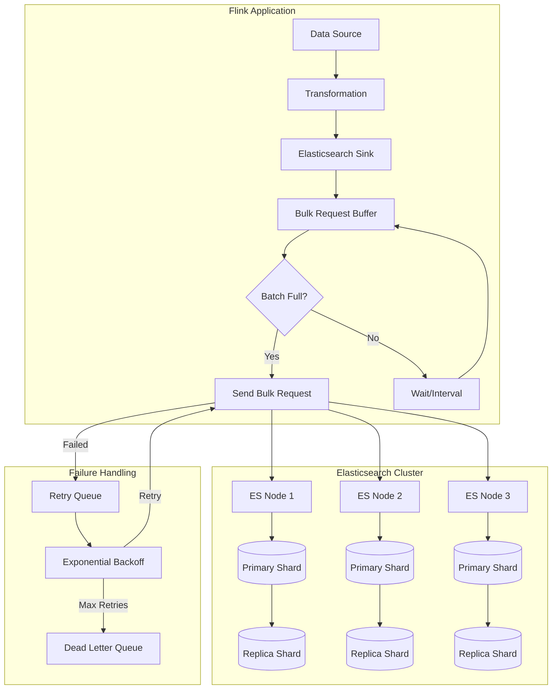
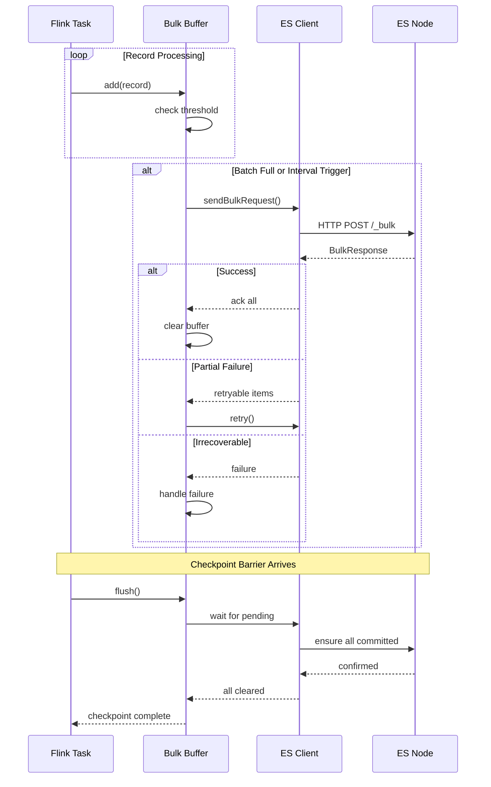
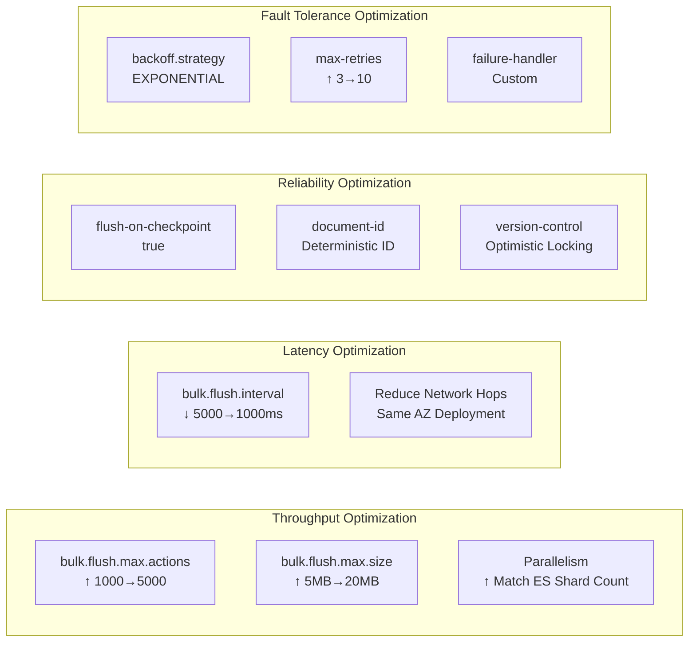

# Elasticsearch Connector Complete Guide

> Stage: Flink/Connectors | Prerequisites: [Flink DataStream API](../../03-api/09-language-foundations/flink-datastream-api-complete-guide.md), [Flink Checkpoint Mechanism](../../02-core/checkpoint-mechanism-deep-dive.md) | Formalization Level: L3

---

## 1. Concept Definitions

### Def-F-04-01: Elasticsearch Sink

**Definition**: Elasticsearch Sink is an output operator provided by the Flink DataStream API, used to write streaming data into an Elasticsearch cluster, supporting near-real-time indexing, bulk writes, and fault-tolerance semantics.

```
ES Sink: DataStream<T> → Elasticsearch Cluster
         ∀ record ∈ T: record → IndexRequest → BulkRequest → ES Node
```

### Def-F-04-02: Index and Document Model

**Definition**: Elasticsearch adopts an inverted index structure, and data is organized hierarchically as follows:

| Level | Concept | Description |
|-------|---------|-------------|
| Cluster | Cluster | A collection of one or more nodes |
| Index | Index | A logical collection of documents, corresponding to a table in relational databases |
| Shard | Shard | The physical partition unit of an index, supporting horizontal scaling |
| Document | Document | A JSON-formatted data unit, corresponding to a row in relational databases |
| Field | Field | An attribute of a document, corresponding to a column in relational databases |

**Formal Representation**:

```
Index = {Doc₁, Doc₂, ..., Docₙ}
Doc = {_id: String, _source: JSON, _version: Long, ...metadata}
```

### Def-F-04-03: Bulk Write Mechanism (Bulk API)

**Definition**: The Flink ES Connector uses the Elasticsearch Bulk API to pack multiple records into a single request, reducing network round-trip overhead.

```
BulkRequest = [IndexRequest | UpdateRequest | DeleteRequest]⁺
             where |BulkRequest| ≤ bulk.flush.max.actions
               and size(BulkRequest) ≤ bulk.flush.max.size
```

**Core Parameters**:

- `bulk.flush.max.actions`: Maximum number of actions per bulk request (default 1000)
- `bulk.flush.max.size`: Maximum size in bytes per bulk request (default 5MB)
- `bulk.flush.interval`: Bulk flush interval (default null)

### Def-F-04-04: Idempotent Write Semantics

**Definition**: By specifying document IDs and version control, the ES Sink can achieve Exactly-Once semantics:

```
∀ checkpoint: records processed → ES committed
              ∧ failure → replay from checkpoint
              ∧ no duplicate documents (by _id)
```

---

## 2. Property Derivation

### Prop-F-04-01: Write Performance Boundary

**Proposition**: The maximum throughput of the ES Sink is constrained by the following factors:

```
T_max = min(T_bulk, T_es, T_network)
where:
  T_bulk = bulk.flush.max.actions / bulk.flush.interval
  T_es = ES cluster indexing capacity (number of shards × throughput per shard)
  T_network = network bandwidth / average document size
```

### Prop-F-04-02: Version Conflict Handling

**Proposition**: When multiple concurrent write operations target the same document:

```
if (provided_version == current_version) {
    update succeeds
} else if (provided_version > current_version) {
    update succeeds (fast-forward)
} else {
    VersionConflictException
}
```

### Lemma-F-04-01: Bulk Size and Latency Trade-off

**Lemma**: Increasing `bulk.flush.max.actions` can improve throughput but will increase latency:

```
Latency ≈ (N_actions / ArrivalRate) + NetworkRTT + ES_ProcessingTime
Throughput ≈ N_actions / Latency
```

---

## 3. Relation Establishment

### 3.1 Relationship with Other Connectors

```
┌─────────────────────────────────────────────────────────────────┐
│                     Flink Sink Connectors                        │
├──────────────┬──────────────┬──────────────┬────────────────────┤
│  Kafka Sink  │   JDBC Sink  │  ES Sink     │   FileSystem Sink  │
├──────────────┼──────────────┼──────────────┼────────────────────┤
│ Append-Only  │ Upsert       │ Index/Upsert │ Append/Overwrite   │
│ High Throughput│ Transaction Support│ Full-text Search│ Batch/Streaming Unified│
│ Partitioned Order│ Exactly-Once│ Near Real-time│ Columnar Storage   │
└──────────────┴──────────────┴──────────────┴────────────────────┘
```

### 3.2 ES Sink Position in the Data Pipeline

```
Data Source → Flink Processing → ES Sink → Elasticsearch Cluster
                                                ↓
                                    Kibana / Grafana / Custom App
```

### 3.3 Relationship with Flink Checkpoint

```
ES Sink as Stateful Sink:
- Pre-Checkpoint: Wait for all pending bulk requests to complete
- Snapshot: Record the last successfully acknowledged document offset
- Recovery: Recover from checkpoint, replay unacknowledged records
```

---

## 4. Argumentation

### 4.1 Version Compatibility Analysis

| Flink Version | ES 6.x | ES 7.x | ES 8.x | Description |
|---------------|--------|--------|--------|-------------|
| 1.13 | ✅ `flink-connector-elasticsearch6` | ✅ `flink-connector-elasticsearch7` | ❌ | Independent artifact |
| 1.14 | ✅ | ✅ | ❌ | |
| 1.15 | ✅ | ✅ | ❌ | |
| 1.16 | ⚠️ | ✅ | ✅ | ES6 enters maintenance mode |
| 1.17+ | ❌ | ✅ | ✅ | ES6 support removed |
| 1.18+ | ❌ | ✅ | ✅ | ES7/8 recommended |

### 4.2 Architectural Decision: Synchronous vs Asynchronous Writes

**Synchronous Write**:

```
Pros: Simple, exceptions are immediately perceived
Cons: Low throughput, network waiting wastes time
Applicable: Low throughput, strong consistency scenarios
```

**Asynchronous Write** (Adopted by ES Sink):

```
Pros: High throughput, batch optimization, network reuse
Cons: Requires backpressure handling, delayed exception perception
Applicable: Stream processing scenarios (default)
```

### 4.3 Counter-example Analysis: Incorrect Dynamic Index Implementation

```java

// [Pseudo-code snippet - not runnable] Only demonstrates core logic
import org.apache.flink.streaming.api.datastream.DataStream;

// ❌ Incorrect approach: Create a new IndexRequest function for each record
DataStream<LogEvent> stream = ...;
stream.addSink(new ElasticsearchSink.Builder<LogEvent>(
    config,
    (element, ctx, indexer) -> {
        // Create a new IndexRequest on each call
        String indexName = "logs-" + element.getDate(); // Computed at runtime
        indexer.add(new IndexRequest(indexName).source(element.toJson()));
    }
).build());
// Problem: Does not leverage bulk write advantages, each record processed individually
```

```java
// [Pseudo-code snippet - not runnable] Only demonstrates core logic
// ✅ Correct approach: Use IndexRequest builder, let the Sink batch process
ElasticsearchSink.Builder<LogEvent> builder = new ElasticsearchSink.Builder<>(
    config,
    (element, ctx, indexer) -> {
        String indexName = "logs-" + element.getDate();
        IndexRequest request = Requests.indexRequest()
            .index(indexName)
            .id(element.getId())
            .source(element.toJson(), XContentType.JSON);
        indexer.add(request); // Add to bulk queue
    }
);
builder.setBulkFlushMaxActions(1000); // Bulk flush
```

---

## 5. Formal Proof / Engineering Argument

### Thm-F-04-01: At-Least-Once Semantics Guarantee of ES Sink

**Theorem**: When `flush-on-checkpoint` is configured as true, the ES Sink guarantees At-Least-Once semantics.

**Proof**:

1. **Record Emission**: The Flink operator adds records to the internal buffer via `invoke()`
2. **Batch Construction**: When the buffer reaches `bulk.flush.max.actions` or `bulk.flush.interval` triggers, a BulkRequest is constructed
3. **Asynchronous Send**: Sent asynchronously via the ES REST Client
4. **Acknowledgment Callback**: After receiving ES acknowledgment, the corresponding records are removed from the buffer
5. **Checkpoint Coordination**: During checkpoint, wait for all pending requests to complete

```
∀ record r emitted:
    if checkpoint C succeeds:
        then r ∈ ES (committed)
    if checkpoint C fails:
        then r may be replayed (duplicate possible)
```

**Engineering Implementation**:

```java
// [Pseudo-code snippet - not runnable] Only demonstrates core logic
// Enable checkpoint synchronization
builder.setFlushOnCheckpoint(true);
```

### Thm-F-04-02: Exactly-Once via Idempotent IDs

**Theorem**: Providing deterministic document IDs for each record can achieve Exactly-Once semantics.

**Proof**:

Let the unique identifier of record `r` be `id(r)`. At checkpoint `Cₙ`:

1. **First Execution**: Create document in ES with `_id = id(r)`
2. **Failure Recovery**: Restart from `Cₙ`, resend `r`
3. **Idempotent Write**: ES detects the same `_id`, performs an update operation (same content)

```
Result: Only one copy of r in ES, no duplicates
```

---

## 6. Example Verification

### 6.1 Maven Dependency Configuration

```xml
<!-- Flink 1.17+ with Elasticsearch 7.x -->
<dependency>
    <groupId>org.apache.flink</groupId>
    <artifactId>flink-connector-elasticsearch7</artifactId>
    <version>3.0.1-1.17</version>
</dependency>

<!-- Flink 1.17+ with Elasticsearch 8.x -->
<dependency>
    <groupId>org.apache.flink</groupId>
    <artifactId>flink-connector-elasticsearch8</artifactId>
    <version>3.0.1-1.17</version>
</dependency>

<!-- If using Java 11+ -->
<dependency>
    <groupId>org.apache.flink</groupId>
    <artifactId>flink-connector-elasticsearch-base</artifactId>
    <version>3.0.1-1.17</version>
</dependency>
```

### 6.2 Basic Write Example (Java)

```java
import org.apache.flink.api.common.functions.RuntimeContext;
import org.apache.flink.streaming.api.datastream.DataStream;
import org.apache.flink.streaming.api.environment.StreamExecutionEnvironment;
import org.apache.flink.streaming.connectors.elasticsearch.ElasticsearchSinkFunction;
import org.apache.flink.streaming.connectors.elasticsearch.RequestIndexer;
import org.apache.flink.streaming.connectors.elasticsearch7.ElasticsearchSink;
import org.apache.http.HttpHost;
import org.elasticsearch.action.index.IndexRequest;
import org.elasticsearch.client.Requests;
import org.elasticsearch.common.xcontent.XContentType;

import java.util.ArrayList;
import java.util.List;

public class ElasticsearchSinkExample {

    public static void main(String[] args) throws Exception {
        StreamExecutionEnvironment env = StreamExecutionEnvironment.getExecutionEnvironment();

        // Sample data stream
        DataStream<UserAction> stream = env.fromElements(
            new UserAction("user1", "click", "product_A", System.currentTimeMillis()),
            new UserAction("user2", "view", "product_B", System.currentTimeMillis()),
            new UserAction("user3", "purchase", "product_C", System.currentTimeMillis())
        );

        // Configure ES cluster addresses
        List<HttpHost> httpHosts = new ArrayList<>();
        httpHosts.add(new HttpHost("127.0.0.1", 9200, "http"));
        httpHosts.add(new HttpHost("127.0.0.1", 9201, "http"));

        // Build ES Sink
        ElasticsearchSink.Builder<UserAction> builder = new ElasticsearchSink.Builder<>(
            httpHosts,
            new ElasticsearchSinkFunction<UserAction>() {
                @Override
                public void process(UserAction element, RuntimeContext ctx, RequestIndexer indexer) {
                    // Build IndexRequest
                    String json = String.format(
                        "{\"user_id\":\"%s\",\"action\":\"%s\",\"target\":\"%s\",\"timestamp\":%d}",
                        element.getUserId(), element.getAction(),
                        element.getTarget(), element.getTimestamp()
                    );

                    IndexRequest request = Requests.indexRequest()
                        .index("user-actions")
                        .id(element.getUserId() + "_" + element.getTimestamp()) // Deterministic ID
                        .source(json, XContentType.JSON);

                    indexer.add(request);
                }
            }
        );

        // Bulk write configuration
        builder.setBulkFlushMaxActions(1000);
        builder.setBulkFlushMaxSizeMb(5);
        builder.setBulkFlushInterval(5000); // Flush every 5 seconds

        // Enable checkpoint synchronization
        builder.setFlushOnCheckpoint(true);

        stream.addSink(builder.build());
        env.execute("Elasticsearch Sink Example");
    }
}

// POJO definition
class UserAction {
    private String userId;
    private String action;
    private String target;
    private long timestamp;

    public UserAction(String userId, String action, String target, long timestamp) {
        this.userId = userId;
        this.action = action;
        this.target = target;
        this.timestamp = timestamp;
    }

    // Getters
    public String getUserId() { return userId; }
    public String getAction() { return action; }
    public String getTarget() { return target; }
    public long getTimestamp() { return timestamp; }
}
```

### 6.3 ES Sink Configuration with Authentication

```java
// [Pseudo-code snippet - not runnable] Only demonstrates core logic
import org.apache.http.auth.AuthScope;
import org.apache.http.auth.UsernamePasswordCredentials;
import org.apache.http.client.CredentialsProvider;
import org.apache.http.impl.client.BasicCredentialsProvider;
import org.elasticsearch.client.RestClientBuilder;

// ... In builder configuration

builder.setRestClientFactory(
    restClientBuilder -> {
        // Basic Auth configuration
        CredentialsProvider credentialsProvider = new BasicCredentialsProvider();
        credentialsProvider.setCredentials(
            AuthScope.ANY,
            new UsernamePasswordCredentials("elastic", "your-password")
        );

        restClientBuilder.setHttpClientConfigCallback(
            httpClientBuilder -> httpClientBuilder
                .setDefaultCredentialsProvider(credentialsProvider)
                // SSL/TLS configuration
                .setSSLContext(sslContext) // Pre-configured SSLContext
                .setSSLHostnameVerifier(NoopHostnameVerifier.INSTANCE)
        );

        // Connection configuration
        restClientBuilder.setRequestConfigCallback(
            requestConfigBuilder -> requestConfigBuilder
                .setConnectTimeout(5000)
                .setSocketTimeout(60000)
        );
    }
);
```

### 6.4 Dynamic Index (Time-based Partitioning)

```java
import java.util.Map;

import java.time.LocalDateTime;
import java.time.format.DateTimeFormatter;

import org.apache.flink.streaming.api.environment.StreamExecutionEnvironment;
import org.apache.flink.streaming.api.datastream.DataStream;


public class DynamicIndexExample {

    private static final DateTimeFormatter FORMATTER =
        DateTimeFormatter.ofPattern("yyyy.MM.dd");

    public static void main(String[] args) throws Exception {
        StreamExecutionEnvironment env = StreamExecutionEnvironment.getExecutionEnvironment();

        DataStream<LogEvent> logStream = env.addSource(new LogSource());

        List<HttpHost> httpHosts = List.of(
            new HttpHost("es-node1", 9200),
            new HttpHost("es-node2", 9200)
        );

        ElasticsearchSink.Builder<LogEvent> builder = new ElasticsearchSink.Builder<>(
            httpHosts,
            new ElasticsearchSinkFunction<LogEvent>() {
                @Override
                public void process(LogEvent element, RuntimeContext ctx, RequestIndexer indexer) {
                    // Dynamically compute index name
                    LocalDateTime eventTime = LocalDateTime.ofInstant(
                        java.time.Instant.ofEpochMilli(element.getTimestamp()),
                        java.time.ZoneId.systemDefault()
                    );
                    String indexName = "application-logs-" + eventTime.format(FORMATTER);

                    // Build request
                    IndexRequest request = Requests.indexRequest()
                        .index(indexName)
                        .id(element.getLogId())
                        .source(element.toJson(), XContentType.JSON);

                    indexer.add(request);
                }
            }
        );

        // Performance optimization configuration
        builder.setBulkFlushMaxActions(2000);
        builder.setBulkFlushMaxSizeMb(10);
        builder.setBulkFlushInterval(10000);
        builder.setFlushOnCheckpoint(true);

        logStream.addSink(builder.build());
        env.execute("Dynamic Index ES Sink");
    }
}

// Log event class
class LogEvent {
    private String logId;
    private String level;
    private String message;
    private String service;
    private long timestamp;
    private Map<String, String> tags;

    public String toJson() {
        // Serialize using Jackson or Gson
        return "{\"logId\":\"" + logId + "\",\"level\":\"" + level + "\",...}";
    }

    // Getters
    public String getLogId() { return logId; }
    public long getTimestamp() { return timestamp; }
}
```

### 6.5 Complete Configuration with Retry Policy and Dead Letter Queue

```java
import org.apache.flink.streaming.connectors.elasticsearch.ActionRequestFailureHandler;
import org.apache.flink.streaming.connectors.elasticsearch.RequestIndexer;
import org.elasticsearch.action.ActionRequest;
import org.elasticsearch.common.util.concurrent.EsRejectedExecutionException;
import org.elasticsearch.index.mapper.MapperParsingException;
import org.apache.flink.util.ExceptionUtils;

import org.apache.flink.streaming.api.environment.StreamExecutionEnvironment;
import org.apache.flink.streaming.api.datastream.DataStream;


public class RobustElasticsearchSink {

    public static void main(String[] args) throws Exception {
        StreamExecutionEnvironment env = StreamExecutionEnvironment.getExecutionEnvironment();
        env.enableCheckpointing(60000); // 1-minute checkpoint

        DataStream<Event> stream = env.addSource(new EventSource());

        // Dead letter queue stream (side output)
        OutputTag<Event> deadLetterTag = new OutputTag<Event>("dead-letters") {};

        SingleOutputStreamOperator<Event> mainStream = stream
            .process(new ProcessFunction<Event, Event>() {
                @Override
                public void processElement(Event value, Context ctx, Collector<Event> out) {
                    out.collect(value);
                }
            });

        List<HttpHost> httpHosts = List.of(
            new HttpHost("es-cluster", 9200)
        );

        ElasticsearchSink.Builder<Event> builder = new ElasticsearchSink.Builder<>(
            httpHosts,
            new ElasticsearchSinkFunction<Event>() {
                @Override
                public void process(Event element, RuntimeContext ctx, RequestIndexer indexer) {
                    IndexRequest request = Requests.indexRequest()
                        .index(element.getIndexName())
                        .id(element.getId())
                        .source(element.toJson(), XContentType.JSON)
                        .routing(element.getRoutingKey()); // Routing configuration

                    // Version control (optimistic locking)
                    if (element.getVersion() != null) {
                        request.version(element.getVersion());
                        request.versionType(VersionType.EXTERNAL);
                    }

                    indexer.add(request);
                }
            }
        );

        // Bulk configuration
        builder.setBulkFlushMaxActions(1000);
        builder.setBulkFlushMaxSizeMb(5);
        builder.setBulkFlushInterval(5000);

        // Retry configuration
        builder.setBulkFlushBackoff(true);
        builder.setBulkFlushBackoffType(ElasticsearchSink.FlushBackoffType.EXPONENTIAL);
        builder.setBulkFlushBackoffDelay(100); // Initial delay 100ms
        builder.setBulkFlushBackoffRetries(8); // Max retries 8

        // Custom failure handler
        builder.setFailureHandler(new ActionRequestFailureHandler() {
            @Override
            public void onFailure(ActionRequest action, Throwable failure,
                                  int restStatusCode, RequestIndexer indexer) throws Throwable {

                // Retryable errors: Add to retry queue
                if (ExceptionUtils.findThrowable(failure, EsRejectedExecutionException.class).isPresent()
                    || restStatusCode == 429 // Too Many Requests
                    || restStatusCode >= 500) { // Server errors

                    indexer.add(action);
                    return;
                }

                // Irrecoverable errors: Skip or send to dead letter queue
                if (ExceptionUtils.findThrowable(failure, MapperParsingException.class).isPresent()
                    || restStatusCode == 400) { // Bad Request

                    // Log error, discard request
                    System.err.println("Dropping invalid request: " + action);
                    return;
                }

                // Other errors: Throw exception to terminate task
                throw failure;
            }
        });

        builder.setFlushOnCheckpoint(true);

        mainStream.addSink(builder.build());
        env.execute("Robust ES Sink");
    }
}
```

### 6.6 Complete Log Analysis Scenario (Python Table API)

```python
from pyflink.table import StreamTableEnvironment, EnvironmentSettings
from pyflink.datastream import StreamExecutionEnvironment

# Create execution environment
env = StreamExecutionEnvironment.get_execution_environment()
env.enable_checkpointing(60000)

settings = EnvironmentSettings.new_instance() \
    .in_streaming_mode() \
    .build()

table_env = StreamTableEnvironment.create(env, settings)

# Create source table (Kafka logs)
table_env.execute_sql("""
CREATE TABLE kafka_logs (
    log_id STRING,
    timestamp TIMESTAMP(3),
    level STRING,
    service STRING,
    message STRING,
    host STRING,
    proctime AS PROCTIME()
) WITH (
    'connector' = 'kafka',
    'topic' = 'application-logs',
    'properties.bootstrap.servers' = 'kafka:9092',
    'properties.group.id' = 'flink-es-connector',
    'format' = 'json',
    'scan.startup.mode' = 'latest-offset'
)
""")

# Create ES Sink table
# Dynamic index achieved via DATE_FORMAT
table_env.execute_sql("""
CREATE TABLE es_logs (
    log_id STRING PRIMARY KEY NOT ENFORCED,
    log_time TIMESTAMP(3),
    level STRING,
    service STRING,
    message STRING,
    host STRING,
    idx STRING NOT NULL,
    INDEX idx_service LEVEL service
) WITH (
    'connector' = 'elasticsearch-7',
    'hosts' = 'http://es-node1:9200;http://es-node2:9200',
    'index' = 'application-logs-{idx}',
    'document-id.key-delimiter' = '$',
    'bulk-flush.max-actions' = '1000',
    'bulk-flush.max-size' = '5mb',
    'bulk-flush.interval' = '1000',
    'bulk-flush.backoff.enable' = 'true',
    'bulk-flush.backoff.delay' = '100ms',
    'bulk-flush.backoff.max-retries' = '8',
    'format' = 'json'
)
""")

# Transform data and write to ES
table_env.execute_sql("""
INSERT INTO es_logs
SELECT
    log_id,
    timestamp as log_time,
    level,
    service,
    message,
    host,
    DATE_FORMAT(timestamp, 'yyyy.MM.dd') as idx
FROM kafka_logs
""")
```

### 6.7 Advanced Configuration Using SQL Connector

```sql
-- ES Sink with authentication
CREATE TABLE es_secure_logs (
    id STRING PRIMARY KEY NOT ENFORCED,
    content STRING,
    created_at TIMESTAMP(3)
) WITH (
    'connector' = 'elasticsearch-7',
    'hosts' = 'https://es-secure:9200',
    'index' = 'secure-logs',
    'username' = 'elastic',
    'password' = '${ES_PASSWORD}',

    -- SSL configuration
    'security.ssl.enabled' = 'true',
    'security.ssl.verification-mode' = 'certificate',
    'security.ssl.keystore.path' = '/path/to/keystore.jks',
    'security.ssl.keystore.password' = '${KEYSTORE_PASSWORD}',
    'security.ssl.truststore.path' = '/path/to/truststore.jks',
    'security.ssl.truststore.password' = '${TRUSTSTORE_PASSWORD}',

    -- Bulk and performance
    'bulk-flush.max-actions' = '2000',
    'bulk-flush.max-size' = '10mb',
    'bulk-flush.interval' = '5000ms',
    'bulk-flush.backoff.strategy' = 'EXPONENTIAL',
    'bulk-flush.backoff.max-retries' = '10',

    -- Connection configuration
    'connection.path-prefix' = '',
    'connection.request-timeout' = '60000',
    'connection.timeout' = '5000',

    -- Failure handling
    'sink.failure-handler' = 'retry-rejected',
    'sink.flush-on-checkpoint' = 'true'
);
```

---

## 7. Visualizations

### 7.1 ES Sink Data Flow Architecture



### 7.2 Bulk Write Sequence Diagram



### 7.3 Dynamic Index Decision Tree

```mermaid
flowchart TD
    A[Record Arrives] --> B{Determine Index}
    B -->|Time-based| C[logs-YYYY.MM.dd]
    B -->|Tenant-based| D[logs-tenant-{id}]
    B -->|Service-based| E[logs-{service}]

    C --> F[Check Index Exists]
    D --> F
    E --> F

    F -->|No| G[Create Index with Template]
    F -->|Yes| H[Index Document]
    G --> H

    H --> I{Write Result}
    I -->|Success| J[Next Record]
    I -->|Conflict| K[Handle Conflict]
    I -->|Error| L[Retry/Dead Letter]

    K --> M{Conflict Type}
    M -->|Version| N[Ignore/Update]
    M -->|Mapping| O[Reject to DLQ]
```

### 7.4 Performance Optimization Configuration Matrix



---

## 8. References

---

## Appendix: Complete Configuration Parameter Quick Reference

| Parameter | Type | Default | Description |
|-----------|------|---------|-------------|
| `hosts` | String | Required | ES cluster addresses, semicolon-separated |
| `index` | String | Required | Index name, supports `{field}` placeholder |
| `document-id.key-delimiter` | String | `_` | Composite ID delimiter |
| `bulk-flush.max-actions` | Integer | 1000 | Maximum bulk actions |
| `bulk-flush.max-size` | String | 5mb | Maximum bulk size |
| `bulk-flush.interval` | Duration | null | Bulk flush interval |
| `bulk-flush.backoff.enable` | Boolean | false | Enable backoff retry |
| `bulk-flush.backoff.strategy` | Enum | CONSTANT | Backoff strategy: CONSTANT/EXPONENTIAL |
| `bulk-flush.backoff.delay` | Duration | 50ms | Backoff delay |
| `bulk-flush.backoff.max-retries` | Integer | 8 | Maximum retry count |
| `sink.flush-on-checkpoint` | Boolean | true | Flush on checkpoint |
| `format` | String | json | Serialization format |
| `username` | String | null | Username |
| `password` | String | null | Password |
| `security.ssl.enabled` | Boolean | false | Enable SSL |
| `connection.timeout` | Integer | 5000 | Connection timeout (ms) |
| `connection.request-timeout` | Integer | 60000 | Request timeout (ms) |
| `sink.failure-handler` | String | fail | Failure handling: fail/ignore/retry-rejected/custom |

---

> **Maintainer Note**: This document corresponds to Flink 1.17+ and Elasticsearch 7.x/8.x. ES 6.x support was removed in Flink 1.17.
> Last Updated: 2026-04-04

---

*Document Version: v1.0 | Created: 2026-04-19*
